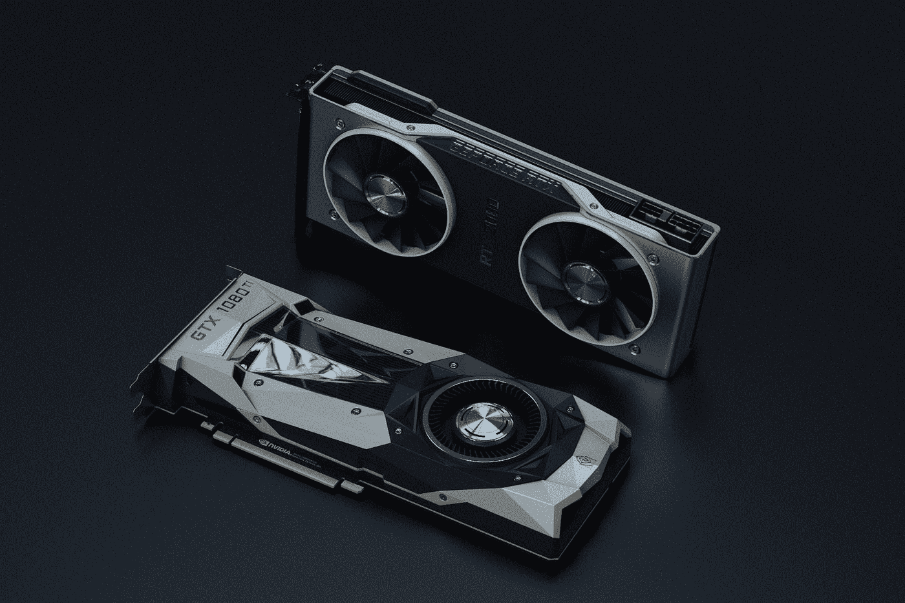
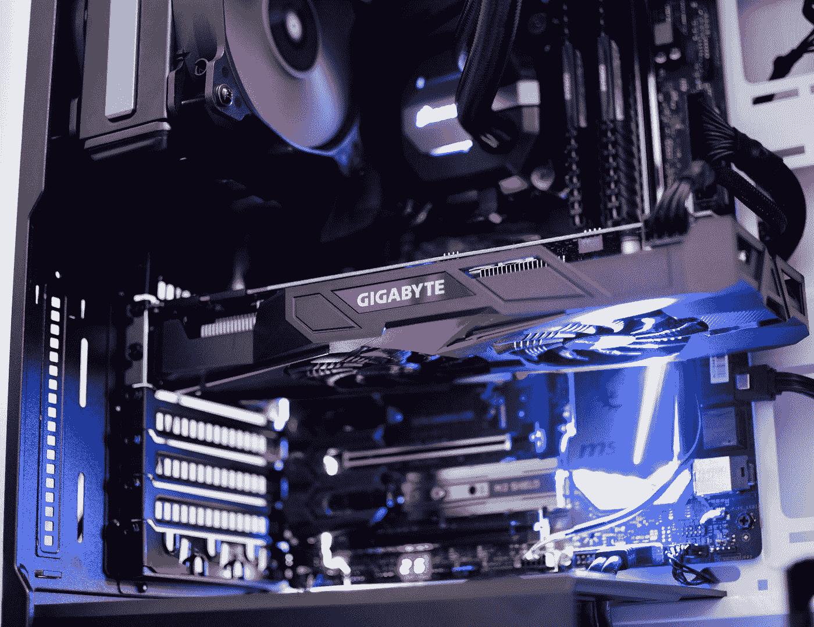

# 深度学习真的需要 GPU 吗？

> 原文：<https://towardsdatascience.com/do-you-really-need-a-gpu-for-deep-learning-d37c05023226?source=collection_archive---------21----------------------->

## 意见

## 获得一个 GPU 是深度学习的必备条件吗？了解 GPU 及其优势，并探索替代方案


卡斯帕·卡米尔·鲁宾在 [Unsplash](https://unsplash.com?utm_source=medium&utm_medium=referral) 上的照片

我一直是一个超级游戏迷，也是一个游戏迷。

从小到大，我看到的对显卡的唯一要求就是为了游戏的目的。

我很幸运，在我开始涉足人工智能和数据科学，尤其是深度学习之后，我意识到了显卡的真正潜力。

这几乎就像梦想成真。这就像是一箭双雕，因为我可以利用同一个显卡进行游戏以及学习和研究。

> **注意:**GPU 和显卡的意思差不多，在本文中会互换使用。

GPU 针对训练人工智能和深度学习模型进行了优化，因为它们可以同时处理多个计算。它们拥有大量内核，可以更好地计算多个并行进程。

在本文中，我们将了解 GPU 和 CUDA 到底是什么，然后探讨图形处理单元的优势，以及如果您预算紧张，何时应该考虑购买它。最后，我们将讨论替代方案。

事不宜迟，让我们开始理解这些概念。

# GPU 到底是什么？



照片由 [Nana Dua](https://unsplash.com/@nanadua11?utm_source=medium&utm_medium=referral) 在 [Unsplash](https://unsplash.com?utm_source=medium&utm_medium=referral) 上拍摄

**图形处理单元**是一种专用的电子电路，设计用于快速操作和改变存储器，以加速在帧缓冲器中创建图像，用于输出到显示设备。

GPU 是现代计算的关键部分。GPU 计算和高性能网络正在改变计算科学和人工智能。GPU 的进步为今天深度学习的发展做出了巨大贡献。

NVIDIA 提供了一种名为**计算统一设备架构(CUDA)** 的东西，这对支持各种深度学习应用至关重要。

CUDA 是 Nvidia 创建的并行计算平台和应用编程接口模型。它允许软件开发人员和软件工程师使用支持 CUDA 的图形处理单元(GPU)进行通用处理，这种方法称为 GPGPU。

这些 CUDA 核心在人工智能领域是高度有益和进化的。我们将在下一节进一步讨论这个话题。

# GPU 的优势



Rafael Pol 在 [Unsplash](https://unsplash.com?utm_source=medium&utm_medium=referral) 上的照片

如前所述，NVIDIA GPUs 提供了 CUDA 内核的支持。

每种显卡的 CUDA 内核数量各不相同，但可以肯定的是，大多数显卡通常至少有 1000 个以上的内核。

当您使用 TensorFlow 或 Pytorch 等深度学习框架时，与使用 CPU 的相同性能相比，您可以利用这些 CUDA 核心来计算您的深度学习算法，速度要快得多。

虽然 CPU 一次只能执行少量操作，但 GPU 可以一次执行数千次这样的操作。仅举一个假设的例子，在一个质量不错的 GPU 的帮助下，一个需要在 CPU 上训练 2-3 个小时的任务可能在大约 10 分钟内完成。

GPU 是计算机视觉和超级计算的动态资源，具有深度学习和神经网络，可以执行复杂的任务，有时甚至超出人类的想象。

此外，GPU 还有许多其他应用。GPU 在嵌入式系统、移动电话、个人电脑、工作站和游戏控制台中都有应用。

您可以充分利用这些显卡来完成其他任务，如游戏和玩 AAA 游戏(AAA 游戏基本上是一种非正式的分类，用于由中型或大型发行商制作和发行的视频游戏，通常具有较高的开发和营销预算。)或其他需要 GPU 的图形软件用途，以及动画和设计。

GPU 在机器人领域也有巨大的应用范围，使高科技机器人能够通过集成人工智能来感知环境。

汽车行业对基于深度学习的自动驾驶汽车的应用也有很高的需求。为了改变未来，在这些汽车的开发上投入了大量的资金。

最后但同样重要的是，通过将数据用于理想的图像分割任务和其他医疗应用，这些 GPU 还可以在医疗保健和生命科学的医疗领域中找到各种应用。

# 什么时候应该考虑？


由 [Viacheslav Bublyk](https://unsplash.com/@s1winner?utm_source=medium&utm_medium=referral) 在 [Unsplash](https://unsplash.com?utm_source=medium&utm_medium=referral) 拍摄

显卡挺贵的！

尤其是当你预算紧张的时候，你可能会很难决定是否要买显卡。那么，关于这个问题，你怎么能得出一个合理的结论呢？

我想提供的一个个人建议是，确保你在数据科学领域挖得更深。了解机器学习的概念，对深度学习有基本的概念理解。

如果你非常确定和自信地认为深度学习是你感兴趣的事情，并希望进一步探索这个有趣的话题，那么请放心地为自己购买一个。

如果您想知道在直接投入之前是否有任何替代选择或免费工具来测试该主题，那么您很幸运，因为有许多这些资源可用。

让我们研究一下这些替代办法和其他可行的选择。

# 可供选择的事物


尤金尼奥·马佐尼在 [Unsplash](https://unsplash.com?utm_source=medium&utm_medium=referral) 上的照片

如果你想测试深度学习，或者你已经得出结论，你不需要显卡，那么你可以选择什么样的替代品来进行深度学习？

首先，如果您想在自己的个人计算机上工作，并且您有一个能够进行一般计算的中等 CPU，那么您可以选择安装 TensorFlow 的 CPU 版本。这个简单的安装可以通过一个简单的 pip 命令来完成，如下所示:

```
pip install tensorflow
```

对于简单的深度学习计算，如处理 MNIST 数据集，如果您想利用 CPU 或 GPU 版本，不会有很大的区别。对于初级深度学习项目来说，CPU 版本应该很好。

然而，如果你想要实践经验和使用 GPU 的感觉，那么你可以在**谷歌合作实验室**或**谷歌实验室**上完全免费地这样做。这是谷歌研究的一个产品。 **Colab** 允许任何人通过浏览器编写和执行任意 python 代码，特别适合机器学习、数据分析和教育。

在接下来的一周，我将会写两篇关于 Jupyter 笔记本和 Google Colab 的文章。如果你想了解使用它们的详细指南，请继续关注。

其他选择包括创建一个 AWS 云实例或使用 IBM Watson Studio，以及其他一些方法，在这些方法中，您可以为在云上使用 GPU 支付少量费用。

根据我的经验，这些是一些可供选择的方法。如果你有更好的替代建议，请在评论区告诉我。

但是有了这些替代品，你应该很容易就能自己探索深度学习，并对这个主题有一个基本的了解。


约翰·汤纳在 [Unsplash](https://unsplash.com?utm_source=medium&utm_medium=referral) 上拍摄的照片

# 结论

在本文中，我们讨论了 GPU 到底是什么以及它的众多优点。我还建议什么时候是考虑为自己拥有一个 GPU 的最佳时机。我们还检查了各种替代方案，这些方案可以帮助您在学习深度学习基础知识时茁壮成长，即使没有 GPU 也是如此。

所以，要回答“深度学习真的需要 GPU 吗？”简单来说—

如果你是一个初学者，你才刚刚开始，那么绝对不要。但是，如果你更认真，获得了更敏锐的理解和知识，想用深度学习走得更远，那么强烈推荐。

看看我的其他一些文章，你可能会喜欢读！

[](/10-step-ultimate-guide-for-machine-learning-and-data-science-projects-ed61ae9aa301) [## 机器学习和数据科学项目的 10 步终极指南！

### 详细讨论构建您的机器学习和数据科学项目的最佳方法…

towardsdatascience.com](/10-step-ultimate-guide-for-machine-learning-and-data-science-projects-ed61ae9aa301) [](/step-by-step-guide-proportional-sampling-for-data-science-with-python-8b2871159ae6) [## 分步指南:使用 Python 进行数据科学的比例采样！

### 了解使用 python 进行数据科学所需的比例采样的概念和实现…

towardsdatascience.com](/step-by-step-guide-proportional-sampling-for-data-science-with-python-8b2871159ae6) [](/10-most-popular-programming-languages-for-2020-and-beyond-67c512eeea73) [## 2020 年及以后最受欢迎的 10 种编程语言

### 讨论当今 10 种最流行的编程语言的范围、优缺点

towardsdatascience.com](/10-most-popular-programming-languages-for-2020-and-beyond-67c512eeea73) [](/opencv-complete-beginners-guide-to-master-the-basics-of-computer-vision-with-code-4a1cd0c687f9) [## OpenCV:用代码掌握计算机视觉基础的完全初学者指南！

### 包含代码的教程，用于掌握计算机视觉的所有重要概念，以及如何使用 OpenCV 实现它们

towardsdatascience.com](/opencv-complete-beginners-guide-to-master-the-basics-of-computer-vision-with-code-4a1cd0c687f9) 

谢谢你们坚持到最后。我希望你们都喜欢这篇文章。祝大家有美好的一天！