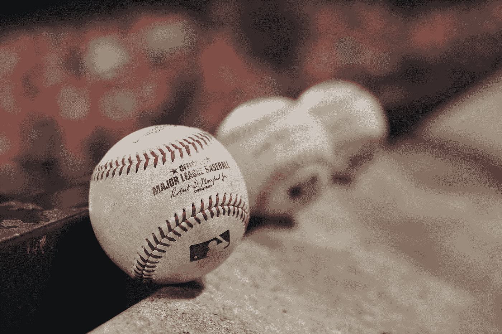
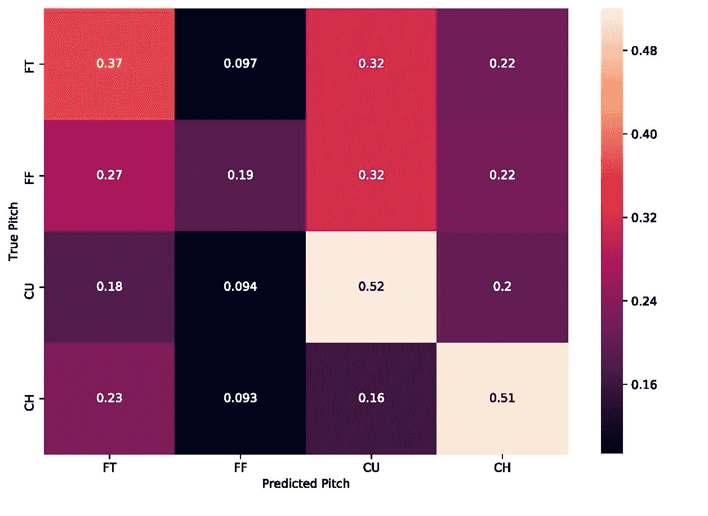
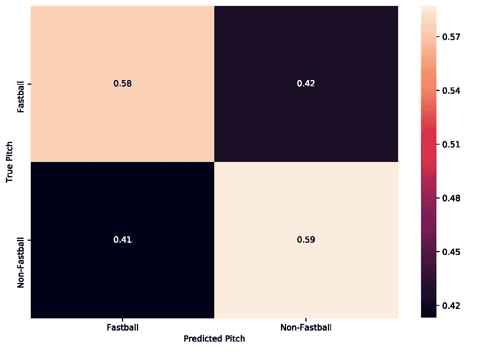
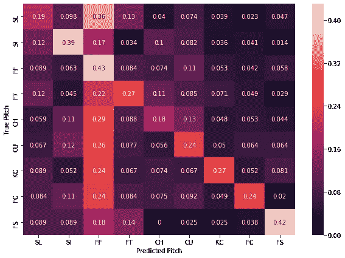
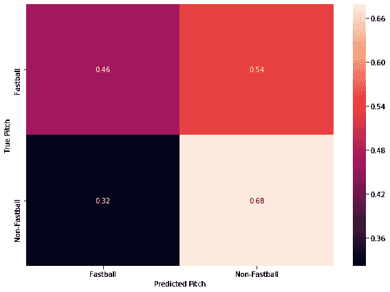

# 你真的需要垃圾桶吗？

> 原文：<https://towardsdatascience.com/do-you-really-need-trash-cans-6837921d127c?source=collection_archive---------28----------------------->

## 用机器学习预测下一次投球

2019-2020 MLB 休赛期被休斯顿太空人队在 2017 年世界职业棒球大赛获胜赛季期间窃取对方投手标志的消息所主导。这是通过在球员休息区外观看来自中外场的现场摄像，并通过敲打垃圾桶向击球手传达下一次投球来实现的。这让我想到，“机器学习能预测接下来会是什么样的投球吗？你甚至需要偷窃标志，或者只是一台电脑？”

莱斯莉·华雷斯在 [Unsplash](https://unsplash.com?utm_source=medium&utm_medium=referral) 上的照片

# 太空人计划

到目前为止，Astros 计划已经被很好地覆盖了。我不会深究他们作弊的细节，但有两件具体的事情与用机器学习预测下一次投球的目标有关。首先，他们似乎只有在下一个球不是快速球的时候才会去砸垃圾桶。这意味着他们没有指定具体的投球类型，而只是在投球速度变慢时进行交流。第二个是来自*棒球计划书*的 Rob Arthur 确定太空人在 93%的时间里正确地判定了一个非快速球向本垒板飞来。

> “总的来说，宇航员们倾向于获得正确的信号，但这并不完美。当他们重击易拉罐时，他们是最准确的:当他们这样做时，一个非快速球在途中的概率为 93%，而他们错误的概率为 7%。…根据亚当斯的数据，太空人经常使用垃圾桶，而且相对准确，敲打时比安静时更准确。"

(来源:[https://blogs . fangraphs . com/the-most-important-bangs-of-the-astros-scheme/](https://blogs.fangraphs.com/the-most-important-bangs-of-the-astros-scheme/))

因此，为了让我们的机器学习模型能够与 Astros 的方案相媲美，它必须预测快速球和非快速球之间的投球，并且以相当高的准确度进行预测。

# 数据

将分析和机器学习应用于棒球的伟大之处在于，有大量的数据可以免费获得并且容易访问。由于我使用的是 Python，所以我选择了使用 [pybaseball](https://github.com/jldbc/pybaseball) Python 包，它为 [Statcast](https://baseballsavant.mlb.com/) 数据提供了一个包装器，其中包含了在 MLB 投掷的每一个球的条目，包括游戏状态，比如第几局，谁在垒上，以及当前的计数。还包括投手用什么手投球和击球手的姿势。至关重要的是，Statcast 还提供了投掷的类型及其速度。在此基础上，我创建了一个前一个音高和前一个音高速度列。

一旦数据从 Statcast 中提取出来并稍加处理，我就把它分成一个训练集和一个测试集。在训练过程中出现的一个问题是，棒球的主要投球是快速球，因此投手投快速球的情况比投非快速球的情况多得多。这种不平衡意味着机器学习算法通过预测下一个投球总是会是快速球而获得了非常好的准确性。显然这不是很有帮助，所以为了解决这个问题，我使用了 [SMOTE](https://imbalanced-learn.readthedocs.io/en/stable/generated/imblearn.over_sampling.SMOTE.html) 来创建合成的非快速球训练数据，给我们留下了所有不同类型球场之间的平衡训练数据集。

在这次分析中，我们将使用两个不同的数据集，一个由何塞·贝里奥斯从 2017 赛季开始到 2019 赛季结束的投球组成，另一个由 2019 年 4 月 1 日至 2019 年 4 月 7 日期间 MLB 队每场比赛的所有投球组成。这两个数据集将让我们看到，与全联盟在特定情况下决定投什么球的偏好相比，个人投手的习惯是否更容易预测。

对于这两个不同的数据集，我还创建了每个数据集的一个版本，该版本只包含投球是快速球还是非快速球。对于这个版本的数据，我认为四缝线快速球、两缝线快速球和切球是“快速球”，其他的都是非快速球。我有根据地猜测，这也是太空人认为的快速球。

# 模特们

我从一些“基本”的机器学习模型开始，如决策树、支持向量机和 k 近邻。这些模型在所有数据集上的准确率都很低(低于 50%)。然后，我决定将数据输入两个不同的神经网络:一个用于数据集的一个版本。

## 何塞·贝里奥斯模型

这些模型比我们的其他方法实现了更好的准确性，多间距分类器在测试集上实现了 74%的准确性，快速球/非快速球分类器实现了 58%的准确性。我不清楚为什么这两个分类器之间会有这样的差异，但是让我们深入研究它们产生的混淆矩阵。

何塞·贝里奥斯全音高预测器的混淆矩阵

查看上面的混淆矩阵，我们可以通过查看矩阵的对角线来了解给定类型的音高有多少与预测类型相匹配。例如，该模型正确预测了 52%的弧线球。查看矩阵中的行可以告诉你有多少百分比的真实音高被错误地归类为不同类型的音高。观察曲线球行(标记为“CU”)，我们可以看到 52%的模型成功预测，而 20%的时间预测变速球将是下一个投球。第二个被预测最多的是双线快速球，有 18%的几率，接下来是四线快速球，有 10%的几率。如果你把这变成敲打垃圾桶，大约 30%的时间你会是错误的。虽然这个模型的真实精度相当好，但将其预测转化为可操作的结果将是困难的，仍然远远落后于 Astros 的精度。

何塞·贝里奥斯的快速球/非快速球预测者的混淆矩阵

以上是快速球/非快速球分类器的混淆矩阵。如你所见，我们的真实阳性率和真实阴性率非常相似，这使我们的准确率达到了 58%。与多音调分类器不同，结果相对平衡。这是一件好事，因为我们希望减少误报和漏报的数量，但这两个百分比都会给我们的垃圾桶攻击者带来更糟糕的结果:只有大约 60%的时间他们是正确的。也许我们全联盟的数据会更好？

## 联盟范围内的模型

在测试集上，联盟范围内所有投球的分类器准确率为 88%,但像以前一样，让我们看看下面的混淆矩阵:

全联盟全音高预测值的混淆矩阵(音高缩写参考:[https://www.daktronics.com/support/kb/Pages/DD3312647.aspx](https://www.daktronics.com/support/kb/Pages/DD3312647.aspx)

正如你所看到的，与特定于投手的模型相比，在提高垃圾桶爆炸的准确性方面没有太大的改进。该模型正确地预测了四缝线快速球被投出的概率是 43%,而它预测曲球或滑球被投出的概率是 20%。包括一个两缝线快速球的预测让我们正确地预测球会是四缝线快速球或是两缝线快速球的概率只有 51%。显然还不够准确，击球手无法从模型中获得任何好处。也许快速球/非快速球分类器这次会产生更好的结果？

全联盟快速球/非快速球预测者的混淆矩阵

所以，显然这也不是一个好结果。测试集的准确率为 57%，正如混淆矩阵所示，假阳性的数量非常高。这意味着我们的垃圾桶在 54%的时间里会砰击一个快速球，而它只应该砰击一个非快速球。分类器在预测非快球何时到来方面做得稍好，但仍有 32%的假阴性率。这意味着垃圾桶在 32%的非快速球被投出的时候不会被撞。这个模型对击球手毫无帮助。

# 结论

在这个项目中，我认为机器学习可能能够以足够高的精度预测下一次投球，这对击球手可能是有益的。显然不是这样的。即使某些模型产生了大于 75%的准确度，假阳性和假阴性率也足够大，以至于没有明显的益处。不同的神经网络架构和围绕每个音高的更多数据可能会产生更好的准确性，但我现在怀疑它是否会有那么大的帮助。然而，就目前而言，知道下一次推销会是什么的最好方法是作弊。

*查看这里的代码:*[https://github . com/Parker Erickson/baseballDataScience/blob/master/next pitch prediction . ipynb](https://github.com/parkererickson/baseballDataScience/blob/master/nextPitchPrediction.ipynb)