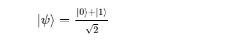

# 你是否纠结于量子叠加？

> 原文：<https://towardsdatascience.com/do-you-struggle-with-the-quantum-superposition-86d0f2147bfb?source=collection_archive---------35----------------------->

## 实践量子计算——直观解释

本帖是本书的一部分: [**用 Python 动手做量子机器学习**](https://www.pyqml.com/page?ref=medium_visual&dest=/) **。**

传统位可以是`0`或`1`。相比之下，量子位(称为量子位)可以处于叠加状态。量子叠加是`0`和`1`的线性组合。但是量子位只要你不测量，就只能处于叠加态。一旦你测量了你的量子位，它会立刻坍缩成`0`或`1`。就像古典音乐一样。

在这篇文章中，我们仔细观察了量子叠加，以及它的状态如何决定我们是将量子位测量为`0`还是`1`。

一个量子位有两种可能的测量方式:`0`和`1`。因此，量子位是一个二维量子系统。每个维度都由一个标准基向量表示。在量子计算中，我们使用狄拉克符号。它表示 ket 旁边的列向量，看起来像“|ψ⟩":”

量子位的状态由两个维度的叠加来表示。这就是量子位状态向量|ψ⟩(“psi”)。

α和β是|0⟩和|1⟩.状态的概率振幅它们的平方分别表示测量量子位的概率为`0`(由α^2 给出)或`1` (β^2)。

|ψ⟩必须通过以下方式标准化:

让我们看看下图中量子位态|ψ⟩的图形表示。

作者弗兰克·齐克特的图片

在此表示中，两个维度都位于垂直轴上，但方向相反。系统的顶部和底部分别对应于标准基矢量|0⟩和|1⟩。

当有两个维度时，通常的做法是把两个维度相互正交。虽然使用一个轴来表示两个维度对于二维系统来说是相当不寻常的表示，但是它非常适合于量子系统。

看看上图中的任意量子比特状态向量|ψ⟩。由于量子位状态向量是归一化的，|ψ⟩起源于中心，大小(长度)为 1/2。圆的直径是 1。由于这个相等的量级，所有的状态向量都在尖圆处结束。|ψ⟩.也是

状态向量|0⟩和|ψ⟩之间的角度称为θ(“theta”)，控制向量头到系统顶部和底部的接近度(虚线)。

这些近似表示概率。

*   α^2 是衡量|ψ⟩的概率为`0`
*   以及测量它的β^2 为`1`。

接近度α和β位于它们所描述的状态概率
(|ψ⟩)的相反两侧。α是到|1⟩的接近度(或距离),因为随着到|1⟩的距离增加，测量`0`的概率增加。

因此，通过控制接近度，角度θ也控制了测量处于状态`0`或`1`的量子位的概率。

我们可以指定角度θ，并使用所需的归一化来导出α和β，而不是指定α和β之间的关系，然后对它们的值进行归一化处理。

我们可以推导出α和β的值，从而推导出状态|ψ⟩:

在 Python 中，双字段数组`[cos(theta/2), sin(theta/2)]`表示这种状态。

你想推导出这个公式吗？这里有一个小提示:泰勒斯和毕达哥拉斯定理在这里帮助你。

还有一个问题。对于θ∈R，如果π

下图显示了这种情况。

作者图片

数学上，我们没有问题。因为我们平方α和β，所以它们的符号(+或)与所得概率无关。

但这意味着什么呢？如图所示，α^2 或β^2 怎么会是负数？答案是 I，I 是一个平方为负的复数:i^2=−1.

而如果α和β是复数(α，β∈C)，它们的平方可以是负数。

这必然会带来很多后果。这引发了很多问题。现在，我们将垂直轴左侧的所有向量解释为β^2 (β^2<0).)的负值

虽然这样一个值让我们能够区分垂直轴两侧的量子位状态向量，但它对于所得的概率并不重要。

例如，国家

产生相同的测量概率`0`或`1`(各 50%)。它位于水平轴。也是如此

尽管这些状态的概率相同，但它们是不同的。并且角度θ在它们之间是不同的。

θ=π/2 指定|ψ⟩=|0⟩+|1⟩/√2，也称为|+⟩.

θ=3/2 π或θ=，π/2 表示|ψ⟩=|0⟩−|1⟩√2，也称为|−⟩.

上面提到的α^2 或β^2 为负的结果之一是，我们的归一化规则需要一些调整。

我们需要将归一化方程改为:

这个帖子包含了很多公式。重要的一点是，我们可以指定量子态，这些量子态产生以角度θ测量`0`和`1`的特定概率。它描绘了一幅清晰的画面，有助于理解和记忆。

让我们来看看角度θ在 Python 代码中是如何工作的。

作者弗兰克·齐克特的图片

在这段代码中，我们引入了函数`getState`(第 5 行)。它将`theta`作为参数，并返回数组`[cos(theta/2), sin(theta/2)]`。这是我们在上面的等式中指定的向量。这导致有 50%的几率测量出量子位分别是`0`或`1`。

# 结论

量子位及其叠加态很难解释。虽然数学为量子位是什么以及它的行为方式提供了一个清晰的定义，但对我们大多数人来说，光靠公式是不够直观的。在这篇文章中，我们提出了量子位状态的视觉解释，以及它如何决定测量量子位在状态`0`或`1`的概率。

把一个概念的图片放在眼前不仅有助于理解它，还能促进对它的记忆。

本帖是本书的一部分: [**用 Python 动手做量子机器学习**](https://www.pyqml.com/page?ref=medium_visual&dest=/) **。**

在这里免费获得前三章。