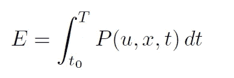
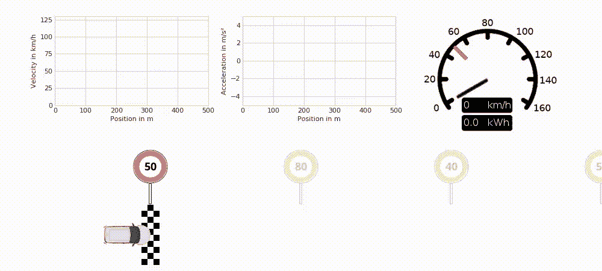
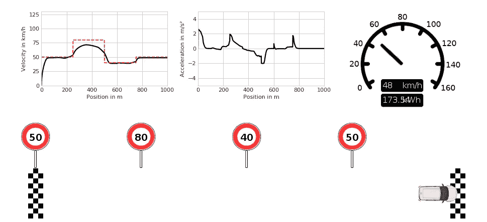
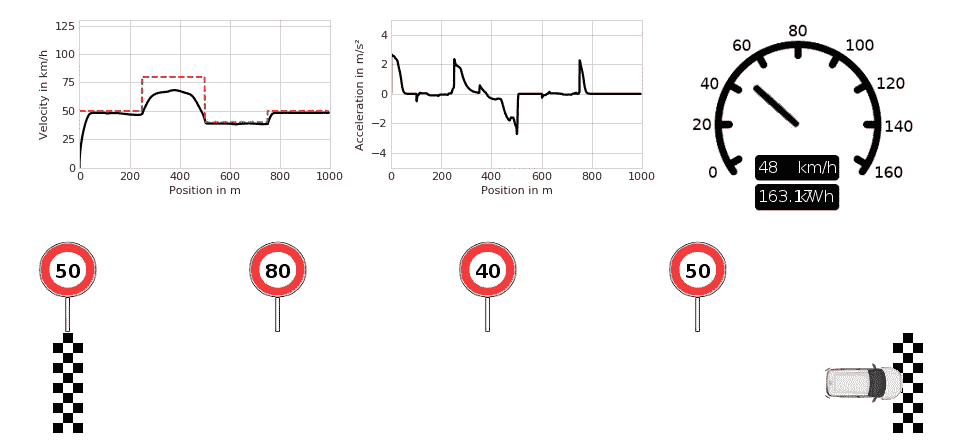
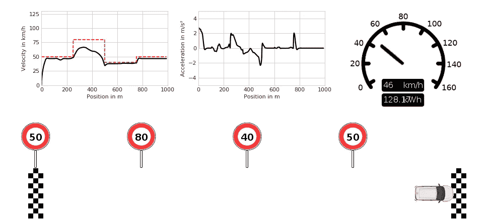

# 要不要用强化学习训练一辆简化的自动驾驶汽车？

> 原文：<https://towardsdatascience.com/do-you-want-to-train-a-simplified-self-driving-car-with-reinforcement-learning-be1263622e9e?source=collection_archive---------18----------------------->

## 试试我们新的 [LongiControl 环境](https://github.com/dynamik1703/gym_longicontrol)

[NeONBRAND](https://unsplash.com/@neonbrand?utm_source=unsplash&utm_medium=referral&utm_content=creditCopyText) 在 [Unsplash](https://unsplash.com/?utm_source=unsplash&utm_medium=referral&utm_content=creditCopyText) 上的照片

在这里，我与简·多门和克里斯托夫·弗里贝尔一起展示了这项研究。

# 动机

近年来，使用强化学习(RL) [1]来解决具有挑战性的游戏和较小的领域问题[2][3][4]的应用成功激增。RL 的这些成功在一定程度上是由于 RL 社区在公共开源环境模拟器(如 OpenAI 的 Gym [5])上的强大协作努力，这些模拟器可以加快开发速度，并在不同的先进策略之间进行有效的比较。

然而，许多现有的环境包含游戏而不是真实世界的问题。只有最近的出版物开始向面向应用的 RL 过渡[6][7]。在这篇文章中，我们的目标是在一个高度相关的问题:自动驾驶车辆的纵向控制中，将现实世界中的激励 RL 与易访问性联系起来。自动驾驶是未来，但在自动驾驶汽车独立地在随机的现实世界中找到自己的路之前，仍然有无数问题需要解决。

# 强化学习

在我们仔细研究 Longicontrol 环境之前，我们将在下面简要描述一下 RL 的基础知识。如果你熟悉 RL，可以直接跳到**纵向控制部分。**

强化学习(RL)是一种从与环境的交互中学习以实现既定目标的直接方法。在这种情况下，学习者和决策者被称为代理，而与之交互的部分被称为环境。交互以连续的形式进行，因此代理在每个时间步 *t* 选择动作，环境对它们做出响应，并以状态 *Sₜ₊₁* 的形式向代理呈现新的情况。响应代理的反馈，环境以数字标量值的形式返回奖励 *Rₜ₊₁* 。代理人寻求随着时间的推移回报最大化[1]。

图 1:强化学习互动[1]

介绍了 RL 的概念后，下面是对某些术语的简要解释。详细介绍请参考[1]。

**政策。政策是代理行为的特征。更正式地说，政策是从状态到行动的映射。**

**目标和奖励。**在强化学习中，智能体的目标以一种称为奖励的特殊信号的形式形式化，这种信号在每个时间步从环境转移到智能体。基本上，代理人的目标是最大化其获得的标量报酬的总量，导致最大化的不是眼前的报酬，而是长期的累积报酬，也称为回报。

**探索与剥削。**强化学习的一个主要挑战是探索和利用的平衡。为了获得高回报，代理人必须选择在过去被证明特别有回报的行动。为了首先发现这种行为，必须测试新的行为。这意味着代理人必须利用已经学到的知识来获得奖励，同时探索其他行动以在未来拥有更好的策略[1]。

**问学。**很多流行的强化学习算法都是基于 Q 值的直接学习。其中最简单的是 Q 学习。更新规则如下:

当在状态 s 中选择一个动作 a 并遵循该动作的策略时，Q 对应于预期的未来回报。交互的回报表示为 r。Q 函数的自适应由学习速率和折扣因子控制。该策略隐含在 Q 值中:

**深度确定性政策梯度(DDPG)。**寻找最佳行动需要对 Q 函数进行有效评估。虽然这对于离散的和小的动作空间是简单的(计算所有的动作，并选择具有最高值的动作)，但是如果动作空间是连续的，问题就变得无法解决。然而，在许多应用中，如机器人和能源管理，离散化是不可取的，因为它们对解决方案的质量有负面影响，同时在精细离散化的情况下需要大量的存储器和计算能力。Lillicrap 等人[8]提出了一种称为 DDPG 的算法，它能够通过深度强化学习来解决连续问题。与 Q-Learning 相反，使用了演员-评论家架构。详细的描述可以在[8]中找到。

# 纵向控制

在纵向控制领域中，目标是车辆在给定时间内尽可能节能地完成单车道路线，而不造成事故。总之，这对应于在从 *t₀* 到 *T* 的间隔中使用的总能量 *E* 的最小化，作为功率 p 的函数:

根据外部要求，如其他道路使用者或速度限制，必须同时满足以下边界条件:

其中 *v* 为速度， *a* 为加速度，a_dot 为急动度，()ₗᵢₘ,ₘᵢₙ和()ₗᵢₘ,ₘₐₓ分别代表下限和上限。

# 规划方法

在这一点上，可能会出现这样的问题通常是如何解决的。一种可能性是规划方法。对于这些，假设路线是完全已知的，没有其他道路使用者，并且也知道驾驶员将如何使用辅助消耗装置。下图显示了一个示例性的解决方案。动态规划计算已知路线的两个速度限制之间的最有效速度轨迹。

图 2:使用动态规划的给定路线的示例性解决方案[9]

如果路线不确定，尤其是在你前方有其他道路使用者的情况下，你可能想知道该采取哪种方法。一方面，速度限制大多是已知的，另一方面，其他道路使用者的行为是非常随机的。这通常是不可预见的。因此，不同的方法是必要的。由于强化学习能够解决随机问题，这是一个有前途的方法来解决这个问题。由于在真实交通中直接训练自动驾驶汽车太危险和低效，模拟提供了一种解决方案。可以安全地开发和测试这些算法。因此，我们将处于我们的新 RL 环境中，这将在下面介绍。

# 远程控制环境

正如我们之前看到的，RL 设置由两部分组成:代理和环境。我们将仔细观察环境。它独立于代理。这意味着您可以为代理测试任何算法。

图 3:long control 可视化

环境由两部分组成。车辆和驾驶环境。首先，重点应该放在车辆上。

车辆的运动被简化为匀加速模型。模拟基于 t = 0.1 s 的时间离散化。当前速度 *vₜ* 和位置 *xₜ* 计算如下:

车辆的加速度由当前车辆状态和代理选择的发动机功率产生，因此是环境的作用。由于只考虑纵向控制，所以轨道可以模拟为单车道。因此，在这一点上，一维速度 *vₜ* 和位置 *xₜ* 就足够了。

为了确定车辆的能耗，我们从真实的电动车辆中创建了一个黑盒模型。当前速度和加速度是输入变量，能量消耗是输出变量。了解了车辆模型之后，接下来的话题就是车辆行驶的景观。

图 3 示出了模拟中的轨迹实现的例子。驾驶环境以这样的方式建模，即距离是任意长的，并且任意定位的速度限制指定了任意的允许速度。这可以被认为等同于随机模拟的交通。最多提前 150 米，车辆驾驶员接收关于即将到来的速度限制的信息，从而基本上可以进行前瞻性驾驶。结果是一个持续控制问题的环境。下面列出了国家的各个组成部分。

# 状态 s

国家由五部分组成:

*   速度
*   先前加速度
*   当前速度限制
*   未来速度限制
*   未来限速距离

现在的速度和限速很直观。保持最后一次加速的状态，可能不是每个人都能马上看出来的。这是计算加加速度所需要的。描述车辆加速平稳程度的大小。

# 行动 a

代理在值范围[-1，1]内选择一个操作。因此，代理可以在取决于状态的车辆最大和最小加速度之间进行选择。这种类型的建模导致代理只能选择有效的动作。

# 奖励 r

奖励函数定义了代理人对每个行为的反馈，并且是控制代理人行为的唯一方法。它是 RL 环境中最重要和最具挑战性的组件之一。在这里介绍的环境中，这尤其具有挑战性，因为它不能简单地用一个标量来表示。如果只奖励(惩罚)能源消耗，车辆将简单地静止不动。代理将了解到，从能量消耗的角度来看，简单地不驾驶是最有效的。虽然这是事实，我们都应该更经常地使用我们的自行车，但我们仍然希望代理在我们的环境中驾驶。所以我们需要一个奖励，让驾驶对代理人更有吸引力。通过比较不同的方法，当前速度和当前速度限制之间的差异被证明是特别合适的。通过最小化这种差异，代理会自动启动自己。为了仍然将能量消耗考虑在内，奖励成分与能量消耗一起维持。第三个奖励因素是由颠簸引起的。这是因为我们的自动驾驶汽车也应该能够舒适地行驶。最后，为了惩罚违反速度限制的行为，增加了第四个奖励部分。

由于 RL 是为标量奖励设计的，所以有必要对这四个部分进行加权。合适的加权并不是微不足道的，而是一个巨大的挑战。为了让您更容易开始，我们已经预先配置了适当的权重。在本文的下一部分，我们将向您展示不同权重的效果的一些例子。但是，欢迎您自己探索更好的权重。

为了能够评估不同权重的效果，有效的 RL 学习过程是必要的。这是接下来要考虑的。

# 示例性学习过程

图 4:学习过程的开始

在第一个示例中，我们看到了代理在培训开始时的动作。是的，你没看错，代理不动。所以我们让他训练一下:

图 5:经过一些学习过程后

开了一段时间后，他开始开车，但无视限速。这是不可取的。因此，我们让他训练更长时间:

图 6:在较长的训练过程之后

通过让代理训练更长时间，他也开始尊重速度限制。曲线还不完美。如果你喜欢它，只要在一个更长的学习过程后尝试一下它会是什么样子。

**可以总结一下。**代理学习舒适驾驶，甚至遵守速度限制。值得注意的是，它能够在未来正确地使用速度限制。这不是明确的编程，但他自己学会了。令人印象深刻。

# 多目标优化

如前所述，这个问题有几个相互依赖的目标。因此也可以进行多目标调查。为了更好地理解，我们举了三个例子。

**赏例 1。**如果只应用了移动奖励(与允许速度的偏差):代理违反了速度限制。

图 7:奖励权重[1，0，0，0]

**奖励例 2。**在第二个例子中，增加了对超速的处罚。这导致代理实际上保持限制。

图 8:奖励权重[1，0，0，1]

**奖励例 3。在第三个例子中，我们添加了能量和挺举奖励。这导致代理驱动更节能，也选择更平稳的加速。**

图 9:奖励权重[1，0.5，1，1]

这只是理解的一个例子。因此，该环境为研究多目标算法提供了良好的基础。

# 摘要

在本文的最后，我们将总结最重要的几点。

通过所提出的适用于 OpenAI Gym 标准化的 RL 环境，我们展示了原型化和实现最先进的 RL 算法是容易的。此外，LongiControl 环境适用于各种检查。除了 RL 算法的比较和安全算法的评估，在多目标强化学习领域的研究也是可能的。其他可能的研究目标是与已知路线的规划算法进行比较，调查模型不确定性的影响，以及考虑非常长期的目标，如在特定时间到达。

LongiControl 旨在使社区能够利用强化学习的最新策略来解决自动驾驶领域的现实世界和高影响问题。

这里有 [GitHub 链接](https://github.com/dynamik1703/gym_longicontrol)、[报纸](https://www.researchgate.net/publication/342747549_LongiControl_A_Reinforcement_Learning_Environment_for_Longitudinal_Vehicle_Control)和我的 [LinkedIn](https://www.linkedin.com/in/roman-lie%C3%9Fner-56346113b/) 简介

享受使用它😉

# 参考

[1] R .萨顿和 a .巴尔托，[强化学习简介](http://incompleteideas.net/book/first/the-book.html) (1988)，麻省理工学院出版社

[2] V. Mnih 和 K. Kavukcuoglu 和 D. Silver 和 A. Graves 和 I. Antonoglou 和 D. Wierstra 和 M. A. Riedmiller，[用深度强化学习玩雅达利](https://arxiv.org/abs/1312.5602) (2013)，CoRR

[3] D. Silver 和 J. Schrittwieser 和 K. Simonyan K 和 I. Antonoglou 和 A. Huang 和 A. Guez 和 T. Hubert 和 L. Baker 和 M. Lai 和 A. Bolton 等人[掌握没有人类知识的围棋游戏](https://www.nature.com/articles/nature24270) (2017)，《自然

[4] R. Liessner 和 C. Schroer 以及 A. Dietermann 和 b . bker，[混合动力电动汽车高级能源管理的深度强化学习](https://www.scitepress.org/Link.aspx?doi=10.5220/0006573000610072) (2018)，ICAART

[5] G .布罗克曼和 v .张和 l .彼得森和 j .施耐德和 j .舒尔曼和 j .唐和 w .扎伦巴，[开放健身房](https://arxiv.org/abs/1606.01540)。CoRR，2016。

[6] M. Andrychowicz，B. Baker，M. Chociej，R. Jozefowicz 等人[学习灵巧手操作](https://arxiv.org/abs/1808.00177)。CoRR，2018。

[7] F. Richter，R. K. Orosco，M. C. Yip，[外科机器人的开源强化学习环境](https://arxiv.org/abs/1903.02090)，CoRR，2019。

[8] T. P. Lillicrap 等人，[深度强化学习连续控制](https://arxiv.org/abs/1509.02971) (2015)，CoRR

[9] S. Uebel, [高效纵向混合动力汽车的能源管理策略](https://www.researchgate.net/publication/333000947_EINE_IM_HYBRIDFAHRZEUG_EINSETZBARE_ENERGIEMANAGEMENTSTRATEGIE_MIT_EFFIZIENTER_LANGSFUHRUNG)(2018),TU Dresden