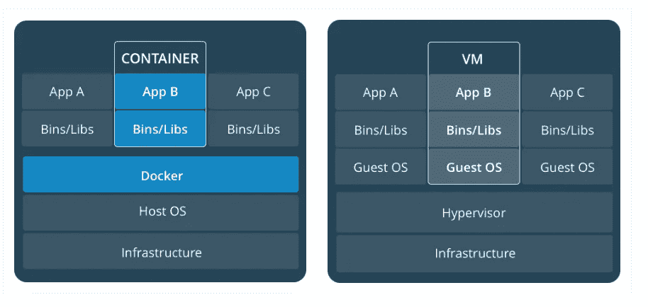
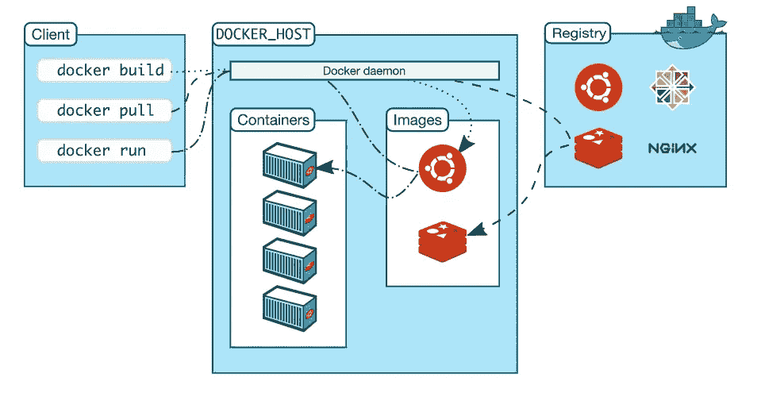
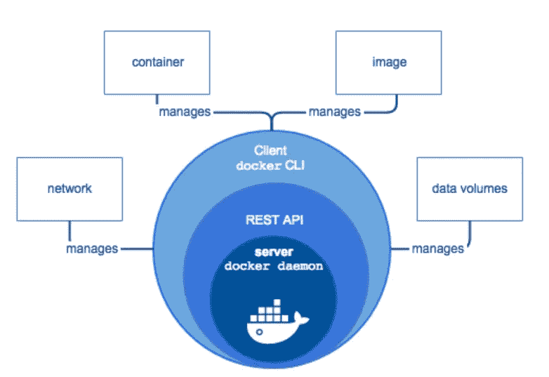

# Docker 101:你想知道的关于 Docker 的一切

> 原文：<https://towardsdatascience.com/docker-101-all-you-wanted-to-know-about-docker-2dd0cb476f03?source=collection_archive---------23----------------------->

## **Docker 入门**

## **绝对初学者的 Docker**

由[拍摄的照片谁是德尼罗？](https://unsplash.com/@whoisdenilo?utm_source=medium&utm_medium=referral) on [Unsplash](https://unsplash.com?utm_source=medium&utm_medium=referral)

你有没有被 Docker 的花哨名字吓倒过，想知道它是什么？—太好了，这篇文章是写给你的。

在这篇文章中，我们将会介绍这个魔鬼到底是什么以及它做了什么。

首先，Docker 是什么？🧐

Docker 是一个开源的容器化工具，主要用于跨不同平台快速运输和运行应用程序。Docker 快速运输和部署代码的方式大大减少了编写代码和在生产中运行代码之间的延迟。它是使用 GO 开发的，于 2013 年首次发布。

**为什么是 Docker？**

Docker 有一系列的优点使它变得非常有用。其中一些是:

1.  **隔离**

它帮助我们创建一个与环境无关的系统。您的应用程序可以在不同的平台上顺利运行。这基本上是使用容器实现的。

**②*。*便携性**

因为所有的依赖项都在同一个容器中，所以很容易从一个地方转移到另一个地方，这赋予了 Docker 可移植性。

***3。*轻量级**

作为系统上的另一个应用程序运行，而不是消耗系统的全部资源。

***4。*鲁棒性**

与虚拟机相比，对硬件的要求较低，需要的内存也很少，因此提供了高效的隔离级别，不仅有助于节省成本，还有助于节省时间。

在我们深入研究之前，我们为什么需要 Docker？我们没有足够的工具吗？🤨

是的，我们有。很多，但是 Docker 不一样。这让我们的生活更轻松。我会告诉你怎么做——继续读下去。

请允许我给你一些背景资料！

**背景**

从前，我们习惯于在操作系统上安装软件，而操作系统安装在一组特定的硬件上——CPU、内存和磁盘。让我们快进一点，虚拟化时代已经到来。在同一个操作系统中运行多个操作系统，允许一定程度的硬件隔离。比如——用 VirtualBox 在 Windows 上运行 Ubuntu。

容器 vs 虚拟机(图片来源:Docker.com[1])

你会发现这很酷，但是在敏捷时代，时间就是金钱，你需要持续地交付，并在每个冲刺阶段结束时提交可交付成果，追赶 IT 部门(如运营)以获得不同故事的不同开发环境(例如，需要更多内存/磁盘的资源密集型流程)可能会令人望而生畏，而且非常耗时。

别担心，码头工人来救你了。它有适合你的东西，一个名为 docker 的产品，它不仅提供了轻量级的虚拟化，还提供了基于开源 Linux 的软件，可以在任何支持 docker 实例的硬件上运行，如 Windows 或 OSX。Docker 通过使用容器实现了这种程度的虚拟化。这是一个比喻，因为它的工作方式和普通容器一样。它确实在里面储存东西。

容器是一个标准的软件单元，它将代码及其所有依赖项捆绑在一起，因此应用程序可以平稳快速地运行，而不受计算环境的影响。老实说，容器只不过是一个正在运行的进程，应用了一些额外的封装特性来保持它与主机和其他容器的隔离。[1]

**你说轻巧？**

Docker 容器作为可执行文件运行，与占用大量系统资源的虚拟化不同，容器就像另一个可执行的应用程序，它提供类似级别的虚拟化，但以资源高效和更安全的方式提供。由于 Docker 容器共享相同的系统资源，这使得它们很有效率。例如，在一个需要运行虚拟机的系统中，用户可以拥有不同的 Docker 容器，并拥有虚拟机中通常拥有的某种隔离级别。

容器隔离的一个最重要的方面是每个容器与其私有文件系统进行交互；这个文件系统是由 Docker 映像提供的。这实质上意味着需要更少的资源，从而降低成本。

**酷，什么是形象？**

不是你想的那样。它更像一台复印机。你可以用图像制作容器，就像你可以用复印机复印一样。它只不过是一个模板，包含一个应用程序，以及所有的依赖，需要运行你的应用程序，如你的代码，库，配置文件，环境变量(ex- PATH)等。该映像可以部署到不同的环境中。想知道图像和容器有什么不同吗？容器是一个图像的运行实例。

现在我们对 Docker 有了一些了解，让我们来看看它的架构。

Docker CLI(客户端)| Docker 守护进程(服务器)| Docker Hub(注册表)(图片来源:Docker.com[1])

**客户端-服务器架构**

Docker 命令行使用 Docker REST API 与 Docker 守护进程进行交互。Docker 客户端是命令行工具，这是用户与 Docker 交互的方式。Docker 守护进程监听 Docker 客户端 API 请求的端口，并管理图像和容器等 Docker 对象。客户端和服务器可以在同一台机器上。注册表是存储 docker 图像的地方。这是一个公共注册表，默认情况下，图像存储在 Docker hub 上。您可以使用自己选择的注册表来存储图像。

客户端-服务器架构(图片来源:Docker.com[1])

**码头枢纽**

这是一个官方的在线存储库，所有 docker 图片都存储在这里，它还允许这些图片被分发。如上所述，Docker 使用基于 Linux 的 CLI 工具与 Docker 守护进程进行交互。您可以使用这个 CLI 创建您的映像并将其发布到 Docker Hub。有两种方法可以实现这一点

1.在本地创建一个映像，并将其推送到 Docker Hub。

2.创建一个 docker 文件，并使用 Docker 连续构建系统来构建映像。(首选)

在将图像推送到 Docker hub 之前，你需要一个账户(基本版是免费的，点击这里获取你的[)和 Docker hub 桌面应用。这样做的先决条件是你应该在你的系统上安装 Docker(获取](https://hub.docker.com/) [Docker CE(社区版)](https://docs.docker.com/install/))。通过身份验证后，您可以开始将您的图像推送到 docker hub。

谁需要 Docker？

如果您需要快速一致地交付您的应用程序，您可能需要使用 Docker。主要是软件工程师、开发人员、数据工程师和数据科学家可以从 Docker 中受益。Docker 简化了软件开发生命周期，允许开发人员在标准化的环境中工作，这对于持续集成和持续交付(CI/CD)工作流来说很有吸引力。

# **结论**

在这篇文章中，我们快速浏览了作为容器化工具的 Docker、客户机-服务器架构及其功能。在接下来的文章中，我们将探索 Docker 命令，构建您的映像，运行容器，以及处理故障。

敬请关注😊

很高兴听到你对此的想法！

如果你觉得这很有用，并且知道任何你认为会从中受益的人，请随时发送给他们。

## 参考资料:

[1][https://docs.docker.com/get-started](https://docs.docker.com/get-started)