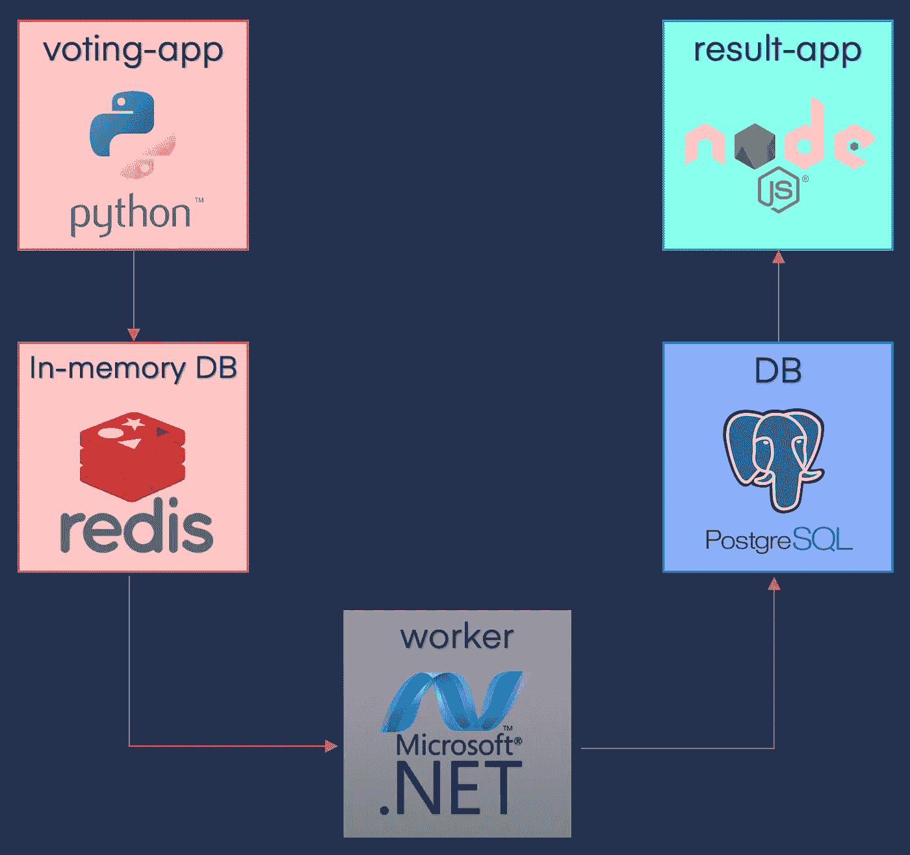
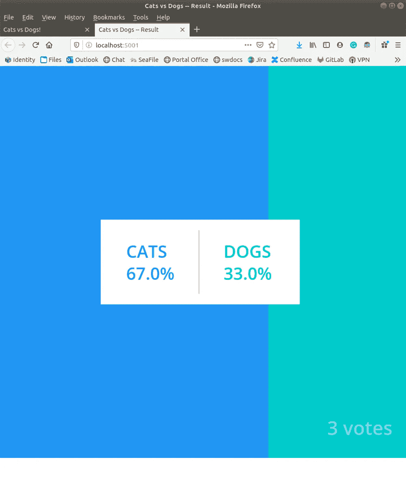
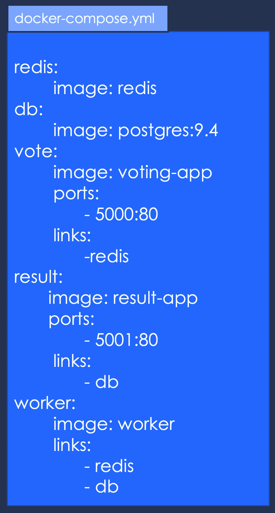
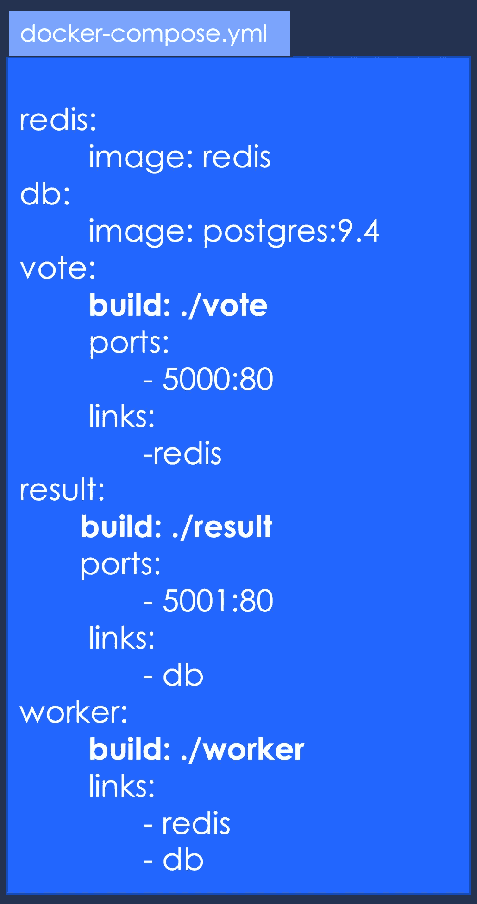
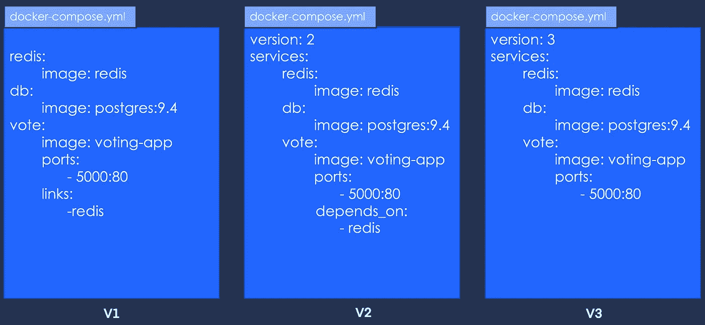
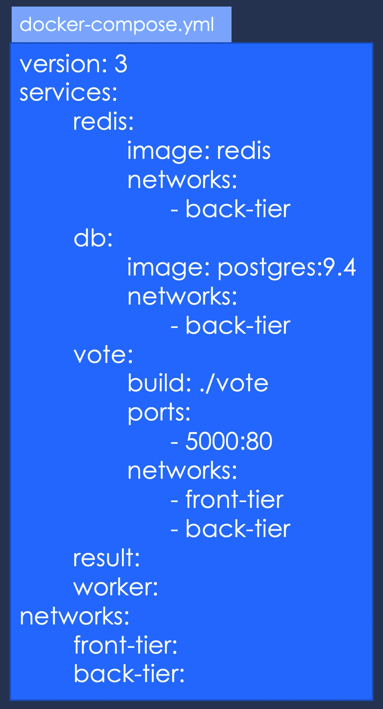
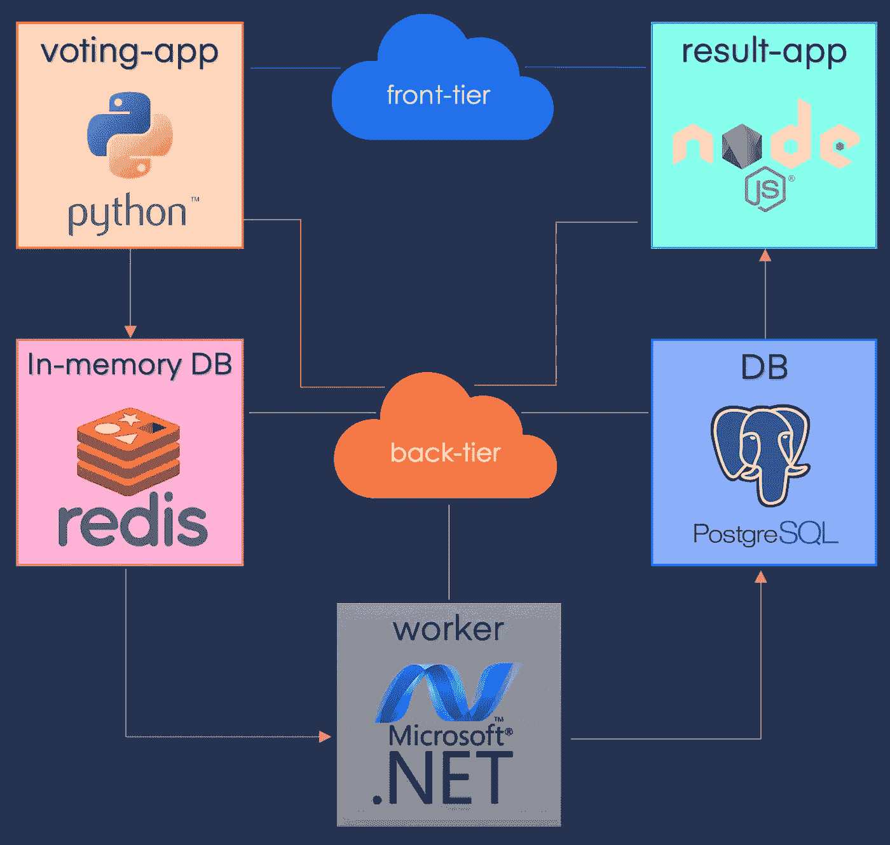
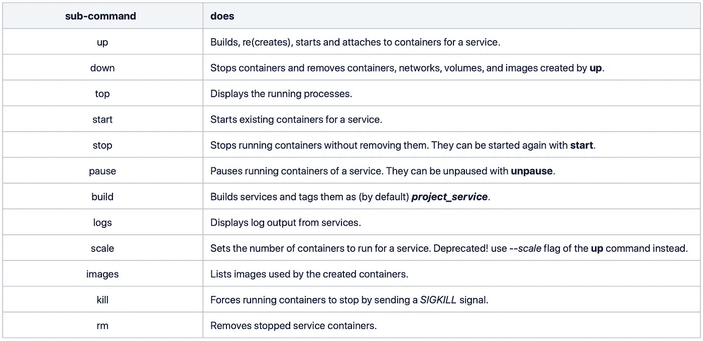

# Docker 撰写

> 原文：<https://towardsdatascience.com/docker-compose-44a8112c850a?source=collection_archive---------31----------------------->

## 完全指南

在本节中，我们将使用 Docker 开发的名为 Voting App 的示例应用程序来了解 Docker Compose、它的文件和命令。

1.  [简介](/a-concise-guide-to-docker-f6b6d5fb56f4)
2.  [Docker 文件](https://medium.com/@gyani91/docker-file-179b5e3d9171)
3.  [基本对接命令](https://medium.com/@gyani91/docker-commands-bbf02780b785)
4.  [端口和卷映射](https://medium.com/@gyani91/port-and-volume-mapping-c8bb09221f82)
5.  [Docker 联网](https://medium.com/@gyani91/docker-networking-919461b7f498)
6.  [码头仓库](https://medium.com/@gyani91/docker-storage-598e385f4efe)
7.  Docker Compose(你在这里！)
8.  [删除 Docker 实体](https://medium.com/@gyani91/deleting-docker-entities-2f90e4a0a765)

投票应用是一个用 Python 写的 Flask 应用，用来在猫和狗之间投票。


Python 中的 Web 应用程序

这个投票然后被传输到 Redis，Redis 在这里充当内存中的 DB。工人应用程序，用。NET，然后处理这个投票并将其插入持久数据库——这里是 Postgres 容器。



投票应用

最后，投票结果通过用 NodeJS 编写的 web 应用程序显示出来。



NodeJS 中的 Web 应用

我强烈建议您克隆这个应用程序并试用它，即使您对 Docker Compose 一无所知。如果你能意识到这些服务运行在 5 个不同的容器上，你就有动力继续阅读。

```
git clone git@github.com:dockersamples/example-voting-app.gitcd example-voting-app/docker-compose up
```

接下来，我们看看 docker-compose 文件。这是一个简单的 YAML 文件，以服务名及其细节开始，包括创建它的映像、要映射的端口、要链接的其他服务等。



简单 Docker 合成文件

这里我们假设每个图像都是预先构建的，并且可以在 Docker 注册中心(在我们的例子中是 Dockerhub)上获得。为了能够在我们的 Docker 主机上构建服务，这就是我们将为投票、结果和工作者图像所做的，我们必须在 docker-compose 文件中用 **build** 属性替换 **image** 属性。



简单 Docker 合成文件

由于 docker-compose 文件多年来持续快速的发展，它有几个版本。从版本 1 到版本 2 的变化是将服务移入**服务**标签，并在第一行添加**版本**标签。此外，您不再需要**链接**，因为默认情况下，每个容器都使用桥接网络连接到其他容器。添加 **depends_on** 是为了支持在依赖关系的情况下，先完成一些容器的构建。对于本教程的有限范围来说，版本 2 和版本 3 基本上是相同的。请记住 Docker Swarm 和其他容器编排软件(如 Kubernetes)的几个特性是在 docker-compose 的第 3 版中添加的。



Docker 合成文件的各种版本

如果您希望将面向客户端的应用程序的流量与后端应用程序隔离开来，您可以通过添加两个网络(前端层和后端层)来修改 docker-compose 文件，并说明哪个服务位于哪个网络上。

*注意，这不是一个完整的 docker-compose 文件，为了简洁起见，我省略了其他细节。*



Docker 用两个网络组成文件

运行这个 docker-compose 文件将产生如下所示的应用程序堆栈。



拥有两个网络的投票应用程序

如果您需要记住任何 docker-compose 命令，那就是 **docker-compose up** ，正如我们在投票应用程序示例中看到的。我还提供了其他命令的列表作为参考。



Docker 编写命令

总之，使用 docker compose，您可以打包并交付一个多容器应用程序，您的客户端只需一个命令就可以启动它。

在下一节的[中，我们将看到如何删除 Docker 的各种实体并回收一些空间。](https://medium.com/@gyani91/deleting-docker-entities-2f90e4a0a765)

参考:

[1] Docker，[编写命令行参考](https://docs.docker.com/compose/reference/) (2020)，Docker 文档

[2]穆姆沙德·曼南贝斯， [Docker for the Absolute 初学者](https://kodekloud.com/p/docker-for-the-absolute-beginner-hands-on) (2020)，KodeKloud.com