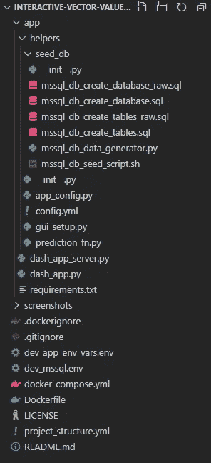
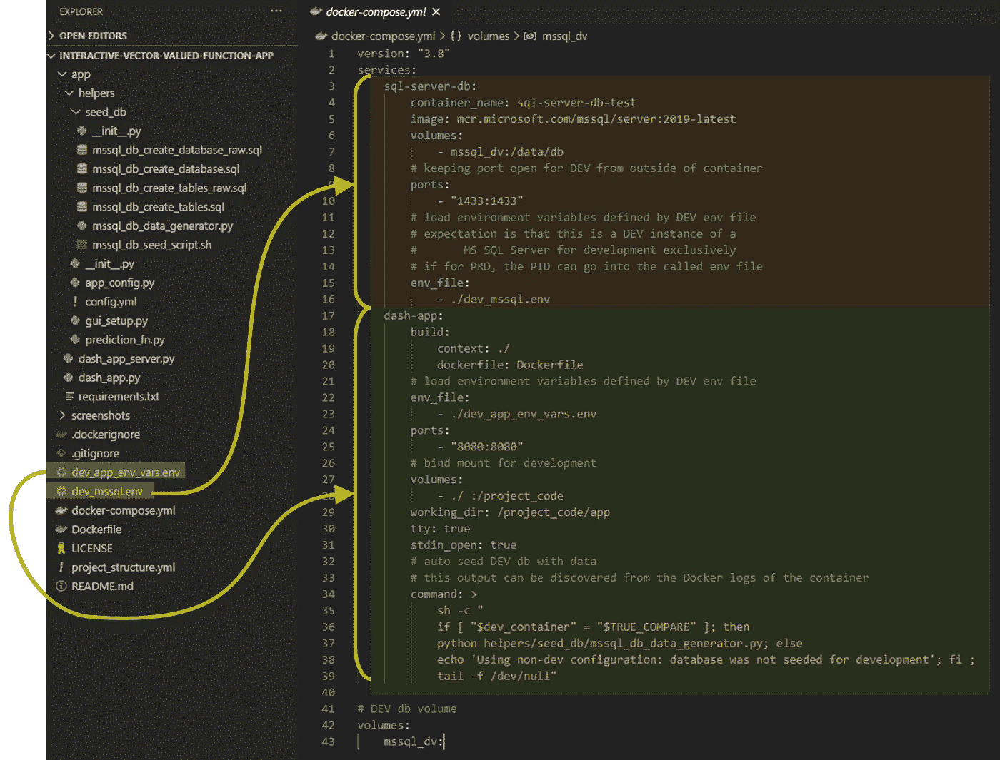
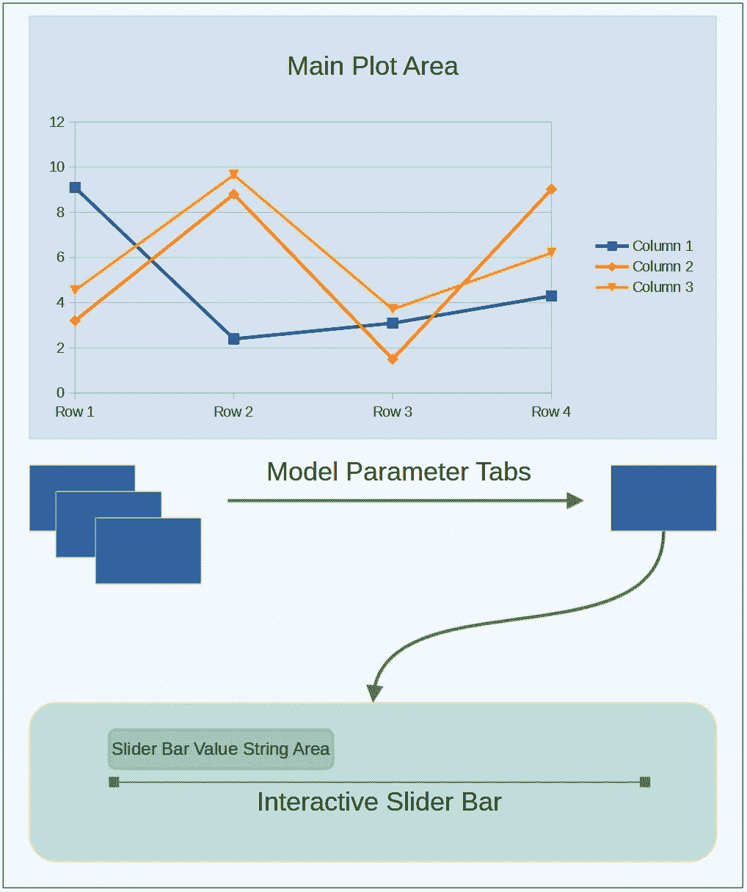
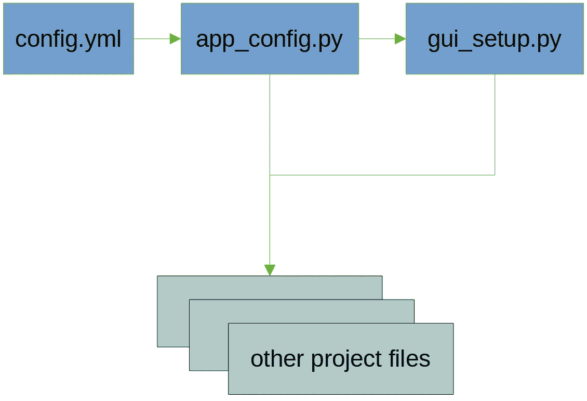
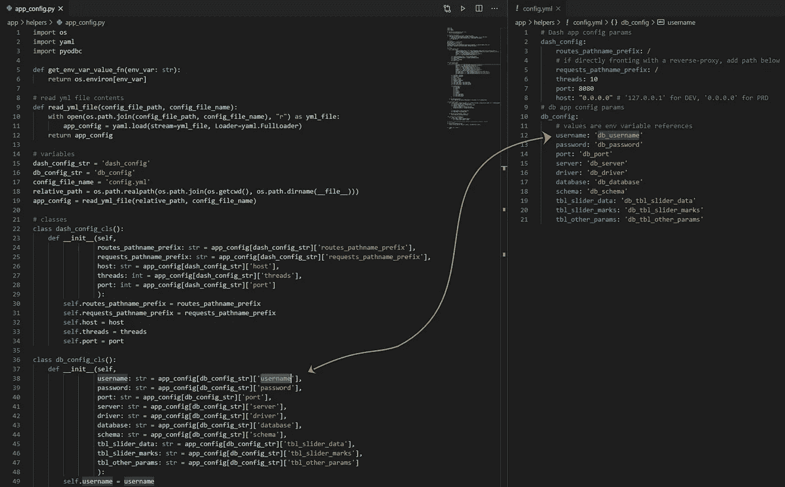
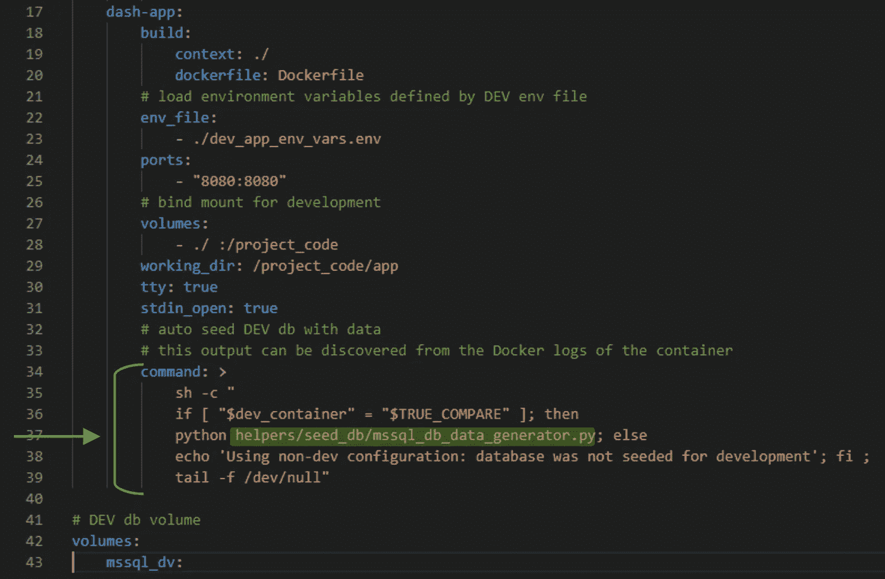
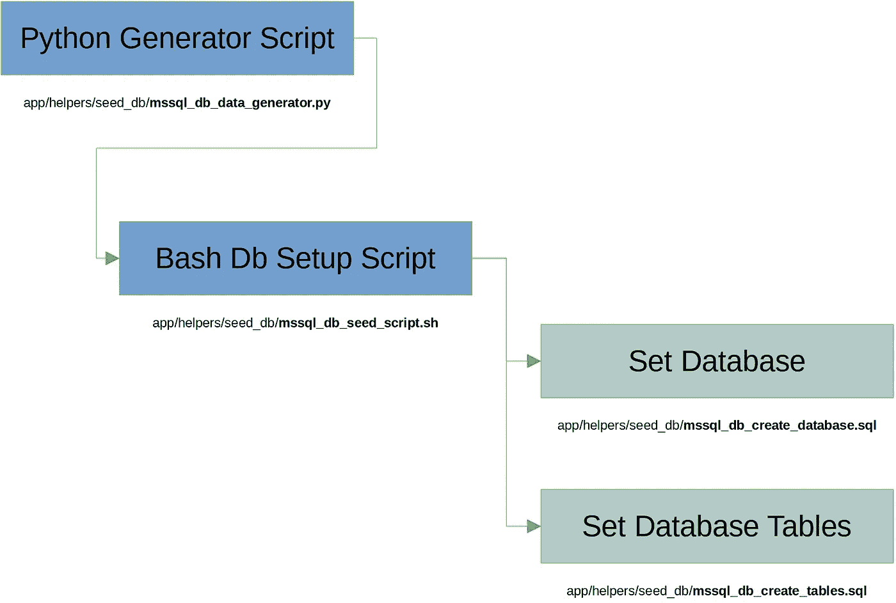
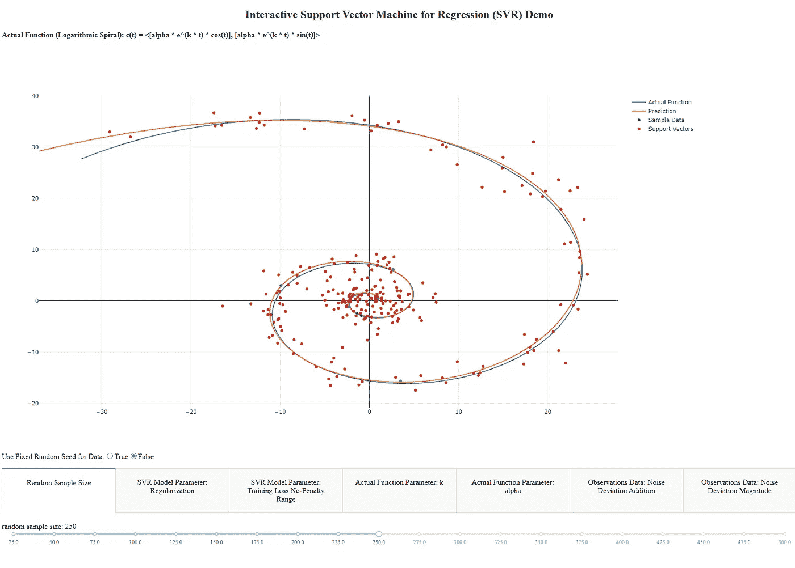

# BI/数据科学开发的 Docker 示例

> 原文：<https://towardsdatascience.com/docker-example-for-bi-data-science-development-16e305ab70fa?source=collection_archive---------32----------------------->

## [实践教程](https://towardsdatascience.com/tagged/hands-on-tutorials)

我发现 Docker 对于 BI 和数据科学开发工作流来说都是一个强大的工具。减轻“它在我的机器上工作”的问题本身就是非凡的，那么为什么不从健壮的业务解决方案的开发角度出发呢？在可伸缩性、工作流效率和最小化软件依赖性/共享库冲突之间找到平衡可能是困难的。然而，我发现 Docker 在这方面是一个非常强大的解决方案。通过 Docker，我已经能够利用开发工具、框架和软件语言，而无需安装在主机上。这种方法提供了可复制的环境，包含了独立的过程。能够从特定版本的 Python 或 Julia Docker 映像进行编程和开发，而不用担心我的主机上的实际安装或依赖性兼容性问题，这是一种令人难以置信的体验(更不用说不再需要整合虚拟 Python 环境的管理)。

尽管本文给出了一个简单的例子，展示了将 Docker 集成到 BI/数据科学开发工作流中的强大功能，但它确实需要一些 Python 和 Docker 的基础知识背景。

# 教程概述

该示例将采用一种简单的交互式动态 ML web 应用程序的方法，该应用程序从外部数据库服务器 MS SQL Server 中提取参数依赖性。要预测的函数是笛卡尔坐标中的对数螺线函数(一个向量值函数)，web app 本身会依赖于 Dash 框架(Plotly)。使用 Docker Compose，Docker 可以轻松管理多容器环境。一个容器将专用于运行模拟最终生产环境的开发 MS SQL Server。另一个容器将用于主应用程序(Docker Compose 将处理这两个容器之间的内部网络)。每个容器将引用一个环境文件，用于提供动态和可再现的环境，同时减少在任意文件中存储代码中的静态值。这些值将通过引用 YAML 文件的 Python 脚本进行连接，以确定环境变量值。这种方法可能看起来像是增加了多余的逻辑层，但是我发现这种模板方法最终会使事情变得简单得多(特别是当项目变得复杂时)。

为了管理代码结构，额外的离散 Python 文件将用于运行应用程序、为应用程序提供服务、保持预测功能、在应用程序的 GUI 结构中提供帮助，以及自动化开发数据库的播种/搭建。为了帮助搭建和播种开发数据库，我将提供一种方法，使用 Python 脚本作为该过程的启动程序，该程序调用 bash 文件在两个 SQL 文件的帮助下处理搭建方面。

示例项目要在给定的机器上运行，只需安装 Docker 和 Docker-Compose。要运行实际的 web 应用程序，请在运行 Docker Compose UP 命令之前取消 Docker 文件底部的注释。另一种方法是从正在运行的 web 应用程序容器中执行“python*dash _ app _ server . py*”(名称应该是*interactive-vector-valued-function-app _ dash-app _ x*)。如果 web 应用程序正在运行，它应该可以从端口 8080 访问(如果需要，可以在 Docker Compose 文件中更改)。点击此处获取项目代码的副本:

 [## bmurders 2/交互式向量值函数应用程序

### 通过 Dash 实现的交互式 ML/AI web 应用程序。这个应用程序允许最终用户修改向量的参数…

github.com](https://github.com/bmurders2/Interactive-Vector-Valued-Function-App) 

DEV、PRD 和 ENV 缩写将分别用于表示开发、生产和环境的代码中。下面是项目结构的快照:

项目文件夹概述-按作者分类的图像

# 主应用程序的 Dockerfile

主应用程序将从 docker 文件中派生出来，用于创建一个可重现的受控应用程序环境(针对开发和 PRD)。从 Python image 3.8.6-slim 开始，项目代码与工作目录的定义一起被复制(或者，这里可以使用 Git 引用，而不是引用项目代码的本地目录)。然后，运行命令用于应用程序预期运行所必需的依赖性和环境配置(例如，包括来自外壳的 *sqlcmd* )。我注释掉了 Dockerfile 的底部部分，该部分在作为非根用户启动容器时自动运行应用程序，以提升开发和测试环境。

Web 应用程序的 Dockerfile

# Docker 撰写设置

除了建立容器编排配置之外，当 docker-compose UP 命令被执行时。将传入包含各自容器使用的环境变量的 env 文件。例如， *dev_mssql.env* 中的变量‘MSQL _ PID’将决定要启动的 mssql 服务器的类型(在本例中是 Developer)。如果在正式流程的生产环境中，请确保您的组织中存在有效的许可证，除非附加到现有的生产 SQL Server(无论是哪种情况，此示例都会复制生产环境以确保有效的调试和代码开发)。下图显示了的映射。env 文件从 *docker-compose.yml* 文件中复制到它们对应的 Docker 容器中。

的可视化映射。env 文件及其相应的服务

# Web 应用程序文件

有一个主 web 应用程序文件( *dash_app.py* )用于 web 应用程序的主要功能，包括 dash 和定制包的包导入。在高层次上，应用程序布局是在导入和所需对象的初始实例化之后定义的，这为应用程序布局提供了总体布局和结构。以下是预期的应用程序视觉呈现的概述(简单明了，带有一个图表和一个参数列表，作为其下方预测函数的输入)。

Web 应用程序的可视化-作者图片

布局所需的一切都可以在这里内联定义，除了对自定义导入的调用，即预测函数的选项卡式参数列表。水平选项卡列表将是一个数组，因此自定义导入 *gui_setup.py* 将需要一个匹配这个输入要求的输出。这是为了管理潜在的动态变化，而不需要对主应用程序 Python 文件进行大量维护。对于每个参数选项卡，滑块用于确定相应的参数值。

Web 应用程序布局

由于应用程序用户界面的简单性，Dash 框架只需要两个应用程序回调:一个用于从 GUI 角度更新参数滑块，另一个用于传递预测函数所需的输入值，并返回 plot 对象。更新 GUI 滑块很简单，如下图所示。

滑块参数值的更新功能

用于调用预测函数并返回绘图的第二个回调函数比第一个回调函数稍微复杂一些，因此将预测函数本身包装在一个单独的文件中有助于压缩这里的代码。在将输入参数传递给预测函数之后，预期的输出是一个 Pandas 数据帧，可以通过 JSON 格式使用 Plotly 进行绘制。

实时更新绘图的功能

下面的代码是用来服务应用程序的。在这种情况下，将使用女服务员(Gunicorn 是服务基于烧瓶的应用程序的另一个可靠选择)。

为 Web 应用提供服务的代码

# 助手类和文件

在尝试播种和搭建开发数据库之前，了解相应数据库的生产环境结构是很重要的。该项目使用一个助手 GUI 文件 *gui_setup.py* ，用于辅助主要的应用程序功能和呈现，它依赖于 *app_config.py* 文件。然后， *app_config.py* 文件依赖于 *config.yml* 文件来确定检索所需值的环境变量名。为了本文的简洁，没有明确显示所有的项目代码。

提供给项目代码的应用程序配置参数概述—图片由作者提供

YAML 配置文件

**config.yml** 和 **app_config.py** 的可视化关系—图片由作者提供

# 设定开发数据库服务器的种子

为了设置开发数据库服务器，我们将创建和播种预期的生产数据库、模式和表。这个过程的开始将包含在命令部分下的 *docker-compose.yml* 文件中(这在容器启动时执行)。这里，将检查一个条件，以确保我们应该通过来自 *dev_app_env_vars.env* 文件的环境变量继续播种开发数据库。如果这个条件成功，继续调用 Python 生成器文件，*MSSQL _ db _ data _ generator . py*(文件位置: *app/helpers/seed_db* )。用于植入/搭建开发数据库的 SQL 文件将要求在调用时传递变量(这些变量在每个文件中显示为“$( <变量>)”。sql 文件)。

Docker-Compose 文件的下半部分突出显示了对**MSSQL _ db _ data _ generator . py**的调用—图片由作者提供

数据生成概述-按作者分类的图像

参考同一个文件*MSSQL _ db _ data _ generator . py*中的*get _ default _ GUI _ cls _ values()*函数，下面是为数据库搭建执行*MSSQL _ db _ seed _ script . sh*(第 26 行)后将生成的数据插入开发数据库的代码。

搭建并播种开发数据库

下面是由*MSSQL _ db _ seed _ script . sh:*调用的 SQL 代码

用于创建开发数据库的 SQL 代码

用于创建开发数据库表的 SQL 代码

# 预测函数

对于应用程序的预测函数，scikit-learn 的两个离散支持向量回归模型将用于分别预测向量值函数曲线的 x 和 y 分量(对数螺线)。将预测结果作为 Pandas 数据框架进行训练和返回所需的代码非常简单。因为要预测的函数不是标量函数，而是向量值函数(由两个分量参数化的直线曲线)，所以务必注意 x 和 y 坐标的曲线步长。

预测功能码

web 应用程序运行的最终结果将如下所示，带有模型的选项卡式交互式参数滑块:

# 结论

这个工作示例演示了在任何运行 Docker 的机器上同时工作的自动化方法中编排多个流程是多么容易。尽管该示例的某些部分对于简单的曲线拟合函数来说可能有些过头，例如当交互式仪表板应用程序本身已经生成值时，使用数据库来保存这些值，但是底层方法展示了在应用于业务解决方案时可伸缩性和敏捷开发的功效。

我想通过一个工作实例来分享利用 Docker 进行 BI/数据科学项目的方法。特别是考虑到 Docker 可以直接用于开发阶段，因为它减少了安装额外的软件工具或调试由于运行时不兼容问题引起的主机问题的需要。个人认为，Docker 是业务创新的有力工具。