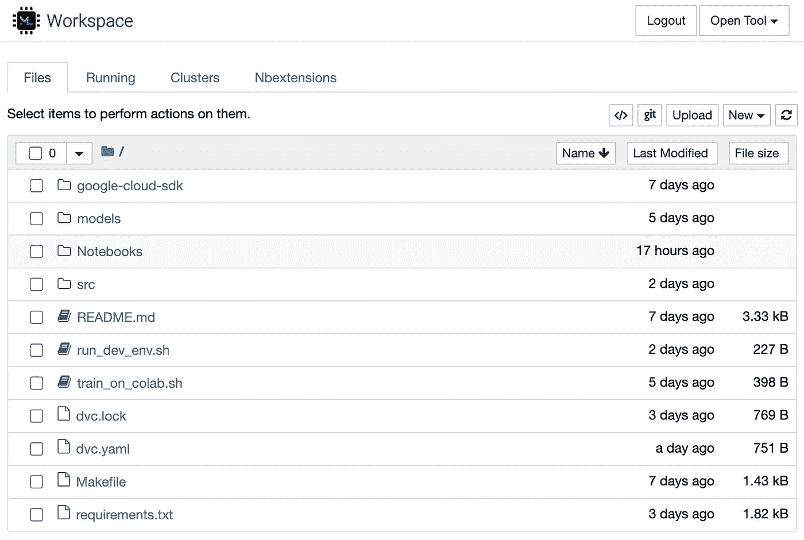
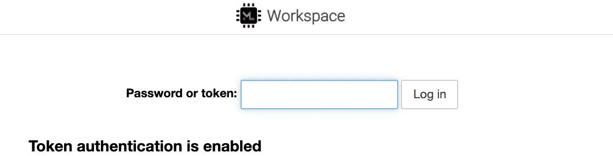

# 数据科学 Docker 逐步指南

> 原文：<https://towardsdatascience.com/docker-for-data-science-a-step-by-step-guide-1e5f7f3baf8e?source=collection_archive---------2----------------------->


卢卡斯·范·奥尔特在 [Unsplash](https://unsplash.com?utm_source=medium&utm_medium=referral) 上的照片

## 在这篇文章的最后，你将通过 Docker 在你的机器上运行一个 ML 工作空间，里面有你需要的 ML 库，VSCode，Jupyter Lab + Hub，以及许多其他好东西。

[关于为什么 Docker 可以改善你作为数据科学家的生活，已经有很多](/how-docker-can-help-you-become-a-more-effective-data-scientist-7fc048ef91d5) [和](https://mlinproduction.com/docker-for-ml-part-1/) [说过了](/learn-enough-docker-to-be-useful-b7ba70caeb4b)。我和几个朋友正在使用 [Fast.ai](https://fast.ai/) 做一个(不)酷的深度估计项目，这时我偶然发现了[@ Jeremy Howard](https://twitter.com/jeremyphoward)的这条推文。

开始这篇文章的推文

碰巧我们正在使用 Docker 为项目创建我们的数据科学工作区，所以我认为解决 Jeremy 的问题并与社区分享这些知识是有意义的。

我将非常简要地回顾一下 Docker 的核心概念和优势，然后展示一个使用 Docker 建立整个数据科学工作空间的分步示例。

如果你已经知道 Docker 是什么，为什么它很棒，那么跳到[分步教程](#39fe)。

# Docker 是什么？

Docker 是一个创建和部署隔离环境(即虚拟机)的工具，用于运行具有依赖关系的应用程序。

您应该熟悉的几个术语(为了便于理解，包括一个烘焙类比):

*   ***Docker 容器*** —应用程序的单个实例，它是实时运行的。在我们的比喻中，这是一块饼干。

一块跳舞的饼干。吉菲

*   ***Docker Image***—创建容器的蓝图。图像是不可变的，从同一图像创建的所有容器都是完全一样的。在我们的比喻中，这是千篇一律的模式。


饼干切割器。伊莎贝拉·艾奇逊 / [Unsplash](https://unsplash.com/?utm_source=ghost&utm_medium=referral&utm_campaign=api-credit)

*   ***Dockerfile*** —包含创建 Docker 映像时要调用的命令列表的文本文件。在我们的类比中，这是创建千篇一律的模具的**指令。**

制作饼干切割器。[吉菲](https://giphy.com/gifs/3ixS2QB5lWmGCcJkqI)

# (作为一名数据科学家)我为什么要关心？

概括地说，ML 中的 Docker 有两个用例:

*   ***只运行*** : 只运行容器是指你在本地 IDE 上编辑你的代码，用容器运行它，这样你的代码就在容器里面运行了。这里有一个很好的例子。
*   ***端到端平台*** : 端到端平台容器是指你有一个 IDE 或者 Jupyter 笔记本/实验室，以及你的整个工作环境，在容器中运行，也在里面运行代码(可以挂载的工作文件系统除外)。

我们将关注第二个用例。

# 在数据科学项目中使用 Docker 的原因

> 使用 docker 容器意味着你不必处理“在我的机器上工作”的问题。

一般来说，Docker 提供的主要优势是标准化。这意味着您可以一次定义容器的参数，并在安装 Docker 的任何地方运行它。这反过来提供了两个主要优势:

1.  ***再现性:*** 每个人都有相同的 OS，相同版本的工具等。这意味着你不需要处理“在我的机器上工作”的问题。如果它能在你的机器上工作，它也能在每个人的机器上工作。
2.  ***可移植性:*** 这意味着从本地开发迁移到超算集群很容易。此外，如果你像我们在 DAGsHub 一样从事开源数据科学项目，你可以 ***为合作者提供一种简单的方法来绕过设置的麻烦*** 。

另一个**巨大优势**——学习使用 Docker 会让你成为一名更好的工程师，或者让你成为一名拥有超能力的数据科学家。许多系统依赖于 Docker，它将帮助您将 ML 项目转化为应用程序，并将模型部署到生产中。

# 面向数据科学的 docker 容器示例

*   [pytorch/pytorch](https://hub.docker.com/r/pytorch/pytorch) —包含 pytorch 的用例 1 的简单容器
*   [jupyter/scipy-notebook](https://hub.docker.com/r/jupyter/scipy-notebook) —用例 2 的容器，包括作为 UI 的 jupyter，以及许多 python [数据科学模块](https://jupyter-docker-stacks.readthedocs.io/en/latest/using/selecting.html#jupyter-scipy-notebook)。
*   [Dag shub/ml-workspace-minimal](https://hub.docker.com/repository/docker/dagshub/ml-workspace-minimal)—是我将在上面展示逐步指南的容器。该容器是来自 [ml-tooling/ml-workspace 存储库](https://github.com/ml-tooling/ml-workspace)的更新版本。原来的已经有 7 个月没有维护了，所以我创建了一个最新的版本。它结合了以下工具:
    -💫Jupyter，JupyterLab
    👾VSCode 基于 web 的 IDE。
    - 🗃 Pytorch、Tensorflow、Sklearn、Pandas 等众多流行的数据科学库&工具。
    -可通过网络浏览器访问的🖥全 Linux 桌面图形用户界面。
    —🎮通过网络浏览器轻松访问终端。
    —🔀针对笔记本电脑优化的无缝 Git 集成。
    —📈集成硬件&通过 Tensorboard & Netdata 进行训练监控。
    —🚪从任何地方通过 Web、SSH 或 VNC 在单个端口下访问。
    - 🎛可通过 SSH 用作远程内核(Jupyter)或远程机器(VSCode)。
    —🐳易于通过 Docker 在 Mac、Linux 和 Windows 上部署。

听起来很棒，对吧？！现在让我们看看如何设置它。

# 设置您的数据科学 docker 容器—分步指南

## 安装 Docker

安装 Docker 是容易和免费的。只需根据您的操作系统遵循本指南即可。

## 建立码头工人形象

将不在本教程中讨论。一旦我们有了想要的图像，我们的重点将是如何运行 Docker 容器。

我们将使用来自[Dag shub/ml-workspace-minimal](https://hub.docker.com/repository/docker/dagshub/ml-workspace-minimal)的预构建图像。它是从 GitHub 上的这个[库](https://github.com/DAGsHub/ml-workspace)中创建的。如果你想建立或修改这张图片或任何其他图片，我推荐杰瑞米·霍华德在他的原始推文中提到的那篇文章。

## Docker Run +处理所有特殊修饰符

只需运行以下命令:

```
docker run -d \
    -v "/${PWD}:/workspace" \
    -p 8080:8080 \
    --name "ml-workspace" \
    --env AUTHENTICATE_VIA_JUPYTER="mytoken" \
    --shm-size 2g \
    --restart always \
    dagshub/ml-workspace:latest
```

`docker run`是获取 Docker 映像(cookie cutter)并从中创建容器的命令。在我们的类比中，这是制作饼干的步骤。

这个长命令可能看起来很吓人，但是我们可以把所有这些标志想象成我们的饼干(巧克力片和夏威夷果)的配料😋).以下是对各种标志以及为什么需要它们的解释:

**挂载你的工作文件系统** `**-v "/${PWD}:/workspace"**` 这可能是最重要的标志。它允许您在容器关闭后保留您的工作(文件)，并从容器外部访问它们。

它通过将您当前的工作文件夹(在这里您执行`docker run`命令)，表示为`/${PWD}`，映射到容器的虚拟文件系统中的`/workspace`文件夹。如果你想改变这一点，你可以适当地改变这个论点。

**端口转发**这个参数暴露了 8080 端口。本质上，这意味着在计算机上运行这个程序后，可以通过`http://{computer-ip}:8080`访问您的容器。如果您在本地系统上运行这个，那么这个地址将是`[http://localhost:8080](http://localhost:8080)`。对于更复杂的映像，出于 API 端点等其他原因，您可能需要转发多个端口。在我们的例子中，端口是 UI 端点，它将把您带到 ML-Workspace 的主屏幕:



[http://localhost:8080](http://localhost:8080)—我的 ML-Workspace 主页

**命名我们的容器** `**--name "dags-workspace"**` 这为我们的容器生成了一个惟一的标识符，以供将来参考。顾名思义，这个名称在您的系统中应该是唯一的，所以如果您从同一个映像创建多个容器，您需要为它们定义不同的名称。`--name`也有助于给我们的容器添加含义。如果不定义名字，会自动为你生成一个没有意义的。

**定义环境变量**`**--env AUTHENTICATE_VIA_JUPYTER="mytoken"**` `--env`标志为你的容器定义环境变量。这在不同的容器之间变化很大，因此很难给出一个通用的用例。

在我们的例子中，我们用它来定义工作区的密码。当有人第一次打开上面的链接时，Jupyter 会要求他们输入这里定义的密码。如果您在共享电脑上工作，这可能会很有用。



ML 工作区请求密码

**定义共享内存** `**--shm-size 2g**` 这个标志用来定义你的容器的共享内存(越多越好)。请记住，这与您的常规系统使用相同的 RAM，所以如果您设置得太高，可能会降低您的计算机速度。对于大多数用例来说，一个好的大小应该在`2g`和`8g`之间。

**定义重启策略**`**--restart always**` `--restart`标志代表容器的重启策略。根据码头文件:

> *重启策略控制 Docker 守护程序在退出后是否重启容器。*

我们使用`always`选项，这意味着即使系统重启，Docker 也会试图保持容器运行。这对于保持您的项目上下文完整无缺非常有用。

**恭喜你！现在你已经有一个完整的 ML 工作空间在你的 docker 上运行，包括你可能需要的所有东西。**

如果你想更深入一层，我推荐你去`docker run` [命令参考](https://docs.docker.com/engine/reference/run/)查看所有可用的标志。

# 附加设置

让我们回顾一下我建议你建立一个理想工作空间的几件事情。

# 在 Docker 中设置 Conda/虚拟环境

我们设置了一个标准化的独立机器来运行我们的 ML。如果你是第一次设置你的项目，你可能会跑去找你的环境管理器`conda` / `pip`安装一些很棒的包。

**让我打断你一下。**

为什么要花这么大力气去创建一个隔离的、可复制的环境，然后去安装一堆没有人知道的不同的包。您应该创建一个 Conda 或虚拟环境来管理您的软件包。如果您决定使用[DAGsHub/ml-workspace-minimal](https://hub.docker.com/repository/docker/dagshub/ml-workspace-minimal)容器，您应该这样做:

在 ML [工作区主页](http://localhost:8080)中，点击打开工具下拉菜单并选择终端。然后键入以下命令:

```
# Input your <env-name> and the <python-version> you want
conda create -y --name <env-name> python=<python-version>
# Activate your environment
source activate <env-name># If you have a `requirements.txt` file, you should install those requirements
pip install -U pip setuptools wheel
pip install -r requirements.txt
```

安装完包之后，如果您想保存项目(希望提交给 Git ),您应该通过运行以下命令来保存包列表:

```
# This will override your existing `requirements.txt`. 
# If you want to append, use `>>` instead of `>`
pip list --format=freeze > requirements.txt
```

**注意:**想知道为什么你应该使用这个命令来列出你的需求(而不是`pip freeze >> requirements`)？[阅读本期 GitHub](https://github.com/pypa/pip/issues/8174)

# 包装它

现在，你已经用 Docker 建立了一个隔离的、可复制的、可移植的、令人敬畏的 ML 工作空间。我希望这篇文章对你有用，如果你有任何问题或反馈，请通过我们的 [DAGsHub Discord Channel](https://discord.com/invite/9gU36Y6) 联系。


杰西·贝利 / [Unsplash](https://unsplash.com/?utm_source=ghost&utm_medium=referral&utm_campaign=api-credit) 拍摄的照片