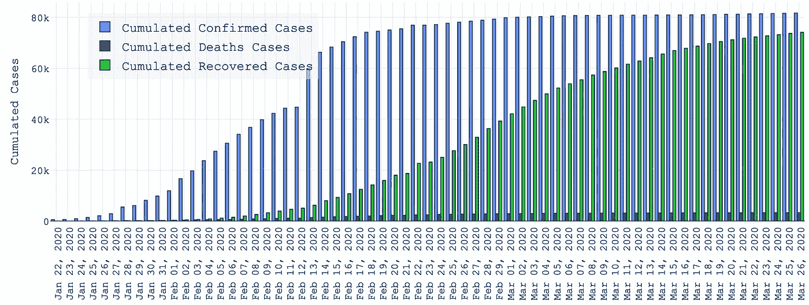

# Python-Dash 和 R-Shiny 的 Docker

> 原文：<https://towardsdatascience.com/docker-for-python-dash-r-shiny-6097c8998506?source=collection_archive---------6----------------------->

## Docker & docker-compose 快速入门。以及显示新冠肺炎案例编号的仪表板示例。

您想使用 Docker & Docker Compose 部署您的数据驱动型应用程序吗？然后继续读下去，因为这篇文章会让你在几分钟内就开始运行。对于最广泛传播的数据科学/分析堆栈: **Python & R** 。

在我最近的媒体报道中，我解释了如何建立一个数据驱动的 web 应用程序，以显示冠状病毒的病例数。我用下面的**两个栈**创建了**完全相同的 web 应用**:

*   Python & Dash ( [链接](/visualise-covid-19-case-data-using-python-dash-and-plotly-e58feb34f70f))
*   R &闪亮([链接](/create-a-coronavirus-app-using-r-shiny-and-plotly-6a6abf66091d))

在本文中，我将向您展示如何使用 Docker & Compose 部署这些应用。我将首先介绍 Docker，包括 Python 和 R，稍后再介绍 docker-compose。


托马斯·詹森在 [Unsplash](https://unsplash.com?utm_source=medium&utm_medium=referral) 上拍摄的照片

# 码头工人

## 装置

在你选择的服务器上安装 Docker 很容易——有大量的说明。例如，如果您有一个运行 Amazon Linux 的 [AWS 实例(EC2)](https://aws.amazon.com/ec2/) ，只需输入:

```
sudo yum install -y docker  # Install Docker.
sudo service docker start   # Start the service.
sudo usermod -a -G docker ec2-user  # Add ec2-user to Docker group.
sudo chkconfig docker on    # Let docker auto-start.
```

完美。码头工人准备好了！

## Python-Dash 的 docker 文件

首先，我们要创建***requirements . txt***文件，包括所有必要的库。这可以使用命令来完成

```
pip freeze > requirements.txt
```

或者通过手动创建文本文件并输入库的名称。对于[提到的 app](/visualise-covid-19-case-data-using-python-dash-and-plotly-e58feb34f70f) ，我们需要以下库(顺便说一下， *plotly* 安装有*破折号*):

```
dash
pandas
```

然后我们准备设置 **DOCKERFILE** 本身。对于一个简单的 Python-Dash 应用程序，以下代码就足够了:

```
FROM python:3.8
LABEL maintainer "Meinhard Ploner <[dummy@host.com](mailto:meinhard.ploner@gmail.com)>"WORKDIR /codeCOPY requirements.txt /
RUN pip install -r /requirements.txt
COPY ./ ./EXPOSE 8050CMD ["python", "./app.py"]
```

**单个**命令**的描述**:

*   FROM …:提取标签为 3.8(=版本)的 Python 图像。
*   标签…:可选。维护者的姓名和电子邮件。
*   WORKDIR …:设置工作目录。
*   复制需求…:复制*需求. txt* 文件。
*   运行 pip …:安装所有列为需求的库。
*   收到。/ …:将所有文件复制到 Docker 映像。
*   EXPOSE …:设置监听端口。
*   CMD …:设置运行映像时要执行的命令。

完美。如果我们对 R 解决方案不感兴趣，我们可以**跳到****docker-compose**的定义。否则，请继续…

## R-Shiny 的 docker 文件

在 R 上，**包**通常不在需求文件中列出，而是**直接成为 DOCKERFILE** 代码的一部分。与 Python 类似，我提出了一个 DOCKERFILE，它适用于简单的应用程序，就像我在[其他帖子](/create-a-coronavirus-app-using-r-shiny-and-plotly-6a6abf66091d)中解释的那样。

该文件比 Python 稍微复杂一些，但仍然很紧凑:

```
FROM rocker/shiny:3.6.1
LABEL maintainer "Meinhard Ploner <[dummy@host.com](mailto:meinhard.ploner@gmail.com)>"WORKDIR /srv/shiny-serverRUN apt-get update \
    && apt-get install -y libsasl2-dev libssl-devRUN echo \
  'options(repos=list(CRAN="[https://cloud.r-project.org/](https://cloud.r-project.org/)"))' > \
  ".Rprofile"
RUN R -e "install.packages(c('dplyr','tidyr', 'plotly'))"ADD https://raw.githubusercontent.com/rocker-org/shiny/master/shiny-server.sh /usr/bin/COPY ./ ./EXPOSE 3838RUN chmod a+w .
RUN chmod +x /usr/bin/shiny-server.shCMD /usr/bin/shiny-server.sh
```

**单个**命令**的描述**:

*   来自…:提取标签为 3 . 6 . 1(=版本)的 R-闪亮图像。
*   标签…:可选。维护者的姓名和电子邮件。
*   WORKDIR …:设置工作目录。
*   运行 apt-get …:安装 *libssl* ，这是 *plotly* 所需要的。在其他 Linux 实例或 Windows 上可能有所不同。
*   运行 echo …:将 [CRAN 库 URL](https://cran.r-project.org/) 写入*。Rprofile* ，在后续的 R 调用中使用。
*   运行 R …:调用 R 来安装各种包。
*   ADD …:下载 *shiny-server.sh* 文件并将其添加到映像中。
*   收到。/ …:将所有文件复制到 Docker 映像。
*   EXPOSE …:设置监听端口。
*   运行 chmod +w…:使镜像的主目录可写。
*   运行 chmod +x…:使 *shiny-server.sh* 可执行。
*   CMD …:设置运行映像时要执行的命令。

就是这样。让我们继续进行**作曲**部分。

# Docker 撰写

## 装置

docker-compose 的安装也很简单。从 GitHub 复制适当的二进制文件，并修复权限:

```
sudo curl -L https://github.com/docker/compose/releases/download/1.22.0/docker-compose-$(uname -s)-$(uname -m) -o /usr/local/bin/docker-compose sudo chmod +x /usr/local/bin/docker-compose
```

你可能想知道 ***uname*** 这个命令是干什么用的？ *uname* 返回操作系统的基本信息。在搭载亚马逊 Linux 的 AWS EC2 上，对于“ *uname -s* ”给出了“ *Linux* ”，对于“ *uname -m* ”给出了“ *x86_64* ”。

# docker-为 Python-Dash & R-Shiny 编写文件

*docker-compose . yml*YAML 文件**在两个堆栈**之间没有区别。但是在创建它之前，先设置一个名为“**的环境文件。env** "带基本应用信息:

```
VERSION=1.0.0
TARGET=LIVE
```

现在创建合成文件，在我们的例子中，它是极简的:

```
version: "3.7"services:
  app-name:
    build:
      context: .
    image: app-name:$VERSION
    container_name: app-name
    ports:
      - "to:from"
    environment:
      - TARGET=$TARGET
    restart: unless-stopped
```

将“ ***应用名称*** ”替换为您选择的应用名称。映像名称将使用版本号，在我们的例子中是“ *app-name:1.0.0* ”。

此外，Python-Dash 应用程序通常运行在端口 5050 上，而 R-Shiny 应用程序默认使用端口 3838。因此**将端口** ( *“至:”*)替换为:

*   Python-Dash 为 80:5050
*   80:3838 代表 R-闪亮

除了端口 80，您还可以使用您想要服务的任何其他端口。将文件另存为 *docker-compose.yml，就大功告成了。*

# 构建并运行！

要构建**图像**,请使用:

```
docker-compose build
```

构建完映像后，通过键入以下命令构建并启动**容器**:

```
docker-compose up -d
```

选项*-d "*确保应用程序在后台运行。如果没有该选项，您将直接看到日志，这对测试设置的最初几次运行非常有用。

如果您从 GitHub 下载了应用程序代码并按照说明操作，您的应用程序将在服务器上运行。



否则，您也可以测试运行在 **my EC2 实例**上的应用程序:

*   **AWS/EC2 上的 Python-Dash app**:[*https://go.aws/2xsdb7q*](https://go.aws/2xsdb7q)
*   **AWS/EC2 上的 R-Shiny app**:[*https://go.aws/3aoYsIW*](https://go.aws/3aoYsIW)

# 结论

如您所见，部署一个简单的 Dash 或闪亮的应用程序没什么大不了的。即使一个应用变得更加复杂，这些例子也可以作为一个蓝图。

我希望你喜欢这篇文章，它有助于让你自己的应用程序运行起来！