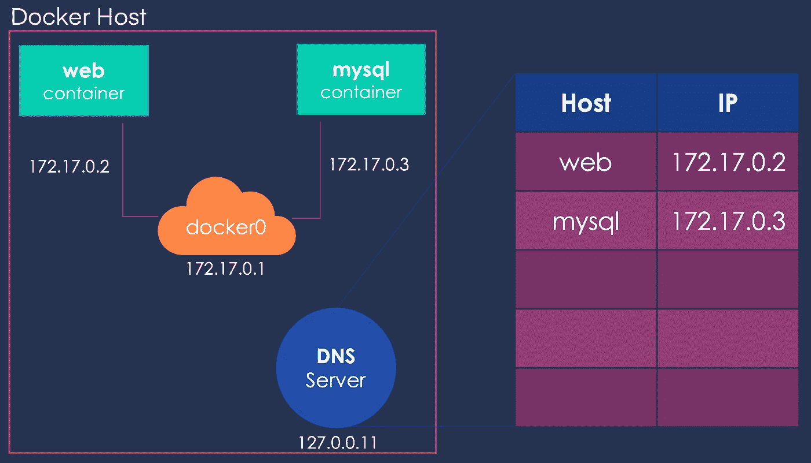
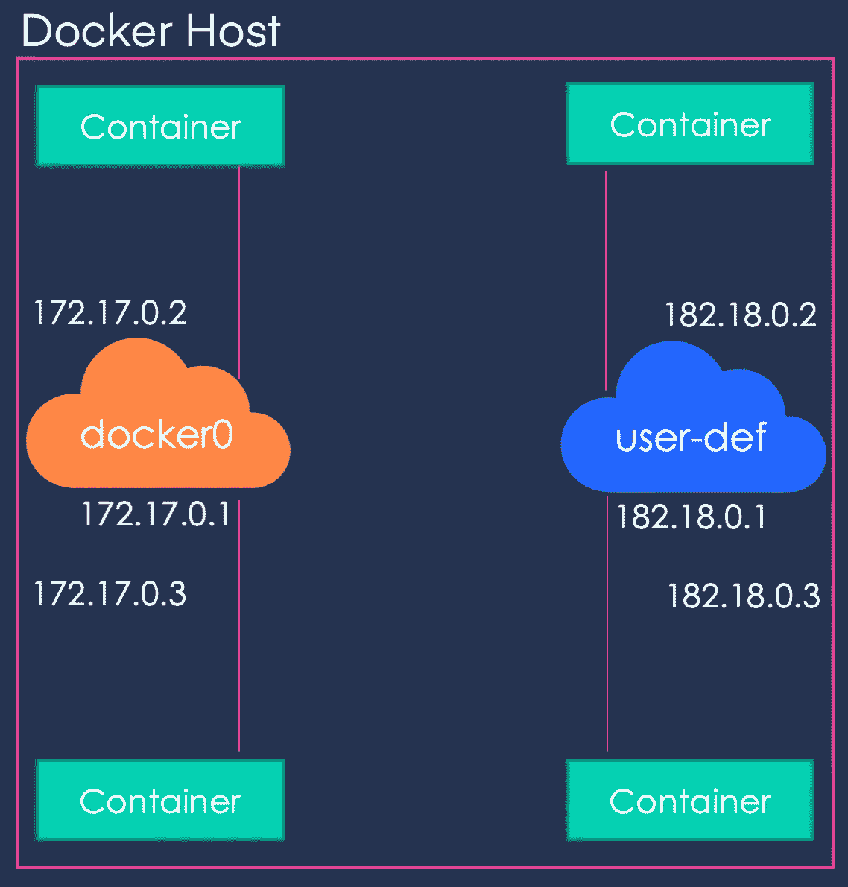

# Docker 网络

> 原文：<https://towardsdatascience.com/docker-networking-919461b7f498?source=collection_archive---------19----------------------->

## 容器是如何与它们的宿主以及彼此通信的！

当你安装 docker 时，它会自动创建三个网络——网桥、主机和无网络。其中，网桥是容器运行时所连接的默认网络。要将容器连接到任何其他网络，您可以使用 run 命令的 **- network** 标志。

1.  [简介](/a-concise-guide-to-docker-f6b6d5fb56f4)
2.  [Docker 文件](https://medium.com/@gyani91/docker-file-179b5e3d9171)
3.  [基本对接命令](https://medium.com/@gyani91/docker-commands-bbf02780b785)
4.  [端口和卷映射](https://medium.com/@gyani91/port-and-volume-mapping-c8bb09221f82)
5.  Docker 联网(你来了！)
6.  [码头仓库](https://medium.com/@gyani91/docker-storage-598e385f4efe)
7.  [Docker 撰写](https://medium.com/@gyani91/docker-compose-44a8112c850a)
8.  [删除 Docker 实体](https://medium.com/@gyani91/deleting-docker-entities-2f90e4a0a765)


Docker 中自动创建的网络

**桥**网络将 *172.17.x.x* 范围内的 IP 分配给其中的容器。要从外部访问这些容器，您需要将这些容器的端口映射到主机上的端口。另一个自动创建的网络是**主机**。选择**主机**网络将移除 docker 主机和容器之间的任何网络隔离。例如，如果您在端口 5000 上运行一个容器，它将可以在 docker 主机上的同一个端口上被访问，而不需要任何显式的端口映射。这种方法的唯一缺点是不能对任何容器两次使用同一个端口。最后， **None** 网络保持容器完全隔离，即它们不连接到任何网络或容器。

这些容器可以使用它们的名字相互联系。这是通过运行在地址 **127.0.0.11** 上的嵌入式 DNS 实现的。



嵌入式 DNS

默认情况下，容器连接到同一个网络。如果我们希望两个容器在不同的网络上，我们该怎么办？


默认网络

为此，我们可以使用以下命令定义一个用户定义的网络，并在运行容器时分配该网络。

```
docker network create \
	--driver bridge \
	--subnet 182.18.0.0/16 \
	user-def
```



用户定义的网络

在[下一节](https://medium.com/@gyani91/docker-storage-598e385f4efe)中，我们将了解 Docker 储物件！

参考:

[1]穆姆沙德·曼南贝斯， [Docker for the Absolute 初学者](https://kodekloud.com/p/docker-for-the-absolute-beginner-hands-on) (2020)，KodeKloud.com