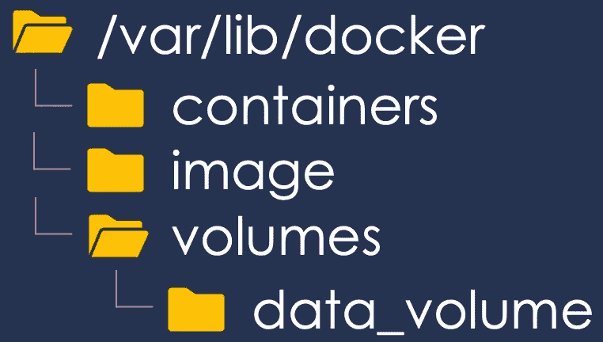
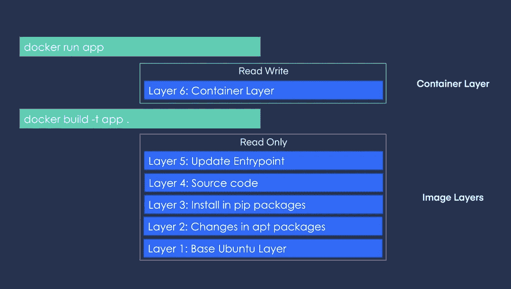
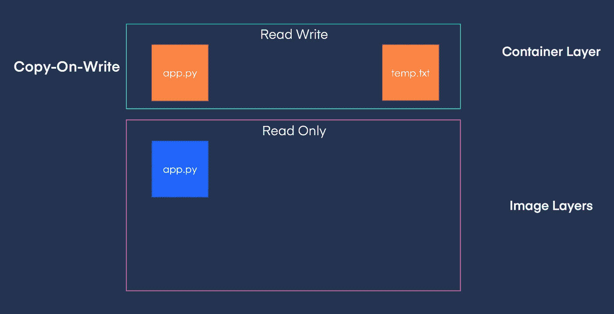
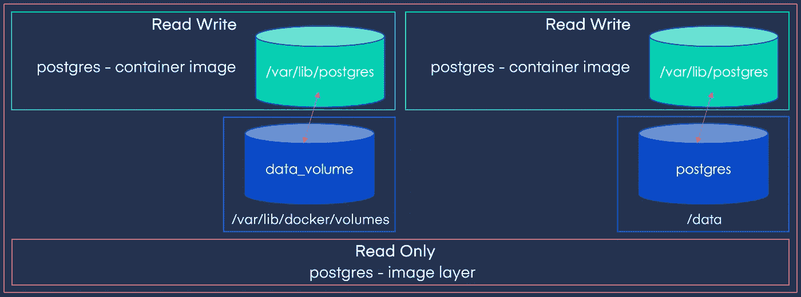

# 码头仓库

> 原文：<https://towardsdatascience.com/docker-storage-598e385f4efe?source=collection_archive---------12----------------------->

## Docker 数据架构和持久存储

在本节中，我们将讨论 docker 如何在本地文件系统上存储数据，了解哪些层是可写的，并加深我们对容器持久存储的了解。

1.  [简介](/a-concise-guide-to-docker-f6b6d5fb56f4)
2.  [Docker 文件](https://medium.com/@gyani91/docker-file-179b5e3d9171)
3.  [基本对接命令](https://medium.com/@gyani91/docker-commands-bbf02780b785)
4.  [端口和卷映射](https://medium.com/@gyani91/port-and-volume-mapping-c8bb09221f82)
5.  [Docker 联网](https://medium.com/@gyani91/docker-networking-919461b7f498)
6.  Docker 存储(你在这里！)
7.  [Docker 撰写](https://medium.com/@gyani91/docker-compose-44a8112c850a)
8.  [删除 Docker 实体](https://medium.com/@gyani91/deleting-docker-entities-2f90e4a0a765)

在 linux 系统上，docker 将与映像、容器、卷等相关的数据存储在 **/var/lib/docker** 下。



Linux 系统上 Docker 文件的位置

当我们运行 *docker build* 命令时，docker 为 docker 文件中的每条指令构建一个层。这些图像图层是只读图层。当我们运行 *docker run* 命令时，docker 构建容器层，这是读写层。



Docker 层

你可以在容器上创建新的文件，例如，下图中的 **temp.txt** 。您还可以修改属于容器上图像层的文件，例如，下图中的 **app.py** 。当您这样做时，会在容器层上创建该文件的本地副本，并且更改只存在于容器中，这称为写入时复制机制。这很重要，因为几个容器和子图像使用相同的图像层。只要容器还活着，容器上的文件就一直存在。当容器被销毁时，其上的文件/修改也被销毁。为了持久化数据，我们可以使用我们在上一节中看到的卷映射技术。



写入时复制机制

您可以使用 **docker volume create** 命令创建一个 docker 卷。这个命令将在**/var/lib/docker/volumes**目录中创建一个卷。

```
docker volume create data_volume
```

现在，当您运行 **docker run** 命令时，您可以使用 **-v** 标志来指定使用哪个卷。这称为卷安装。

```
docker run -v data_volume:/var/lib/postgres postgres
```

如果该卷不存在，docker 会为您创建一个。现在，即使容器被销毁，数据也将保留在卷中。

如果希望将数据放在 docker 主机上的特定位置，或者磁盘上已经有数据，也可以将这个位置挂载到容器上。这被称为绑定安装。

```
docker run -v /data/postgres:/var/lib/postgres postgres
```



具有卷映射的持久存储

在[下一节](https://medium.com/@gyani91/docker-compose-44a8112c850a)中，我们将了解 Docker Compose、它的文件和它的命令。

参考:

[1]穆姆沙德·曼南贝斯， [Docker for the Absolute 初学者](https://kodekloud.com/p/docker-for-the-absolute-beginner-hands-on) (2020)，KodeKloud.com