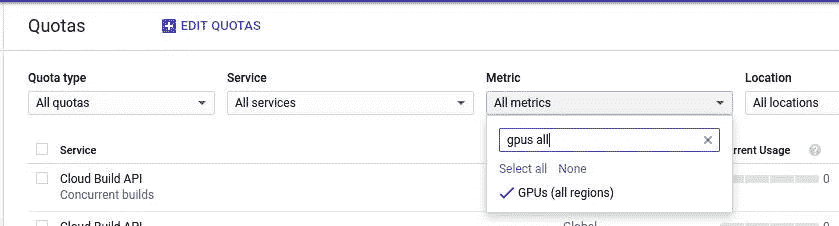
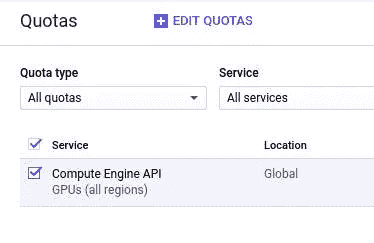
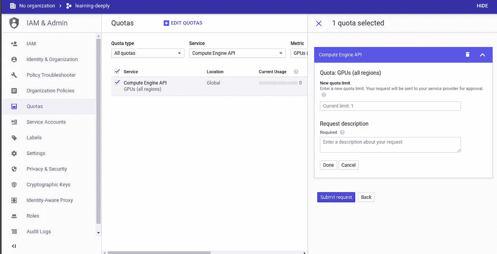
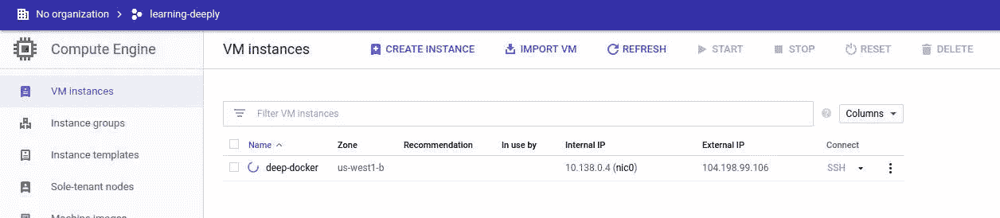
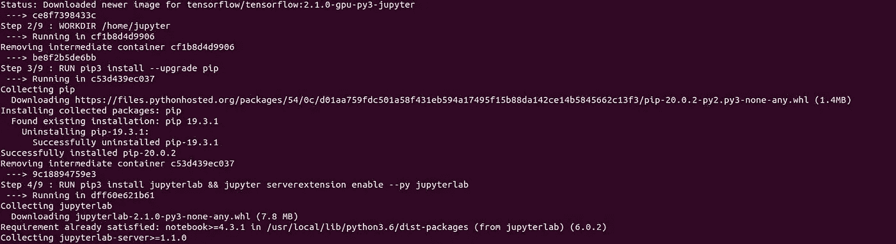
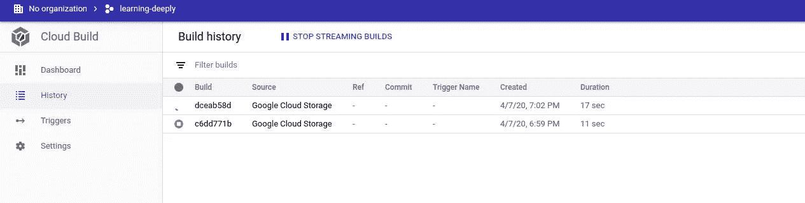
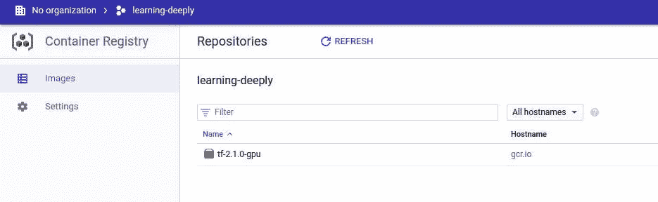
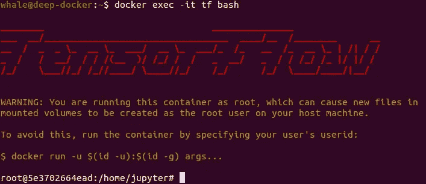

# Docker + TensorFlow + Google 云平台=爱

> 原文：<https://towardsdatascience.com/docker-tensorflow-google-cloud-platform-love-87c026f08cc7?source=collection_archive---------44----------------------->

## 记录你的张量流，让你的生活更轻松


`Docker, TensorFlow and Google Cloud Platform logos. Heart by Bohdan Burmich from the Noun Project.`

Docker 改变了我的工程生活。我已经学会爱那条鲸鱼了！

几年前，当我第一次在 Windows 笔记本电脑上安装支持 GPU 的 TensorFlow 时，我对这个过程的复杂和脆弱感到震惊。当我在笔记本电脑上启动双引导 Ubuntu 时，我不得不重复这个可怕的过程。当我的桌面有了 GPU 后，我不得不重温过去的创伤。

> *如果有一种与操作系统无关的运行 TensorFlow 的方式，可以让您在几分钟内启动并运行，那会怎么样？*

这是本帖的重点！我们将使用一个`Google Cloud Platform (GCP)`计算引擎虚拟机作为我们的机器。但是你可以很容易地用你自己的带有`NVIDIA GPU`的笔记本电脑/台式机替换这个虚拟机。

**注意:我将假设您已经安装了** `**GCP account**` **和** `**GCP SDK**` **，这样您就可以从您的终端运行 GCP 命令。**

# 我们将访问的主题

以下是本文将涉及的主题的概述:

*   `GPU quotas`在 GCP
*   GCP 计算引擎`VM startup scripts`
*   我们支持 GPU 的`TensorFlow Dockerfile`
*   GCP `Cloud Build`在云中构建我们的 Docker 映像
*   GCP，GCP 的码头中心
*   测试我们是否可以从 Docker 容器中访问我们的 GPU

我们开始吧！

# 你有 GPU 配额吗？

当你第一次在 GCP 开始时，你不会被分配一个 GPU 来玩。如果你试图让一个虚拟机的 GPU 配额不足，你会得到一个错误，告诉你你的配额已经超过。所以让我们现在就解决这个问题。

转到`IAM & Admin -> Quotas`。

在`Metrics`下拉列表中，首先点击`None`。

在文本框中搜索`GPUs (all regions)`并点击出现的结果:



勾选下面列表中的方框，然后点击`EDIT QUOTAS`:



填写屏幕右侧出现的表格，并请求至少一个 GPU:



现在我们等待我们的批准。这应该很快——我不到两分钟就被批准了！

# 构建虚拟机

一旦我们增加了配额，我们就可以开始构建至少有一个 GPU 的虚拟机。为了做到这一点，我们可以进入 UI 中的`Compute Engine`，或者我们可以学习如何使用 GCP 的`Cloud SDK`。还是做后者吧！

假设我们想在名为`deep-docker`的区域`us-west-1b`中创建一个虚拟机。假设我们已经安装了 Cloud SDK，我们可以在终端中发出这个命令:

```
gcloud compute instances create deep-docker \
	--zone=us-west1-b \
	--accelerator="type=nvidia-tesla-k80,count=1" \
	--image-family "ubuntu-1804-lts" \
	--image-project "ubuntu-os-cloud" \
	--boot-disk-device-name="persistent-disk" \
	--boot-disk-size=100GB \
	--boot-disk-type=pd-standard \
	--machine-type=n1-standard-4 \
	--maintenance-policy=TERMINATE \
	--metadata-from-file startup-script=./startup.sh
```

现在不要担心`metadata-from-file startup-script=...`的争论。我们将在下一节探讨这一点。

当我们可以使用`gcloud compute instances create-with-container`创建一个带有容器的 VM 时，为什么我们选择了 Ubuntu？好问题！这个命令创建了一个基于 Chromium OS 的带有`Container-Optimized OS`的虚拟机。在这样的虚拟机上安装 NVIDIA 驱动程序要复杂得多，所以我们选择 Ubuntu，让我们的生活变得更轻松。如果你热衷于使用容器优化的操作系统，那么请看[这份报告](https://github.com/GoogleCloudPlatform/cos-gpu-installer)中的 GPU 驱动程序安装解决方案。

在发出这个命令之前，我们需要在当前目录中有一个启动脚本。让我们来看看这个启动脚本是怎么回事！

# 启动脚本

[这里的](https://github.com/eustin/docker-tf-gcp/blob/master/startup.sh)是完整的启动脚本。

启动脚本会处理一些棘手的事情:

*   它安装 Docker 并将`gcloud`设置为 Docker 凭证助手。这将允许我们从 GCP 的`Container Registry`中提取我们稍后将构建的 Docker 图像。
*   它将 NVIDIA 驱动程序安装到虚拟机上。
*   它安装了 NVIDIA 容器工具包，这将允许我们的 Docker 容器访问我们虚拟机上的 GPU。

让我们最后发出命令，等待我们的 VM 完成构建。



您可以通过 SSH 进入您的机器来跟踪启动脚本的进度:

```
gcloud compute ssh whale@deep-docker --zone=us-west1-b
```

进入虚拟机后，发出以下命令并查看您的日志流:

```
tail -f /var/log/syslog
```

在某些时候，您应该会看到类似这样的内容:

```
Apr 12 08:09:49 deep-docker startup-script: INFO Finished running startup scripts.
```

在这里你可以跳一小段庆祝舞。这个过程最难的部分已经过去了！

# 让启动脚本运行一次

我们的启动脚本的一个问题是，它在每次虚拟机启动时运行。如果我们频繁重启我们的虚拟机，这将变得不必要的耗时。

确保我们的脚本只运行一次的一种方法是使用`gcloud` CLI 将它从虚拟机的元数据中删除:

```
gcloud compute instances remove-metadata deep-docker --keys=startup-script
```

另一种方法是遵循此处[的建议。这是我采取的方法。在](https://googlecloudplatform.uservoice.com/forums/302595-compute-engine/suggestions/32030122-ability-to-run-startup-script-only-once)[启动脚本](https://github.com/eustin/docker-tf-gcp/blob/master/startup.sh)中，您会看到它的大部分被包含在一个`if`语句中:

```
if test ! -f "$STARTUP_SUCCESS_FILE"; then
	...
	touch /home/$LOGIN_USER/.ran-startup-script
else
	echo "$STARTUP_SUCCESS_FILE exists. not running startup script!"
fi
```

我们根据特定位置是否存在名为`.ran-startup-script`的文件来决定是否运行启动脚本的主体。在第一次引导时，那个文件不存在，所以执行了`if`语句的主体。如果我们的虚拟机第一次启动一切顺利，上面的`touch`行将创建`.ran-startup-script`。在第二次启动时，启动脚本中所有耗时的部分都不会被执行。我们可以检查`/var/log/syslog`以确认这是事实:

```
Apr 12 09:05:58 deep-docker startup-script: INFO startup-script: /home/whale/.ran-startup-script exists. not running startup script!
Apr 12 09:05:58 deep-docker startup-script: INFO startup-script: Return code 0.
```

# 文档文件

这里的是我们的 Dockerfile。超级简单！

*   我们在 Python 3 中使用 TensorFlow GPU 基础映像。在编写时，该图像是`tensorflow/tensorflow:2.1.0-gpu-py3`图像。
*   我们安装 JupyterLab。
*   我们安装了一些其他的 Python 包。

我们现在将建立这个图像。

# 在云中构建 Docker 映像

我们使用的 TensorFlow 图像大小约为 2GB。我们将利用 GCP 的强大功能，在云中构建 Docker 映像，而不是在本地构建并从本地机器推送到`Container Registry`。

我们将建立的形象将位于`gcr.io/GCP_PROJECT_NAME/SOME_IMAGE_NAME`。我的项目叫`learning-deeply`。我想把图像叫做`tf-2.1.0-gpu`。因此，我将在我的终端中发出以下命令:

```
REMOTE_IMAGE_NAME=gcr.io/learning-deeply/tf-2.1.0-gpu \
	&& gcloud builds submit --tag $(REMOTE_IMAGE_NAME) \
        --timeout=15m
```

我指定了一个更长的超时来解决我遇到的超时问题。让我们发出命令，看着我们的构建发生吧！



我们可以在 GCP 控制台的`Cloud Build`部分监控我们的构建进度:



一旦完成，让我们前往`Container Registry`部分，我们应该在那里看到我们美丽的形象！



# 点燃我们的容器，检查图形处理器

这太令人兴奋了！我看到你期待地搓着手掌。让我们看看我们的努力是否有回报。

首先，让我们 SSH 进入我们的 VM(参见`startup script`部分了解如何操作)。

让我们将 Docker 映像放入我们的虚拟机中！发出与此类似的命令，用您在前面发出`gcloud builds submit`时提供的内容替换对图像位置的引用:

```
docker pull gcr.io/learning-deeply/tf-2.1.0-gpu:latest
```

由于我们已经在启动脚本中处理了容器注册认证，这应该会从`Container Registry`中提取您的图像。

接下来，让我们启动我们的容器。注意，我们有一个`--gpus`参数，它将我们虚拟机上的所有 GPU 暴露给我们的容器:

```
docker run -it -d --name tf --gpus all gcr.io/learning-deeply/tf-2.1.0-gpu
```

问题`docker ps`我们应该看到我们的容器运行！

现在让我们在容器上执行一个交互式 Bash shell:

```
docker exec -it tf bash
```

你应该会看到像这样美丽的东西:



现在交叉手指运行这个来检查我们是否可以访问我们的 GPU:

```
python3 -c "import tensorflow as tf;print(tf.config.list_physical_devices('GPU'))"
```

将打印一串文本。但是如果你最后看到这样的东西，你就知道你成功了，我的朋友们:

```
[PhysicalDevice(name='/physical_device:GPU:0', device_type='GPU')]
```

# 结论

Docker 改变了我的工作方式。我不仅将它用于我的机器学习工作，还将它用于我的常规数据分析工作和构建我的博客。

如果你的职称以“数据”开头，那就帮自己一个忙，学会使用它。你也可以学会爱鲸鱼！

直到下一次，

贾斯廷

*原载于 2020 年 4 月 13 日*[](https://embracingtherandom.com/deep-learning/cloud/tensorflow/docker/dockerise-your-tf/)**。**