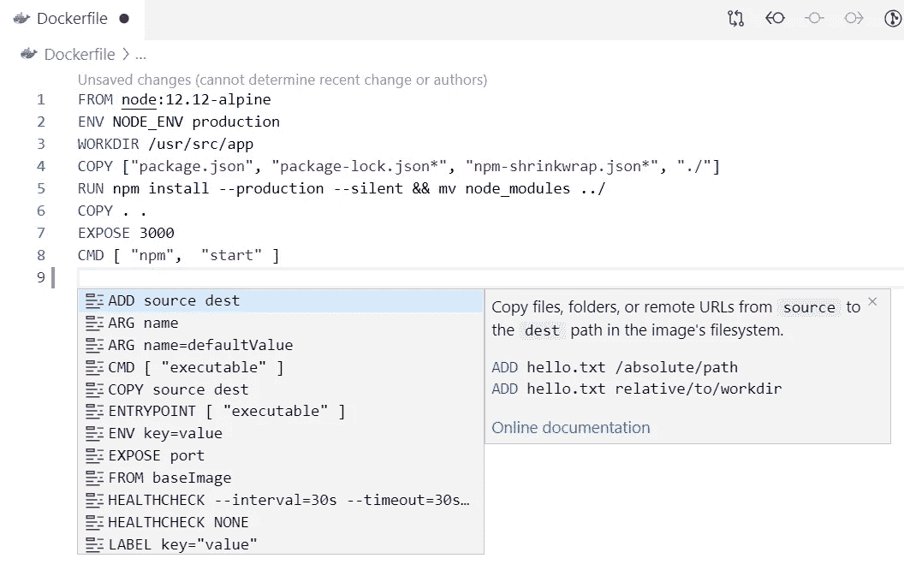
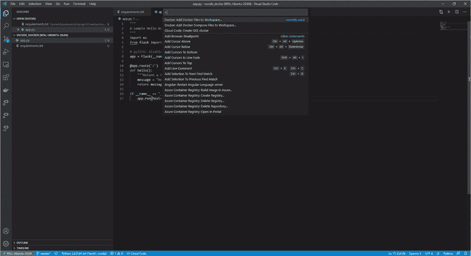
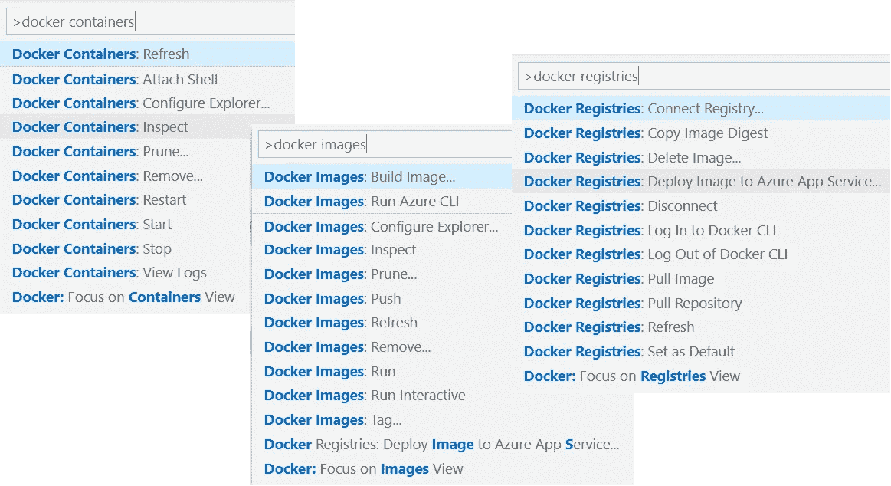
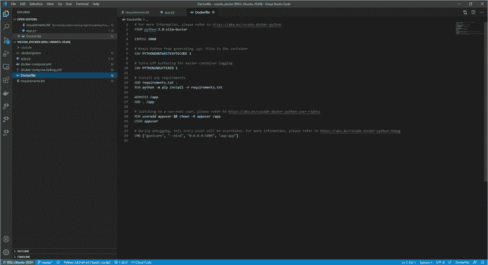
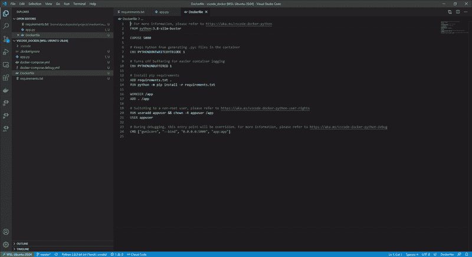
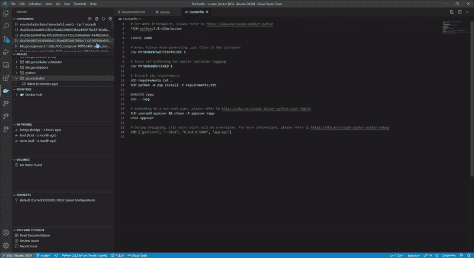

# 码头工人:你做错了

> 原文：<https://towardsdatascience.com/docker-you-are-doing-it-wrong-e703075dd67b?source=collection_archive---------6----------------------->

## 使用 VS 代码和 Docker 扩展成为 Docker 超级用户。


micha Parzuchowski 在 [Unsplash](/s/photos/difficult?utm_source=unsplash&utm_medium=referral&utm_content=creditCopyText) 上的照片

您已经用自己选择的语言实现了服务。现在，您希望在将它部署到生产环境之前，将其打包并在本地进行测试。第一步是编写 Dockerfile 文件、构建映像、运行容器并检查日志。对吗？


插图作者[劳雷尔·杜尔马尔](https://twitter.com/laurelcomics?lang=en)

不完全是。虽然这个过程是完全可以接受的，但有一个更好的方法:**一个可以为您编写 Docker 文件的工具，如果您想要编辑它，它可以帮助您自动完成，并提供一个图形用户界面来与 Docker 引擎进行交互。**

> 如果有一个工具可以为你编写 Docker 文件，帮助你自动完成，并提供图形用户界面与 Docker 引擎进行交互，会怎么样？

Visual Studio 代码的 Docker 扩展不仅仅是另一个 IDE 扩展。它有能力提升你与 Docker 的工作方式。**在这个故事中，我们深入探讨了 Docker Visual Studio 代码扩展可以做什么，以及如何使用它成为 Docker 超级用户。**

> [学习率](https://www.dimpo.me/newsletter?utm_source=article&utm_medium=medium&utm_campaign=docker_vs_code&utm_term=docker_vs_code)是我每周给那些对 AI 和 MLOps 世界好奇的人发的简讯。你会在每周五收到我关于最新人工智能新闻、研究、回购和书籍的更新和想法。在这里订阅！

# Docker + VS

VS 代码的 Docker 扩展使得从 Visual Studio 代码构建、运行、管理和部署容器化的应用程序变得容易。要开始使用它，请确保[下载 Visual Studio 代码市场的扩展](https://marketplace.visualstudio.com/items?itemName=ms-azuretools.vscode-docker)。此外，这是一个开源项目，因此您可以检查它的代码，安装过程非常简单，因此没有必要在这里的另一节中介绍它。

# 主要特征

在这一节中，我们将介绍 Docker 扩展的突出特性。稍后，我们将在一个简单的示例中使用它们中的许多。

*   **编辑 docker 文件:**编辑`Dockerfile`和`docker-compose.yml`文件时，您可以使用智能感知自动完成功能。此外，您还可以获得常用命令的语法帮助。



VS 代码上 Docker 的智能感知和语法帮助

*   **通用 Dockerfiles:** 通过使用命令面板中的`Docker: Add Docker Files to Workspace`命令，你可以生成并添加一个 Dockerfile 到你的工作空间。该命令将生成`Dockerfile`和`.dockerignore`文件，并将它们添加到您的工作区。您也可以使用此命令来生成 Docker 合成文件。这将证明在调试时非常方便。



为一个简单的 flask 应用程序生成 docker 文件

*   **Explore:**Docker 扩展为 VS 代码贡献了一个 Docker 视图。Docker 视图允许您检查和管理 Docker 资产:容器、映像、卷、网络和容器注册表。一切只需点击鼠标右键。


VS 代码中的 Docker 视图

*   **执行 Docker 命令:**许多最常见的 Docker 命令都内置在命令面板中。您可以运行 Docker 命令来管理[图像](https://docs.docker.com/engine/reference/commandline/image/)、[网络](https://docs.docker.com/engine/reference/commandline/network/)、[卷](https://docs.docker.com/engine/reference/commandline/volume/)、[图像注册表](https://docs.docker.com/engine/reference/commandline/push/)，以及 [Docker 组合](https://docs.docker.com/compose/reference/overview/)。此外，`**Docker: Prune System**`命令将删除停止的容器、悬挂的图像以及未使用的网络和卷。



集成到调色板中的通用 Docker 命令

*   **调试容器:**使用 Docker 扩展，我们可以调试使用 Node.js、Python 或。NET (C#)在一个容器内运行。

还有更多的特性，比如注册表连接和上下文管理，但是仅仅通过使用这些关键的产品，你就可以走很长的路。接下来，我们实现一个简单的 Python Flask 应用程序，对它进行 dockerize 并部署它，而无需摆弄 Docker CLI。

# 简单的例子

在本节中，我们构建一个简单的" *Hello World* " Flask 应用程序，并使用 Docker 扩展部署它。首先，代码:

如果您熟悉 Flask，您会发现这是您可以实现的最简单的应用程序。每当您点击根端点时，它就返回“ *Hello World* ”。接下来，我们需要一个`requirements.txt`文件来保存依赖项，我们已经准备好了:

```
Flask==1.1.2
gunicorn
```

要创建 Dockerfile 和其他任何东西，你只需要在命令面板中运行`Docker: Add Docker Files to Workspace`(windows 中的`ctlr+shift+p`)。

为第一个问题选择`Python: Flask`选项，然后，扩展将询问您是否想要包含可选的 Docker 编写文件。选择是；这样，您将能够在以后调试运行在容器内部的应用程序。最后，选择包含 Flask 应用程序的 python 文件(上面提供的代码)和您想要公开的端口(`5000`是默认的)。你准备好了！

现在，要构建图像，右键单击生成的 Dockerfile 并选择`Build Image...`。一个终端将打开，你的图像将在几秒钟内准备好。



使用 VS 代码的 Docker 扩展构建您的映像

要运行应用程序，从左侧面板选择 Docker 图标，在`Images`部分找到您的图像，右键单击它并选择 run。就这么简单。



使用 VS 代码的 Docker 扩展运行你的容器

在`Containers`部分找到正在运行的容器，右键单击它并选择`View Logs`。这个命令将在终端中显示容器的日志。获取它正在监听的端点(应该是`[http://0.0.0.0:5000](http://0.0.0.0:5000)`)。要获得 Python 服务的结果，请运行`curl [http://0.0.0.0:5000](http://0.0.0.0:5000)`。



使用 VS 代码的 Docker 扩展查看日志

就是这样！VS 代码的 Docker 扩展简化了这个过程，你可以有时间专注于你的代码。

# 排除故障

要用 Gunicorn 配置调试，我们需要更多的东西。`The Docker: Python-Flask`使用 Python 调试器，自动创建的启动配置会覆盖容器的 Gunicorn 入口点。要调试运行 Gunicorn 的应用程序，我们应该遵循以下步骤:

1.  将`debugpy`添加到您的`requirements.txt`文件中。
2.  将以下代码片段添加到要调试的文件中:

```
import debugpy
debugpy.listen(("0.0.0.0", 5678))
debugpy.wait_for_client()
```

3.将一个`Python: Remote Attach`配置添加到`.vscode`文件夹中的`launch.json`中。JSON 文件现在应该如下所示:

4.通过将`5678:5678`添加到 ports 部分，修改`docker-compose.yml`文件以公开调试器端口。该文件现在应该如下所示:

5.右键单击一个`docker-compose.yml`文件并选择 Compose Up 来启动容器。

6.在所选文件中设置断点，导航至`Run and Debug`并选择`Python: Remote Attach`启动配置。

7.按 F5 或按播放按钮来连接调试器。

调试愉快！

# 结论

在这个故事中，我们探索了 VS 代码的 Docker 扩展，以及它如何帮助我们编写 Docker 文件、构建映像并部署它。要深入了解，请查看 Visual Studio 代码文档网站上的[使用容器](https://code.visualstudio.com/docs/containers/overview)主题。

> [学习率](https://www.dimpo.me/newsletter?utm_source=article&utm_medium=medium&utm_campaign=docker_vs_code&utm_term=docker_vs_code)是我每周给那些对 AI 和 MLOps 世界好奇的人发的简讯。你会在每周五收到我关于最新人工智能新闻、研究、回购和书籍的更新和想法。在这里订阅！

# 关于作者

我的名字是 [Dimitris Poulopoulos](https://www.dimpo.me/?utm_source=article&utm_medium=medium&utm_campaign=docker_vs_code&utm_term=docker_vs_code) ，我是一名为 [Arrikto](https://www.arrikto.com/) 工作的机器学习工程师。我曾为欧洲委员会、欧盟统计局、国际货币基金组织、欧洲央行、经合组织和宜家等主要客户设计和实施过人工智能和软件解决方案。

如果你有兴趣阅读更多关于机器学习、深度学习、数据科学和数据运算的帖子，请在 Twitter 上关注我的 [Medium](https://towardsdatascience.com/medium.com/@dpoulopoulos/follow) 、 [LinkedIn](https://www.linkedin.com/in/dpoulopoulos/) 或 [@james2pl](https://twitter.com/james2pl) 。此外，请访问我的网站上的[资源](https://www.dimpo.me/resources/)页面，这里有很多好书和顶级课程，开始构建您自己的数据科学课程吧！