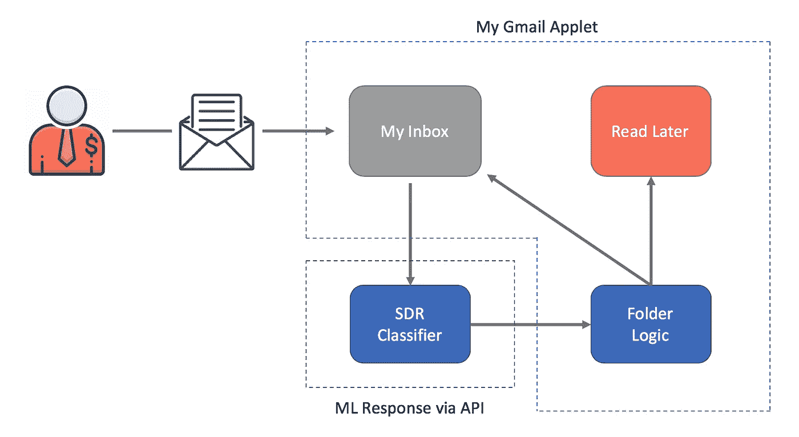
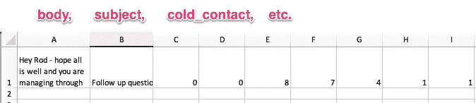
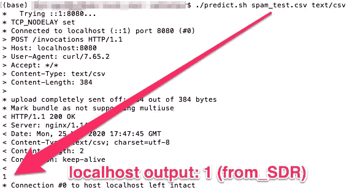
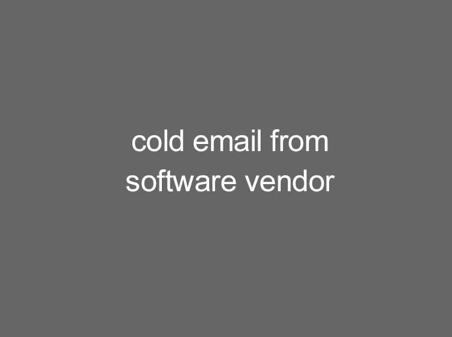

# 通过 API 对接、部署和调用我的 SDR 电子邮件检测器模型

> 原文：<https://towardsdatascience.com/dockerize-deploy-and-call-my-sdr-email-detector-model-via-api-68e238b7ecff?source=collection_archive---------66----------------------->

这是我[之旅的第二部分，建立一个系统，最大限度地减少我每天处理的销售邮件数量。概括地说，该系统通过 OAuth 连接到用户的 Gmail，确定收到的电子邮件是否来自销售开发代表(`from_SDR=1`)，并将这些电子邮件移动到一个特殊的文件夹中“稍后阅读”如果电子邮件不是`from_SDR`，那么它会将分类邮件留在主收件箱中。](/minimizing-sales-emails-in-my-inbox-with-natural-language-processing-38296b562da7)



使用自然语言处理的 SDR 电子邮件检测器

在[我的最后一篇帖子](/minimizing-sales-emails-in-my-inbox-with-natural-language-processing-38296b562da7)中，我从收件箱中取出带标签的电子邮件，训练一个机器学习模型来分类电子邮件是否来自 SDR，并评估该模型的性能。在这里，我描述了如何将我的模型部署到 API 端点，这样我就可以从 Gmail 小程序中调用它。

有很多方法可以让你的模型进入云端。我从 AWS 找到了这个例子，[自带 Sci-kit 模型](https://github.com/awslabs/amazon-sagemaker-examples/blob/master/advanced_functionality/scikit_bring_your_own/scikit_bring_your_own.ipynb)，它是最简单的，解释得最好的，也最适用于我的项目。下面的步骤展示了我如何将我的模型容器化，将容器推入 Sagemaker 服务器，然后使用 Chalice 管理该服务器的 API 端点。

## 设置我的 Docker 容器

Docker 提供了一种将代码打包成映像的方法，该映像可以作为一个自包含的环境在服务器上运行。 *Dockerfile* 指定应该如何创建图像。在这种情况下，我制作了一个 Docker 映像，它可以运行 Python 3.7.7 来匹配我的本地环境，并导入必要的包来执行我在[第一部分](/minimizing-sales-emails-in-my-inbox-with-natural-language-processing-38296b562da7)中描述的培训脚本。

如果您正在关注这个 [AWS 示例](https://github.com/awslabs/amazon-sagemaker-examples/blob/master/advanced_functionality/scikit_bring_your_own/scikit_bring_your_own.ipynb)，请注意这些使其与 Python 3 一起工作所需的重要更新:(I)我在第 3 行升级到了 Python 3.7.7，这(ii)改变了第 17 行中的包的位置。

我从 AWS 示例中复制了[容器目录](https://github.com/awslabs/amazon-sagemaker-examples/tree/master/advanced_functionality/scikit_bring_your_own)，它提供了打包 Amazon SageMager 算法所必需的文件。例如，该目录包含用于*构建和使用`docker push`将容器映像推*到 AWS ECR 的 shell 代码。请注意，我修改了示例代码以与 AWS CLI v2 配合使用(参见第 45–50 行):

但是在我构建和推送 AWS ECR 之前，我必须在容器目录中准备执行训练和预测步骤的文件。

## 将我的训练脚本添加到容器中

我用我自己的训练脚本替换了示例容器中的`train`文件(参见本系列的[第一部分](/minimizing-sales-emails-in-my-inbox-with-natural-language-processing-38296b562da7)了解详细信息):

请注意从`preprocess.py`引入的两个模块，它们将数据转换成我的机器学习模型可以接受的格式。这些类和函数包含在同一个文件夹中:

最后，我修改了示例容器中的`predictor.py`文件，如下所示:

我的更改主要反映在第 64–78 行，在那里我更新了 AWS 示例[以使用最新版本的 StringIO，并在`data`数据帧上包含标题以匹配我的模型的预期输入。](https://github.com/awslabs/amazon-sagemaker-examples/blob/master/advanced_functionality/scikit_bring_your_own/container/decision_trees/predictor.py)

编辑完这些文件后，我运行了构建和推送脚本:

```
$ sh build_and_push.sh sg_linearsvm
```

它创建了 Docker 容器并将其推送到 AWS ECR。

## 部署算法之前在本地主机上测试它

在部署模型之前，确定容器化的代码是否正常工作是很有用的。 [AWS 示例](https://github.com/awslabs/amazon-sagemaker-examples/tree/master/advanced_functionality/scikit_bring_your_own/container/local_test)为此提供了一个子目录`local_test`。我克隆了那个 repo，并将我的样本训练数据添加到适当的文件夹`/local_test/test_dir/input/data/training`中，然后运行:

```
$ ./train_local.sh sg_linearsvm
```

该 shell 脚本以`train`模式运行 docker 映像:

```
image=$1
mkdir -p test_dir/model
mkdir -p test_dir/output
rm test_dir/model/*
rm test_dir/output/*
docker run -v $(pwd)/test_dir:/opt/ml --rm ${image} train
```

使用我的容器的`local_test`版本，我能够诊断和解决与将我的脚本从 Google Colab 移植到 Docker 容器相关的各种问题。一旦这些问题得到解决，我还必须测试`serve`的功能。所以我跑了:

```
./serve_local.sh sg_linearsvm
```

这是一个执行以下代码的 shell 脚本:

```
image=$1
docker run -v $(pwd)/test_dir:/opt/ml -p 8080:8080 --rm ${image} serve
```

一旦 Docker 服务器运行本地映像，我就能够从我的终端命令行得到一个预测:

```
./predict.sh payload.csv text/csv
```

其中`payload.csv`是一个模拟模型预期输入的 CSV 文件:



以下是响应，显示该容器的行为符合预期:



接下来，我需要将我的容器放入 SageMaker 服务器，这样我就可以在 web 上训练和托管我的模型。

## 将我的容器部署到 Amazon SageMaker

首先，我设置了环境，指定了 S3 bucket 和 SageMaker 角色。我还创建了`sess`来记住连接参数，我用它来执行各种 SageMaker 操作。

接下来，我指定了模型应该在 S3 的哪里找到我的训练数据(第 1-3 行)，并使用适当的帐户、地区和容器名称(第 5-11 行)标识了`image`。

为了适应我的算法，我创建了一个 SageMaker 估计器，它定义了如何使用容器进行训练(下面的第 1–4 行)。然后我使用`estimator`上的`.fit`来训练我上传到`data_location`的数据(下面第 6 行)。

将模型部署到 SageMaker 主机需要对 fitted 模型进行部署调用(上面的第 9 行)。该调用接受实例计数、实例类型以及可选的序列化程序和反序列化程序函数。

有了这个，我就有了一个训练有素的模型来获得实时预测。在下一节中，我将描述如何公开一个 web 可访问的 API 端点。

## 通过 API 访问模型

对于这个项目，我选择了 [AWS Chalice](https://chalice.readthedocs.io/en/latest/quickstart.html#creating-your-project) 来使用 Amazon API Gateway 和 AWS Lambda 创建和部署应用程序。开箱即用，它提供:

> 用于创建、部署和管理应用程序的命令行工具
> 熟悉且易于使用的 API，用于在 python 代码中声明视图
> 自动生成 IAM 策略

从命令行，我运行:

```
$ chalice new-project sg_to_api
```

然后，我导航到那个文件夹并编辑了`app.py`文件，它定义了视图和结果逻辑。我是这样配置我的 API 的:

我获取一个传入的请求并解码它(第 24–25 行)。然后，我遍历数据来构建一个字典(第 27–36 行),将它输入到 Pandas 数据帧(第 38–39 行),这样我就可以将文本重新格式化为一个漂亮的 CSV 有效负载(第 40 行)。接下来，在第 46–51 行，我调用了`sagemaker.invoke_endpoint()`，引用了本文前面部分中的端点名称。最后，结果被存储并作为 HTML 响应传递(第 53–92 行),这样我就可以在 web 浏览器上演示了。

为了部署这个应用程序，我导航到`sg_to_api`目录并运行`chalice deploy`:

```
$ chalice deploy
...
Initiating first time deployment...
https://xyz123.execute-api.us-east-1.amazonaws.com/api/
```

就是这样。我使用 API Gateway 和 Lambda 启动并运行了一个 API。

(我喜欢更新`app.py`文件，然后通过再次运行`chalice deploy`快速重新部署 API 变更。)

## 在野外测试我的 API 端点

虽然我可以使用`curl`来运行我的 API，但我渴望向一些不习惯使用命令行的非技术朋友展示这一点。对于他们，我使用 S3 托管了一个静态网页，它接受文本输入并向我的端点发出 POST 请求，并从`app.py`输出 HTML 响应。

首先，我创建了一个 S3 桶:

```
$ aws s3api create-bucket --bucket sg-learner-test-1 --region us-east-1
```

然后我[配置我的桶](https://docs.aws.amazon.com/AmazonS3/latest/dev/WebsiteHosting.html)支持静态网站托管:

```
$ aws s3 website s3://sg-learner-test-1/ --index-document index.html --error-document error.html
```

最后，我创建了一个`index.html`文件，并将其复制到我的具有全局访问权限的 S3 存储桶中:

```
$ aws s3 cp index.html s3://sg-learner-test-1/index.html --grants read=uri=http://acs.amazonaws.com/groups/global/AllUsers
```

为了这个例子，我没有花任何时间美化网页——请忍受它的丑陋:

输入代码后，我翻遍收件箱，将邮件粘贴到网页的“邮件正文”部分。如果我从来没有给发件人发过邮件，那么我把“冷联系”字段设为 1，否则，我输入 0。

看到结果感觉像魔术一样！虽然我很乐意在这里提供端点，以便您可以自己测试模型，但是托管 SageMaker 端点每小时的费用是 0.28 美元(每月大约 201 美元)，这对于您想使用它的可能性来说有点高😉

相反，我为你记录了几个例子:



3 通过网络可访问的 SDR 电子邮件检测器进行演示检测

(你在想为什么上面的动画里会有一个*火腿*？简单: [ham 是一种标记“非垃圾邮件”的更快捷的方式](https://cwiki.apache.org/confluence/display/SPAMASSASSIN/Ham)

## 未来方向

我冒险的下一步是跳过网页界面，从另一个应用程序调用我的 API 端点。很快会有更多的报道！

让这个帖子成为可能，要感谢的人太多了。这里有几个人极大地指导了我的旅程: [Quinn Lanners](https://medium.com/u/8a2f7df48b90?source=post_page-----68e238b7ecff--------------------------------) (关于[在 AWS](/deploying-a-scikit-learn-model-on-aws-using-sklearn-estimators-local-jupyter-notebooks-and-the-d94396589498) 上部署 Scikit-Learn 模型)；[Leon Gerritsen](https://medium.com/u/65a12f624874?source=post_page-----68e238b7ecff--------------------------------)(关于[用 Chalice](https://machine-learning-company.nl/deploy-machine-learning-model-rest-api-using-aws/) 创建 REST API)；[Patrick Michel Berger](https://medium.com/u/d9b3a7de1139?source=post_page-----68e238b7ecff--------------------------------)(关于部署无服务器 ML 微服务)；[David Arpin](https://github.com/djarpin)、 [Tom Faulhaber](https://github.com/tomfaulhaber) 等(关于[构建您的](https://github.com/awslabs/amazon-sagemaker-examples/blob/master/advanced_functionality/scikit_bring_your_own/scikit_bring_your_own.ipynb)