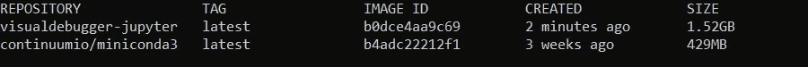
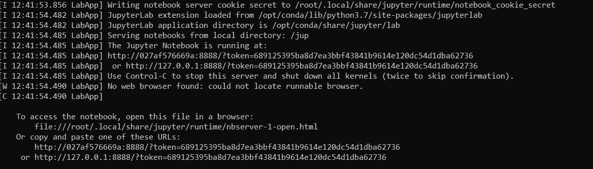
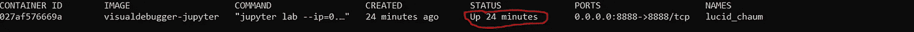
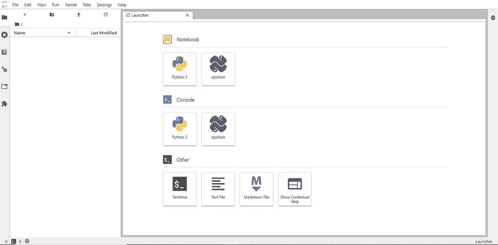

# 用可视化调试器 Dockerize Jupyter

> 原文：<https://towardsdatascience.com/dockerize-jupyter-with-official-visual-debugger-enabled-cbce1840b7f?source=collection_archive---------49----------------------->

## 在 docker 容器中启用和使用 Jupyter 可视化调试的分步指南。


尼兰塔·伊兰加穆瓦在 [Unsplash](https://unsplash.com?utm_source=medium&utm_medium=referral) 上拍摄的照片

Jupyter 最近宣布了期待已久的可视化调试器的首次公开发布。虽然这是第一个版本，但它支持调试和检查变量等所需的所有基本调试要求。

数据科学界非常依赖 Jupyter 笔记本电脑，因为它能够以互动的方式轻松交流和分享成果。

然而，唯一担心的是缺少可视化调试能力，因此人们通常不得不转向其他可用的经典 ide，它们提供了更好的调试和代码重构能力。这个特性是数据科学界期待已久的，现在终于发布了。

有关可视化调试器如何运行的简要概述，请参考下面的截屏:


由[杰瑞米](https://github.com/jtpio)在 [Github](https://github.com/jupyterlab/debugger/blob/master/screencast.gif) 上截屏

在本文中，我们将介绍在现有的 JupyterLab 环境中设置可视化调试器所需的步骤，还将介绍默认情况下启用了可视化调试器的 JupyterLab 环境。

# 先决条件:

JupyterLab 2.0+
基本了解任何编程语言的调试
基本了解 Docker。

# 安装:

假设您已经在使用 JupterLab，那么您只需要安装 JupyterLab 调试器扩展来进行前端调试，并在后端安装任何支持 Jupyter 调试协议的内核。

## 安装 JupyterLab 扩展以启用前端调试:

JupyterLab 使用 nodejs 来安装扩展，所以为了安装前端调试器扩展，我们也需要安装 nodejs。

在未来的版本中，Jupyter 可能会默认包含这个扩展。

```
conda install -c conda-forge nodejs
jupyter labextension install @jupyterlab/debugger
```

## 安装内核 xeus-python:

在后端截至目前，只有 xeus-python 支持 Jupyter 调试协议。将来，可能会有许多其他内核支持这个协议。

```
conda install xeus-python -c conda-forge
```

现在，如果您运行 Jupyter 实验室，您应该能够看到另外两个图标，分别位于 xeus-python 内核的控制台和笔记本部分。

## 为什么要集装箱化？

容器使得跨多个环境的开发更加顺畅。这就是为什么它们是应用交付的云原生方法的技术基础。

Docker 的创建者 Solomon Hykes 说，当支持的软件环境不一致时，问题就出现了。“您将使用 Python 2.7 进行测试，然后它将在生产中运行于 Python 3 上，奇怪的事情将会发生。或者，您将依赖于某个 SSL 库版本的行为，然后会安装另一个。你将在 Debian 上运行你的测试，在 Red Hat 上生产，各种奇怪的事情都会发生。”

Container 通过将运行应用程序所需的环境、依赖项、二进制文件、所有必要的配置和应用程序本身打包到一个包中来解决这个问题。这样，我们不再需要担心操作系统和其他特定于环境的依赖性，因为一切都打包在一个独立的实体中，可以在任何地方运行。

## 启用可视调试器的 Dockerize Jupyter

我假设您熟悉基本的 Docker 命令和术语。解释 docker 如何工作超出了本文的范围。但是，如果您觉得需要重新查看，请参考 Docker [文档](https://docs.docker.com/)。

现在，我们将创建所需环境的 Docker 映像所需的 Docker 文件。您可以将图像看作是一个文件，其中包含了在容器中运行我们的应用程序所需的所有内容。

我们将使用 Miniconda，它是 Anaconda 的一个最小的轻量级安装程序。它是 Anaconda 的一个小型引导版本，只包含 conda、Python、它们所依赖的包以及少量其他有用的包。

```
FROM continuumio/miniconda3
```

定义 Docker 文件和工作目录的元数据:

```
LABEL maintainer=”Manish Tiwari <m***[@gmail.com](mailto:mtiwari5@gmail.com)>”
LABEL version=”0.1"
LABEL description=”Debugging Jupyter Notebook”WORKDIR /jup
```

安装 JupyterLab

```
RUN conda install -c conda-forge jupyterlab
```

为前端调试安装 nodejs 和 labextension

```
RUN conda install -c conda-forge nodejs
RUN jupyter labextension install [@jupyterlab/debugger](http://twitter.com/jupyterlab/debugger)
```

安装支持 Jupyter 调试协议的内核

```
RUN conda install xeus-python -c conda-forge
```

**注意:**这里我们使用了 conda 软件包管理器，您也可以使用 pip，但是，不建议同时使用两者，因为这可能会破坏环境。

最后，公开端口并定义入口点

```
EXPOSE 8888
ENTRYPOINT [“jupyter”, “lab”,” — ip=0.0.0.0",” — allow-root”]
```

我们的最终文档应该如下所示:

启用可视化调试器的 Dockerize JupyterLab

## 从以上 Docker 文件构建 Docker 映像。

导航到包含上述 docker 文件的文件夹，并运行以下命令。

```
docker build -t visualdebugger .
```

或者，您也可以从任何提供 Dockerfile 文件绝对路径的地方运行该命令。

成功构建映像后，通过以下命令列出 docker 映像进行验证

```
docker image ls
```

输出应该如下所示:



现在，在一个新的容器中运行 docker 映像，如下所示:

```
docker container run -p 8888:8888 visualdebugger-jupyter
```

这里，我们将主机端口(冒号前的第一个端口)8888 映射到容器 8888 中的公开端口。这是主机与容器的端口通信所必需的，Jupiter 在容器中监听该端口。

运行上述命令后，您应该会看到如下输出(假设端口没有被其他进程使用):



这意味着我们的 docker 容器已经启动并正在运行。现在，您可以打开上面输出中指定的 URL，使用 Jupyter 和可视化调试器，甚至不会意识到它没有在主机上运行。

您还可以通过以下命令查看可用容器的列表:

```
docker container ls
```

上面的命令应该列出容器以及容器的元数据，如下所示:



一旦打开上面输出中指定的 URL，您应该看到 JupyterLab 在主机的 localhost 和端口 8888 上运行。



容器中运行可视化调试器的 JupyterLab

现在来玩一下可视化调试器，用启动器中显示的 **xpython** 而不是 python 打开笔记本或控制台。

我已经发布了上面我们刚刚在 [docker hub](https://hub.docker.com/repository/docker/beingmanish/visualdebugger-jupyter) 上构建的 docker 映像，以防你想要一个启用了可视化调试的随时可用的 Jupiter 环境。

你可以通过下面的命令来拖动 docker 图像，并使用它。

```
docker pull beingmanish/visualdebugger-jupyter
```

如果你想更深入地了解 Jupyter 的可视化调试架构，你可以参考这里的。

建议或问题？请写在评论里。

**参考资料:** [Jupyter 博客](https://blog.jupyter.org/)
[Jupyter @ Github](https://github.com/jupyter)