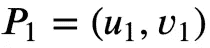

# 文档扫描仪和私人数据共享

> 原文：<https://towardsdatascience.com/document-scanner-and-private-data-sharing-2fb82b3f0fbb?source=collection_archive---------53----------------------->

## 如何给文档拍照，使用变换矩阵和变换视角并私信

照片由 [Depositphotos](https://depositphotos.com/)

# 摘要

**问题:**我们想用手机给一份文件拍照，然后私下发给收件人。通过这篇文章，我们试图解决现实生活中可能出现的问题:

*   给文档拍照可能会很麻烦——并不是所有的文档都读得很好，有一堆不需要的数据；
*   图片可以通过第三方(如托管、图像共享服务等)获取。).我们希望一切都是私人的；
*   我们希望有一种快速的方式在浏览器中显示图像，直接从密文转换而来。

**这是现实生活中的问题吗？**拍一张影像，“修复”视角并不是什么新鲜事，但却是现实妻子身上出现频率非常高的东西。这是一件常见的事情——有人问:“请扫描这份合同，并在今天发给我”或“请扫描这份声明，并在一个小时内发给我”，但如果我们没有扫描仪，我们怎么办？当然——用我们的手机拍个照，发个乱七八糟的图。然后我们得到回应——“嘿，你有扫描仪吗？我不想照片上有你的鞋子”等等。

我们将如何解决这个问题——当然是用数学。我们将使用一些步骤来抛出这个过程。我们将使用检测角度、改变视角和加密库来隐藏重要信息并方便地传输。

**我们将使用什么库** —我们将使用和组合各种类型的库:

*   [numpy](https://numpy.org/) —作为 Python 数值运算中的标准
*   [OpenCV](https://opencv.org/)—Python 中的图像处理；
*   [blurhash-python](https://github.com/woltapp/blurhash-python) —获取图像的占位符。它对文档不是很有用，但也许我们会想在功能上扩展这个私人共享图像服务。如果我们这样做，占位符将非常非常重要。读者只能看到最初的预览，但如果没有密码，就没有办法看到整个画面。
*   [imutils](https://pypi.org/project/imutils/) —一系列方便的功能，使基本的图像处理功能，如平移、旋转、调整大小、骨架化、显示 Matplotlib 图像、排序轮廓、检测边缘等，在 OpenCV 中变得更加简单。
*   [py AES](https://pypi.org/project/pyaes/)—AES(FIPS-197)分组密码算法和常见操作模式(CBC、CFB、CTR、ECB、OFB)的纯 Python 实现，不依赖于标准 Python 库。有关 API 参考和详细信息，请参见 README.md。
*   [pbkdf2](https://pypi.org/project/pbkdf2/)—RSA PKCS # 5v 2.0 中规定的基于密码的密钥派生函数 pbk df 2

**我们将使用什么加密算法来保护数据？**

*   base64 —用于将图像转换为文本，并以相反的方式进行转换。它对于向浏览器发送图片很有用；
*   blurhash —用于生成图像的占位符；
*   AES —用于文本(base64)加密；

# 数学视角的改变

为什么在这篇文章中改变视角如此重要？在当前的文章中，我们将看看视角的实际变化。但是更深入地了解这个概念和数学基础对于理解整个图景是至关重要的。

在这里你可以找到一篇文章，它对透视变换背后的数学进行了深入的概述:[https://www.math.utah.edu/~treiberg/Perspect/Perspect.htm](https://www.math.utah.edu/~treiberg/Perspect/Perspect.htm)那些发生在艺术和计算机图形学中的数学思想。

阿尔贝提的问题

这个问题促进了一门新学科——射影几何的发展，其代表人物是吉拉德·笛沙格(1591-1661)。

## 点的平行变换

描述三维空间中的点如何映射到绘图平面的透视变换可以使用初等几何来简单地解释。我们从建立坐标开始。投影涉及两个坐标系。待画物体坐标系中的一点由 ***X=(x，y，z)*** 给出，在成像系统中(在绘图平面上)对应的是 ***P=(u，v)*** 。如果我们使用标准的右手系统，那么 ***x*** 和 ***y*** 对应宽度和深度， ***z*** 对应高度。在绘图平面上，我们让*为水平变量， ***v*** 为垂直变量。*

**

*将对象投影到绘图平面*

*我们可以使用[欧几里德度量](https://en.wikipedia.org/wiki/Euclidean_distance)以通常的方式测量成对点之间的距离。*

*如果*

**

*和*

**

*以此类推，然后:*

**

*如果物体中的所有平行线组都映射到图上的平行线，则从 X 到 P 的投影称为平行投影。这种映射由仿射变换给出，其形式为*

**

*其中 ***T*** 是平面中的固定向量，而 ***A*** 是 3×2 常数矩阵。平行投影还具有保持比值的特性。也就是说，如果 ***X (1，2，3，4)*** 是物体中的共线点，那么在平行投影下保持距离比*

**

*当然，分母被假定为非零。*

# *全过程*

## *步骤 0。要求*

*当你不知道所需的库和版本时，启动 Python 脚本总是一件痛苦的事情。我就是这样创建一个 **requirements.txt** 文件([链接](https://gist.github.com/simeonemanuilov/8eb79283007445d6ee929caf62e48b59)):*

***requirements.txt***

## *第一步。阅读图像*

*在这个阶段，我们需要进行导入，我们将在本文中进一步使用它们。请不要忘记让所有的导入按预期工作。此外，我们还定义了一些函数，这些函数在将来会很有用。这些是 OpenCV 的基本操作，可以重复多次，在函数中使用它们是很好的做法(如 **read_image** 、 **show_image_opencv** 、 **save_image_opencv** 等)。我们还创建了一个函数 **get_current_dir** ，如果我们不知道当前目录，或者我们想要包含来自不同位置的图像，这个函数可以帮助我们。*

*请记住，对于*nix 系统(比如 Mac)，show_image_opencv 不能很好地工作。可以“冻结”在 **destroyAllWindows()** 的部分；*

*我们读取我们的输入文件，名为**bulsatcom.png**，它和课程项目文件放在同一个目录下。然后我们可以创建一个变量来保存输入文件+一个副本。*

*原始文件:*

**

*bulsatcom.png*

***这一步的预期结果:**我们现在有了保存图像的 OpenCV 对象。我们在 **input_image.png** 中也有一份图像的副本*

## *第二步。识别边缘*

*每个图像都有一些噪声，我们在这一步的目标是进行清理。其中一种方法是将彩色图像转换成灰色图像。之后，我们应用一个模糊函数，用(3，3)滤波器模糊图像。模糊减少了任何高频噪声，使轮廓检测更容易。*

*这里我们只有一个函数 detect_edges，它接受输入图像并返回一个带有边缘的实例。*

*也许这里最有趣的部分是精明的边缘检测。Canny 边缘检测是一种流行的边缘检测算法。它是由约翰·f·坎尼在 1986 年开发的。这是一个多阶段算法，简而言之，步骤如下:*

*   *降噪；*
*   *找到图像的强度梯度；*
*   *非最大抑制；*
*   *滞后阈值处理。*

*所以我们最终得到的是图像中的强边缘。第一个参数是图像实例(已经是灰色和模糊的)，第二个和第三个参数分别是我们的 minVal 和 maxVal。*

***这一步的预期结果:**我们这里只有一个函数，但却是非常重要的一个。我们应用过滤器对图像中的噪声进行一些清理。*

**

***edged_image.jpg***

***其他方法，文章&边缘检测方法:***

*   *[Canny 边缘检测](https://opencv-python-tutroals.readthedocs.io/en/latest/py_tutorials/py_imgproc/py_canny/py_canny.html)*
*   *[边缘检测——迈向数据科学的文章](/edge-detection-in-python-a3c263a13e03)*

## *第三步。检测图像中的文档边缘*

*最有趣的部分之一是找到图像中的轮廓。找出面积最高的等高线也是一个挑战(但非常重要)。在这一点上，我们将排除文件中的一些大字母或图像。我们只需要最大的部分，也就是整个文档。*

*我们创建了一个函数**calculate _ draw _ contours**，其中我们使用了一些内置的 OpenCV 函数，比如 findContours。该函数返回*

***这一步的预期结果:**我们有了图像的轮廓。*

**

***contoured_image.jpg***

## *第四步。识别和提取文档边界/边缘*

*这是本文中最难的时刻之一。我们有文档中所有角的坐标，排列它们并知道哪个坐标对应于一个角是至关重要的。
图像由像素组成。当我们有一张灰色的图片时，我们没有颜色的深度，这也是一个维度。所以我们可以在两个维度上处理这些图片——宽度和高度。*

## *第五步。应用透视变换*

*当我们有了维度，我们就可以构建目的点。我们可以使用 OpenCV 中的 getPerspectiveTransform 函数，它从四对对应点计算透视变换。之后，我们可以使用 warpPerspective，它对图像应用透视变换。*

***这一步的预期结果:**一个几乎扫描的图像，哪一个视角更好显示。*

**

***scanned_image.jpg***

## *第六步。用 base64 编码图像*

## *但是 Base64 是什么呢？*

*Base64 是一种将 8 位二进制数据编码成可以用 7 位表示的格式的方式。只使用字符 a-z、A-Z、0–9、+和/来表示数据，用=来填充数据。例如，使用这种编码，三个 8 位字节被转换成四个 7 位字节。*

*术语 Base64 取自[多用途互联网邮件扩展(MIME)](https://en.wikipedia.org/wiki/MIME) 标准，该标准广泛用于 HTTP 和 XML，最初是为编码电子邮件附件以便传输而开发的。*

## *我们为什么使用 Base64？*

*Base64 对于二进制数据表示非常重要，因为它允许二进制数据以看起来和行为上都像纯文本的方式来表示，这使得在数据库中存储、通过电子邮件发送或以基于文本的格式(如 XML)使用二进制数据更加可靠。Base64 主要用于以 ASCII 字符串格式表示数据。*

## *为什么我们不到处使用 Base64？*

*base64 能为我们做一些重要的事情是好的，但我们必须记住，我们不应该在每个地方都使用 Base64，尤其是在 web 开发中。在这里你可以找到一篇关于这个的[有趣文章。](https://csswizardry.com/2017/02/base64-encoding-and-performance/)*

## *第七步。也获取图像的 blurhash 值*

*BlurHash 是图像占位符的紧凑表示。我发现它在项目中很有用，在项目中，我希望节省带宽并在图像实际加载之前显示一个占位符。此外，它非常适合本文，因为我们可以计算图片的 BlurHash 值并将其存储在 DB 中。之后，我们可以在用户的浏览器中显示“预览”,用户不允许查看完整的图片/文档。
它可以用来做一些事情，比如一张图像的秘密变体，上面有一些数据，但不足以读取或识别模式。*

**

*照片由 [BlurHash](https://github.com/woltapp/blurhash) 拍摄*

***更多相关链接信息***

*   *[https://github.com/woltapp/blurhash-python](https://github.com/woltapp/blurhash-python)*
*   *[cloud image+blur hash 的沙盒](https://codesandbox.io/s/lopvu)*

## *第八步。用 AES 加密*

*下面的例子将说明一个简单的基于密码的 AES 加密(PBKDF2 + AES-CTR)，没有消息认证(未经认证的加密)。我发现这对于本文很有用，因为我们希望对图像进行 base64 编码，并使其“受密码保护”,如果有人拥有服务器，或者以某种方式阅读我们的消息，他就不能看到内容。*

*此类操作的有用链接:[https://crypto book . nakov . com/symmetric-key-ciphers/AES-encrypt-decrypt-examples](https://cryptobook.nakov.com/symmetric-key-ciphers/aes-encrypt-decrypt-examples)*

## *第九步。发送密文并在浏览器中可视化*

*这一步是可选的，我们不打算深入这个主题。这个想法是，当我们在浏览器中显示加密的 image + blurhash(简短预览)时，拥有密码的用户可以加密密文并看到 base64 字符串。他也可以把它转换成图像。创建一个 JavaScript 库非常容易，它接受 BlurHash 值+密文，并在成功输入密码后可视化 base64 图像(原生为 HTML 格式)。*

*可用于此类操作(AES 在浏览器中解密)的示例库可在此处找到:【https://github.com/ricmoo/aes-js*

# *摘要*

***简而言之，我们想在这篇文章中表达什么？***

*   *用我们的手机拍一张图像；*
*   *修复透视图以获得几乎扫描的文档；*
*   *用 base64 编码；*
*   *获取 blurhash 值；*
*   *用 AES 加密；*
*   *发送密文；*
*   *显示 blurhash 预览；*
*   *在有可用库的浏览器中解码。*

*它将解决一些私人文件/图片共享+修复一个文件的图片透视的问题。我们使用各种技术来获得这一点，这种方法可以很容易地成为一个 API，我试图在最大的部分像函数一样，可以转换为端点。*

# *类似的文章/研究*

*   *[https://github.com/AmeyCaps/Document_Scanner](https://github.com/AmeyCaps/Document_Scanner)*
*   *[https://towards data science . com/document-scanner-using-computer-vision-opencv-and-python-20b 87 B1 cbb 06](/document-scanner-using-computer-vision-opencv-and-python-20b87b1cbb06)*
*   *[https://github.com/andrewdcampbell/OpenCV-Document-Scanner](https://github.com/andrewdcampbell/OpenCV-Document-Scanner)*

***这篇文章中我们还有哪些内容？***

*   *用加密方法扩展私人文件共享的想法；*
*   *对函数、步骤和数学概念的描述性解释；*
*   *一些函数的测试，如果在计算中出现问题，这些测试会对我们有所帮助。*

# *一些函数的快速测试*

# *链接*

*   *[https://en.wikipedia.org/wiki/Steganography](https://en.wikipedia.org/wiki/Steganography)(隐藏图像信息的有趣话题)*
*   *[https://it next . io/steganography-101-LSB-introduction-with-python-4c 4803 e 08041](https://itnext.io/steganography-101-lsb-introduction-with-python-4c4803e08041)(图像中隐藏信息的有趣话题)*
*   *[https://code . tuts plus . com/tutorials/Base64-encoding-and-decoding-using-python-CMS-25588](https://code.tutsplus.com/tutorials/base64-encoding-and-decoding-using-python--cms-25588)(Base64 文章)*
*   *[https://CSS wizardry . com/2017/02/base64-encoding-and-performance/](https://csswizardry.com/2017/02/base64-encoding-and-performance/)(为什么要用 base64，为什么不用？)*
*   *[https://medium . com/@ amita saurus/encrypting-decrypting-a-string-with-AES-js-1 d9 EFA 4d 66d 7](https://medium.com/@amitasaurus/encrypting-decrypting-a-string-with-aes-js-1d9efa4d66d7)(JavaScript decrypt AES)*
*   *[https://stack overflow . com/questions/41980931/image-encryption-and-decryption-using-py Crypto](https://stackoverflow.com/questions/41980931/image-encryption-and-decryption-using-pycrypto)(Python 加密模块)*
*   *[https://pycryptodome . readthedocs . io/en/latest/src/cipher/aes . html](https://pycryptodome.readthedocs.io/en/latest/src/cipher/aes.html)(JavaScript 解密 AES)*
*   *[https://github.com/woltapp/blurhash-python](https://github.com/woltapp/blurhash-python)(Python 的 BlurHash 实现)*
*   *[https://www.pro-soft.bg/software/](https://www.pro-soft.bg/software/)(保加利亚语的软件新闻/博客)*
*   *[https://crypto book . nakov . com/symmetric-key-ciphers/AES-encrypt-decrypt-examples](https://cryptobook.nakov.com/symmetric-key-ciphers/aes-encrypt-decrypt-examples)(AES 用密码加密和解密)*