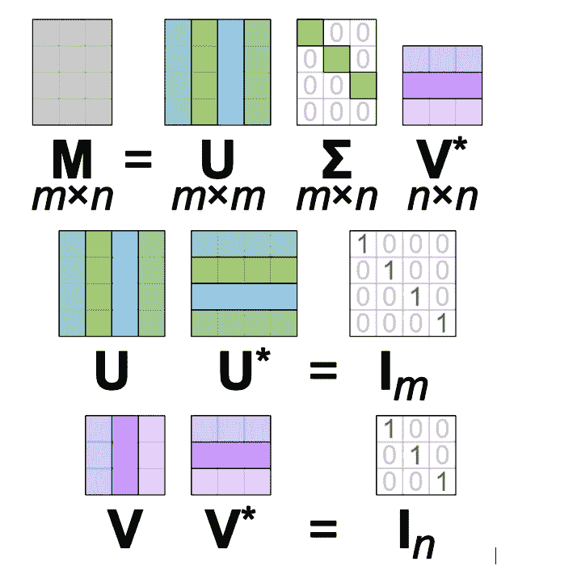
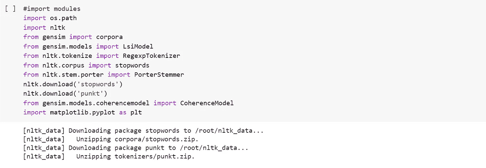
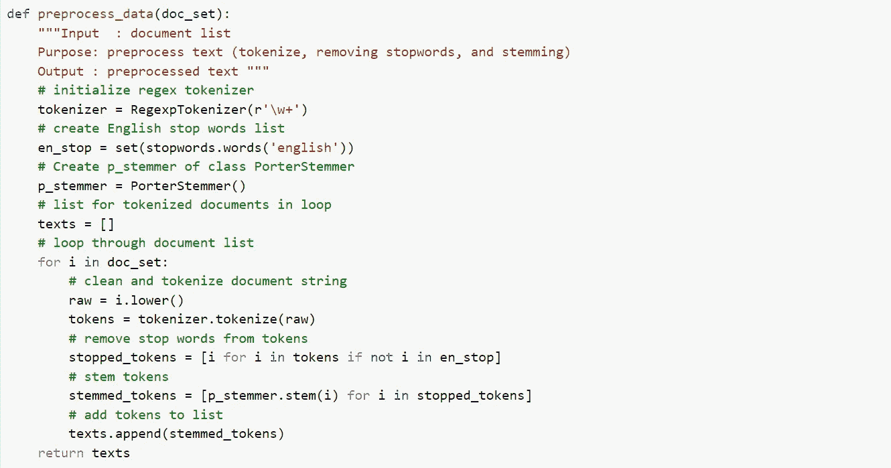
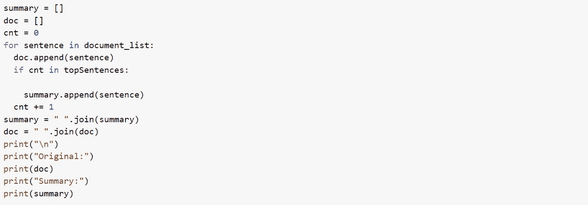

# 使用潜在语义索引的文档摘要

> 原文：<https://towardsdatascience.com/document-summarization-using-latent-semantic-indexing-b747ef2d2af6?source=collection_archive---------11----------------------->

文档摘要是从文本中获取文档的要点或摘要的方法。有两种总结方法。抽象概括和摘录概括。

摘录摘要基本上是严格根据你在文本中得到的内容创建一个摘要。这可以比作把一篇文章的要点抄下来，不做任何修改，然后重新安排要点和语法的顺序，使摘要更有意义。

抽象概括技术倾向于模仿从文本中“解释”的过程，而不仅仅是简单地概括它。使用这种技术总结的文本看起来更像人类，并且产生更精简的摘要。这些技术通常比提取摘要技术更难实现。

潜在语义索引或潜在语义分析是抽取摘要方法之一。

UX·印尼在 Unsplash 上拍摄的照片

**潜在语义索引**

潜在语义索引用于分析一组文档和文档中包含的术语之间的关系。这使用一种称为奇异值分解(SVD)的数学概念来计算给出文档之间相似性的矩阵集。

潜在语义分析使用数学技术奇异值分解(SVD)来识别术语和概念之间的关系模式。这是基于这样一个原则，即出现在相同上下文中的单词往往有相似的意思。

**奇异值分解**

奇异值分解是降维技术之一。奇异值分解是将矩阵分解成 3 个矩阵。所以如果我们有一个矩阵 A，它用

a 是维数为 mxn 的矩阵。u 是维数为 mxm 的正交矩阵。∑是维数为 mxn 的对角矩阵，V 是维数为 nxn 的正交矩阵。

u 是指左奇异向量，∑是奇异值或特征值，V 是右奇异向量。

[“文件:奇异值分解 visualization . SVG”](https://commons.wikimedia.org/w/index.php?curid=67853297)BY[cm glee](https://commons.wikimedia.org/wiki/User:Cmglee)在 [CC BY-SA 4.0](https://creativecommons.org/licenses/by-sa/4.0?ref=ccsearch&atype=rich) 下授权

(下面的例子摘自大卫·A·格罗斯曼和奥菲尔·弗里德所著的《信息检索、算法和启发式》

考虑以下 3 个文档

d1:在火灾中受损的黄金货物。

d2:用一辆银色卡车运送白银。

d3:一批黄金用卡车运到。

现在我们创建术语文档矩阵

如果我们对这个矩阵进行奇异值分解，我们得到的分量为

考虑将这些文档分为两个主题

U 的列给出了与属于该主题的每个单词相匹配的权重。例如，单词 silver 对第二主题具有更大的权重，而单词 truck 对第一主题具有更大的权重

在矩阵 S 或∑中，第一对角线条目给出第一主题的权重，第二对角线条目给出第二主题的权重

矩阵 VT 的列给出了属于每个主题的文档的权重。像前两个文件属于第二个主题，第三个文件属于第一个主题。

LSI 主要帮助对属于不同主题的文档进行分类。LSI 也用于搜索引擎。由于矩阵 U 给出了单词与每个主题的相关性，并且我们还具有属于每个主题的文档的相关性，因此我们可以估计单词与每个文档的相关性。这样我们就可以得到查询词属于每个文档的权重。

**使用潜在语义分析的摘要**

LSI 给出了属于不同主题的文档的权重。通过根据权重从每个主题中选择前 N 个文档来完成摘要。

这给出了一个摘要，其中我们从摘要的每个主题中获得权重较高的文档。

**应用潜在语义分析进行摘要**

我们试图用下面的代码片段来解释这一点

我们需要首先加载所需的包

我们需要从文件中载入数据

接下来，我们将预处理数据。这是为了标记，删除停用词和词干

现在我们为文档创建术语频率。

现在我们创建 LSI 模型。我们使用 Gensim 的 LSIModel 函数

现在我们尝试对文档应用 LSI 模型。我们选择主题的数量为 2

现在我们将文件按重量分类

我们试着选择最上面的文件

我们试着按顺序排列句子编号

现在我们试着总结一下

**结论**

潜在语义索引是一种抽取摘要技术。因为文档是按照主题的数量排序的，所以我们得到了所有主题的文档摘要。此外，根据语义相似度对文档或句子进行分类。

**作者**

斯里尼瓦斯·查克拉瓦蒂—[Srinivas.yeeda@gmail.com](mailto:Srinivas.yeeda@gmail.com)

钱德拉舍卡 B N-[chandru4ni@gmail.com](mailto:chandru4ni@gmail.com)

**参考文献**

[https://radimrehurek.com/gensim/](https://radimrehurek.com/gensim/)

信息检索、算法和启发式

[https://github . com/yee das/abstract ive _ Summary _ of _ Transcriptions/blob/master/Summary _ using _ Latent _ Semantic _ analysis . ipynb](https://github.com/yeedas/Abstractive_Summary_of_Transcriptions/blob/master/Summarization_using_Latent_Semantic_Analysis.ipynb)