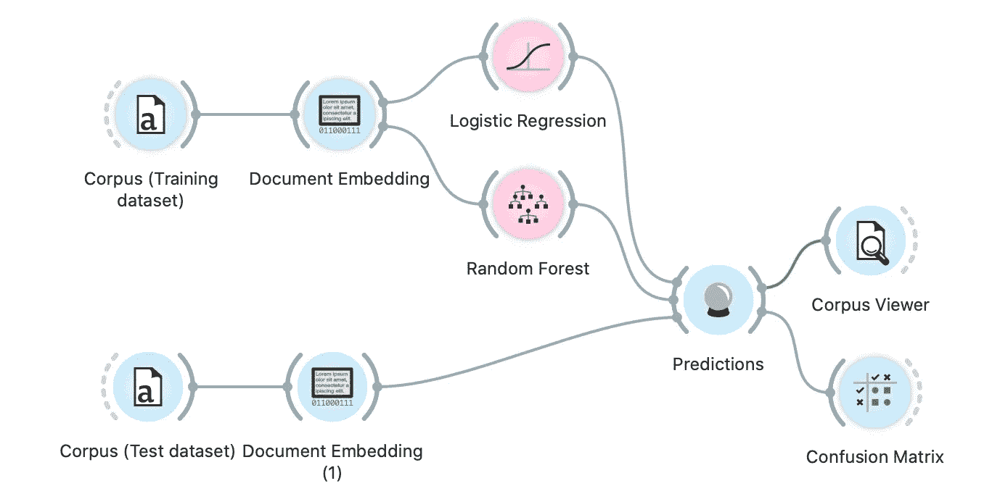
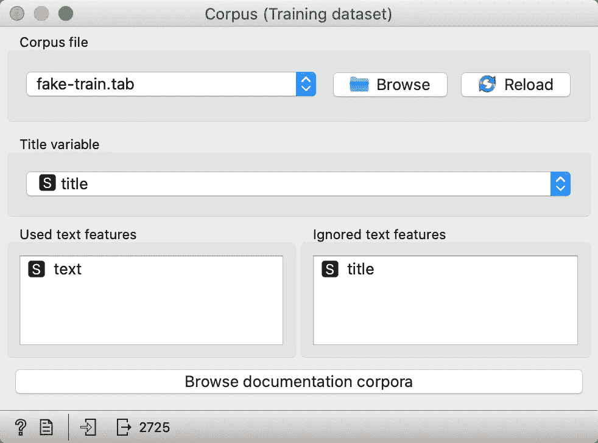
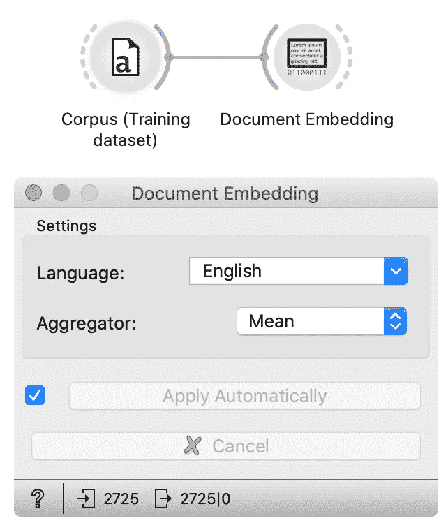
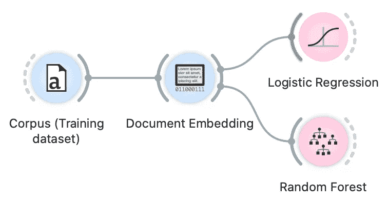
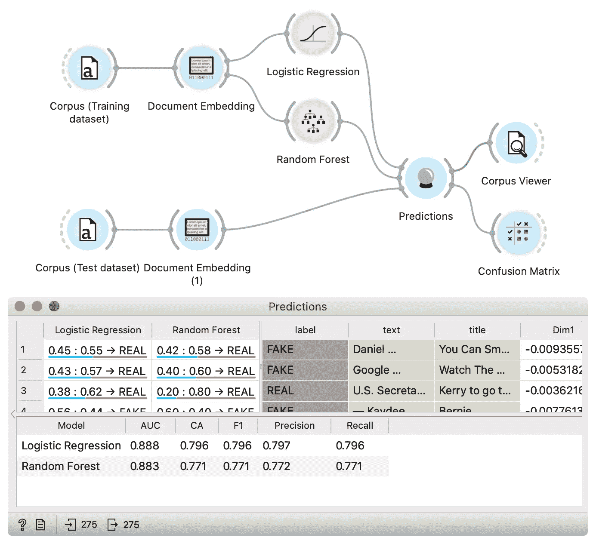
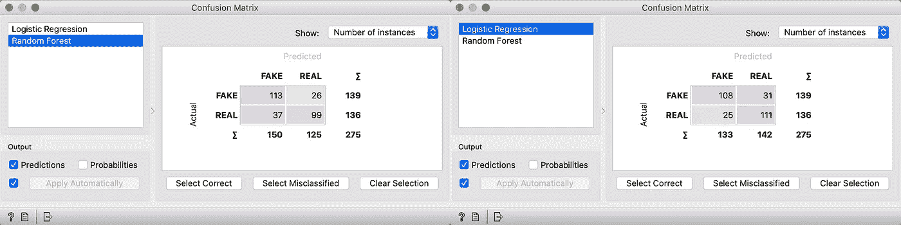

# 无需编码的文档嵌入和文本分类

> 原文：<https://towardsdatascience.com/documents-embeddings-and-text-classification-without-coding-e274b4e191e9?source=collection_archive---------26----------------------->

## 什么是文档嵌入，如何在没有一行代码的情况下对文本进行分类？

安妮·斯普拉特在 [Unsplash](https://unsplash.com/) 上的照片

T ext 是由字符序列描述的。由于每个机器学习算法都需要数字，因此我们需要将文本转换为实数向量，然后才能继续进行分析。为此，我们可以使用各种方法。在深度学习进化之前，最知名的方法是[单词袋](https://en.wikipedia.org/wiki/Bag-of-words_model)，由于其优点，该方法仍被广泛使用。最近深度学习的蓬勃发展给我们带来了新的方法，如单词和文档嵌入。在这篇文章中，我们解释了什么是文档嵌入，为什么它是有用的，并展示了它在没有编码的分类例子中的用法。为了分析，我们将使用 [Orange 开源工具](https://orange.biolab.si/)。

## 单词嵌入和文档嵌入

在理解文档嵌入之前，我们需要理解单词嵌入的概念。单词嵌入是单词在多维空间中的表示，使得具有相似含义的单词具有相似的嵌入。这意味着每个单词都被映射到代表该单词的实数向量。嵌入模型大多基于神经网络。

文档嵌入通常分两步从单词嵌入中计算。首先，文档中的每个单词被嵌入单词嵌入，然后聚集单词嵌入。最常见的聚合类型是每个维度的平均值。

## 为什么以及何时应该使用嵌入器？

与统计文档中每个标记(单词)出现次数的[单词袋](https://en.wikipedia.org/wiki/Bag-of-words_model)相比，嵌入有两个主要优势:

*   **他们没有维度问题。**词袋的结果是一个表，该表的特征数量等于语料库中所有文档中唯一标记的数量。具有长文本的大型语料库导致大量独特的标记。这会导致巨大的表格，超过计算机内存。巨大的表格也增加了机器学习模型的学习和评估时间。嵌入具有恒定的向量维数，Orange 使用的 fastText 嵌入维数为 300。
*   大多数预处理是不需要的。在单词袋方法的情况下，我们通过文本预处理来解决维度问题，在文本预处理中，我们移除似乎对分析不太重要的标记(例如单词)。它还会导致删除一些重要的令牌。当使用嵌入器时，我们不需要删除令牌，所以我们不会失去准确性。此外，在快速文本嵌入的情况下，可以省略大多数基本预处理(例如归一化)。
*   **嵌入可以在拥有数十亿标记的大型语料库上进行预训练**。这样，它们捕捉到了语言的重要特征，并生成了高质量的嵌入。然后使用预训练的模型来获得较小数据集的嵌入。

嵌入器的缺点是难以理解。例如，当我们使用单词袋时，我们可以很容易地观察到哪些标记对于分类是重要的，因为标记本身就是特征。在文档嵌入的情况下，特征是人类自身无法理解的数字。

## 柑橘

对于这个故事中的演示，我将使用我最喜欢的数据分析工具——Orange。Orange 是最知名的交互式数据分析、可视化和机器学习工具之一。它是[开源的](https://github.com/biolab/orange3)，你可以从[它的网站](https://orange.biolab.si/download/)下载。Orange 由画布组成，您可以在画布上放置小部件，并将它们连接在一起以创建工作流。每个小部件代表数据分析中的一个步骤。

示例工作流—在后面的分析中使用并解释了相同的工作流(作者的*图片)*

## 文档嵌入小部件

Orange 通过[文档嵌入小部件](https://orange.biolab.si/widget-catalog/text-mining/documentembedding/)提供文档嵌入器。它使用了 [fastText 预训练嵌入器](https://fasttext.cc/docs/en/crawl-vectors.html)，支持 157 种语言，将每个文档映射到包含 300 个元素的向量中。Orange 的文档嵌入小部件目前支持 31 种最常见的语言。

在小部件中，用户设置文档的语言和聚合方法——这就是如何将文档中每个单词的嵌入聚合成一个文档嵌入(*作者图片*)

## 假新闻数据集

在本教程中，我们使用的是[假新闻数据集](https://www.kaggle.com/c/fake-news/data)的样本。数据集样本在[这里](http://file.biolab.si/datasets/fake.zip)可用。它包含两个数据集:包含 2725 个文本项的训练集和包含 275 个文本项的测试集。每一件物品都是贴有真假标签的物品。

## 假新闻识别

在这里，我们提出了如何使用文件嵌入的假新闻识别一步一步。首先，我们将使用语料库小部件加载数据集的训练部分。

语料库小工具及其选项(*作者图片*)

小部件加载包含三列的表格:文本、标题和标签。加载数据集后，我们确保在*已用文本特征字段*中选择了*文本*特征。这意味着该特征中的文本用于文本分析(来自该变量的标记将被嵌入)，而不使用*标题*特征。当加载数据集时，我们将语料库小部件连接到文档嵌入器小部件，后者将计算文本嵌入。我们的工作流应该是这样的:

带有加载数据的语料库小部件和嵌入数据的文档嵌入小部件的工作流。下图显示了文档嵌入小部件设置。(*作者图片*)

在文档嵌入小部件中，我们检查语言是否设置为英语，因为该数据集中的文本是英语。在这个实验中，我们将使用均值(平均)聚合，这是最标准的方法。一分钟后，文档被嵌入—嵌入进度显示在小部件周围的栏中。

当嵌入准备好时，我们可以训练模型。在本教程中，我们训练两个模型—逻辑回归和随机森林。我们将对两个学员使用默认设置。

上图中的工作流扩展了两个额外的小部件，用于训练两个模型，一个是逻辑回归，另一个是随机森林。(*作者图片*)

当我们的模型被训练时，我们准备测试数据，以查看我们的模型在新数据上的表现。为了加载测试数据，我们使用另一个语料库小部件，并将其连接到文档嵌入器小部件。设置与之前相同。唯一的不同是，这次我们在第二个语料库小部件中加载数据集的测试部分。为了在测试数据集上进行预测并检查预测结果，我们使用了预测小部件。

最终的工作流程。工作流的顶部加载训练数据，嵌入它们，并训练模型。工作流的底部加载测试数据，嵌入它们，并将它们发送到预测小部件，小部件使用模型对它们进行预测。在底部，我们看到预测小部件窗口，我们可以在其中检查来自数据集测试部分的每个数据实例的预测。(*图片作者*)

在小部件的底部，我们检查准确性。在名为 CA(分类精度)的列中，我们可以看到两个模型的精度都在 80 %左右。在上表中，我们可以找到模型出错的案例。如果我们选择行，我们可以在连接到预测小部件的 Corpus Viewer 小部件中检查它们。我们还将混淆矩阵小部件连接到我们的工作流，它显示了预测类和实际类之间的比例。

左边是随机森林的混淆矩阵，右边是逻辑回归模型的混淆矩阵(作者的*图片)*

我们可以看到，逻辑回归在真实新闻的情况下稍微更准确，而随机森林模型在预测假新闻方面更好。

在本教程中，我们解释了什么是文档嵌入，并展示了如何在包含真实或虚假新闻的数据集上使用它们的示例。您可以尝试对自己的文档进行类似的分析，也可以使用嵌入来完成其他任务，如聚类、回归或其他类型的分析。

## 参考

[1] Grave，Edouard 等人，学习 157 种语言的词向量。 *arXiv 预印本 arXiv:1802.06893* ，2018。

[2]demar，Janez，等. Orange:Python 中的数据挖掘工具箱.*机器学习研究杂志*，2013，14.1:2349–2353。

[3]张、尹；金、容；周，志华。理解词袋模型:一个统计框架。*国际机器学习与控制论杂志*，2010 年，1.1–4:43–52。

[4]维基百科:单词袋模型。在[https://en.wikipedia.org/wiki/Bag-of-words_model](https://en.wikipedia.org/wiki/Bag-of-words_model)有售

[5] Joulin，Armand，等. Fasttext .压缩文本分类模型。 *arXiv 预印本 arXiv:1612.03651* ，2016。