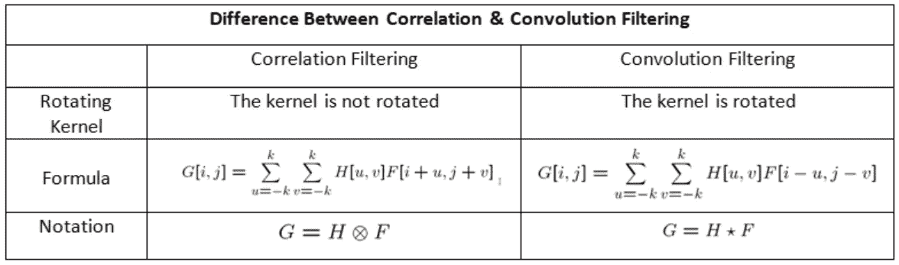
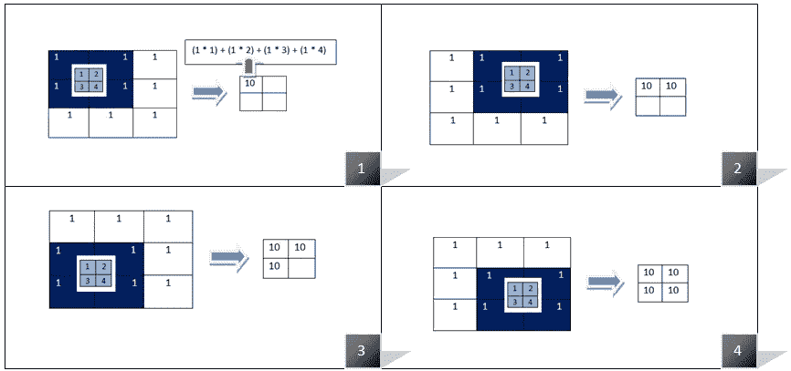
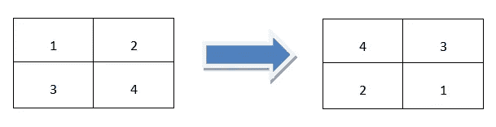

# CNN 代表卷积神经网络还是相关神经网络？

> 原文：<https://towardsdatascience.com/does-cnn-represent-convolutional-neural-networks-or-correlational-neural-networks-76c1625c14bd?source=collection_archive---------53----------------------->

## 试图解开为什么我们在 CNN 中提到使用卷积，而实际上我们使用的是互相关…

图片来源: [Pixabay](https://pixabay.com/vectors/squirrel-reading-books-surprise-304021/)

> CNN 或俗称的卷积神经网络(甚至 CovNets)是深度学习中使用的高效深度神经网络的关键成分之一，尤其是在处理非结构化数据时。但是我们在使用 CNN 的时候真的进行卷积运算吗？我知道数据科学和人工智能社区在有效使用 CNN 方面已经获得了很多专业知识，并且有像 Tensorflow，Keras 和 PyTorch 这样的框架，可以非常快速有效地使用 CNN 来构建深度学习模型？但是每当我们讲授 CNN 的概念时，为什么我们提到使用卷积的数学运算，而实际上我们做的是执行互相关！等等，你不相信我说的话？那么就让我们来深入探究一下这篇文章吧！

对于一些正在阅读这篇文章的人来说，我在接下来的部分将要讨论的内容可能会让你大吃一惊！但是最近，我和我的一个朋友进行了一次大讨论，他试图让我相信卷积和相关运算实际上是相同的，这就是为什么我们仍然说 CNN 使用卷积，而不是相关运算，我强烈反对，因此我想表达我的想法和我的观点，CNN 实际上是相关的神经网络！

图片来源:( [Pixabay](https://pixabay.com/vectors/co-workers-argument-argue-worker-294266/) )

# 卷积与相关滤波

对于我们中的一些人来说，我们可能没有足够的时间重温我们很久以前学过的数学概念，所以我想重放数学术语卷积和相关性之间的区别，以便更好地论证:

[相关 vs 卷积](https://medium.com/@aybukeyalcinerr/correlation-vs-convolution-filtering-2711d8bb3666)

所以基本上当我们在计算机视觉或者图像处理相关的工作中做相关滤波的时候，我们通常会在图像上滑动相关滤波器的中心，然后将相关滤波器中的每个值乘以图像中的像素值，最后将这些乘积求和。那么这一系列的操作你听起来是不是很熟悉呢？什么事？是的，你是对的，这正是我们在对图像等非结构化数据应用 CNN 时所想做的！

[相关滤波步骤](https://medium.com/@aybukeyalcinerr/correlation-vs-convolution-filtering-2711d8bb3666)

我让你困惑了吗？那么让我来解释一下当我们尝试应用卷积滤波时会发生什么。像相关滤波一样，卷积滤波也是一种线性滤波，但是相关和卷积之间有很小的区别。在卷积滤波中，我们在两个维度(从下到上，从右到左)翻转内核或滤波器，然后执行与相关滤波相同的步骤。

[在卷积滤波中在两个维度上反转滤波器](https://medium.com/@aybukeyalcinerr/correlation-vs-convolution-filtering-2711d8bb3666)

**产量有什么区别？**

你们中的一些人可能会想，*好吧，没关系，这可能只是术语上的缺陷，所以这有什么大不了的*？你们中的一些人可能会想，*如果我们应用实际的卷积运算而不是伪装的相关操作符，会有什么变化呢*？

为了回答这些问题，让我给你看一些通过卷积和相关运算在图像上使用高斯模糊滤镜的输出。

在左边的基础图像上使用相关性应用高斯模糊滤镜(图片由作者提供)

使用卷积在左边的基础图像上应用高斯模糊滤镜(图片由作者提供)

从上面两幅图像中，我们可以清楚地看到，当我们使用卷积和相关对同一幅图像应用相同的滤波器时，输出有所不同。所以，现在问题来了，对于神经网络学习权重和偏差来说，哪一个是真正有用的？我在这里的答案是相关滤波，因为卷积滤波在某些情况下实际上可能会引入噪声，这可能会导致深度学习模型的误导性结果。

**命名法中为什么会有这种谬误？**

你可能想知道，即使我们在 CNN 中使用互相关，为什么我们仍然称它为卷积神经网络？是因为卷积听起来更复杂吗？还是 CovNet 看起来比 CorrNet 更时髦？嗯，这些原因可能是真的，但当我做我的研究时，我发现 CNN 的最开始被认为是源于论文 [**Neocognitron**](https://www.rctn.org/bruno/public/papers/Fukushima1980.pdf) ，已知它使用卷积滤波，但后来的 CNN 和大多数 ML/DL 包的实现都使用相关滤波而不是卷积滤波，但我们仍然继续使用卷积神经网络的名称。虽然数学或算法的复杂性实际上几乎保持不变，但结果却有所不同。

现在，看完这篇文章，你会支持我把 CovNets 重命名为 CorrNets 的观点吗？或者至少支持我，当有人争论说 CovNets 和 CorrNets 实际上是一样的，当有明显的区别时？

你喜欢这篇文章吗？还想多看几篇同一主题的文章？那么请看看这个:[卷积 Vs 相关](/convolution-vs-correlation-af868b6b4fb5)，[卷积神经网络 Conv (CNN):相关还是卷积？](https://medium.com/@zhang_yang/convolutional-neural-networks-conv-cnn-correlation-or-convolution-5840b91c46a6#:~:text=The%20name%20Convolutional%20Neural%20Networks,is%20correlation%20that%20it's%20using.)我们的媒体作者同事在强调差异方面做得很好，因此这些文章可能对你真的有帮助。

*因此，这就把我们带到了本文的结尾。在* [*我的个人网站*](https://aditya-bhattacharya.net/) *中，我正在尝试编写一个* [*深度学习词汇表*](https://www.aditya-bhattacharya.com/?p=170) *，里面会有更多深度学习中用到的有趣概念的细节，我会在以后挑选一些更有趣的概念。在那之前，请鼓掌并激励我进行更多的讨论，并与社区分享我的发现。希望我能帮上忙！继续关注:***和我的网站:*[https://www.aditya-bhattacharya.net/](https://aditya-bhattacharya.net/)*

**** *更新**** : ***我正在用 python 写一本关于应用计算机视觉的书，正在寻找可以在写作或审查内容和代码方面做出贡献的投稿人。我最感兴趣的是接收研究生，通过写一本书和维护一个开源项目来帮助他们成为应用计算机视觉专家！请看看我的这篇文章了解更多:*** [***链接***](https://medium.com/analytics-vidhya/become-an-applied-computer-vision-expert-in-a-fun-and-practical-way-b6c79335d4b1) ***。如果你想看看该倡议的早期努力，请看看我在***[***YouTube***](https://www.youtube.com/watch?v=jHMNL5KOmjE)***中关于应用计算机视觉的详细实践研讨会。如果你有兴趣成为其中的一员，请随时通过这里提到的任何交流方式联系我们:***[***https://aditya-bhattacharya.net/contact-me/***](https://aditya-bhattacharya.net/contact-me/)***带着你更新的简历。****