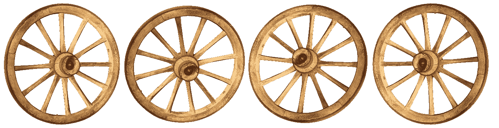
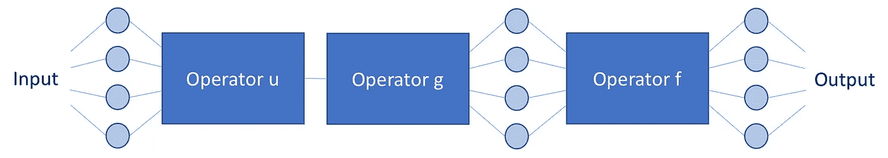
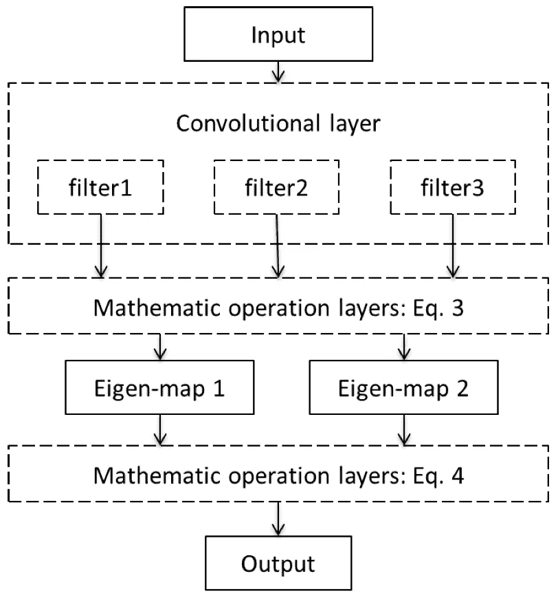
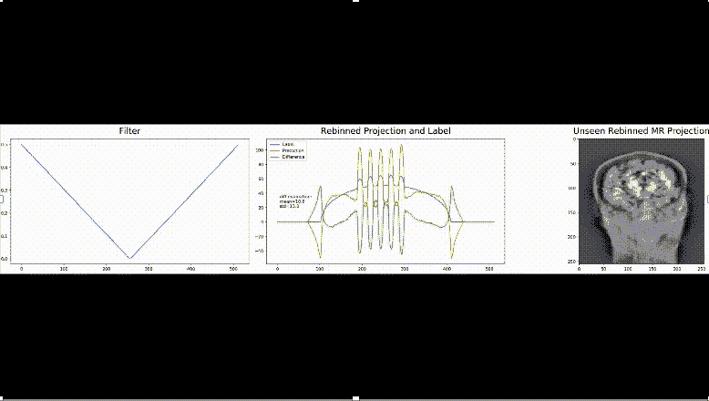

# 深度学习总是要重新发明轮子吗？

> 原文：<https://towardsdatascience.com/does-deep-learning-always-have-to-reinvent-the-wheel-2c526018c5c5?source=collection_archive---------39----------------------->

机器学习，特别是深度学习，彻底改变了我们今天所知道的世界。我们已经看到了语音和图像识别方面的巨大进步，随后是深度学习在许多其他领域的应用。在其中的许多领域，深度学习现在是最先进的，甚至正在超越它。一个明显的趋势是网络变得越来越复杂，计算要求越来越高。

今天，我们正在构建越来越多的网络，这些网络建立在前几代网络拓扑之上。由于神经网络固有地与其他神经网络兼容，我们能够将它们结合并适应新的目的。如果你的目标是解决一个新问题，没有明确的准则来定义一个合适的网络拓扑。最常见的方法是看看其他人试图解决类似问题的工作，或者自己设计一个全新的拓扑。这种新设计通常受到经典方法的启发，但它取决于网络和训练数据来学习正确的权重，以便它们收敛到似乎合理的解决方案。因此，它们甚至是从零开始学习众所周知的函数的网络，例如[傅立叶变换](https://www.nature.com/articles/nature25988)。由于离散傅立叶变换是一种矩阵乘法，因此它通常被建模为完全连接的层。使用这种方法，很明显有两个缺点是无法避免的:首先，全连接层引入了许多自由参数，这些参数可以模拟完全不同的功能。第二，用这种方法永远达不到快速傅立叶变换的计算效率。

[已知操作员学习的可视化](https://www.nature.com/articles/s42256-019-0077-5)

如果我们已经知道解决一个特定的问题需要一个特定的函数，我们就会想到这样一个问题:把它作为一种先验知识包含到我们的网络结构中是否会有好处。[已知操作员学习](https://www.nature.com/articles/s42256-019-0077-5)的方法在一个新的理论框架中研究了这个过程。虽然这个想法看起来简单而直观，但是理论分析也确定了明显的优点:首先，将已知操作引入神经网络总是导致较低或相等的最大训练误差界限。第二，减少了模型中自由参数的数量，从而也减少了所需训练数据的大小。另一个有趣的观察结果是，任何允许计算相对于输入的梯度的操作都可以嵌入到神经网络中。事实上，如我们从例如最大汇集操作中所知，即使是次梯度也已经足够了。

有趣的是，这段理论是 2019 年才发表的。它是为将物理先验知识嵌入神经网络的理论分析而开发的。然而，这些观察也很好地解释了为什么我们看到卷积神经网络和池层的巨大成功。与生物学类似，我们可以认为卷积和汇集运算是感知的先验知识。最近的工作甚至走得更远:有一些方法甚至将复杂的滤波器功能，如[血管性滤波器](https://arxiv.org/abs/1711.03345)或[导向滤波器](https://arxiv.org/abs/1803.05619)纳入神经网络。

Frangi-Net 是[血管性过滤器](https://arxiv.org/abs/1711.03345)的可微分版本。在我们的[代码海洋实验环境](https://doi.org/10.24433/CO.5016803.v2)中测试代码。

理论分析还表明，前几层的建模误差会被后几层放大。这个观察结果也符合特征提取在经典机器学习和模式分析中的重要性。在深度学习中进行的特征提取和分类的组合，允许我们同步这两个过程，从而减少训练后的预期误差。

由于精确学习允许结合经典理论方法和深度学习，我们现在能够将这些想法更进一步:最近的一篇[出版物](https://arxiv.org/abs/1807.03057)提出从底层物理方程中推导出特定问题的整个神经网络拓扑。这种方法的美妙之处在于，拓扑的许多操作符和构建块都是众所周知的，并且可以有效地实现。然而，它们仍然是计算效率非常低的操作。然而，我们从类似问题的其他解决方案中知道，特定的矩阵求逆或其他不太容易处理的运算可以用其他函数来表示。在这个例子中，昂贵的矩阵逆矩阵被循环矩阵代替，即卷积层，它是所提出的网络的唯一可学习部分。在他们的实验中，他们证明了所提出的架构确实解决了以前只能近似解决的问题。虽然他们只在模拟数据上进行训练，但在真实数据上的应用也是成功的。因此，包含先验知识也有助于构建针对特定问题的通用网络架构。

该动画示出了用于投影重排的已知操作者网络的拟合，该投影重排仅在合成数据上训练并应用于来自真实扫描仪的拟人幻像数据。代码可在我们的[代码海洋实验环境](https://doi.org/10.24433/CO.8086142.v2)中获得。

我们认为这些新方法对深度学习社区很有意思，深度学习社区今天已经远远超出了仅仅对感知任务进行建模。对我们来说，看到传统方法与今天在深度学习中所做的一切内在兼容是令人兴奋的。因此，我们相信在不久的将来，在机器和深度学习领域会有更多新的发展，跟踪这些发展将是令人兴奋的。

如果你认为这些观察是有趣和令人兴奋的，我们建议阅读我们的[深度学习温和介绍](https://www.sciencedirect.com/science/article/pii/S093938891830120X)作为这篇文章的后续，我们的[免费深度学习资源](https://lme.tf.fau.de/teaching/free-deep-learning-resources/)或[我的 YouTube 频道](https://www.youtube.com/channel/UCoiMqX5FHfk_KDow7xSe7pg)。

本文的文本和图像根据知识共享许可 4.0 署名进行许可。因此，请随意重用和共享这项工作的任何部分。这篇文章最初发表在 MarkTechPost.com。