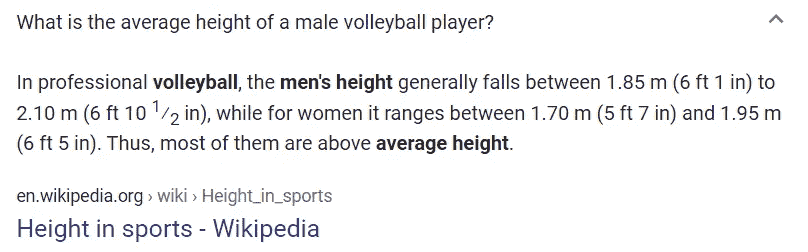
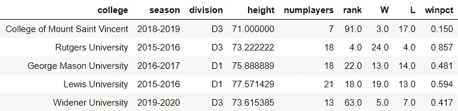

# 身高真的很重要吗？

> 原文：<https://towardsdatascience.com/does-height-really-matter-c3db062e8333?source=collection_archive---------16----------------------->

埃里克·麦克林在 [Unsplash](https://unsplash.com/s/photos/men%27s-volleyball?utm_source=unsplash&utm_medium=referral&utm_content=creditCopyText) 上的照片

## 身高对排球成功影响的数据驱动研究

# 介绍

我是职业排球运动员。

不完全是。但是当被问到“如果你能做任何事，你会以什么为生？”，我的回答几乎都是，“打排球。”这是我最喜欢的运动，但不幸的是，我对它感兴趣太晚了，以至于没有任何好处。最近，看旧的 [NCAA](http://www.ncaa.org/) 比赛的视频让我思考:*我能不能*打 NCAA 排球？我够高吗？

排球显然是一项高度重要的运动——高个子球员有更高的触及范围，可以更容易更快地越过网，并且有更多的击球选择。我身高 6 英尺 1 英寸，我想知道我的身高是否足以胜任我在 NCAA 级别的外线击球手的位置。自然，我第一个去回答这个问题的地方是谷歌。

图片来自[谷歌](https://www.google.com/search?rlz=1C1CHBF_enUS896US896&sxsrf=ALeKk02b2WwSCUnQx5rFuRKA0TnOUSOulg%3A1598215940939&ei=BNdCX9bpONLUtQX03JWgBg&q=men%27s+volleyball+average+height&oq=men%27s+volleyball+average+height&gs_lcp=CgZwc3ktYWIQAzICCAA6BAgjECc6BQguEJECOgQIABBDOgUIABCRAjoGCAAQChBDOggILhCRAhCTAjoICAAQsQMQgwE6AgguOgcIABAUEIcCOgQILhBDOgYIABAWEB46BQghEKABOgQIABANOggIABAIEA0QHlDCcljfkwFgxJQBaARwAHgBgAHdAYgBmiWSAQYwLjMyLjGYAQCgAQGqAQdnd3Mtd2l6wAEB&sclient=psy-ab&ved=0ahUKEwjW-7urmrLrAhVSaq0KHXRuBWQQ4dUDCAw&uact=5)

图片来自 [NCSA 体育](https://www.ncsasports.org/mens-volleyball/recruiting-guidelines)

经过一番挖掘，这些是我能找到的最具体的数字——我并不满意。6 尺 1 到 6 尺 10.5？这是一个很大的范围，这些范围都不能告诉我在 NCAA 我将如何**实际上**与外部击球手相比。看起来我必须自己找到答案。

# 数据收集

首先，我从 [NCAA 目录](https://web3.ncaa.org/directory/)中获取了所有 D1 和 D3 NCAA 男子排球队网站的列表。这些链接只指向学院的一般体育网站，所以我必须将这些链接转换为每个学院男子排球队的特定链接。我用 [Selenium](https://www.selenium.dev/) 从所有 156 支球队的花名册上刮出了每个球员的名字、位置和身高。我认为一年的数据不够全面，所以我收集了 2010-2011 赛季的球员名单数据。

这个过程并非没有痛苦。花名册的布局改变了，球队将不再拥有在线花名册，链接风格改变了，位置名称和高度格式也变了，还有其他困难。在我不愿意承认的长时间之后，我终于收集并清理了所有的数据，产生了下面的数据框架。

作者使用[熊猫](https://pandas.pydata.org/)的图片

15000 多条记录之后，我终于准备好回答我的问题了。我够高可以在 NCAA 打排球吗？

# 探索性分析

## 堆积起来

我想直入问题的核心，所以我创建了一个表格，按位置和部门显示球员的平均身高。

作者使用[熊猫](https://pandas.pydata.org/)的图片

对于外侧击球手，D1 高度是 6 英尺 3.7 英寸，D3 高度是 6 英尺 1.5 英寸。我不符合标准。为了挽回我的自尊，我看了一段时间内一名外线击球手的身高分布，看看我的身高是否够得上比赛。

图片由作者使用 [Seaborn](https://seaborn.pydata.org/)

虽然随着时间的推移，身高会有所变化，但看起来我总是比平均水平低一点。D1 和 D3 高地在 2010 年和 2013 年之间的显著背离让我吃惊；我认为 D1 的球队和球员一直都要高得多，但早期的情况并非如此。

总而言之，事情看起来不太妙。我甚至不够高，不能为 D3 球队效力，我可以忘记 D1 排球。然而，这些结论是基于一个基本假设:身高在排球比赛中很重要。但是真的吗？我想自己找出答案。

# 身高的重要性

衡量一个排球队成功的主要方法是他们赢了多少。他们的胜率是多少？与他们所在部门的其他队伍相比，他们的排名如何？我从 [NCAA 统计](http://www.ncaa.org/championships/statistics/mens-volleyball-statistics)搜集数据，找出每个赛季每个球队的胜败，以及他们的分区排名。在汇总了我每个赛季每支球队平均身高的原始数据后，我加入了球队获胜的数据。

作者使用[熊猫](https://pandas.pydata.org/)的图片

我制作了散点图，看看球队的平均身高和他们的胜率或排名百分比之间是否有任何明显的关系。等级百分位数用于说明跨部门/年度的不同团队数量，标准化 0 到 1 之间的值。在 50 分中排名 1 的团队的排名百分位数将是 0.02；一个 50 分中排名 30 的团队的百分位数为 0.6。

图片由作者使用 [Seaborn](https://seaborn.pydata.org/)

虽然看起来这两个部门之间没有很强的关系，但是 D1 和 D3 之间 R2 值的差异是令人惊讶的。D3 的值比 D1 的百分位值大三倍多，比胜率大四倍多。这种差异揭示了一个有趣的观点，表明对于 D3 团队来说，身高是一个团队成功的更大决定因素，而不是 D1 团队。

直觉上，这是有道理的。正如我后来对各个赛区高个子球员的分析所支持的那样，D1 球队在获得非常高的球员方面没有任何困难，所以身高并不能强烈反映他们的获胜能力。另一方面，D3 球队发现获得同样的 6 英尺 5–6 英尺 10 的巨人要困难得多，所以这些高大球员的存在(导致球队整体高大)可以使球队比其他球队更有优势。

然而，这些数字和视觉结合了所有季节。虽然我们知道随着时间的推移，平均位置或球队身高没有一致的模式，但身高仍然会发生变化，在一个赛季内比较球队是有意义的，因为他们的胜率和排名百分点与其他球队在那个赛季的表现直接相关-2012-2013 年斯坦福红雀队不受 2019-2020 年加州大学洛杉矶分校布鲁因斯分校的身高或胜率的影响。

我绘制了等级百分比和胜率随时间变化的 R2 和相关值，结果很有趣。

图片由作者使用 [Seaborn](https://seaborn.pydata.org/)

图片由作者使用 [Seaborn](https://seaborn.pydata.org/)

对于相关性，D1 和 D3 的两个成功指标的值非常相似。这表明 D1 和 D3 的身高和成功之间的线性关系的强度是相似的。有趣的是，在这两个部分中，相关系数都低于 0。

R2 讲述了一个不同的故事。这两个指标遵循一个非常相似的趋势:D1 R2 值到处都是，没有真正的模式，而 D3 R2 值从 2010 年到 2014 年有明显的上升趋势，然后下降，然后变平。我们无法从 R2 值中推断出因果关系，但 R2 值随着时间推移的趋势似乎符合我们之前的直觉:身高并不能很好地反映 D1 队的获胜能力，所以线性模型不能很好地解释因变量，R2 值到处都是基于球队最终的表现。

另一方面，D3 球队从 2010 年到 2014 年可以看到非常高的球员的突出程度上升，随着高个子球队获得更多优势，身高成为他们获胜能力的更好预测因素，R2 增加。2014 年后的下降和随后的持平可以解释为非常高的球员的新鲜感逐渐消失，使球队在身高上的优势减少。

虽然这种说法是推测性的，但它在一定程度上得到数据的支持。如果我们随着时间的推移观察每个分区中非常高(6 英尺 5 英寸以上)的球员的数量，两种情况下都明显有增加的趋势(尽管 D3 在 2011-2012 年有异常，这一年特别高，不太符合模式)。

图片由作者使用 [Seaborn](https://seaborn.pydata.org/)

尽管总体上 D3 球员的数量更多，但是 D1 的高个子球员的数量比 D3 多得多，这表明 D1 队比 D3 队更容易甚至更容易接触到这些球员。这解释了 D3 的 R2 模式对 D1 的非模式。

# 团队级分析

我想看的最后一件事是，随着时间的推移，身高在团队层面上是否重要——如果一支球队变高了，它是否会提高胜率和排名百分位数？我添加了球队在身高、胜率和排名百分比方面的变化的列。如果身高和成功一起移动(身高上升和成功上升，身高下降和成功下降),身高的变化乘以胜率或排名百分位数的变化会得到一个正数，如果身高和成功反向移动，则会得到一个负数。如果随着时间的推移，身高对于一个特定团队的成功非常重要，那么身高和成功在大多数时候应该是同步的。我还研究了身高变化和成功变化之间的 R 平方值。

作者使用[熊猫](https://pandas.pydata.org/)的图片

如你所见，差别相对来说很小。即使我们只看平均高度超过一英寸的变化，在同一方向上移动的最高比例是 D1 队胜率的 60%。我们在不同级别的变化中看到类似的数字，尽管有趣的是，D1 在 1 英寸以上的变化中具有更高的同向移动比例，并且比任何其他组合中的 R 平方值都高得多。

所有比例都超过 50%的事实进一步表明，身高意味着**一些东西，**只是不太多。

# 结论

我们发现身高绝对是排球队成功的一个因素，而且对于 D3 球队来说，身高比 D1 球队重要得多。尽管身高对一个团队的成功有一定影响，但它显然不是成功的唯一决定因素；我们观察的大多数成功的衡量标准与身高的相关性只比随机的好一点点。虽然身高在排球中很重要，但练习和技术更重要，还有一点天赋。

所以，最后回答这个问题，我可以打 NCAA 排球吗？大概不会。但是我现在发现，这不是因为我的身高。这是因为缺乏必要的训练和练习年数，而这是在这样一个竞争激烈的水平上进行一项运动所必需的。