# Imagenet 预处理对胸部放射摄影图像有效吗(新冠肺炎)？

> 原文：<https://towardsdatascience.com/does-imagenet-pretraining-work-for-chest-radiography-images-covid-19-2e2d9f5f0875?source=collection_archive---------33----------------------->

## 动物、胸部 x 线摄影和新冠肺炎

我们被包围了。未知敌人的围攻。一个让我们困惑的敌人。除非你在过去的几个月里生活在岩石下(像杰瑞德·莱托一样)，你知道我在说什么——新冠肺炎。无论你打开新闻，还是浏览社交媒体，你现在获取的大部分信息都是关于 SARS-COV2 病毒或新型冠状病毒的。

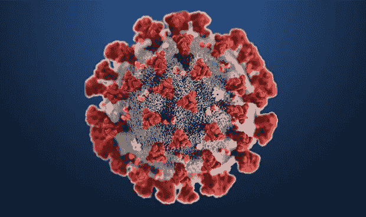

[疾控中心](https://unsplash.com/@cdc?utm_source=medium&utm_medium=referral)拍摄

但是在所有的负面情绪中，有一丝光亮闪耀着。当面对共同的敌人时，人类跨越国界团结起来(在很大程度上；总是有害群之马)互相帮助度过当前的难关。科学家是当今的英雄，他们加倍努力寻找治疗方法、疫苗和其他一百万种有助于对抗新冠肺炎的东西。除了真正的英雄之外，数据科学家也被号召以任何可能的方式提供帮助。许多人尽最大努力预测疾病的发展，以便政府能够更好地计划。更多的人花时间分析来自各种来源的数据，准备仪表板或网络图等。帮助理解疾病的发展。还有一批人试图将人工智能技术应用于识别病人的风险，或用 X 射线帮助诊断疾病等。

在关注这些发展的同时，很多人做了一些尝试的一个特定领域是基于胸部 x 线摄影的新冠肺炎病例识别。其中一个早期的尝试得到了很多关注、志愿者和资金等。伴随着对该研究定位的大量批评([你可以在这里阅读更多信息](/detecting-covid-19-with-97-accuracy-beware-of-the-ai-hype-9074248af3e1))。TLDR；澳大利亚的一名博士候选人使用了一个预训练模型(Resnet50)，对 50 幅图像进行了训练，由于训练验证泄漏而打乱了代码，并声称对新冠肺炎病例识别的准确率为 97%。有些人甚至获得了 100%的准确率(结果它是在获得 100%准确率的同一数据集上训练的)。

伴随着这种噪音，加拿大滑铁卢大学的 Linda Wang 和 Alexander Wong 发表了 arxiv 预印本，标题为 [COVID-Net:一种定制的深度卷积神经网络设计，用于从胸部放射摄影图像中检测新冠肺炎病例](https://arxiv.org/pdf/2003.09871.pdf)。在论文中，他们提出了一种新的 CNN 架构，该架构是在 5941 个后前胸部放射摄影图像的数据集上从头开始训练的。为了生成数据集，他们结合了两个公开可用的数据集——[COVID 胸部 x 光数据集](https://github.com/ieee8023/covid-chestxray-dataset)，和 [Kaggle 胸部 x 光图像(肺炎)数据集](https://www.kaggle.com/paultimothymooney/chest-xray-pneumonia)。在论文中，他们将这个数据集分为四类——新冠肺炎、病毒、细菌和正常。下面的条形图显示了训练和测试分割的类别分布。这是一个规模相当大的数据集，尽管 COVID 的情况较低。他们报告了该模型 100%的召回率和 80%的准确率。

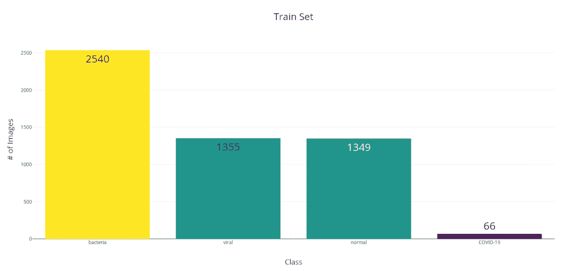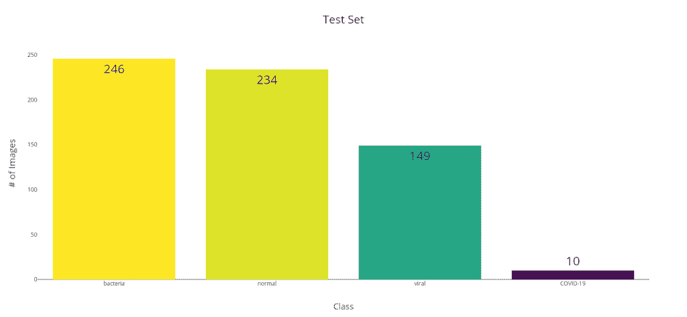

这是 COVIDx 上第一个相当大的数据集，它引起了我的兴趣。由于他们在 Github Repo 中共享了经过训练的模型和代码来进行评估，这是进行分析的最佳时机。

# 放弃

我觉得我需要在这里声明一个免责声明。接下来的一切都是纯粹的学术活动，并不意味着这是对新冠肺炎的一种可验证的有效的测试方式。重要的事情先来。我个人并不赞同试图用这些模型来识别新冠肺炎。我对医学知之甚少，对看 x 光片更是一窍不通。除非这已经被医学专业人士验证和审查，否则这比在竞争数据集上训练的模型好不了多少。

关于数据集也有一些问题。

1.  新冠肺炎案例和其他案例来自不同的数据来源，模型是否识别代表新冠肺炎的数据来源或实际视觉指标令人怀疑。我试图查看 GradCAM 的结果，但我在阅读 x 光片方面是一个绝对的零，我不知道模型是否在查看正确的指标。
2.  同样不清楚的是，病人在拍 x 光片时处于什么阶段。如果是在他的疾病中服用得太晚了，这种方法就站不住脚了。

# 为什么不转学？

当我看到模型和数据集时，我的第一个想法是——为什么不转移学习呢？数据集很小，尤其是我们感兴趣的类。从零开始训练一个模型，并试图恰当地捕捉不同类的复杂表示，尤其是新冠肺炎类，对我来说有点吃力。

但是唱反调，为什么一个接受过动物和食物(ImageNet 中最受欢迎的课程)培训的 CNN 会在 x 光方面做得更好？对自然和彩色图像进行训练的网络，可能已经学会了处理单色 X 射线所需的完全不同的特征表示。

作为一个理性的人和科学过程的坚定信徒，我决定查阅现有的相关文献。令人惊讶的是，研究界在这个问题上存在分歧。让我说清楚。对于预训练或迁移学习是否适用于医学图像，没有争议。但是争论的焦点是在 Imagenet 上进行预训练是否有任何好处。有论文声称 Imagenet 预处理有助于医学图像的分类和分割。也有报纸推动权重的随机初始化。

Veronika Cheplygina 最近发表的一篇论文[1]从 Imagenet 预处理是否有益于医学图像的角度对文献进行了综述。结论是——“视情况而定”。Google Brain 最近的另一篇论文(被 NeurIPS 2019 接受)[2]深入探讨了这个问题。尽管总的结论是使用 Imagenet 权重的迁移学习对医学成像没有好处，但他们确实指出了一些其他有趣的行为:

*   当样本量很小时，如医学成像中的大多数情况，迁移学习，即使它是基于 Imagenet 的，也是有益的
*   当他们观察不同模型的收敛速度时，预先训练的模型收敛得更快
*   最有趣的结果是，他们尝试用随机权重初始化网络，但根据预训练的权重导出随机初始化的均值和标准差，并发现它也提供了预训练模型所具有的收敛速度。

底线是，该研究并没有显示 Imagenet 训练模型的性能更差，而且收敛速度更快。即使大的 Imagenet 模型对于这个问题来说可能是过度参数化的，但是如果你想让一个模型尽可能快地工作，它确实提供了一些好处。

# 实验

既然我已经完成了文献综述，是时候验证我的假设了。我收集了数据集，写了一个训练脚本，并测试了几个预训练的模型。

我用过 FastAI 库(PyTorch 的一个包装器)，它非常容易使用，特别是如果你正在用它简单的“冻结”和“解冻”功能进行迁移学习。大部分实验要么在我装有 GTX 1650 的笔记本电脑上进行，要么在谷歌的 Colab 上进行。除了 torchvision 之外，我还使用了 Cadene 的神奇库[预训练模型作为我的预训练模型的来源。](https://github.com/Cadene/pretrained-models.pytorch)

# 数据扩充

由于我们的训练数据集相对较小，并且因为它有两个不同的 X 射线源，我使用了一些转换作为数据扩充。它既增加了数据集样本，又为模型提供了更好的泛化能力。所使用的转换是:

# 培训程序

以下是我用来训练这些模型的基本步骤。完整代码发布在 [GitHub](https://github.com/manujosephv/covid-xray-imagenet) 上。

1.  导入模型并从 fastai 创建一个学习者。fastai 有一些内置的机制来切割和分割预训练的模型，这样我们就可以使用一个定制的头部，并轻松应用[判别学习](https://blog.slavv.com/differential-learning-rates-59eff5209a4f)速率。对于 torchvision 中的模型，切割和分割在 fastai 中预定义。但是对于从 torchvision 外部加载的模型，我们也需要定义它们。“cut”告诉 fastai 在 CNN 的特征提取器部分和分类器部分之间进行分离，以便它可以用自定义头来替换它。“拆分”告诉 fastai 如何拆分 CNN 上的不同区块，使每个区块可以有不同的学习率。
2.  使用分层的 ShuffleSplit 将训练分成训练和验证
3.  将损失作为标准交叉熵
4.  冻结 CNN 的特征提取器部分，训练模型。我用的是 Leslie Smith[3]提出的[单周期学习率调度器](https://arxiv.org/pdf/1506.01186.pdf)。这是杰瑞米·霍华德在他的 fastai 课程中大力提倡的，并在 fastai 图书馆中实现。
5.  在学习饱和后，解冻模型的其余部分并微调模型。是否使用单周期调度程序以及是否使用差分学习率，是通过查看损失曲线根据经验决定的。

# 训练中使用的技巧

## 混合

[mix up](https://arxiv.org/pdf/1710.09412.pdf)【4】是一种数据扩充形式，我们通过对两个现有示例进行加权线性插值来生成新示例。

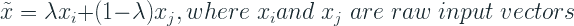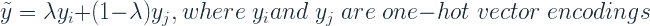

λ介于 0 和 1 之间。实际上，它是从以α为参数的贝塔分布中取样的。通常，α在 0.1 到 0.4 之间，此时混合的影响不会太大而导致欠拟合。

## 渐进调整大小

对于 DenseNet 121，我也尝试了渐进式调整大小，只是为了看看它是否能给我带来更好的结果。渐进式调整大小是指我们开始用小尺寸图像训练网络，然后使用从小尺寸图像学习的权重，并开始在大尺寸图像上训练，并分阶段转移到更高分辨率的图像尺寸。我分三个阶段试过——64×64，128×128，224×224。

# 结果呢

事不宜迟，我们来看看结果。

## Densenet 121

最佳 DenseNet 模型是通过逐步调整 64×64 -> 128×128 的大小并在训练期间使用 mixup 得到的。

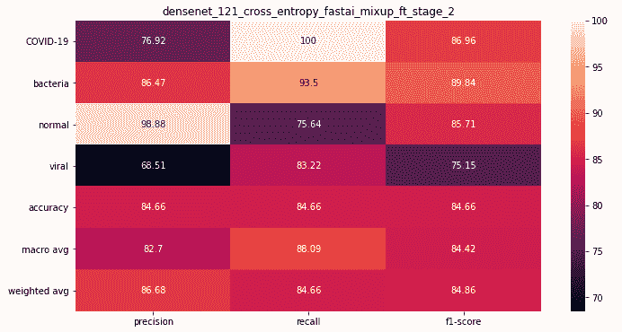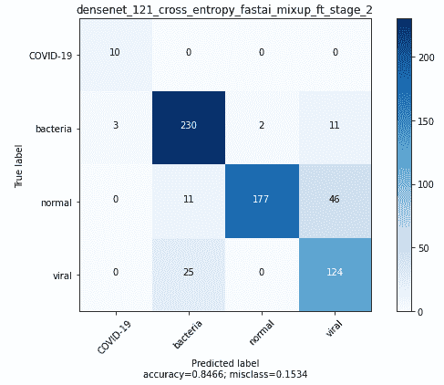

## 例外

使用 mixup 训练最佳异常模型，并在使用冻结权重进行初始预训练后进行微调。

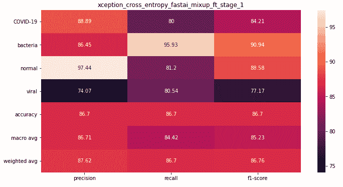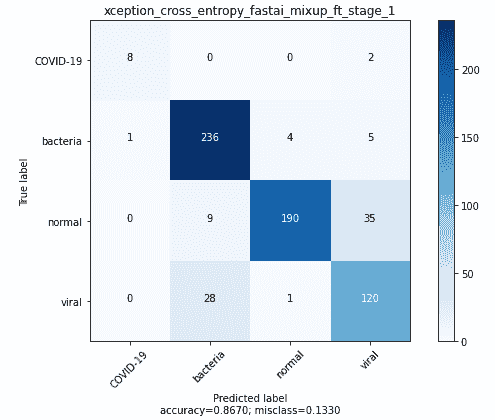

## ResneXt 101 32x4d

最好的 ResNeXt 模型是在没有 mixup(没有尝试)和没有 finetuning(由于某种原因，finetuning 给了我更差的性能)的情况下训练的。

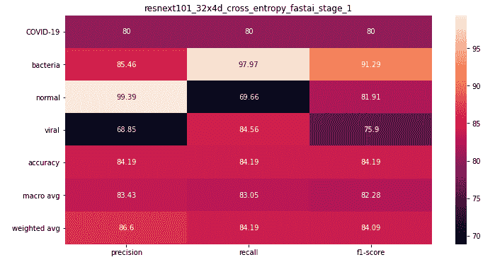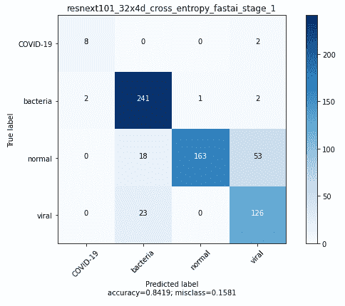

让我们将这些结果汇总在一个表格中，并将它们与 COVID-Net 论文中的结果放在一起。

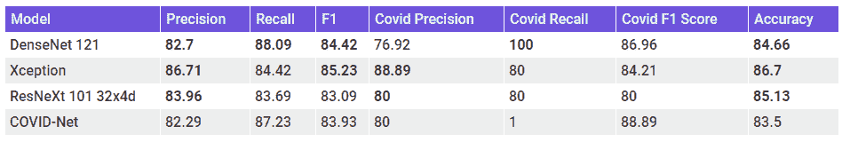

我们可以马上看到，所有的模型都比 COVID-Net 具有更好的准确性。但是准确性并不是这里评估的正确标准。F1 得分最高的 e Xception 车型似乎是所有车型中表现最好的车型。但是，如果我们分开来看精度和召回，我们可以看到 COVID-Net 具有高召回率，特别是对于新冠肺炎的情况，而我们的模型具有高精度。Densenet 121 具有完美的召回率，但是精确度很差。但是 Xception 模型的精度很高，召回率也不算太差。

## 组装

我们已经看到 DenseNet 是一个高召回模型，而 Xception 是一个高精度模型。如果我们对这两个模型的预测进行平均，性能会更好吗？

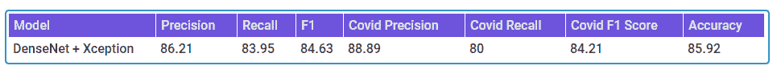

和以前没多大区别。我们的合奏仍然没有更好的回忆。让我们尝试一个加权系综，给在新冠肺炎有着完美回忆的 Densenet 更多的权重。为了确定最佳权重，我使用了验证集中的预测，并尝试了不同的权重。

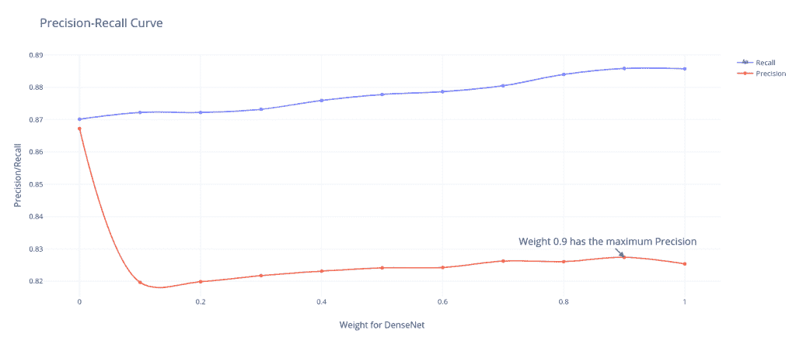

让我们将这些集合也添加到前面的表中进行比较。

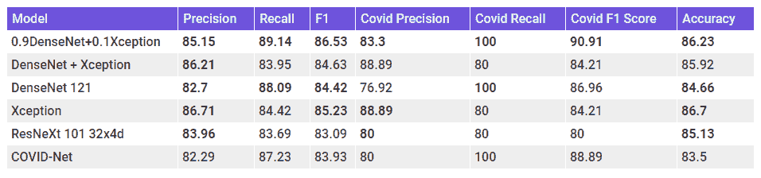

最后，我们有一个模型，它在精确度和召回率之间取得了平衡，并且在所有指标上都超过了 COVID-Net 分数。让我们来看看系综的混淆矩阵。

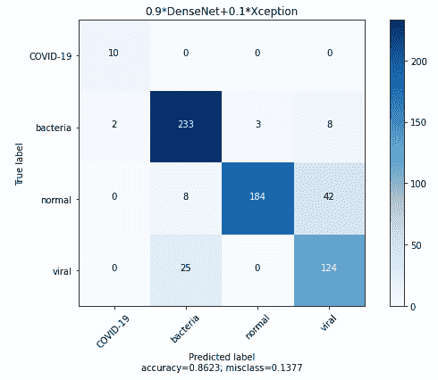

## 模型复杂性和推理时间

当我们在考虑模型的可用性时，我们还应该记住模型的复杂性和推理时间。下表显示了在我的机器(GTX 1650)上作为模型复杂性和推理时间的代理的参数数量。

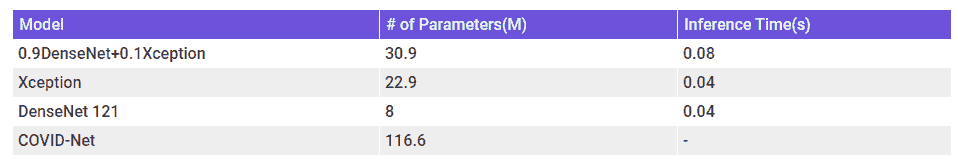

注意——无法在我的笔记本电脑上运行 COVID-Net 上的推理(它与 Tensorflow 的关系很糟糕),因此不知道模型的推理时间。但是从参数数量来看，应该比其他型号多。

注意:集合的参数数量和推断时间被视为成分的总和。

# 模型分析

# GRAD CAM

早在 2015 年，周、等人[5]就引入了类别激活图，作为理解 CNN 在打包预测时在看什么的一种方式。这是一种理解 CNN 在进行预测时关注的图像区域的技术。他们通过将输出层的权重投射回卷积神经网络部分的输出来实现这一点。

Grad CAM 是 CAM 在许多最终用例中的推广，除了分类，他们通过在卷积层的最后一个输出中使用梯度来实现这一点。这篇论文的作者[6]说:

> 梯度加权类激活映射(Grad-CAM)使用任何目标概念的梯度(比如“狗”的逻辑或者甚至是标题)，流入最终卷积层以产生粗略的定位图，该定位图突出显示图像中用于预测概念的重要区域。

让我们看几个例子，看看我们的预测和它们的激活叠加成一个热图。虽然我不知道网络是否在寻找正确的地方，但如果有人正在阅读这篇文章，知道如何去做，[联系我](https://www.linkedin.com/in/manujosephv/)让我知道。

## 新冠肺炎（新型冠状病毒肺炎）

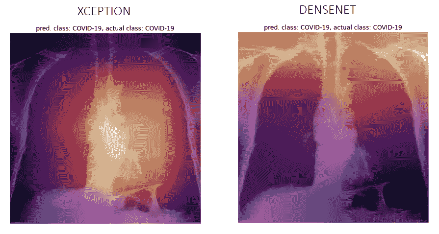

## 病毒的

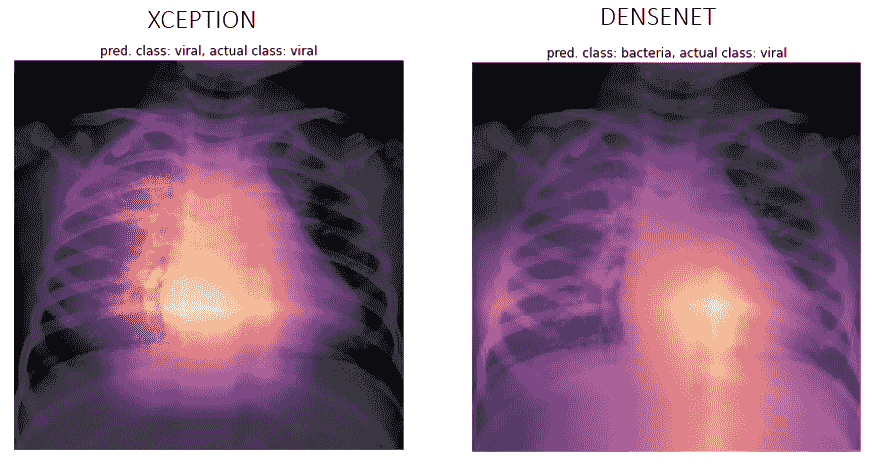

## 细菌

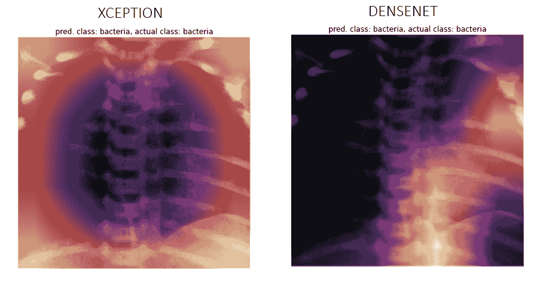

## 常态

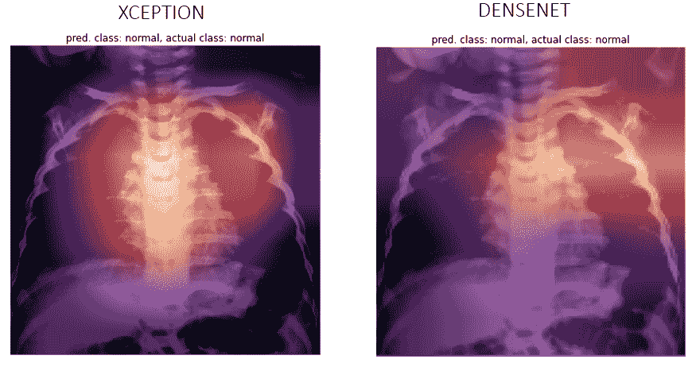

## 当神经网络作弊时

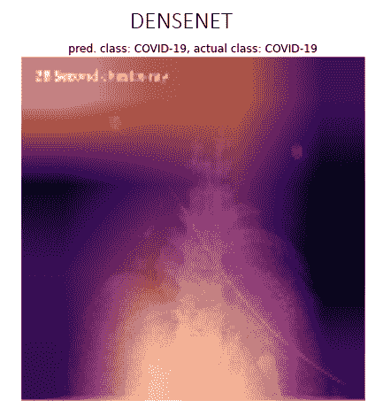

# 特征表示(t-SNE)

我们还可以看看这些网络生成的要素制图表达有多好。由于卷积层的输出是高维的，我们必须使用降维技术来绘制二维图。

一种流行的探索高维数据的方法是 t-SNE，由 van der Maaten 和 Hinton 在 2008 年提出[7]。SNE 霸王龙不像 PCA，它不是；t 线性投影。它使用点之间的局部关系来创建低维映射。这允许它捕捉非线性结构。

让我们来看看 t-SNE 的可视化，三种模型的困惑度为 50——COVID-Net、Xception 和 DenseNet。

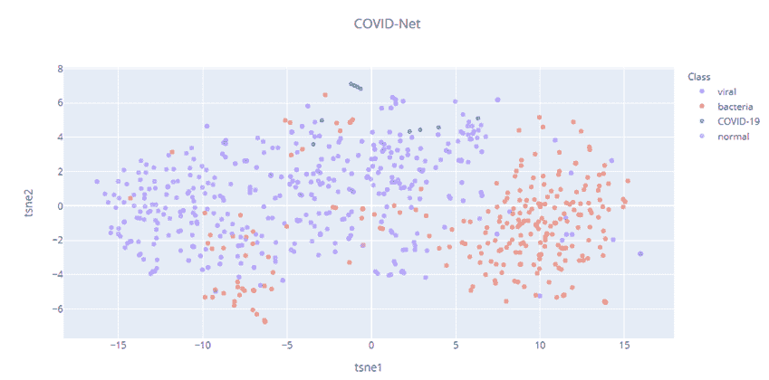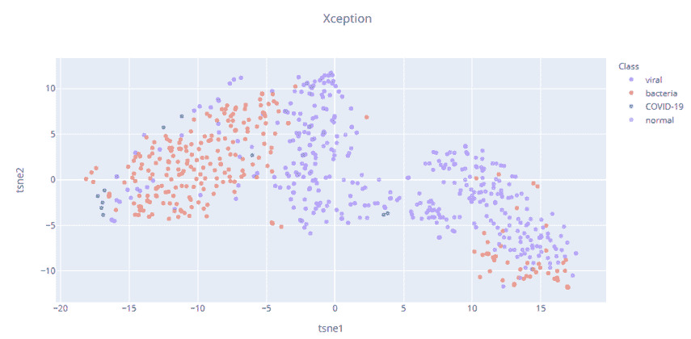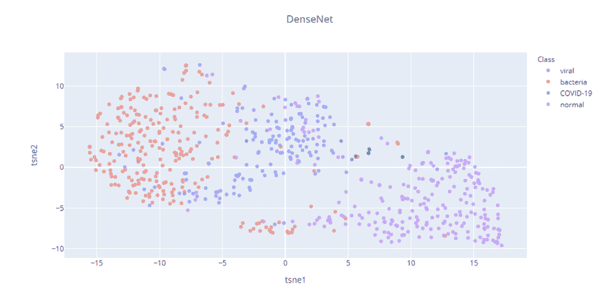

我们的 Imagenet 预训练模型(Xception 和 DenseNet)似乎比 COVID-Net 具有更好的特征表示。COVID-Net 的 t-SNE 相当分散，在不同的类之间有很多点缀。但是，Xception 和 DenseNet 要素制图表达显示了不同类之间更好的分离程度。这三个案例中的新冠肺炎案例(绿色)显示了分离，但是因为数据集很小，我们需要对这个推论有所保留。

# 最后的话

我们已经看到，Imagenet 预训练模型的性能优于 COVID-Net 模型。最佳例外模型具有更好的精度，最佳 DenseNet 模型具有更好的召回率。在这种特殊的情况下，回忆更重要，因为你需要的是安全而不是遗憾。即使你把少数非新冠肺炎病例归类为阳性，他们也只会被引导去做适当的医学测试。但是另一种错误并不那么宽容。因此，单纯从这一点来看，我们的 DenseNet 模型更好。但我们也需要记住，这是在有限的数据集上训练的。同样，新冠肺炎病例的数量也只有 60 例左右。很有可能这个模型已经记住或过拟合了这 60 个。这是一个典型的例子，模型使用 x 光片上的标签将它归类为新冠肺炎。GradCAM 检查也不是很有帮助，因为一些例子看起来像模型正在寻找正确的地方。但是对于一些例子来说，热图照亮了几乎所有的 X 射线。

但是在检查了 GradCAM 和 t-SNE 之后，我认为例外模型对这些情况有了更好的表示。回忆率低的问题是可以解决的。

从更大的角度来看，我们已经开始了整个练习，我认为我们可以有把握地说，Imagenet 预训练确实有助于新冠肺炎胸部放射摄影图像的分类(我确实试图在相同的数据集上训练 DenseNet，但没有预训练权重，没有取得多大成功)。

# 未探索的方向

这个问题还有很多未被探索的方面，我会提到这些，以防我的读者想了解这些。

*   收集更多数据，尤其是新冠肺炎案例，并重新训练模型
*   处理阶级不平衡
*   灰度 ImageNet[9]上的预训练和灰度 X 射线上的后续转移学习
*   使用 CheXpert 数据集[8]作为 Imagenet 和胸部 x 线摄影图像之间的桥梁，通过微调 CheXpert 数据集上的 Imagenet 模型，然后应用于手头的问题

> [***Github Repo****带训练和推理代码。*](https://github.com/manujosephv/covid-xray-imagenet)

# 呼吁合作

> *如果你是医学专业人士，认为这是一个值得研究的方向，请联系我***。我想确信这是有效的，但目前还没有。**
> 
> **如果你是一个 ML 研究者，想要合作发表论文，或者继续这方面的研究，* [*联系我*](https://www.linkedin.com/in/manujosephv/) *。**

****更新***——在我克隆了 COVID-Net 回购协议之后，有了一次更新，既在数据集中增加了几个新冠肺炎的案例，也增加了一个更大的模型。而且我们合奏的表现还是比大模型好。*

****编者按:*** [*走向数据科学*](http://towardsdatascience.com/) *是一份以数据科学和机器学习研究为主的中型刊物。我们不是健康专家或流行病学家，本文的观点不应被解释为专业建议。想了解更多关于疫情冠状病毒的信息，可以点击* [*这里*](https://www.who.int/emergencies/diseases/novel-coronavirus-2019/situation-reports) *。**

# *参考*

1.  *Cheplygina，Veronika，“CAT 或 CAT 扫描:从自然或医学图像源数据集转移学习？，“arXiv:1810.05444 [cs。简历]，2019 年 1 月。*
2.  *Raghu，Maithra 等，“输血:理解医学成像的迁移学习”，arXiv:1902.07208 [cs .简历]，2019 年 2 月*
3.  *史密斯，莱斯利·n .，“训练神经网络的循环学习率”，arXiv:1506.01186 [cs .简历]，2019 年 6 月*
4.  *张弘毅、穆斯塔法·西塞、扬·n·多芬、戴维·洛佩斯·帕兹，“混乱:超越经验风险最小化”。ICLR(海报)2018*
5.  *周，等，“学习深度特征进行鉴别性定位”，arXiv:1512.04150，2015 年 12 月*
6.  *Selvaraju，Ramaprasaath R .等人，“Grad-CAM:通过基于梯度的定位从深度网络进行视觉解释”。arXiv:1610.02391 [cs。简历]，2016 年 10 月*
7.  *劳伦斯·范德·马腾，杰弗里·辛顿，“使用 t-SNE 可视化数据”。2008*
8.  *Irvin，Jeremy 等人，“CheXpert:带有不确定性标签和专家比较的大型胸片数据集”，arXiv:1901.07031 [cs .简历]，2019 年 1 月*
9.  *谢，伊婷&里士满，大卫。(2019).灰度 ImageNet 预培训改善医学图像分类:德国慕尼黑，2018 年 9 月 8 日至 14 日，会议录，第六部分。10.1007/978–3–030–11024–6_37.*

**原载于 2020 年 4 月 5 日*[*http://deep-and-shallow.com*](https://deep-and-shallow.com/2020/04/05/does-imagenet-pretraining-work-for-chest-radiography-imagescovid-19/)*。**