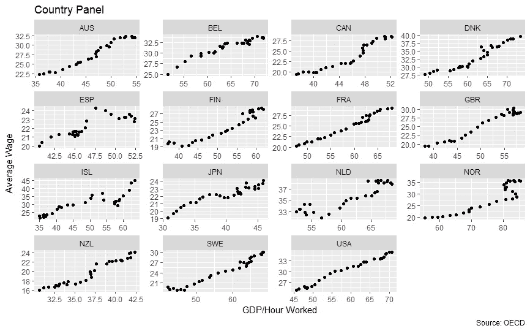
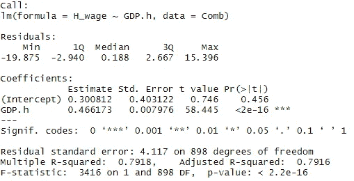
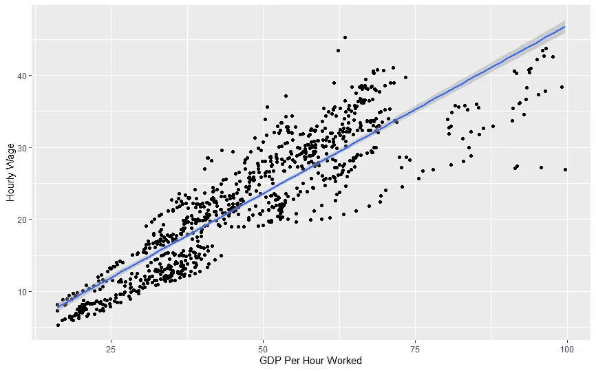
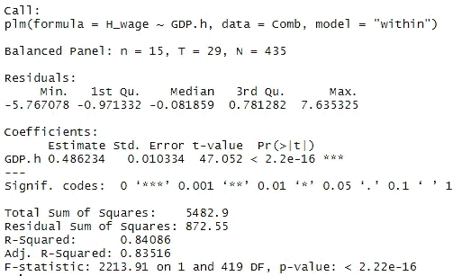
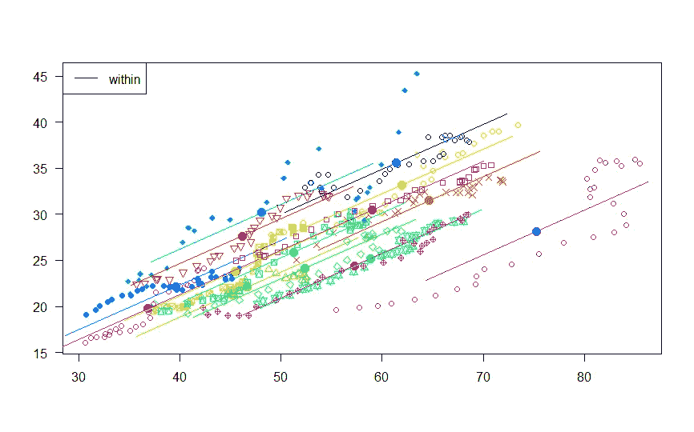
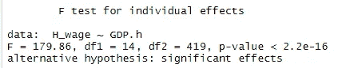
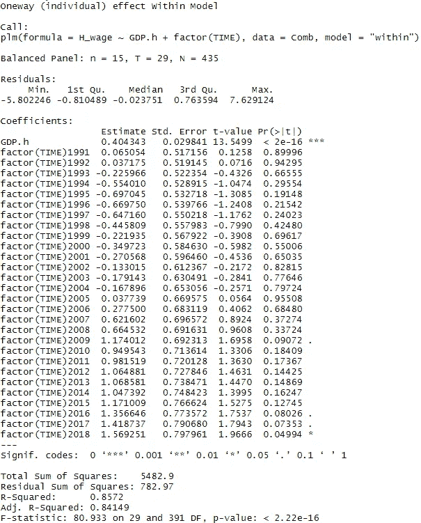
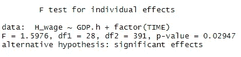

# 生产率提高了工资吗？

> 原文：<https://towardsdatascience.com/does-productivity-increase-wages-f50ce24f41d0?source=collection_archive---------76----------------------->

## 探索固定效应回归的 R 项目



# 介绍

经济理论告诉我们，劳动生产率是工资的主要决定因素。然而，许多评论家认为这种关系已经破裂，尤其是在最近几十年。该项目将探索一种固定效应回归，以分析经合组织国家小组的生产率和工资之间的联系。

这个项目并不打算面面俱到——相反，更多的是一个实验，提供一些来自不同国家的关于这个主题的证据。

## 数据源

我所有的数据都将来自经合组织的数据库。我下载了 CSV 文件中的三个数据序列:[劳动生产率](https://data.oecd.org/lprdty/gdp-per-hour-worked.htm)(每小时工作的 GDP)[年平均工资](https://data.oecd.org/earnwage/average-wages.htm)和[年平均工作时间](https://data.oecd.org/emp/hours-worked.htm)。我选取了 1990 年至 2018 年的时间段，因为这是所有三个数据集中可用的最多的数据。

在我的 Github 上有完整的代码和数据集。

# 该项目

首先，我将把每个数据集放入 r 中。我还加载了几个我在几乎所有项目中使用的标准包。

```
library(ggplot2)
library(dplyr)#Bring in labour productivity data
GDPh <- read.csv("DP_LIVE_16062020201012437.csv")#Bring in average annual wages
Wage <- read.csv("DP_LIVE_16062020201639206.csv")#Bring in average annual hours worked
Hours <- read.csv("DP_LIVE_16062020202140847.csv")
```

## 清理和准备数据

对于几乎任何项目来说，数据都会以我们想要的形式出现。经合组织的数据设计得很好，但仍需要做一些工作才能得到所需的格式。对于每个数据系列，为了可读性，我将重命名几列，然后删除我不需要的列。

```
#GDP per hour
names(GDPh)[1] <- "Country"
names(GDPh)[7] <- "GDP.h"
GDPh <- GDPh[-c(2:5,8)]#Annual wages
names(Wage)[1] <- "Country"
names(Wage)[7] <- "Wage"
Wage <- Wage[-c(2:5,8)]#Hours worked per year
names(Hours)[1] <- "Country"
names(Hours)[7] <- "Hours.a"
Hours <- Hours[-c(2:5,8)]
```

从这里，我可以将数据集合并到一个数据框中:

```
Comb <- merge(GDPh, Hours)
Comb <- merge(Comb, Wage)
```

这个数据集包括作为一个国家的整个经合组织，我不想把它包括在内(因为我是在看单个国家)。我需要从我的数据中删除这些观察结果。有几种方法可以做到这一点，但我发现了一种创建“不在”函数的简洁方法，在这种情况下很容易使用。

```
#Create 'notin' function
`%notin%` <- Negate(`%in%`)#Remove OECD observations
Comb <- subset(Comb, Country %notin% c("OECD"))
```

最后，我想创建一个新列，其中包含每小时的平均工资，而不是我现在的年平均工资。为此，我可以简单地用“Hours.a”列除“工资”列来创建一个新列。

```
#Create an hourly wage column
Comb$H_wage <- Comb$Wage/Comb$Hours.a
```

此时，数据是我可以处理的格式。

# 统计数字

## 普通最小二乘法

首先，让我们用数据生成一个标准的普通最小二乘(OLS)回归:

```
#OLS regression
ols <- lm(H_wage~GDP.h, Comb)
summary(ols)
```

然后，Summary 会提供以下输出:



系数 0.466(意味着劳动生产率每增加 1 美元，工资增加 0.466 美元)具有统计意义。

我们也可以想象这种回归。虽然我可以使用默认的 plot 函数，但大多数人认为 ggplot 包更有吸引力。

```
library(ggplot2)#Visualize fit
ggplot(Comb, aes(x=GDP.h, y=H_wage)) +
  geom_point() +
  geom_smooth(method=lm) +
  labs(x = "GDP Per Hour Worked",
       y = "Hourly Wage")
```

这产生了下面的情节:



阴影区域代表 95%的置信区间

然而，由于国家之间的异质性，这不是分析数据的最佳方式。

## 平衡面板

第一步将是检查面板是否平衡(意味着我们对所有国家都有相同的时间段)。我已经知道面板是*非*平衡的，但是我们还是会显示代码。为此，我们将使用“plm”包。

```
library(plm)is.pbalanced(Comb)
[1] FALSE
```

此功能已确认我们的面板不平衡。幸运的是，这个包也有平衡我们面板的功能。但是，我们必须选择如何平衡我们的面板(该功能提供了三个选项)。我将选择保留所有可用时间段的选项，删除不可用的国家。

```
length(unique(Comb$Country))
[1] 35
```

这段代码告诉我，我的面板目前有 35 个国家。

```
Comb <- make.pbalanced(Comb, balance.type = "shared.individuals")
length(unique(Comb$Country))
[1] 15
```

新的数据集现在只有 15 个国家，这是一个相当小的国家样本。确认新面板是平衡的:

```
is.pbalanced(Comb)
[1] TRUE
```

面板现在是平衡的。现在，我将在剩余的面板中制作一个国家的可视化。

```
ggplot(Comb, aes(x=GDP.h, y=H_wage)) +
  geom_point() +
  facet_wrap(.~ Country, scales = "free") +
  labs(title = "Country Panel",
       caption = "Source: OECD",
       y = "Average Wage",
       x = "GDP/Hour Worked")
```


## 固定效应模型

现在，我们可以在面板上运行固定效果模型。

```
f <- plm(H_wage~GDP.h, data=Comb, model="within")
summary(f)
```

它产生以下输出:



该系数现在是 0.486，仍然具有统计学意义。我们能够绘制一个显示国内回归的图表:

```
plot(f,
     pooling=F,
     within=T)
```



虽然我们的面板有太多的国家来产生视觉上吸引人的图，但这对于具有较少实体的数据集是有用的。然而，我们仍然可以看到，几乎所有国家都表现出积极的关系。

## 检验固定效应模型对 OLS 的影响

首先，我在平衡数据集上重新运行 OLS。现在我们可以针对 OLS 测试固定效应模型，看看它是否能更好地解释这些数据:

```
#Test fixed-effects against OLS
pFtest(f, ols)
```



我们可以拒绝零假设；固定效应模型产生的结果明显优于 OLS。

## 模型诊断

我将测试该模型是否具有时间固定效应。

```
#Time fixed effects
ft <- plm(H_wage ~ GDP.h + factor(TIME), data=Comb, model="within")
summary(ft)
```



```
#Test time-fixed effects--null hypothesis is no time fixed effects
pFtest(ft,f)
```



p 值为 0.029 是困难的——它提供了好的，但不是时间固定效应的结论性证据。这表明这个模型可能更适合。

## 其他诊断

虽然我不会在这里执行它们，但是您可以执行各种其他测试。一个特别值得关注的问题是截面依赖性。你也可以测试序列相关性和异方差性。