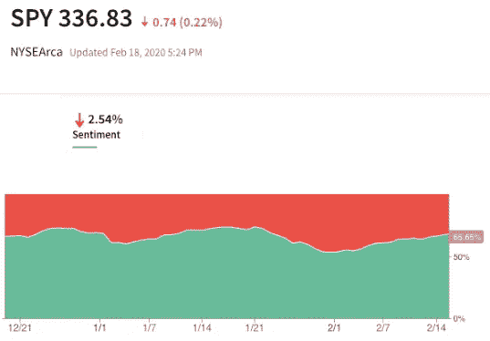
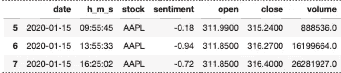
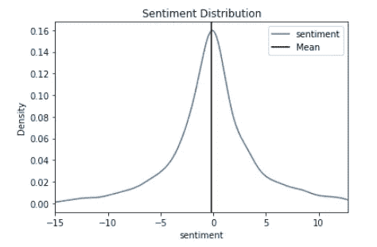
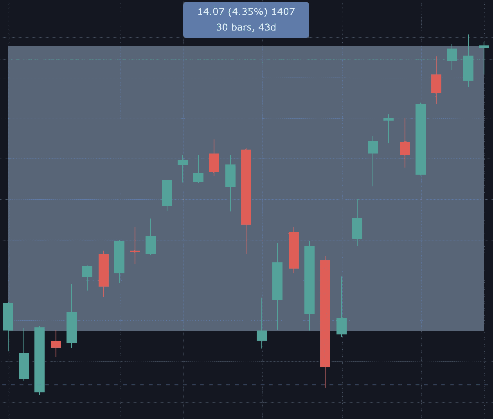
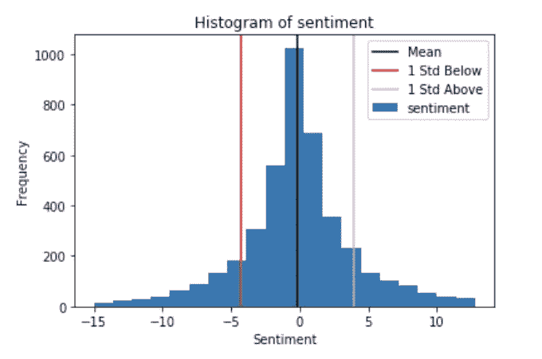
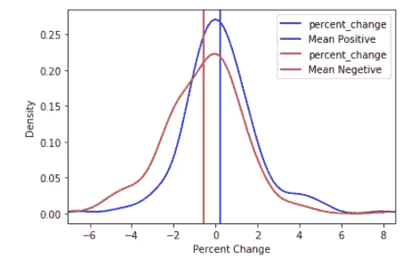

# 公众情绪影响股市吗？

> 原文：<https://towardsdatascience.com/does-public-sentiment-effect-the-stock-market-ea3836e3b2b?source=collection_archive---------28----------------------->



stocktwits.com

众所周知，股票市场的表现会对公众产生影响，但如果情况正好相反呢？随着社交媒体的兴起，人们已经发布了大量关于各种主题的信息，研究人员越来越有兴趣了解金融相关社交媒体数据在金融模型中可能扮演的角色。这可能是关于股市乐观或悲观的总社交媒体情绪可以预测未来的股票走势，如果这是真的，那么社交媒体数据可能对金融机构非常有价值。

衡量公众对股市情绪的一种方法是使用社交媒体平台 StockTwits 的数据。StockTwits 类似于 Twitter，但信息更详细，因为用户可以选择将他们的推文标记为“看涨”或“看跌”。通过查看使用这些标签的推文，研究人员可以避免在分析中使用自然语言处理，这将节省大量时间。假设有足够大比例的人使用这些标签，通过比较当天看涨和看跌标签的推文总数，可以估计出公众每天的整体市场情绪。

对于这个项目，我通过查看 80 个来自标准普尔 500 的报价机来测试这个方法。为了确保结果不会被少数推文中的情绪所扭曲，我根据粉丝数量挑选了 80 个报价器(每个报价器有 10，000 或更多粉丝)。这个项目的目标是看看情绪是否与股票的未来价格行为有任何关联。

```
tickers = ['spy', 'ABBV', 'ATVI', 'ADBE', 'AMD', 'GOOGL', 'GOOG', 'MO', 'AMZN', 'AAL', 'AAPL', 'AMAT', 'T', 'BAC', 'BRK.B', 'BBY', 'BIIB', 'BA', 'BKNG', 'BMY', 'AVGO', 'CAT', 'CVX', 'CMG', 'CSCO', 'C', 'KO', 'COST', 'CVS', 'DAL', 'EBAY', 'EA', 'XOM', 'FB', 'FDX', 'F', 'FCX', 'GE', 'GM', 'GILD', 'GS', 'HD', 'INTC', 'IBM', 'ISRG', 'JNJ', 'JPM', 'KMI', 'KHC', 'KR', 'LMT', 'M', 'MA', 'MCD', 'MRK', 'MU', 'MSFT', 'NFLX', 'NKE', 'NVDA', 'ORCL', 'PYPL', 'PFE', 'PG', 'QCOM', 'CRM', 'SWKS', 'LUV', 'SBUX', 'TMUS', 'TTWO', 'TGT', 'TWTR', 'ULTA', 'UAA', 'VZ', 'V', 'WMT', 'DIS', 'WFC', 'WYNN', 'QQQ', 'GLD', 'XLF']
```

为了收集数据，我在今年 1 月 1 日至 2 月 14 日股票市场开放的日子里，分别在上午 9:30、下午 1:30 和下午 4:00 左右从 Stocktwits.com 收集了每个股票的情绪。为了计算股票价格的百分比变化，我比较了情绪发生时的价格和下一个数据点的收盘价。



数据框架中的示例行

在实践中，数据科学家通常与样本一起工作，但大多数时候我们实际上对描述样本本身并不感兴趣；我们想用这些样本来推断相应的人群。由于我仍处于数据收集的早期阶段，我现在将查看到目前为止我所收集的数据的分布情况。

总的来说，数据的分布看起来很正常。情绪的平均值是-.153。这表明，平均而言，整个数据集的公众情绪只是有点悲观。



所有 80 个报价机的综合平均情绪

在同一时期，标准普尔 500 上涨了 4.35%。考虑到整体情绪略显悲观，这无疑很有趣。



2020 年 1 月 2 日至 2 月 14 日 S&P 价格行动。上涨 4.35%，而平均情绪略有看跌

均值告诉我，来自样本的平均情绪是-0.153，但这并不意味着每个数据点的情绪是-0.153。通过使用标准差公式，我可以了解平均情绪的变化程度。计算告诉我，平均而言，情绪在平均值上下波动约 4.10 倍。



```
df['sentiment'].std(ddof = 1)
```

然而，情绪可能会偏离均值 1 个标准差以上。一些异常值低至-15 或高达 11，如上图所示。

因为该数据集是情感的样本，所以在计算标准偏差时使用 n-1。原因是样本标准差通常低估了总体标准差。有些样本标准偏差较低，有些较高，有些相同，但平均而言，样本标准偏差低于总体标准偏差。

这意味着，当从总体中抽取样本时，如果你从分布差的角度考虑，你更有可能得到一个分布差低于总体分布差的样本。获得具有较高标准偏差的样本是可能的，但可能性较小。这主要是特定于具有高分布且没有聚类的样本。

为了纠正低估问题，分母减少 1。这种由除以 *n-1* 而不是 *n* 组成的小修正被称为贝塞尔修正。(来源:[维基百科](https://en.wikipedia.org/wiki/Bessel%27s_correction))

# 情绪能预测价格行为吗

根据我收集的数据，我查看了情绪超过或低于平均值两个标准差的数据点。对于这个样本，这意味着 8.2%(看涨)或-8.2%(看跌)的情绪。

```
significant_data[(significant_data['sentiment'] <= -8.2)]significant_data[(significant_data['sentiment'] >= 8.2)]
```

我的假设是，在对股票的情绪极度看涨或看跌的日子里，价格行为将遵循相同的方向。原因是极端情绪无论如何通常是因为一些外部因素。

我发现，即使情绪在两个方向都很极端，百分比变化的分布仍然是正常的。在下图中，蓝线代表情绪为 8.2%或更高时的百分比变化。红线代表情绪为-8.2%或更低时的百分比变化。



当市场情绪极度看涨时(偏离平均值+2 个标准差)，平均价格变化为+0.223%。

```
df_2_std_pos['percent_change'].mean()
#0.2227859276042125
```

当情绪极度悲观时，平均价格变化为负，为-0.558

```
df_2_std['percent_change'].mean()
#-0.5578316295700224
```

这很有趣，因为根据目前的数据，它确实表明极端情绪可以预测。

目前我只能做到这一步，因为我需要更多的数据来进行任何有意义的分析。尽管这些初步结果确实很有趣。