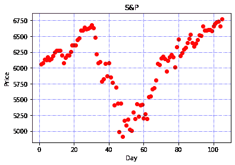
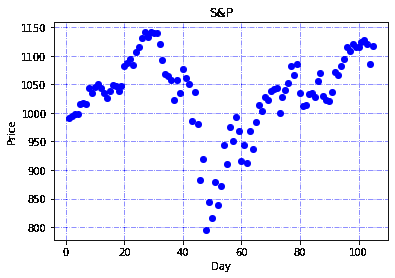
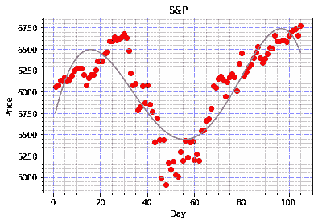
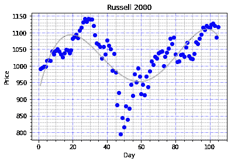
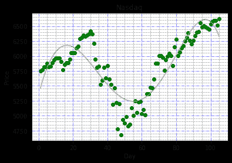

# 与大市值公司相比，新冠肺炎造成的经济损失对小市值公司的影响更大吗？

> 原文：<https://towardsdatascience.com/does-the-economic-damage-caused-by-covid19-affect-smaller-cap-companies-more-compared-to-bigger-7693cab360e0?source=collection_archive---------68----------------------->

## 根据权威人士的说法，他们真的能更好地抵御这场飓风吗？

新冠肺炎·疫情让我们所有人都大吃一惊。在短短几周时间内，美国股市已跌至超过 2008 年金融危机的水平，更让人想起大萧条，而从香港到日本再到东京，世界各地的股市都经历了类似的冲击。但是新闻报道说在这次股市崩盘中。较大的公司可以更好地抵御危机，因为与中小型公司相比，它们拥有更大的储备。因此，我将利用数据科学，用数据做一个快速的比较，看看这是真的还是假的。

在美国，有两个市场指数，即 S&P(标准普尔)和罗素 2000/3000 指数。这两个指数跟踪大型和小型/中型公司的股票价格。我用股票价格来代表公司的健康状况，但这涉及到许多因素，如现金储备、债务额等。但是为了让事情变得简单并继续前进。我决定从 S&P 和罗素 2000 指数中获取前 10 只股票的总股价。S&P 排名前十的股票在这里列出[https://www . investopedia . com/top-10-s-and-p-500-stocks-by-index-weight-4843111](https://www.investopedia.com/top-10-s-and-p-500-stocks-by-index-weight-4843111)

S&P 排名前十的股票是:
1——微软
2——苹果
3——亚马逊
4——脸书
5——Alphabet
6——谷歌
7——强生&强生
8——伯克希尔·哈撒韦
9——Visa
10——摩根大通

我挑选的罗素 2000 指数的前 10 只股票列在这里[https://www . fool . com/investing/stock-market/indexes/Russell-2000/](https://www.fool.com/investing/stock-market/indexes/russell-2000/)

1—Teladoc
2—novo cure
3—Generac
4—lumen tum
5—Trex
6—Amedisys
7—Portal General Electric
8—Haemonetics
9—第一工业地产信托
10 —德克斯户外公司

我从雅虎财经网站上下载了所有的股票价格，这些价格是基于从 2020 年 1 月 7 日到 6 月 5 日的 6 个月时间范围。这两个 CSV 文件可以从这里下载[S&P 的](https://gist.github.com/gibtang/457b31db0feea1737fcac4ee99fa7678)和这里[Russell 2000 的](https://gist.github.com/gibtang/f60fbcdc973f4fdf90e8a0f9edc668e3)。

有了这两个 CSV 文件。我需要先把它们画在图上，看看它们是什么样子。所以用谷歌的 Colab，Python，和 Panda。我开始导入和读取 CSV

`import numpy as np
import matplotlib.pyplot as plt
import pandas as pd`

`dataset = pd.read_csv('S_n_P - V-2.csv')
X = dataset.iloc[:, 1].values.reshape(-1, 1)
y = dataset.iloc[:, 12].values.reshape(-1, 1)`

现在，CSV 文件显示日期、股票价格和 10 家公司的总数。图表需要显示 X 的日期和 y 的股票价格。但是 Panda 不允许我在导入时使用日期作为值。所以我修改了我的 CSV，增加了一列 **day** ，这是一个流水号序列，从 1 月 7 日的第 1 天开始，到 6 月 5 日的最后一天，即第 105 天。这个新日柱位于指数 **1** 处，而组合股票价格位于指数 **12** 处

接下来，我绘制图表，看看如何使用这段代码显示数据点

`plt.scatter(X, y, color = 'red')
plt.title('S&P')
plt.xlabel('Day')
plt.ylabel('Price')
plt.grid(b=True, color='blue', alpha=0.6, linestyle='dashdot')
plt.show()`

正如你所看到的，你可以看到股价上涨，然后在图表中心大幅下跌，然后再次上涨。

从罗素 2000 指数前 10 名股票的图表中，我们可以看到这一点

股价像预期的那样上涨，然后在之前 S&P 图表显示的日期范围内再次下跌。所以从这两张图中，我们很难得到更多的数据，因为数据点或多或少非常相似。此外，图表显示股价不断上涨、下跌和上涨，因此线性回归没有意义，因为它不会反映数据点的涨跌。所以我决定用多项式回归来代替，这是我用的代码

`from sklearn.preprocessing import PolynomialFeatures
polynomial_reg = PolynomialFeatures(degree = 5)
X_polynomial = polynomial_reg.fit_transform(X)
lin_reg_2 = LinearRegression()
lin_reg_2.fit(X_polynomial, y)`

接下来，我添加这些代码行来显示曲线，并添加更多次要的网格线，以便我们可以更好地看到这些点

`plt.plot(X, lin_reg_2.predict(polynomial_reg.fit_transform(X)), color = 'grey')`

`plt.minorticks_on()
plt.grid(which='minor', linestyle=':', linewidth='0.5', color='black')`
`plt.grid(b=True, color='blue', alpha=0.6, linestyle='dashdot')
plt.show()`

有了 S&P，我们可以看到图表中的曲线

你会注意到曲线上升到 6500，然后下降到 5450，然后上升到 6750。这意味着在第 55 天出现了 16%的下跌，然后再次上涨至 6750 点，比最初的高点 6500 点上涨了约 3.8%。

现在对于罗素 2000 曲线，我们得到这个

在下跌 13%至 950 点之前，它达到约 1100 点的高点，然后从 1100 点的初始高点上涨 0.9%至 1110 点。

这表明中小型公司和大公司都受到了 Covid19 危机的同等影响，如曲线的下降所示。但是与大公司相比，中小型公司并没有恢复那么多。这可能是由于投资者信心、对蓝筹公司的看法、公司现金储备等原因造成的。因此，这张图确实显示了中小市值公司在复苏方面确实受到了更大程度的影响。

好的，如果你看过前 10 大 S&P 股票，其中大部分是科技股，如亚马逊、微软、苹果等。这是否会影响 S&P 10 大股票的整体反弹，因为 S&P 10 大股票中的大多数都是科技股？为此，我决定通过雅虎财经(Yahoo Finance)从以科技股为主的纳斯达克(NASDAQ)调出前 10 只股票，这 10 只股票是

1 —苹果
2 —亚马逊
3 —康卡斯特
4 —思科
5 —脸书
6 —谷歌
7 — Alphabet
8 —英特尔
9 —微软
10—英伟达

我已经提取了纳斯达克股票的数据，并将它们放在这里。

使用多项式回归的相同代码集，我们可以看到图形是如何排列的。这是纳斯达克十大股票的图表

因此，该曲线首先在 6240 点见顶，然后开始下跌至 5250 点，跌幅为 15.8%，然后反弹至 6600 点，从 6240 点上涨 5%。这说明科技股的回升幅度要大得多。这可能是因为看涨的投资者希望将资金投入他们认为更安全的公司，如科技股，因为它们不受 Covid19 局势的影响，尽管由于投资者的信心，股票全面下跌。

因此，从这三张图表来看，似乎有一些事实是，较大的公司更有能力抵御由 Covid19 整体引起的危机，而科技公司比其他公司更好地经受住了这场风暴。

下面是我用的 CSV 文件的链接
Russell 2000:[https://gist . github . com/gib Tang/f 60 fbcdc 973 f 4 fdf 90 e 8 a 0 f 9 EDC 668 e 3](https://gist.github.com/gibtang/f60fbcdc973f4fdf90e8a0f9edc668e3)Nasdaq:
[https://gist . github . com/gib Tang/8924 b 61 c 06043003d 9d 49 D5 AEC 842 b 73](https://gist.github.com/gibtang/8924b61c06043003d9d49d5aec842b73)
S

以及我在本文中使用的代码
[https://gist . github . com/gib Tang/62e 854d 6 FB 5976601193 b 089 E8 DC 85d 4](https://gist.github.com/gibtang/62e854d6fb5976601193b089e8dc85d4)