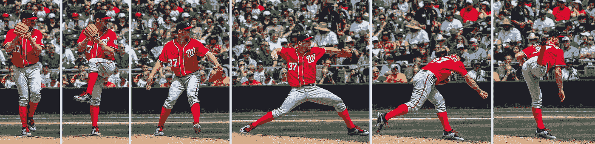
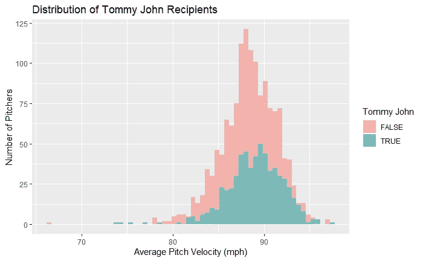
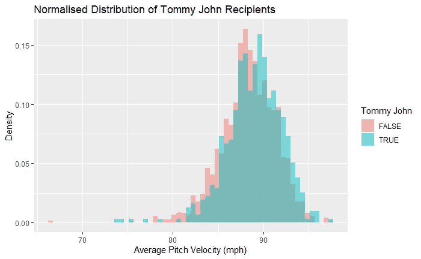
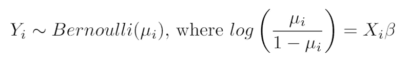
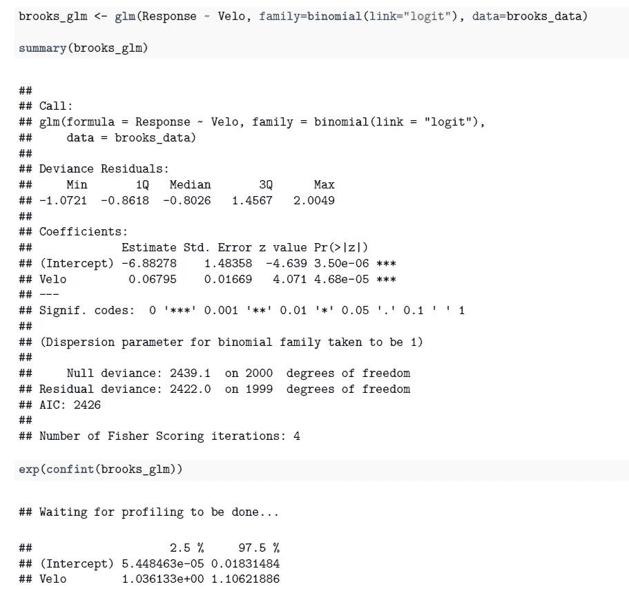
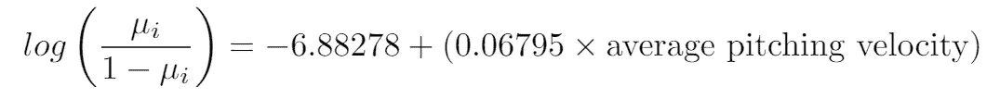
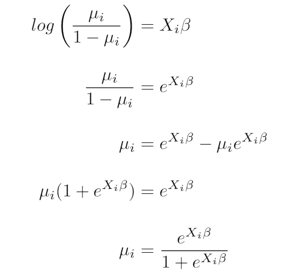
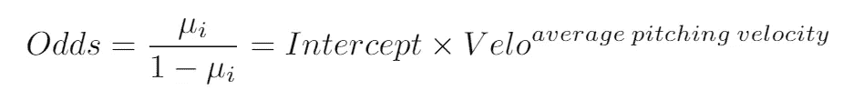
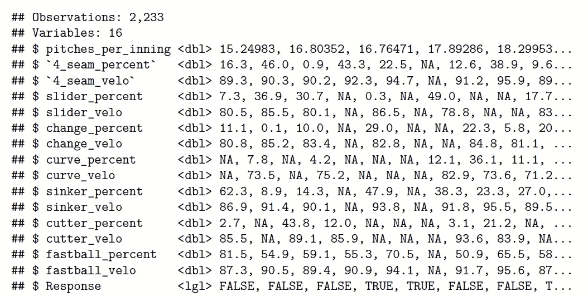

# 病例对照研究和棒球

> 原文：<https://towardsdatascience.com/does-throwing-hard-give-you-tommy-john-cbab2f153e0b?source=collection_archive---------48----------------------->

## 高速和汤米·约翰的统计探索



斯蒂芬·斯特拉斯堡只是汤米·约翰众多成功案例中的一个

目前超过四分之一的 MLB 投手进行了汤米·约翰，更正式的名称是尺骨副韧带重建手术。一些最近的受害者？纵火犯 Luis Severino，Chris Sale 和 Noah Syndergaard。


**Syndergaard 经常投 90 多分的球**(图片来自维基共享)

对于一个没有医疗经验的统计学学生来说，这个过程似乎比破译 Nats 的世界大赛标志更难。实质上，外科医生从身体的其他地方获取肌腱(通常是腿筋)，在有问题的手臂上钻孔，然后将移植肌腱穿过几次。抱歉，我曲解了你的解释。

奇迹般地，手术几乎成了常规。恢复率估计为 80-90 %,大多数投手继续领导漫长的职业生涯。相反，大多数棒球运动员仍在试图找出 ***为什么*** 这种情况一直发生。为什么手肘一直爆，为什么越来越年轻？

**普遍共识是过度使用**；运动员招募发生在生命的早期，孩子们被鼓励更努力地投掷，淡季是失败者的。也有许多生物力学的解释，说明某些投球类型，如滑球，如果投得太年轻会有危险。

我着手解决这个解释的一小部分，即:

1.  **更高的俯仰速度会增加汤米·约翰的可能性吗？**
2.  **某些球场类型会增加汤米·约翰的可能性吗？**

为了简洁起见，我将从此把这个手术称为“TJ”。

# 方法

我在 MLB 的投手中进行了一项**病例对照研究**，病例组是接受过 TJ 的投手，对照组是没有接受 TJ 的投手。

投手总数因数据可访问性而异；例如，关于快速球使用的更细粒度的数据只从 2017-19 年开始提供，因此某些模型只考虑了这些年。我会在必要的地方阐明选择方法。

## 病例对照研究快速入门

对于那些不熟悉的人，病例对照研究试图确定建议的风险属性和观察到的条件之间的**关系(对我们来说，这个观察到的条件将是 TJ)。**

这是通过考虑仅在条件状态上不同的两个组来完成的，一个组有条件，一个组没有条件。然后，通过风险属性的水平(例如，俯仰速度、滑动百分比)对这两组进行比较，并计算比值比。

比值比表明，在风险属性增加的情况下，出现病例情况的机会增加。请注意，如果属性不是定量的而是定性的，例如，惯用手，级别将被转换为属性的普遍性。

**TL；【T2 博士】我们正在比较有 TJ 和没有 TJ 的投手的速度和投球类型，希望在这个过程中找到一些有意义的东西。从病例对照研究中计算出的优势比也有助于我们*量化*速度对 TJ 可能性的影响。否则，仅仅知道 TJ 投手投得更努力并不能揭示太多。**

# 数据

我使用了 3 个来源:[来自 Brook 棒球的 PITCHf/x](http://www.brooksbaseball.net/pfxVB/pfx.php)、[棒球专家](https://baseballsavant.mlb.com/)和 Jon Roegele 的极其[有史以来每个 Tommy John 手术的极有帮助的列表](https://docs.google.com/spreadsheets/d/1gQujXQQGOVNaiuwSN680Hq-FDVsCwvN-3AazykOBON0/edit#gid=0)。

# 分析

## **第 1 部分:更高的俯仰速度会增加汤米·约翰的可能性吗？**

我首先使用以下参数从 Brooks 收集 PITCHf/x 数据:

*   2007–2019 赛季(从数据开始算起)
*   所有音高类型的平均速度
*   首发和替补队员
*   至少投出 200 个球(只抓住主要的联盟球员，排除位置球员)

这给了我 2001 个投手，数据如下:



这看起来不太有希望。TJ 组以较高的平均值为中心，但*几乎没有*。如果放大并使用密度，看起来会更近:



这并不意外。又不是每个投出 95+ mph 的都自动得到汤米约翰。我们继续吧。

我使用**逻辑回归**从我们的速度属性预测我们的二元响应(对 TJ 是/否)。这对应于统计模型:



Yᵢ是我们的响应变量，表示 iᵗʰ球员是否有汤米·约翰。μᵢ是 iᵗʰ球员拥有 TJ 的概率，x 是包含投球速度的模型矩阵，这是我们唯一的独立变量。因此，Xᵢβ是独立变量的线性组合。

logit 函数将二元响应变量与我们的协变量联系起来。在高层次上，我们这样做是因为线性标度更好使用，但是我们的是/否回答必须被转换以适应；因此，logit 函数！

结果如下:



我来解释一下如何解读有用的部分。

`Coefficients`指的是我们的模型，即



如果我们对实际概率或μᵢ感兴趣，我们必须提取μᵢ:



最终表达式给出了**拥有 TJ 的实际概率，或μᵢ** 。例如，我们可以计算平均速度为 95 英里/小时的投手出现 TJ 的概率:


因此，平均投球速度为 95 英里/小时意味着汤米·约翰接受手术的概率为 39.5%。

我们可以这样做来计算在一定速度下 TJ 的概率，但这并不能量化增加速度和增加 TJ 可能性之间的关系。为了提取这些信息，我们对这些`Coefficients`进行指数运算以产生优势比。

请注意，我对系数的 ***置信区间*** 进行了指数运算，因为这比特定的点估计更好地反映了可能值的范围。

```
>>> exp(confint(brooks_glm)) 2.5%   97.5%
Intercept  5.45e-05  0.0183
Velo       **1.036133  1.1062**
```

我们将保持`Intercept`和`Velo`作为我们指数化变量的名称，给我们以下赔率等式:



这与线性回归不同，在线性回归中，当变量值改变时，我们**添加**系数。取而代之的是，当变量值改变时，现有的赔率被**乘以**可变系数。

因此，如果一个变量的系数是 1 ，那么这个变量对响应没有影响，因为我们将现有的值乘以 1。请注意，我们使用的是置信区间，因此包含 1 的范围实际上使我们的变量变得无用。

要点如下:如果系数**的置信区间包含 1** ，我们可以认为该变量**对响应**没有影响。

从输出的最后一行(上面加粗的部分)，我们看到平均俯仰速度增加 1mph 相当于将 TJ 的现有几率乘以 1.036 到 1.106 之间的值。这可以解释为:

> 每增加一英里/小时，患 TJ 的几率增加 3.6-10.6%。

我重复了这个练习，但是专注于平均四缝线快速球速度，而不是所有球路的平均速度。

```
>>> exp(confint(brooks_glm_4seam)) 2.5%   97.5%
Intercept  1.1e-5   0.026
Velo       **1.0313   1.121**
```

使用同样的解释过程，我们可以看到**四缝线快速球速度每增加一英里/小时，TJ 的几率增加 3.1–12%**，与我们之前的发现非常相似。

## 某些音高类型会增加汤米·约翰的可能性吗？

速度的增加似乎增加了汤米·约翰的胜算，但是对于某些类型的投球来说也是这样吗？在[棒球专家](https://baseballsavant.mlb.com/)上可以很容易地获得细分球场使用情况的数据，但仅限于 2017-2019 年；因此，本部分的结论仅来自这三个季节。

为了澄清，投球使用数据是以百分比的形式给出的，表示由某种投球类型(如快速球)构成的总投球数的百分比。

我分别研究了快速球、滑球、变速球和切球，以分离每种球种的效果。我也考虑了每种投球类型的平均速度，例如在同一模型中包括快速球的使用*和*速度。

以下是已清理数据集的一瞥:



每一列对应一个玩家的统计；第一位投手以 89.3 英里/小时的平均速度在 16.3%的时间里投出了他们的 4 缝线球，以 80.5 英里/小时的平均速度在 7.3%的时间里投出了他们的滑球，以此类推。(我也研究了每局的投球数，但结果并不显著)

然后，我以 TJ 状态作为反应进行了一项类似的病例对照研究，同时考虑了音高使用和速度。注意，同样的解释成立:如果置信区间包含 1，我们将认为它没有影响——为了便于阅读，我将这些区间加粗。

## **快速球**

```
>>> exp(confint(fastball_glm))

                 2.5%  97.5%
Intercept       0.001  0.095
fastball_usage  **0.986  1.001**
fastball_velo   1.020  1.096
```

看来**快速球的使用并不影响 TJ 可能性，**因为它的置信区间包含 1。这意味着快速球使用率每增加一个百分点，现有的 TJ 赔率就会乘以一个很可能是 1 的值，因此没有效果。

然而，**快球速度**增加 1 英里/小时，似乎**增加了 TJ 几率 2–9.5%**，这一发现与我们从**第一部分得出的结果一致。**由于仅考虑 2017-19 年数据，具体百分比有所不同。

## **滑块**

```
>>> exp(confint(slider_glm))

               2.5%  97.5%
Intercept     0.001  0.084
slider_usage  **0.995  1.011**
slider_velo   1.018  1.095
```

类似地，滑块使用的**置信区间包含 1** ，意味着它**不影响 TJ 可能性**。然而，滑块速度每增加 1 英里/小时，TJ 几率就会增加 1.8-9.5%。

## 变速球

```
>>> exp(confint(changeup_glm))

                 2.5%  97.5%
Intercept       0.002  0.679
changeup_usage  **0.982  1.005**
changeup_velo   **0.996  1.068**
```

变速使用和速度的置信区间都包括 1，表明**这两个属性都不影响 TJ 可能性**。这并不奇怪；变速球是低速球，理想情况下比快球慢得多，可能会减少肘部的压力。

虽然变速球以相似的「手臂速度」投出，以掩饰它们是快速球，但是很少有投手会尽全力向后仰投变速球。更难的变速球实际上可能不太受欢迎，因为它们的部分效果来自于欺骗打者提早挥棒。

如果我们的假设是真的，增加快速球的速度会增加 TJ 的胜算，变速球不影响这些胜算就说得通了。

## 倾斜节理

```
>>> exp(confint(cutter_glm))

               2.5%  97.5%
Intercept     8e-05  14.29
cutter_usage  **0.987  1.010**
cutter_velo   **0.962  1.102**
```

像变速一样，两个置信区间都包括 1，这意味着**刀具使用和速度都不会影响 TJ 可能性。**

这个有点难以解释，甚至可能表明所用统计方法的缺陷。

切割球，或切割快速球，移动起来像是快速球和滑球的混合体。这项研究更相关的方面是*如何投掷*刀具。许多投手只是简单地改变他们的四缝线快速球握拍，对球的外侧施加稍微多一点的压力，像快速球一样释放出切球。

由于释放动作类似于快速球，人们可能会期望增加切割速度来增加 TJ 的几率。我们的发现表明并非如此；一个可能的解释是交付背后的*努力*。

虽然削球像快球一样被投出，但是削球的效率来自于移动和位置，而不是速度。因此，投手可能不会像投速度依赖型快速球一样努力投出切球，这种努力可能会导致过度用力和汤米·约翰。支持这一论点的是许多投手采用切割器来抵消速度的损失，承认投球不需要高速度才能有效。

投手们明白，当涉及到切球时，用力投掷不太重要，这可能解释了其速度对 TJ 可能性的微弱影响。

# 结论


**也许，仅仅是也许，力学与此有关**(图片来自维基共享)

*   **快球速度**每增加 1 英里/小时，汤米·约翰接受手术的几率就会增加**3.6–10.6%**
*   **滑块速度**每增加 1 英里/小时，TJ 赔率就会增加**1.8–9.5%**
*   增加**变速和刀具速度并不会增加 TJ 赔率**(尽管你可能无论如何都不会想把它们扔得更重，因为高速度不一定会让这些投球更好)
*   音高的使用无关紧要

我写这份报告的目的之一是复习优势比、逻辑回归和病例对照研究。当我找到课程内容的真实应用时，我会学得更好，我非常鼓励你也这样做！

带着一份健康的盐接受这些结论——数据和方法不可否认地远非完美。例如，对我们数据的原始探索表明，逻辑回归可能不是一个理想的分类器。

不管怎样，有证据表明汤米·约翰手术和高音高速度之间有联系。这并不奇怪，但我现在更加确信了。