# 应用神经网络中的迁移学习进行犬种分类

> 原文：<https://towardsdatascience.com/dog-breed-classification-using-cnns-and-transfer-learning-e36259b29925?source=collection_archive---------20----------------------->


图片来自[乔尼·林德纳](https://pixabay.com/pt/users/Comfreak-51581/?utm_source=link-attribution&utm_medium=referral&utm_campaign=image&utm_content=2467149)由[皮克斯拜](https://pixabay.com/pt/?utm_source=link-attribution&utm_medium=referral&utm_campaign=image&utm_content=2467149)拍摄

## …还有人和狗的相似之处

这篇文章提出了使用预先训练的卷积神经网络来分类养狗。除了用于狗的狗品种分类，CNN 也用于识别与任何给定的人类图片最相似的狗品种。

本文分六个步骤介绍了该项目:

1.  数据集。
2.  OpenCV 实现了[基于 Haar 特征的级联分类器](http://docs.opencv.org/trunk/d7/d8b/tutorial_py_face_detection.html)来识别人类。
3.  为 [ImageNe](http://image-net.org/index) t 数据集预训练 [ResNet50](https://keras.io/applications/#classify-imagenet-classes-with-resnet50) 以识别狗。
4.  犬种分类的迁移学习。
5.  微调
6.  图像分类

## 缩写列表:

FC 层:全连接层
Conv。层:卷积层

## 数据集

Udacity 提供的数据集相对较小。它包含了 8351 张狗的图片，来自 133 个可能的狗品种类别，大约每个类别 63 张。数据集分割如下:

*   训练集的 6680 幅图像；
*   835 幅图像用于验证集；
*   测试集的 836 幅图像。

提供另一个具有 100 个图像的数据集来测试预训练的人类标识符。

## 1.用于人体识别的 OpenCV

[OpenCV](https://opencv.org/) 库在 [GitHub](https://github.com/opencv/opencv/tree/master/data/haarcascades) 库中提供了许多预先训练好的人脸检测器。对于这个项目，我们将[Haar scades](https://github.com/opencv/opencv/tree/master/data/haarcascades)用于[正面人脸检测器](https://github.com/opencv/opencv/blob/master/data/haarcascades/haarcascade_frontalface_alt.xml)。

```
# extract pre-trained face detector
model_file_name = 'haarcascades/haarcascade_frontalface_alt.xml'
face_cascade = cv2.CascadeClassifier(model_file_name)# load color (BGR) image
img = cv2.imread(human_files[83])# convert BGR image to grayscale
gray = cv2.cvtColor(img, cv2.COLOR_BGR2GRAY)# find faces in image
faces = face_cascade.detectMultiScale(gray)
```

从包含人类的 100 幅图像中，预先训练的模型可以识别所有人，100%准确。在这 100 张照片中，有三张发现了不止一张脸。这些例子如图 1 所示。在第一个例子中，只有一张脸，它被识别了两次。


**图 1** —发现多个面的情况。

当我把另一组 100 张狗的图片交给分类器时，它识别出其中 11 张是人的图片。您可以在下面的图 2 中看到其中的 9 个错误。但是，如果您看到下面的错误 1，除了狗之外，图像中还有一个人，人脸检测器正确地识别了这个人。因此，让我们认为它不是一个错误。探测器只犯了 10 个错误，而不是 11 个。

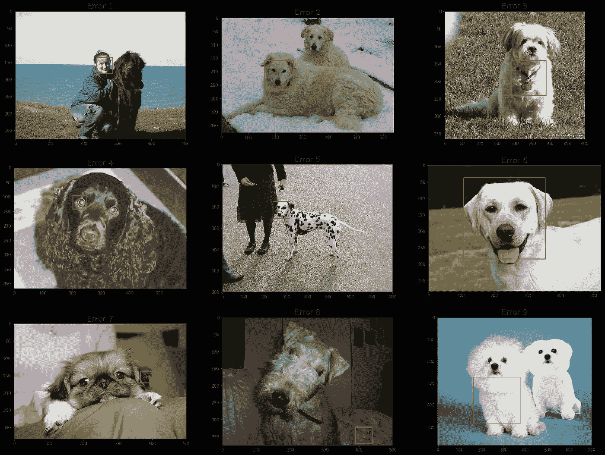

**图 2**–人脸检测器在 100 多张狗的图像中出现的 10 个错误中有 9 个错误。

人脸检测器很好地识别了人，没有假阳性。另一方面，区分狗和人不太好，它把 100 只狗中的 10 只*误归类为人类。*

## 2.预先训练 EGG16 识别狗

库 [Keras](https://keras.io/) 提供了已经在 ImageNet 数据集上训练过的 CNN 模型。该数据集包含 1000 个不同类别的图像，其中 118 个与狗有关。这意味着我们可以使用这些预训练的模型来确定一幅图像是否包含一只狗。

区分前一个分类器和下一个分类器是很重要的。第一个的目的是识别图像是否包含一个人***。接下来的目的是识别图像是否包含**狗**或*狗*。结合两个分类器，我们可以确定图像中何时有狗、人、两者或没有。***

***下面的代码展示了如何使用 Keras 中预先训练好的模型 [ResNet50](https://keras.io/applications/#classify-imagenet-classes-with-resnet50) 来确定图像中是否有狗。***

```
*# Import the ResNet model and the preprocess_input function.
from keras.applications.resnet50 import ResNet50, preprocess_input# Import the functions to load and transform images
from keras.preprocessing.image import load_img, img_to_array# Create a Redidual-network already trained in the IMAGENET
ResNet50_model = ResNet50(weights='imagenet')# Load the image in the size expected by the ResNet50_model
img = load_img('some_image.jpg', target_size=(224, 224))# Transform the image into an array
img_array = img_to_array(img)# Pre-process the image according to IMAGENET standarts
img_ready = preprocess_input(img_array)# Predicts
probs= ResNet50_model.predict(img_ready)# Find the position with the maximum probability value
position_of_max = np.argmax(probs)# Verify if the position of max corresponds to a dog class
is_dog = ((position_of_max >= 151) & (position_of_max <= 268))*
```

***Keras 提供了函数`preprocess_input`来根据 IMAGENET 数据集的分布对新图像进行规范化。该函数从图像的每个 RGB 像素中减去数据集已知的平均像素[103.939，116.779，123.68]。***

***在`ResNet50_model.predict`中进行的预测返回每个类的概率列表。对应于狗的类在 151 和 268 之间的位置，包括 151 和 268。要验证图像是否是狗，最大概率必须在 151 到 268 范围内的位置是狗，否则不是狗。***

***从包含人类的 100 张图像中，预训练的模型没有识别出它们上面的任何狗，这很棒。此外，该分类器还能够识别所有其他 100 张包含狗的图像。这个模型在这 200 张图片上没有犯任何错误。***

***此时，你可能会疑惑，为什么我们不简单地用这 118 个狗类来划分狗的品种呢？这是因为我们试图将狗分为 133 个可能的犬种类别，15 个新的类别。即使我们知道预训练 ResNet50 模型的 118 个类别中的一些与 133 个犬种类别重叠，我们仍然没有针对这些不重叠的特定类别的好的解决方案。事实上，我们有一个解决方案，它使用预训练模型中的知识，并可用于对所有 133 个狗品种进行分类。这是迁移学习。***

## ***3.用于犬种分类的迁移学习***

***幸运的是，可以使用已经在一个数据集中训练过的 CNN 来缩短在其他数据集中的训练。我们只需考虑两件事，新数据集的**大小**和新数据集与之前用于训练网络的数据集之间的**相似度**。对于这两个变量，我们有四种可能的情况，如图 3 所示。***

***当新数据集与用于训练网络的数据集相似时，我们可以保留大部分层。如果我们没有太多数据，我们可以保留几乎所有图层，只需用新图层替换输出图层，以匹配新数据集中的类数量，如图 3 的场景 1 所示。***

***如果新数据集相似，但很大，我们可以保持卷积层不变，并替换所有完全连接的层。这种情况显示在图 3 的场景 2 中。可选地，我们可以在完全连接的层中选择每层相同数量的神经元，只要我们用随机数重置这些层的权重，并证明输出的数量与数据集中的类的数量相同。***

***当我们有一个不同于模型训练数据集的新数据集时，我们不能保留所有卷积层。我们必须替换一些最后的卷积层，因为这些层提取仅与用于训练模型的数据集中的类相关的高级特征。因此，我们应该提取与新数据集中的类更相关的其他高级要素。这种情况如图 3 的场景 3 所示。我们可以保留网络的架构，在卷积层的情况下，用相同数量的滤波器创建新层，在全连接层的情况下，用相同数量的神经元创建新层。输出图层必须与新数据集中的类数量相匹配。***

***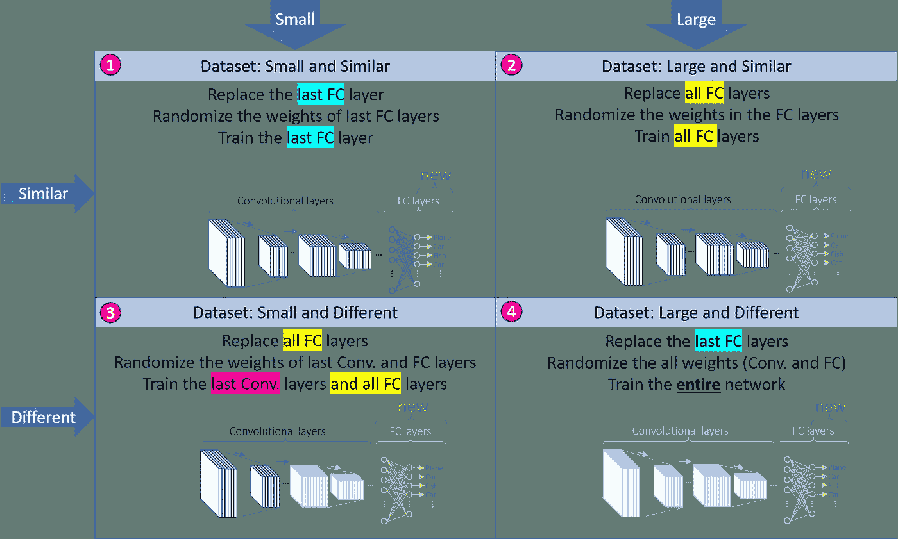***

***图 3***

***我使用了在 ImageNet 数据集上训练的 ResNet50。新的数据集类似于 ImageNet，所以训练好的模型之前已经见过狗了。此外，新数据集有 8351 幅图像，这并不算小。使用一种叫做**数据扩充**的技术，我们可以转换我们数据集中已经存在的图像，以生成稍微不同的图像。使用数据扩充，我们可以有一个大约 5 倍大的数据集。在这种情况下，我们可以使用场景 2，大型且相似的数据集。***

***为了训练新的光纤通道层，我需要用于喂养第一个光纤通道层的功能。这些特性被称为**瓶颈特性**。此名称是因为这些要素是从最后一个 Conv 图层中获得的，该图层具有最窄的要素地图。第一个 Conv 图层提取的要素地图较少，分辨率较高，而最后一个 Conv 图层提取的要素地图较多，分辨率较低。***

***我们可以通过 Conv 层预处理数据集中的所有图像，以生成瓶颈特征并将其存储到文件中，从而节省时间。为了训练网络，我们必须从文件中读取瓶颈特征，并将它们馈送到 FC 层。从文件中读取所有瓶颈特征比通过 Conv 层提交所有图像要快得多。这样，我们节省了宝贵的时间，因为所有的数据集都迭代了很多次。***

***我训练过三种不同型号的 FC 层。这些模型如图 4 所示。
**模型 A** —第一个隐藏层是 GlobalAveragePooling2D 层，后面是输出密集层。
**模型 B**-该模型在 GlobalAveragePooling2D 和输出密集图层之间添加了一个下降图层，有 50%的下降几率。
**模型 C** —此模型在输出密集层之前添加了另一个密集和丢弃层，有 50%的几率丢弃。***

******

*****图 4 —** 培训中使用的三种 FC 模型。***

***所有模型在 50 个时期内被训练(在整个数据集上 50 次迭代)。训练和验证精度和损失如图 5 所示。***

***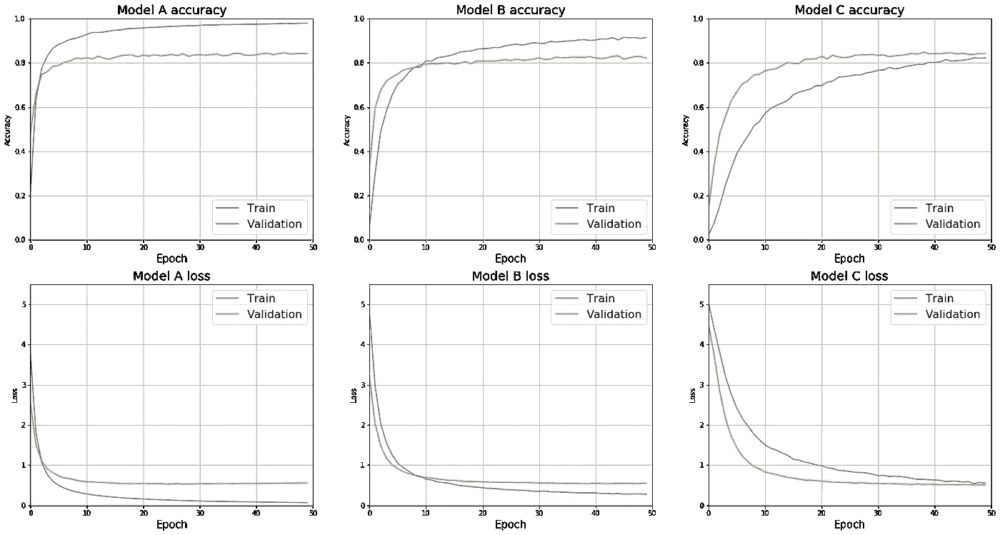***

*****图 5 —** 三种型号在 50 个周期后的性能。***

***所有模型都有非常相似的结果。模型 A 和模型 C 的准确率最高，均为 84.19%，但模型 C 的损耗稍好。迭代 50 次后的损耗和精度如下:
**模型 A** —精度:84.19%，损耗:0.5594。
**B 型** —准确率:82.16%，损耗:0.5532。
**C 型** —准确率:84.19%，损耗:0.5098。***

***注意训练和验证性能之间的差异是很重要的。模型 A 在训练中取得了非常好的结果，但是它不能被复制到验证中。这种差异是过拟合的良好信号，表明该模型在训练期间非常好，但它对以前从未见过的图像进行分类是不一致的。这表明该模型泛化能力较低。***

***模型 B 在训练和验证之间呈现更一致的结果。但是 C 型是他们中最好的。模型 C 在对以前从未见过的图像进行分类方面比对训练中使用的图像进行分类具有更好的结果。而且，C 型也做到了亏损最低。***

## ***4.用数据扩充微调 CNN***

***在上一步中，仅使用 ResNet50 中的瓶颈功能训练了 FC 层。为了微调网络，我将原来的 Conv 层连接到我刚刚训练的 FC 层，从而形成了一个完整的 CNN。***

```
*def append_resnet(fc_model):
    # Load the pre-trained Conv layers from Keras
    ResNet50_convs = ResNet50(include_top=False, weights='imagenet')

    # Create a complete CNN joining the Conv and FC layers
    Resnet50_full = Sequential()
    Resnet50_full.add(ResNet50_convs)
    Resnet50_full.add(fc_model)return Resnet50_full*
```

***训练继续进行，但是这次调整了整个 CNN 中的所有权重，而不仅仅是 FC 层。***

***在这一点上，我还使用了数据扩充来对数据集中的图像进行随机修改。数据扩充使用了以下参数:***

```
*train_datagen = ImageDataGenerator(
rotation_range=20,
width_shift_range=0.2,
height_shift_range=0.2,
shear_range=0.2,
zoom_range=0.2,
horizontal_flip=True,
fill_mode='nearest')valid_datagen = ImageDataGenerator(
rotation_range=20,
width_shift_range=0.2,
height_shift_range=0.2,
shear_range=0.2,
zoom_range=0.2,
horizontal_flip=True,
fill_mode='nearest')*
```

***在用数据扩充对三个完整的 CNN 模型进行了超过五个时期的训练之后，他们获得了下面图 6 所示的结果。***

***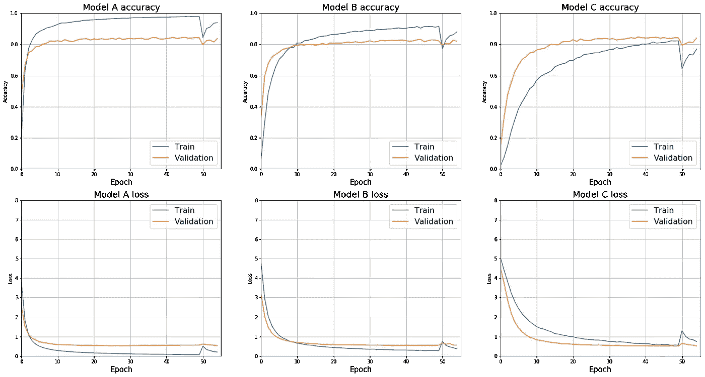***

*****图 6 —** 插入数据扩充和 5 个以上时期后三个模型的性能。***

***数据扩充的插入导致了性能的短暂下降，但是验证值在五个时期之后返回到先前的点。***

***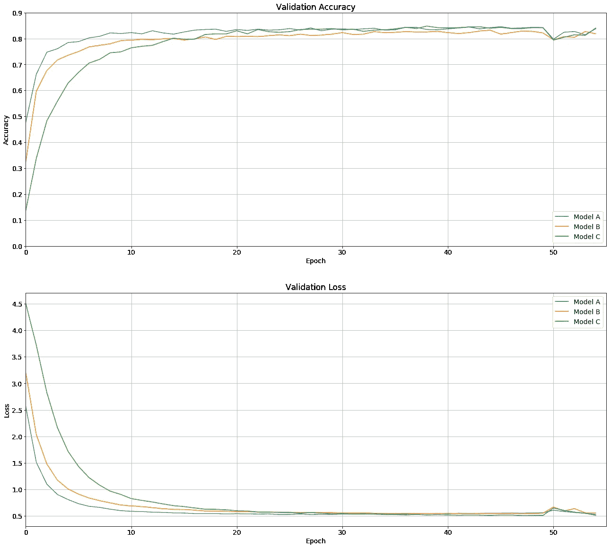***

*****图 7 —** 插入数据扩充和 5 个以上时期后三个模型的性能。***

***这三个模型实现了非常相似的结果。从图上很难看出哪个是最好的型号。我们可以在下表中看到迭代 55 次后实现的精度和损耗:***

***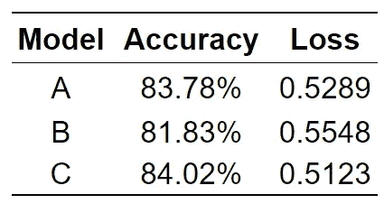***

***模型 C 提供了最好的结果，具有最高的精度和最低的损失。考虑到这个模型也提供了最好的泛化能力，我只训练了模型 C 超过 10 个时期。***

***模型 C 在测试集中的最终准确率为 86.12%，这是以前从未见过的。***

## ***图像分类***

***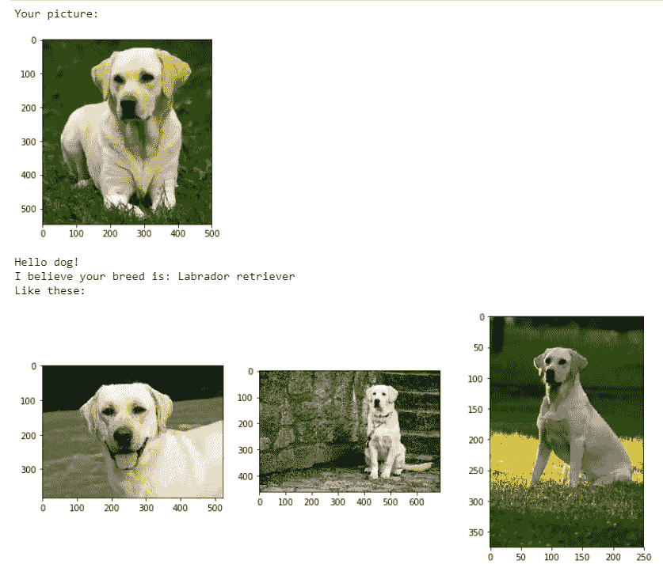******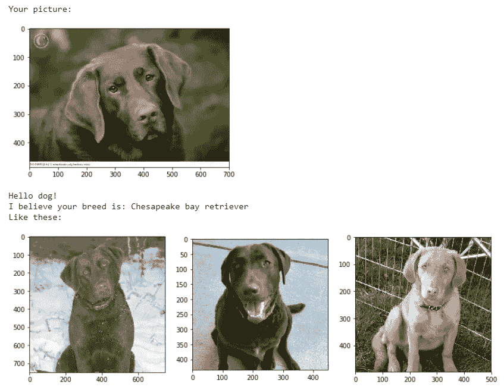******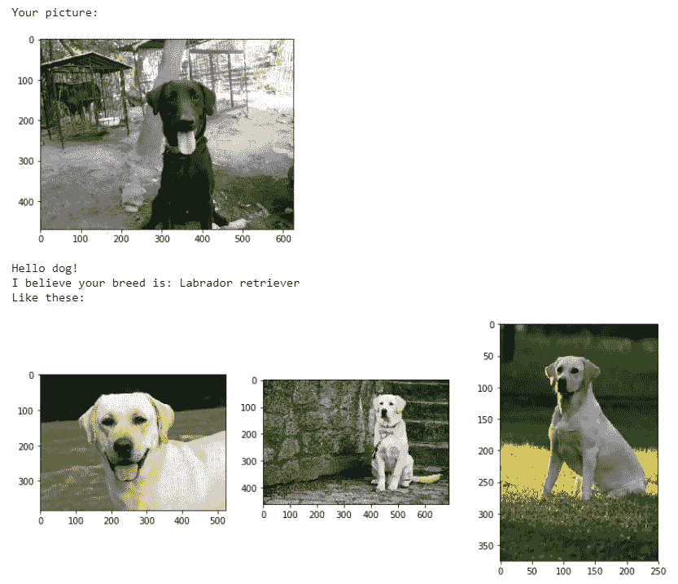******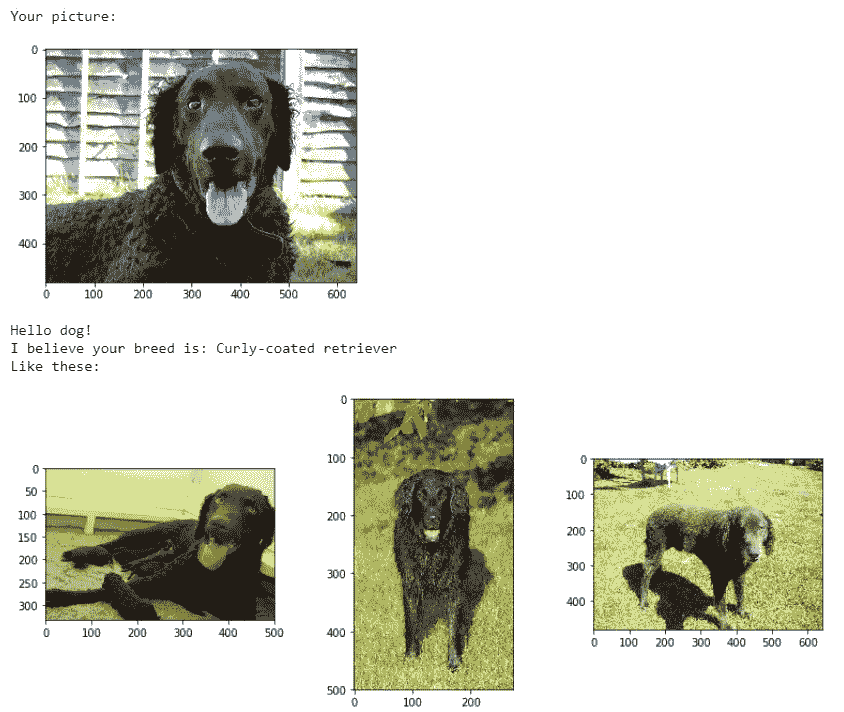******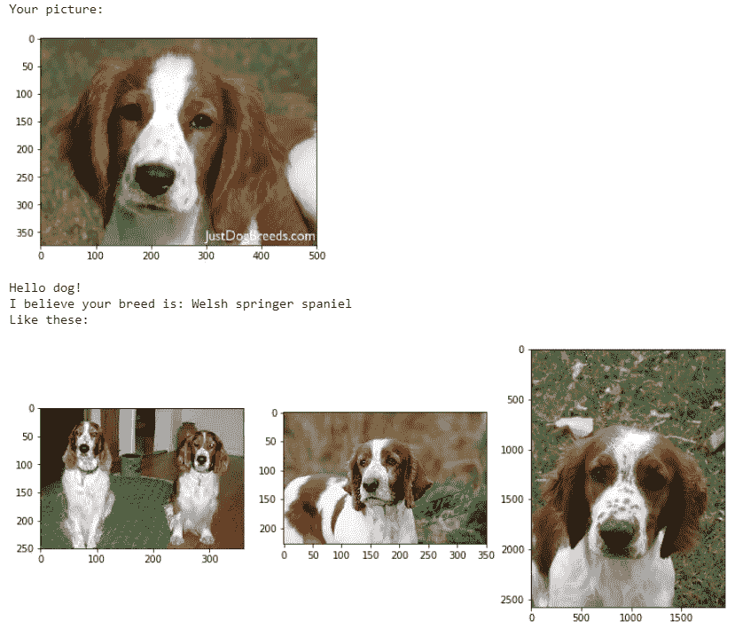******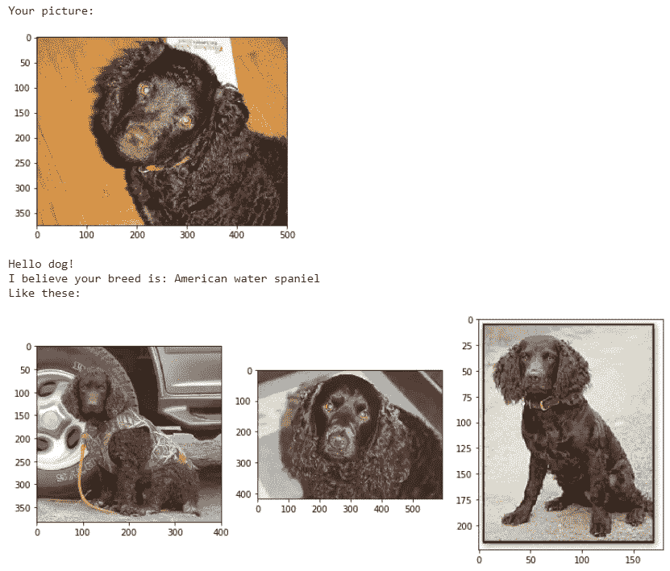******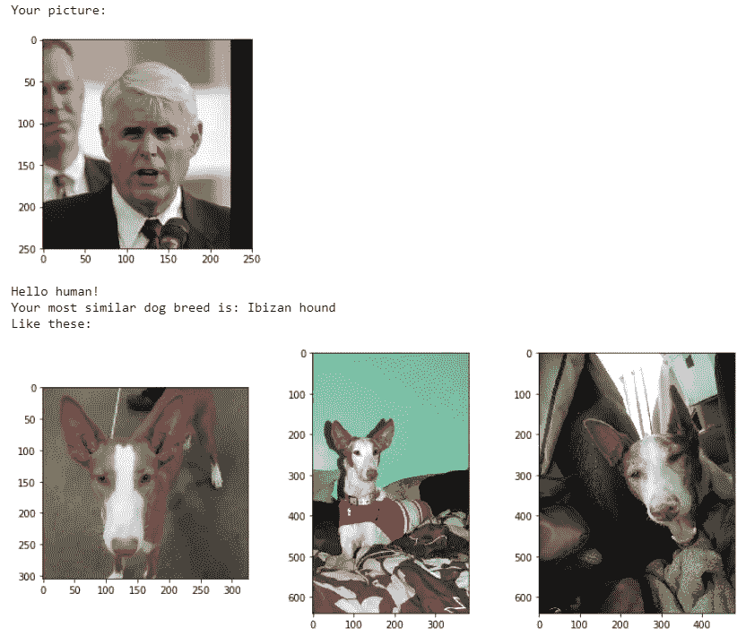******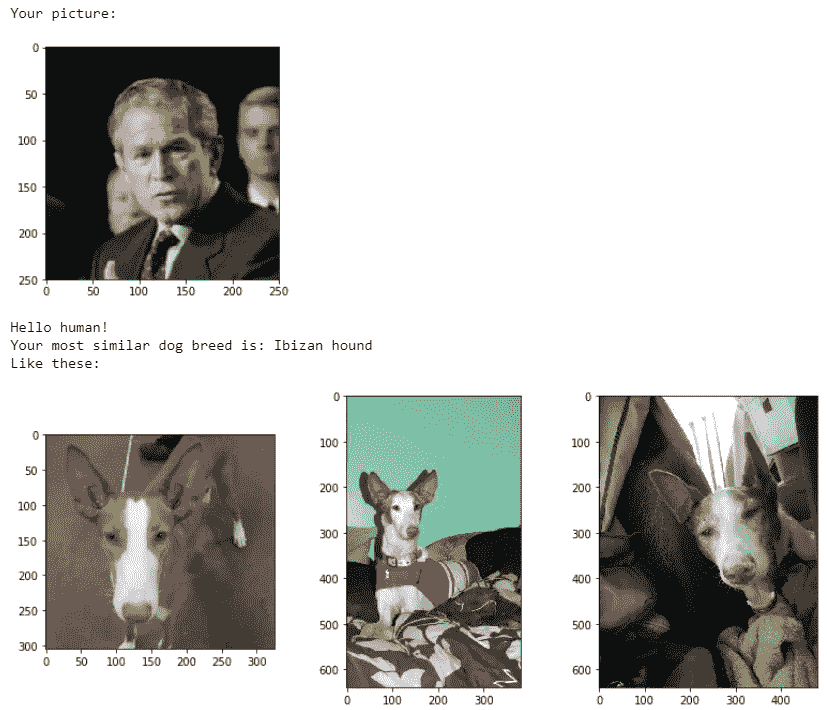******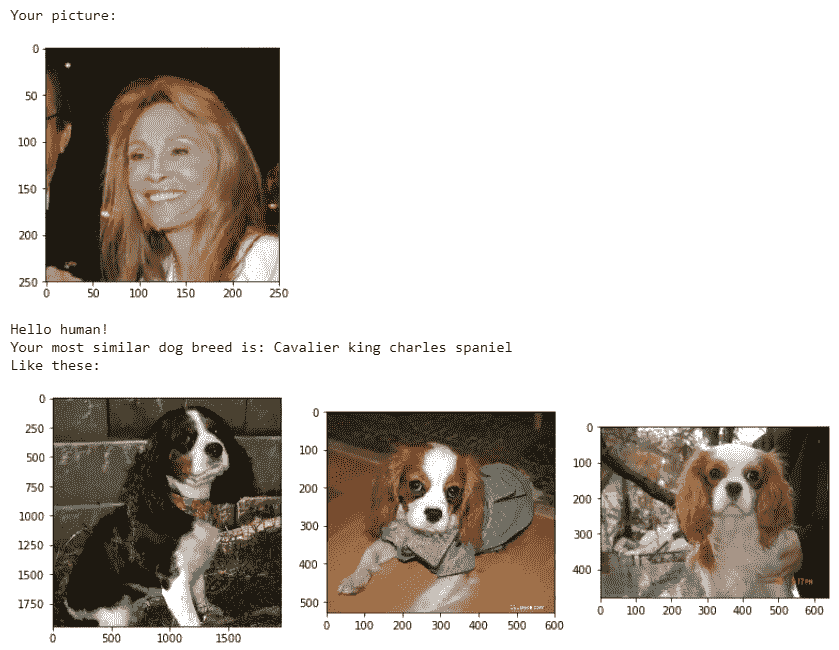******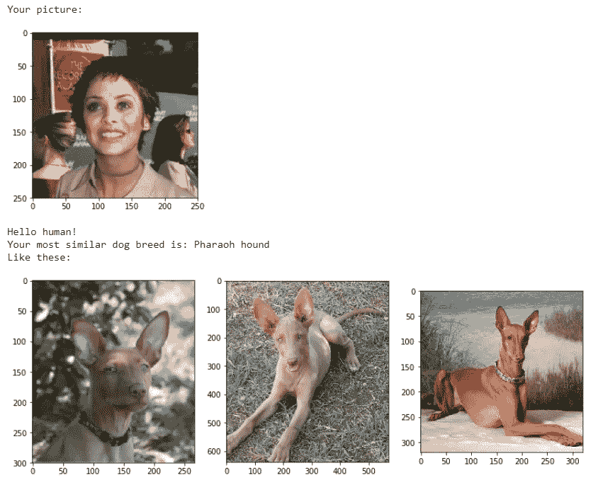******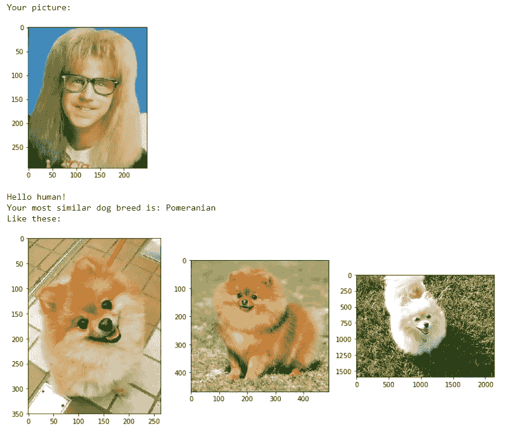***

## ***结论***

***当我们只训练完全连接的层时，提取瓶颈特征有利于节省时间。***

***FC 层中增加的漏失层提高了模型的泛化能力。此外，添加第二个密集层和另一个丢弃层，不仅提高了网络的泛化能力，而且有助于模型实现更好的分类性能。***

***声明:Udacity 可能部分提供了此处展示的部分源代码。***