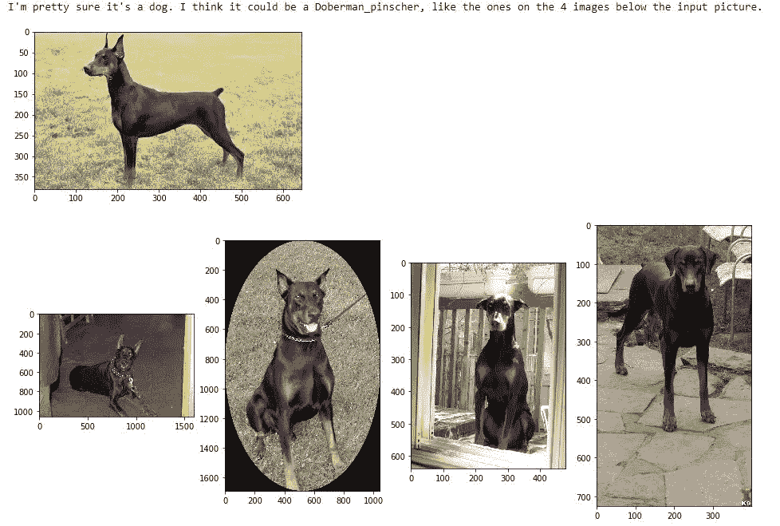

# 使用深度学习概念的狗品种分类

> 原文：<https://towardsdatascience.com/dog-breed-classification-using-deep-learning-concepts-23213d67936c?source=collection_archive---------11----------------------->

## 开发狗识别应用程序的想法

衍生作品: [Djmirko](https://commons.wikimedia.org/wiki/User:Djmirko) ( [talk](https://lizenzhinweisgenerator.de/wiki/User_talk:Djmirko) )，[黄拉拉新](https://commons.wikimedia.org/wiki/File:YellowLabradorLooking_new.jpg)，神经迁移学习， [CC BY-SA 3.0](https://creativecommons.org/licenses/by-sa/3.0/legalcode)

*这篇博文是* [*Udacity 数据科学家纳米学位计划*](https://www.udacity.com/course/data-scientist-nanodegree--nd025) *的一部分。*

## **简介**

世界犬类组织( [FCI](http://www.fci.be/en/) )目前列出了 300 多种官方认可的犬种。几千年来，人类已经成功创造了令人印象深刻的犬类表型多样性，以及它们忠实的四条腿朋友的一系列几乎不可思议的身体和行为特征。然而，除了犬学学者、养狗者和一些久经考验的爱狗人士之外，当被要求说出一只随机出现的狗的品种时，至少当它不是最受欢迎和最知名的品种如腊肠狗、德国牧羊犬或哈巴狗的代表时，大多数人都只是耸耸肩，表示无能为力。如果你是为数不多的觉得不能像犬类学家一样识别狗有点尴尬的人之一，你可能很高兴知道可能有一个技术解决方案。因为谢天谢地，深度学习和人工神经网络这一令人惊叹的领域为解决这种分类任务提供了强大的概念和方法。

在这个项目中，我们将使用深度学习概念开发狗识别应用程序的想法。该软件旨在接受任何用户提供的图像作为输入。如果在图像中检测到狗，它将提供狗的品种的估计。如果检测到人类，它将提供一个最相似的狗品种的估计。

我们的项目包括以下步骤，这些步骤将在这篇博文的后续部分详细介绍。

*   **第 0 步:导入数据集**
*   **第一步:探测人类**
*   **第二步:检测狗**
*   **第三步:创建一个 CNN 对狗的品种进行分类(从头开始)**
*   **第四步:使用 CNN 对狗的品种进行分类(使用迁移学习)**
*   **第五步:创建一个 CNN 对狗的品种进行分类(使用迁移学习)**
*   **第六步:编写你的算法**
*   **第七步:测试你的算法**

## **第 0 步:导入数据集**

显然，为了能够建立一个旨在识别狗的算法，我们需要一些“狗数据”。很多。值得庆幸的是，为了这个项目，Udacity 提供了相当数量的狗图片，包括相应的品种标签。具体地，图像数据包括 8351 幅狗图像和 133 个单独的狗品种名称。

由于该应用程序有一个额外的任务，将最相似的狗品种分配给给定的人脸，我们还需要一个人脸数据集。Udacity 提供的数据集包括来自野生数据集中[标记的人脸的 13233 张图像。](http://vis-www.cs.umass.edu/lfw/)

## **第一步:检测人类**

这似乎是狗识别应用程序开发中有点令人惊讶的一步，但它的额外工作是将最相似的狗品种分配给给定的人脸。

为了检测图像中的人脸，我们将使用 OpenCV 实现的[基于 Haar 特征的级联分类器](http://docs.opencv.org/trunk/d7/d8b/tutorial_py_face_detection.html)。该分类器的方法基于 [Haar-like features](https://en.wikipedia.org/wiki/Haar-like_feature) 的概念，由于其令人信服的计算速度而广泛应用于对象识别领域。

在实例化新的预训练分类器之后，图像被加载并转换成灰度。将分类器应用到图像中，我们得到了检测到的人脸的边界框。

使用 OpenCV 的级联分类器检测人脸的代码

以下是本项目中使用的野生数据集中的[标记人脸在通过我们的级联分类器后的几个例子:](http://vis-www.cs.umass.edu/lfw/)

图片来源:野生标签脸，[http://vis-www.cs.umass.edu/lfw/](http://vis-www.cs.umass.edu/lfw/)

评估人类探测器

现在让我们来看看分类器如何处理来自我们数据集的图片。我们将该算法应用于我们的 100 幅狗图像，并好奇探索其中分类器有趣地识别了人类内容的 12 幅图片。我们有点失望，因为在所描绘的狗的脸上几乎找不到任何奇怪和不可思议的人类特征，这些特征可能骗过了我们的算法

图片来源:Udacity 提供的狗狗图片数据集

相反，在我们的评估中使用的 100 个人类图片样本中，分类器在以下两个样本中遗漏了人脸:

图片来源:野外贴标签的脸，[http://vis-www.cs.umass.edu/lfw/](http://vis-www.cs.umass.edu/lfw/)

尽管如此，我们的分类器似乎足够可靠，可以在我们的项目中尝试一下。

## 第二步:探测狗

现在我们有了一个相当不错的算法来检测图像中的人脸，我们当然希望为狗的检测建立一个类似的功能。不幸的是，目前 OpenCV 的级联分类器没有类似的“狗检测器”。因此，我们选择了另一种方法，采用一种在 [ImageNet](http://www.image-net.org/) 的庞大图像数据库上预先训练好的图像分类模型。更具体地说，我们将使用高级深度学习 API [Keras](https://keras.io/) 来加载 ResNet-50 卷积神经网络，并通过该模型运行图像。对于一个特定的图像，网络预测总共 1000 个图像类别中每一个的概率。如果模型将最大概率分配给 118 个与狗相关的类别中的一个，我们将肯定的狗检测归因于图像。

下面的源代码列出了用于预处理图像数据并通过 ResNet-50 模型运行它们的函数。

**评估狗检测器**

ResNet-50 狗检测器在我们的图像数据集上表现如何？我们将用下面的源代码对此进行测试。

我们用我们的狗图像获得了令人信服的 100%准确性，但 Frank Solich 可能会担心唯一的狗，在人类图像数据集中发现的最具开创性的深度学习网络模型之一，在他的肖像中:

弗兰克·索利希，图片来源:野生的标签脸，[http://vis-www.cs.umass.edu/lfw/](http://vis-www.cs.umass.edu/lfw/)

## 第三步:创建一个 CNN 来分类狗的品种(从头开始)

现在，我们将进入真正有趣的部分，解决应用程序的主要任务的实现，从狗的图像中辨别正确的狗品种标签。我们可以使事情变得简单，只需使用第二步中预先训练好的模型，并预测 ImageNet 数据集类别中定义的狗品种标签。当然，构建我们自己的解决方案更令人兴奋、有趣，也更有教育意义，所以让我们开始吧！在我们开始构建自己的分类器之前，先简单介绍一下卷积神经网络。

卷积神经网络(CNN)是一类主要用于图像分析的深度神经网络。在一定程度上，卷积网络的设计受到了哺乳动物大脑处理视觉印象的方式的启发。平移不变性和共享权重最常被引用来解释 CNN 在图像分析中相对于使用其他类型的神经网络的优势。卷积网络的体系结构涉及使用多个隐藏层，这些隐藏层对其输入执行数学卷积运算。

**第一次尝试**

Udacity 提供了一个 CNN 结构的典型示例，它建议在本步骤中使用以下模型。

因此，我们有一个输入层，图像数据馈入其中，在完全连接的“密集”层产生输出之前，共有三对卷积层和池层。卷积层由一组具有一定高度和宽度的滤波器组成，而汇集层的任务是降低输入的维数。通常，每个卷积层中的滤波器数量增加，而处理数据的维数减少。因为模型的性能通常随着深度的增加而增加，所以我们在 Udacity 提出的模型中增加了两个额外的阶段。

使用 Keras 库创建模型的源代码如下所示:

在产生一个输出之前，我们插入一个额外的脱落层，它随机地去激活一些神经元。丢弃层的使用是防止训练数据过度拟合的常用正则化方法。

最后，我们的第一个模型如下图所示:

CNN 从零开始(与 [Netron](https://github.com/lutzroeder/netron) 一起策划)

现在，让我们通过网络运行我们的训练集 30 次来训练我们的模型:

让我们来看看我们的训练在每个时期取得的进步:

我们可以看到准确性几乎呈线性增长，在训练结束时，我们的训练集获得了大约 23 %的过度拟合效果，这意味着我们的验证集的准确性明显落后，但不是那么多。我们用测试数据进行的额外测试给出了 16.5 %的准确度。

还不错，但是对于一个严肃的应用程序来说肯定不够准确，所以让我们看看我们是否能做得更好。

**第二次尝试使用 AlexNet**

现在我们要用 CNN 模特界的一个真正经典来再试一次。 [AlexNet](https://en.wikipedia.org/wiki/AlexNet) 是一个 CNN 模型，它在 2012 年 ImageNet 大规模视觉识别挑战赛中远远超过了竞争对手，并引入了一些开创性的新概念，如 ReLU 激活功能和使用脱落层来防止过度拟合。该模型的一般结构如下:

AlexNet(用 [Netron](https://github.com/lutzroeder/netron) 绘制)

让我们用 Keras 库实现一个 AlexNet 模型:

与第一次尝试一样，我们通过网络运行我们的训练数据 30 次，并取得了以下进展。

所以，哇，训练集的准确性确实在接近尾声时超过了我们第一次尝试的结果，但是，天哪，验证曲线发生了什么？？？我们显然是在处理一个过度拟合的问题。

**第三次尝试。通过数据扩充解决过度拟合问题**

除了使用 dropout 层，我们可以使用另一种流行的方法来控制我们的问题。数据扩充是一种通过应用随机变换(如图像旋转、图像移动、改变图像亮度和图像翻转)来增加训练集多样性的技术。所以让我们在下一次尝试中试试这个方法:

好了，现在让我们检查一下进度历史:

是的，现在看起来好多了，即使避免过拟合问题显然是以牺牲精度水平为代价的，所以我们的测试数据集只达到了 10.9 %。但是如果我们比较我们第一次和第三次尝试的两个图的轨迹，AlexNet 似乎有一个更陡峭的曲线，并且可能很快在其他时期超过我们第一次尝试的模型。

但总的来说，使用 CNN 模型的方法，即我们从头开始构建的方法，似乎非常复杂、乏味且耗时，这需要很大的耐心和大量的计算能力。所以，下一步我们来看看更好的方法。

## **第四步:使用 CNN 对狗的品种进行分类(使用迁移学习)**

迁移学习背后的一般思想是这样一个事实，即向一个已经掌握特定领域基础知识的学科教授专业技能要容易得多。有很多神经网络模型已经专门研究图像识别，并在大量数据的基础上进行训练。我们现在的策略是利用这种预先训练好的网络，我们的计划可以概括如下:

*   找到为一般图像分类任务预先训练的网络模型
*   用预训练的权重加载模型
*   删除“模型的顶部”，即具有完全连接的层的部分，因为模型的特定任务通常由网络的这一部分来定义
*   通过预训练模型的卷积部分运行新数据。(这也被称为*特征提取*并且该步骤的输出也被称为*瓶颈特征*。)
*   创建一个新的网络来定义手头的特定任务，并用上一步的输出(瓶颈特性*)来训练它。*

正如我们马上会看到的，我们用来填充瓶颈特性的模型结构通常非常简单，因为大部分训练工作已经由预训练模型完成了。在这个项目的第 4 步中，Udacity 为这一策略提供了某种蓝图，它已经将我们的图像数据集输入到预训练的 VGG16 模型(另一个用于图像分类的 CNN 模型领域的经典模型)中，并使输出作为瓶颈特征可用，我们现在可以将其输入到一个非常简单的训练网络中，该网络基本上只包含一个全局平均池层和一个最终的密集输出层。

下面的源代码加载瓶颈特性，为我们的特定分类任务定义顶层，并用瓶颈特性训练这些新层:

同样，让我们来看看进度历史:

除了快速的训练速度之外，我们还观察到在准确性方面的显著表现，并在我们的测试数据中实现了大约 75 %的准确性，尽管这是以明显的过拟合问题为代价的。

## **第五步:创建一个 CNN 对狗的品种进行分类(使用迁移学习)**

我们现在将步骤 4 作为模板，使用迁移学习定义我们自己的 CNN。我们选择 [InceptionV3](https://keras.io/api/applications/inceptionv3/) 作为应该为我们的训练层提供特性的网络。Inception 是 ImageNet 数据集上的另一个高性能模型，它的强大之处在于，通过引入称为 *inception 模块*的子网，该网络可以设计得比其他模型更深入。

源代码看起来与步骤 4 中的代码非常相似:

为了防止我们在步骤 4 中观察到的过拟合问题，我们插入了一个额外的丢弃层，并在输出层之前添加了批量归一化。

正如我们从进度历史中看到的，我们仍然有一些过度拟合的问题，但是我们也注意到精度的另一个提高。我们的测试数据达到了 83 %的准确率。

为了使我们的模型更好，我们可以考虑以下选项:

*   使用数据扩充来防止过度拟合
*   向我们的简单训练模型添加层
*   获取更多培训数据

但是现在，我们对最近一次尝试的结果非常满意，并在接下来的步骤中将它们用于我们将要编写和测试的算法中。

## 第六步:编写你的算法

因此，现在让我们收集前面步骤中的成果和发现，并编写一个算法，该算法获取一张狗或人的图像，并吐出一个狗品种以及该特定品种的 4 个样本图像。

## **第七步:测试你的算法**

最后，让我们用一些测试图像来测试我们的算法。

杜宾犬图片来源:由 Udacity 提供的狗图片数据集

牧羊犬，图片来源:由 Udacity 提供的狗狗图片数据集

图片来源:Udacity 提供的狗狗图片数据集

**结论**

在这个项目中，我们开发了几种方法来开发识别狗品种的应用程序，并且我们通过应用迁移学习模型取得了最好的结果。我们在测试中获得了 83%的准确率。我们还学习了如何从零开始构建卷积网络，这是一项非常有教育意义的任务，尽管我们很快意识到还有更有前途的方法，特别是应用迁移学习。

然而，我们仍然看到未来进一步改进我们算法的几种选择:

*   我们可以收集更多的训练数据。
*   我们可以使用数据扩充来防止过度拟合。
*   我们可以添加更多的层，使我们的模型更复杂，希望更强大。
*   我们可以延长我们的训练时间，给训练增加更多的纪元。

但总而言之，我们测试的准确性水平，以及对特定样本图像的测试，表明我们已经有了一个可以在真实应用程序中使用的严肃模型。

这个项目的源代码是在一个 Jupyter 笔记本上用 Python 编写的，并利用了流行的深度学习库 [TensorFlow](https://www.tensorflow.org/) 和 [Keras](https://keras.io/) 。可以在对应的 [github 库](https://github.com/normannexo/dog-project)中找到。

Udacity 在这个[库](https://github.com/udacity/dog-project)中提供了一些源代码。