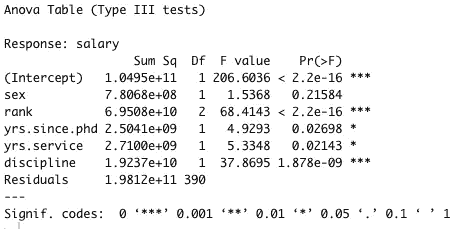
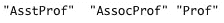
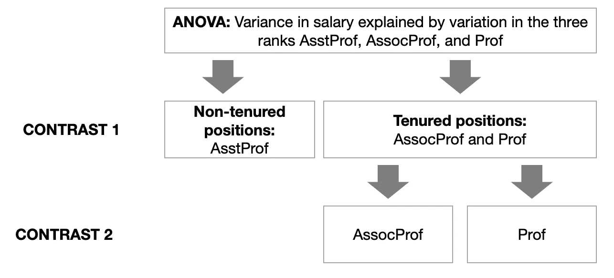
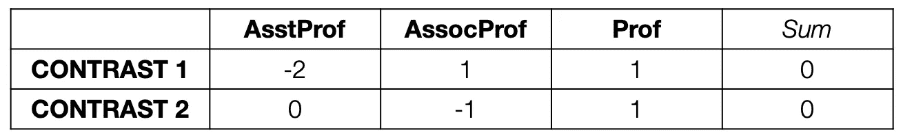
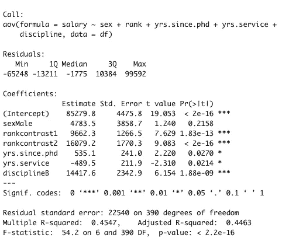

# 在 R 中做并报告你的第一次计划对比

> 原文：<https://towardsdatascience.com/doing-and-reporting-your-first-planned-contrasts-in-r-ee77ff277088?source=collection_archive---------5----------------------->

## 如何用方差分析事后检验来检验你的方向假设

这是我们很多人都面临的情况:你刚刚进行了方差分析，你的结果是显著的…但是接下来呢？我们基本上知道有些事情正在发生，但具体是什么呢？哪些治疗有所不同？

这就是有计划的对比的用武之地。它们听起来比实际更复杂，而且它们是一种灵活的统计工具，使得这种方差分析事后检验非常有效。

在我开始之前，有一个小提示:在本教程中，我将只讨论正交对比…你不需要知道这是什么意思，以防你听说过这个术语，我们正在寻找它。


丹尼尔·利维斯·佩鲁西在 [Unsplash](https://unsplash.com/s/photos/contrast?utm_source=unsplash&utm_medium=referral&utm_content=creditCopyText) 上的照片

# 加载数据集并运行方差分析

在本教程中，我们将使用薪水数据集。它包含了不同教授的工资数据。使用以下命令加载它。

```
df=Salaries
```

下一步我们将需要“car”包，所以如果您还没有安装这个包，请使用下面的命令安装它。如果您不确定是否已经安装了这个包，只需运行这个命令。

```
install.packages("car")
```

现在，我们想做的方差分析是看教授的排名对他们的工资有没有影响。我们还想考虑所有其他直观的重要变量…从技术上讲，这是一个协方差。我们运行下面的命令来获得输出。

```
library(car)aov1 = aov(salary ~ sex + rank + yrs.since.phd + yrs.service + discipline, df)Anova(aov1 ,type="III")
```

这会产生以下结果。



所以我们可以看到等级确实影响教授的薪水。但是具体怎么做呢？有计划的对比可以帮助我们找到更多这方面的信息。然而，有计划的对比需要你真正理解你感兴趣的自变量。

# 设置计划对比度

我们先来看利息这个自变量。“等级”包含什么。为此，运行以下命令来查看“rank”的级别

```
levels(df$rank)
```

这将产生以下输出。



在美国…这是一个美国的数据集…助理教授和副教授之间有很大的区别。副教授是教师的一部分，通常是终身教授。助理教授不是教师的一部分，通常也不是终身教授。有计划的对比可以帮助我们回答的一个问题是，“成为副教授对教授的薪水重要，还是成为教师的一部分重要？”…你看到我们在这里做什么了吗？我们正在使用数据中的隐含信息，以新的方式对我们的级别进行分组，并揭示关于该效果的真正潜在驱动因素的更多信息。基本上，我们在说…“我们知道有三个级别，但是我们如何将这些级别分组以揭示更多信息？”—我们正在对比各组数据。

在这种情况下，你通常会进行两种有计划的对比:首先，你会想看看成为教员是否会有所不同。第二，你会想看看教员之间的差异是否会产生影响。下面是我们试图实现的目标的图示。



我们借助使用特定符号的正交对比将这一点传达给 R。符号由四条规则组成:

*   我们将零(0)用于从对比中排除的组。
*   我们对治疗组使用负值(<0) for the baseline group.
*   We use positive values (> 0)。
*   每个对比度中处理值的总和必须为零(0)。

这听起来并不容易，但是一旦你看到这个例子是如何进行的，就非常简单了。示意图中的对比将以如下方式传达给 R:



**对比 1:** 在第一个对比中，我们将 *AssocProf* 和 *Prof* 归为治疗状态。因此，它们都被赋予一个正值。为了简单起见，我们选择一个较低的值(1)。由于 *AssistProf* 现在是基线，需要为负，并且总对比度 1 需要加起来为零(0)，我们需要将其赋值为 a -2。

对比 2: 在第二个对比中，我们只想看看终身职位之间的差异是否会影响薪酬。因此，我们通过将*赋值为 0 来排除*asst prof。我们选择将 *Prof* 作为治疗条件，将 *AssocProf* 作为基线条件……我们也可以将两者互换，但是方向的改变是危险的，因为当我们后来解释结果时可能会忘记它们。为了简单起见，我们保持方向不变(治疗是更高级的条件)。同样，为了简单起见，我们再次选择低值，并将处理条件 *Prof* 指定为 1。因此，基线条件 *AssocProf* 必须为 a -1，因为总对比度需要加起来为 0。

这正是我们向 r 传达指定对比的方式。

```
contrast1 = c(-2,1,1)
contrast2 = c(0,-1,1)
```

然后，我们告诉 R 将这些对比分配给数据集 *df* 中的变量 *rank* 。

```
contrasts(df$rank) = cbind(contrast1, contrast2)
```

为了检查对比度的分配是否正确，我们可以重复 contrast()命令，看看它们现在是如何保存在 r 中的。

```
contrasts(df$rank)
```


正如我们所看到的，它们已经被正确地实现了。所以现在我们可以继续分析了。

# 分析、解释和报告计划对比

我们通过重新运行之前运行的 ANOVA 命令来分析我们的对比。但是，因为现在 R 以对比的形式拥有了更多关于变量 *rank* 结构的信息，所以输出会有所不同。

```
aov1 = aov(salary ~ sex + rank + yrs.since.phd + yrs.service + discipline, df)
```

这一次，我们不想以 ANOVA 输出的形式访问信息，而是以回归输出的形式访问信息。因此，我们使用 *summary.lm* 命令来请求输出。

```
summary.lm(aov1)
```



可以看到，R 现在产生输出，其中变量 *rank* 的级别被替换为两个对比度。这两个对比都很明显，这意味着成为终身教授会影响教授的薪水，在终身职位上的晋升也会影响。

我们将以如下方式报告这一发现:

> 方差分析显示，在控制了性别、完成博士学位后的年数、服务年数和所从事的学科后，教授的级别对他们的工资有显著影响(*F*(2390)= 68.41， *p* < .001)。使用计划对比进一步调查教授级别对其工资的影响，发现与助理教授相比，成为教员(副教授或正教授)与工资显著增加有关， *t* (390) = 7.64， *p* < .001(双尾)，而一旦成为教员，成为正教授而不是副教授与进一步增加有关， *t* (390) = 9.08，【T20