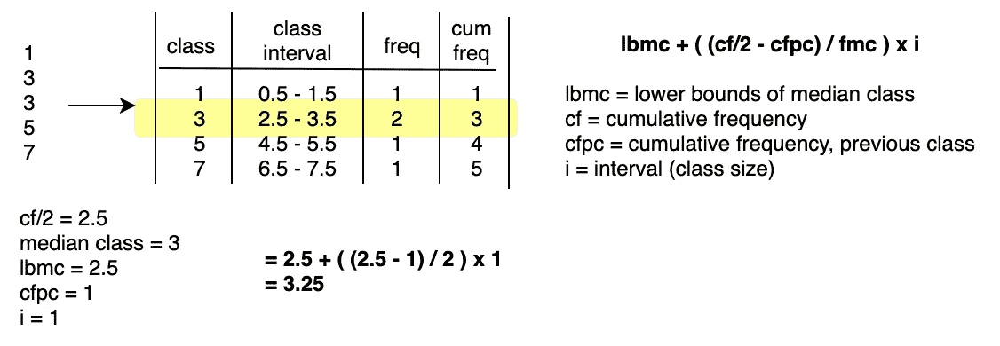
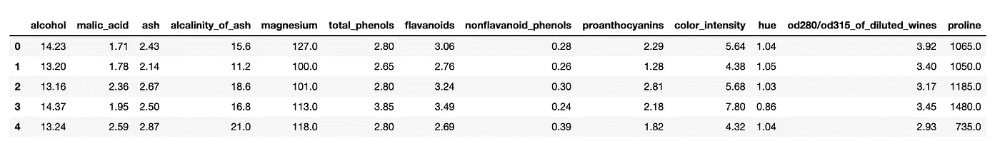
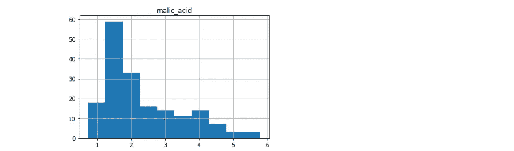
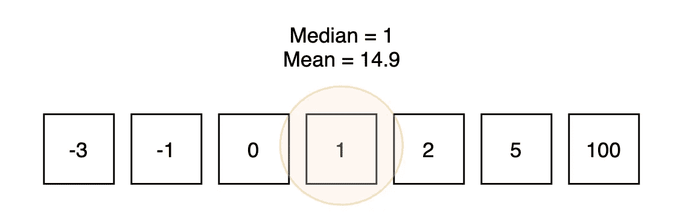
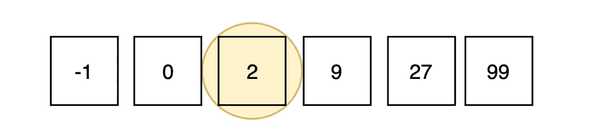
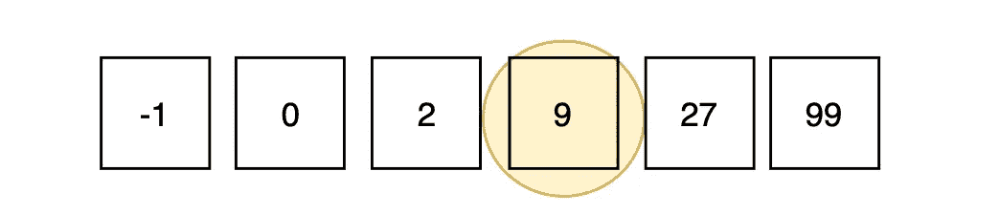
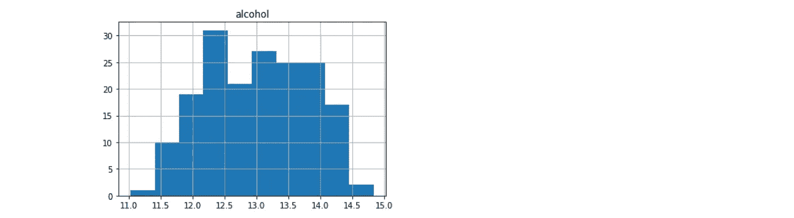

# 使用 Python 的内置统计库进行数据科学研究

> 原文：<https://towardsdatascience.com/doing-data-science-with-pythons-built-in-statistics-library-72cfb2663074?source=collection_archive---------43----------------------->

## python 内置统计库之旅



手动计算组中值

让代码在本地运行，然后看着它在生产中失败，这是我们都能体会到的。尤其是当生产环境不完全在我们的控制之下时(例如:AWS Lambdas，Elastic Beanstalk…)。

出于这个原因，我相信除非必要，否则不要引入依赖。如果一个标准的库可以实现一个结果，就没有必要引入一些花哨的东西。

虽然大多数数据科学家都热衷于 Scipy，但 Python 在其标准库中包含了许多统计函数。问题是这是否足够。

让我们浏览一下 Python 的标准统计库。我们将导入一个数据集来使用，然后遍历`statistics`中的函数。

# 设置

导入统计库本身。

```
import statistics
```

然后导入我们将要使用的数据集，并将其放入数据帧中。数据帧与`statistics`无关，但让我们更容易看到。

导入 sklearn 的葡萄酒数据集。

```
import pandas as pdfrom sklearn.datasets import load_wine
dataset = load_wine()df = pd.DataFrame(dataset['data'], columns=dataset['feature_names'])
df.head()
```



# 功能

## 平均

算术平均值。一个集合中值的总和，除以该集合中值的个数。虽然它是最广为人知的，但它只是一套价值观中心的一个衡量标准。

如果数据不平衡，也可能会产生很大的误导。例如，让我们比较“苹果酸”在数据集中的分布及其平均值。

```
round(
    statistics.mean(df.malic_acid),2
)
#=> 2.34
```



df.hist('苹果酸')

请注意平均值是如何被高端的一些异常值向上倾斜的。

## 调和平均值

思考调和平均值的一种快捷方式是将其视为保守平均值，为较低的输入值赋予额外的权重。

在评估机器学习模型时，我们一直使用调和平均值。f1 分数是精确度和召回率的调和平均值。

在精度为 0.65、召回率为 0.8 的模型评估场景中，我们可以使用`harmonic_mean`来计算 f1 分数。

```
precision = 0.65
recall = 0.8round(
    statistics.harmonic_mean([precision, recall]),2
)
#=> 0.72
```

也就是说，如果我们一开始没有使用 sklearn，我们就必须编写自己的函数来计算精度和召回。

## 中位数

中位数是一组有序数据的中间值。



中位数很有趣，因为它不会因为一个集合中的几个大值或小值而向上倾斜。由于这个原因，我一直认为除了算术平均值之外，看一下也是很重要的。

Median 返回具有奇数个值的集合的中间数，如果该集合具有偶数个值，则取两个中间值的平均值。

```
li = [-3,-1,0,1,2,5,100]
statistics.median(li)
#=> 1li2 = [-3,-1,0,1,2,5,100,101]
statistics.median(li2)
#=> 1.5
```

让我们再来看看“苹果酸”,这样我们就能看出平均值和中间值的区别。

```
round(
    statistics.median(df.malic_acid), 2
)
#=> 1.87
```

作为参考，平均值为 2.34。

## 中值下限



几乎与中位数完全相同，但如果集合中的值为奇数，则采用中间较低的数字。

## 中值高



如果集合有奇数个值，则取中间较高的数。

## 中位数分组

查找连续类的中值，其中每个类的宽度等于间隔的大小(默认情况下为`interval=1`)。


下面的例子用手来说明。

我在上面举例说明了一个对应于我们在下面使用的函数的数据。

```
statistics.median_grouped([1, 3, 3, 5, 7], interval=1)
#=> 3.25
```

请注意，使用该函数比我们自己计算要容易得多。

## 方式

返回集合中最频繁出现的数据点。

```
li = ['cat', 'dog', 'dog', 'fish']
statistics.mode(li)
#=> 'dog'
```

## 总体标准差

对总体中数据分布的度量。

如果数据分布很广，该值将很大，如果数据围绕一个点分组，该值将很小。它是以方差的平方根来计算的。

```
round(
    statistics.pstdev(df.alcohol),2
)
#=> 0.81
```

0.81 告诉我们数据高度集中。如果我们把它形象化成柱状图，看到酒精浓度完全在 11 到 15 之间，那就更明显了。



df.hist('酒精')

## 总体方差

数据传播的另一个衡量标准。

但是请注意，报告数据的标准偏差稍微更常见，因为它与平均值更密切相关。

```
round(
    statistics.pvariance(df.alcohol),2
)
#=> 0.66
```

## 样品标准偏差

除了我们使用`n-1`而不是`N`作为分母之外，它的计算几乎与总体标准差完全相同。可汗学院有一个很棒的视频介绍我们为什么要这么做，这里是。

我们在计算样本而不是总体的标准差时使用这个。

```
round(
    statistics.stdev(df.alcohol[:10]),2
)
#=> 0.58
```

## 采样离散

我们计算样本而不是总体的方差。`n-1` vs `N`在这里同样适用。

```
round(
    statistics.variance(df.alcohol[:10]),2
)
#=> 0.33
```

# 结论

我们在`statistics`中有一些有用的函数，但是很明显`numpy`和`pandas`把它打得落花流水。也就是说，理解 Python 开箱即用的能力并没有坏处。

不是每个计算统计数据的人都在做数据科学，对于一个应用程序来说，均值和标准差可能已经足够了。

也就是说，Python 3.8 增加了一些我没有在这里介绍的新功能，所以谁知道他们将来会增加什么。