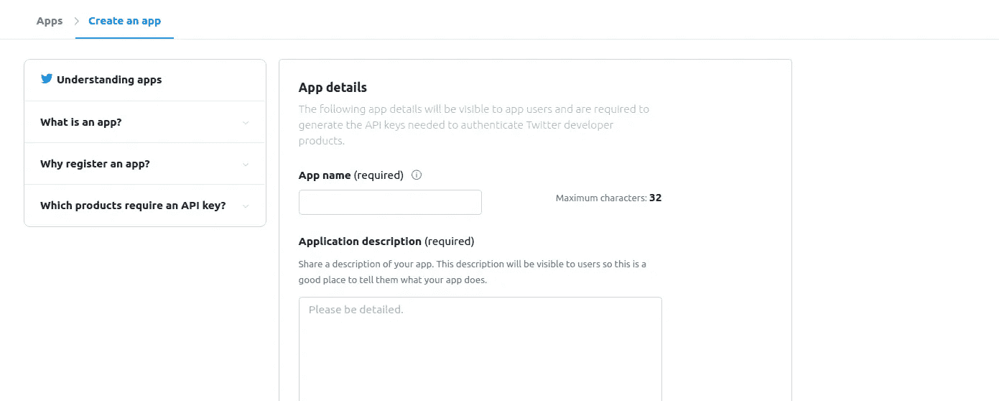
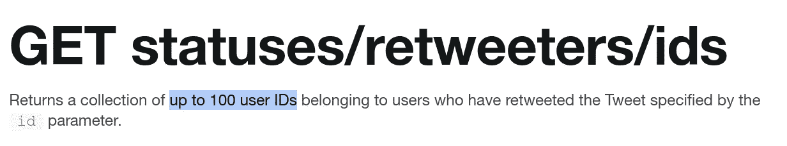
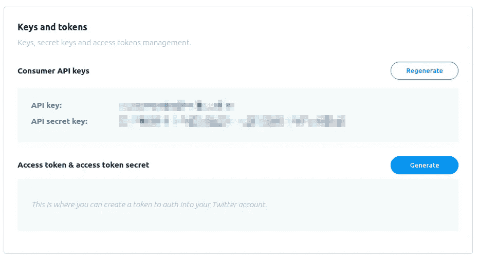
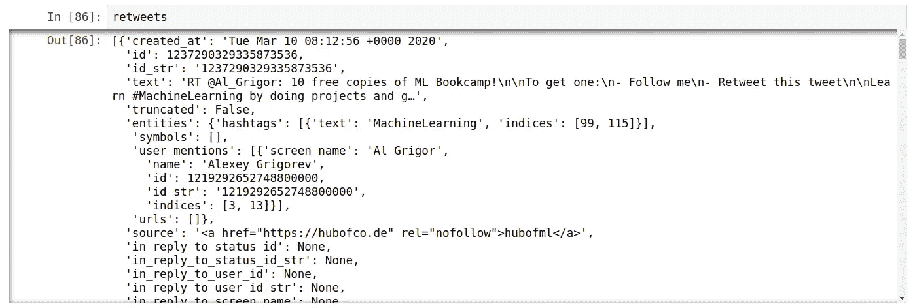
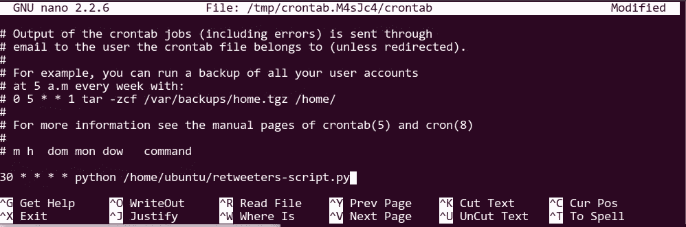
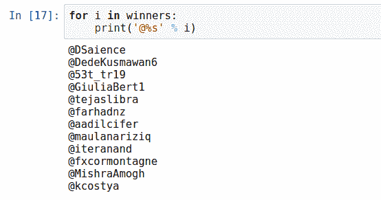

# 在 Twitter 上做赠品

> 原文：<https://towardsdatascience.com/doing-giveaways-on-twitter-a5adc02d1ac0?source=collection_archive---------35----------------------->

## 使用 Twitter API 和 Python 随机绘制转发者


[澳门图片社](https://unsplash.com/@macauphotoagency?utm_source=unsplash&utm_medium=referral&utm_content=creditCopyText)在 [Unsplash](https://unsplash.com/s/photos/gambling?utm_source=unsplash&utm_medium=referral&utm_content=creditCopyText) 上拍摄的照片

Twitter 是一个分享内容和进行推广的绝佳平台。我已经用它发了几次我的书——《T4——机器学习图书营》。在这篇文章中，我将告诉你我是如何做到的，以及如何使用 Python 和 Twitter API 来简化这个过程。

特别是，这个职位包括:

*   在 Twitter 上做赠品
*   使用 Twitter API 获取转发推文的人的列表
*   计划作业
*   随机抽取获奖者

我们开始吧。

# 赠品活动

这个想法很简单:你免费赠送一些东西。这是你的追随者可能会喜欢的东西。例如，它可以是一本书或一门课程。

为了得到它，参与者需要转发它——有时，还需要关注你。

一个免费推文的例子

这是吸引新粉丝和传播你的作品的好方法。就我而言，我想让更多的人知道机器学习图书营——我目前正在写的这本书。

管理此类赠品活动的最简单方法是使用 Twitter API，并以编程方式处理所有事情。

# Twitter 开发者 API


Twitter 开发者 API——运行赠品的最简单方式

要使用 Twitter API，您需要注册一个应用程序。打开[https://developer.twitter.com](https://developer.twitter.com/)，登录进入[应用页面](https://developer.twitter.com/en/apps)。到达后，点击“创建应用程序”按钮。

然后按照说明去做，这很简单。



要创建应用程序，只需按照说明进行操作

点击“创建”按钮后，就可以开始了。

要获得转发者列表，我们只需对[status/retweeters/ids](https://developer.twitter.com/en/docs/tweets/post-and-engage/api-reference/get-statuses-retweeters-ids)进行 API 调用。

有了这些，接下来的步骤似乎就简单了:

*   创建推文
*   让比赛持续几天
*   使用 API 获取转发者列表
*   随机抽取获胜者
*   通过 DM 向获奖者表示祝贺

不幸的是，获得转发者名单并不像看起来那么容易。让我们来看看为什么和如何真正做到这一点。

# 获得转发

上面的算法有一个问题:使用 API 只能得到最后 100 个转发者。[不更](https://twittercommunity.com/t/paging-is-not-possible-with-statuses-retweeters-ids-json/71298/10)。没有办法在一个请求中获得超过 100 个，也没有办法对结果进行分页以获得另外的 100 个。



不幸的是，API 只返回最后 100 个转发者

但是有一个方法可以解决它:定期点击 API 并保存结果！

因此，我们的方法如下:

*   创建推文
*   设置一个定期作业，将最后 100 个转发者保存到一个文件中
*   让比赛持续几天
*   将所有保存的结果汇总到一个列表中
*   从名单中随机抽取获胜者
*   通过 DM 向获奖者表示祝贺

接下来，我们将看到如何使用 API 来获取转发者列表。

# 使用 Python 获取转发者

现在让我们使用 Twitter API 来获取最后的转发者。我们将使用 Python 和[请求](https://requests.readthedocs.io/en/master/)库。

如果您没有请求，您可以通过运行

```
pip install requests
```

为了能够使用 API，我们首先需要进行身份验证。为此，我们需要 API 密钥和 API 秘密密钥。你可以通过应用程序的设置来获取它们。



要获取 API 密钥，请进入“应用详情”→“密钥和令牌”

一旦我们有了密钥，我们就可以使用它们进行身份验证:

```
import requestskey = '<KEY>'
secret = '<SECRET>'auth_url = '[https://api.twitter.com/oauth2/token](https://api.twitter.com/oauth2/token)'
data = {'grant_type': 'client_credentials'}
auth_resp = requests.post(auth_url, auth=(key, secret), data=data)
token = auth_resp.json()['access_token']
```

结果，我们得到一个令牌——一个我们需要包含在每个请求中的字符串。

让我们用它来获得转发者:

```
tweet_id = '1235296848627273735'url = 'https://api.twitter.com/1.1/statuses/retweets/%s.json?count=100' % tweet_idheaders = {'Authorization': 'Bearer %s' % token}
retweets_resp = requests.get(url, headers=headers)
retweets = retweets_resp.json()
```

retweets 变量包含最近 100 个 retweets 的详细信息。



结果是最后 100 个转发者的列表

回复中有很多信息，比我们需要的多得多。我们只需要每个转发者的昵称，也就是他们的 Twitter 账号。我们来摘录一下:

```
retweeters = [r['user']['screen_name'] for r in retweets]
```

现在唯一要做的就是将结果保存到一个文件中。

为了避免意外覆盖旧文件，我们需要确保我们的输出文件有一个唯一的名称。实现这一点最简单的方法是在文件名中添加当前时间戳。

让我们开始吧:

```
from time import timet = int(time())with open('results/retweeters-ids-%s-%s.txt' % (tweet_id, ts), 'w') as f_out:
    for r in retweeters:
        f_out.write(r)
        f_out.write('\n')print('done')
```

就这样——现在我们可以获得最后 100 条转发，并将结果保存到一个文件中。你可以在这里看到完整的代码。

我们将代码保存到一个文件中，并安排它定期运行。

# 安排它

因为我们只能获得一条推文的最后 100 次转发，所以我们需要定期运行这个脚本，每次都将结果保存到一个文件中。

最简单的方法是使用[Cron](https://en.wikipedia.org/wiki/Cron)——Linux 和 macOS 上可用的基于时间的任务调度程序。如果你使用 Windows，有一个类似的工具叫做“任务调度器”，你可以用它来运行周期性的任务。

让我们配置 Cron 每小时运行一次我们的作业。为此，我们将使用以下 Cron 表达式:

```
30 * * * *
```

表示[“每小时 30 分钟执行一次该命令”](https://crontab.guru/#30_*_*_*_*)。

为了调度它，我们需要向 crontab——Cron 的设置文件——添加一行。我们可以通过在终端中键入以下命令来实现:

```
crontab -e
```

现在我们添加下面一行:

```
30 * * * * python /home/ubuntu/retweeters-script.py
```



用 nano 编辑 crontab

最后，保存它并退出编辑器。如果你使用 nano 进行编辑(像我一样)，你可以按 Ctrl+X 退出。 [Vim 有点棘手。](https://stackoverflow.com/questions/11828270/how-do-i-exit-the-vim-editor)

要验证 crontab 是否已更新，请运行

```
crontab -l
```

这项工作已经安排好了，所以我们可以让竞赛进行几天。

# 随机抽取

几天过去了，比赛结束了，我们想选出获胜者。

在这段时间里，我们收集了许多带有转发者的文件，现在我们需要把它们放在一起。这很容易做到:我们只需一个接一个地加载文件，并将内容放入一个集合中:

```
from glob import globretweeter_files = sorted(glob('results/retweeters-ids-*.txt'))all_retweeters = set()for f in retweeter_files:
    with open(f, 'r') as f_in:
        retweeters = [line.strip() for line in f_in]
        all_retweeters.update(retweeters)
```

运行后，all_retweeters 包含转发您的推文的用户列表。

抽取获胜者很容易:

*   将转发者放入列表中
*   洗牌吧
*   选择顶部

让我们来实现它:

```
from random import shuffleall_retweeters = list(all_retweeters)
shuffle(all_retweeters)
winners = all_retweeters[:12]for i in winners:
    print('@%s' % i)
```



抽奖的幸运赢家

现在是宣布获胜者的时候了！

祝贺获胜者！

并开始通过直接消息发送后续步骤的信息。

我希望这篇文章对你有用。别忘了在 Twitter 上关注我的最新动态！

[](https://twitter.com/Al_Grigor) [## 阿列克谢·格里戈里耶夫

### 阿列克谢·格里戈里耶夫(@Al_Grigor)的最新推文。OLX 集团首席数据科学家。对#机器学习感兴趣…

twitter.com](https://twitter.com/Al_Grigor)