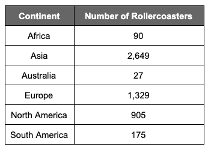

# 使用 Python 做统计作业:分析分类数据

> 原文：<https://towardsdatascience.com/doing-your-statistics-homework-with-python-part-1-b0d1f939e11?source=collection_archive---------73----------------------->

## 同时提高你的统计和编程水平。


在 [Unsplash](https://unsplash.com/s/photos/roller-coaster?utm_source=unsplash&utm_medium=referral&utm_content=creditCopyText) 上由[黄圣贤](https://unsplash.com/@augustinewong?utm_source=unsplash&utm_medium=referral&utm_content=creditCopyText)拍摄的照片

在我教学的最后一年，我同时教授三门 AP 系统课程——AP 统计学和 AP 计算机科学原理在那一年对我来说都是新的，但我在前一年已经教了 AP 计算机科学 A。我冒了一次险，花时间学习如何用 Python 做统计，试图在我的两个预科生之间建立一个重叠。最终，我得到了回报:我找到了新的激情，现在正在从事数据科学方面的职业。

这篇博客是致力于使用 Python 从头开始解决基本的 AP 风格的统计问题的一系列独立文章中的第一篇。我会尽量少用专门的库。重要的是要记住，只有部分统计管道可以(或者应该)自动化，计算特定值只是解决问题的一个步骤——解释和应用结果才是最终目标。许多学生倾向于沉迷于数字运算，以至于看不到更大的图景。通过用代码自动化计算，我们可以专注于那些计算实际上告诉我们什么。

请记住，这篇文章不是对 Python 的介绍，也不是对统计学的介绍。相反，它是一个融合两者的介绍，以增强您对两者的理解。它可以被学生、老师或自学者使用。

# 分析单个分类变量

这里有一个涉及分类变量的 AP 统计问题的例子:

## 例题:分析分类变量的分布

这是在[过山车数据库](https://rcdb.com/census.htm)中找到的过山车的全球分布



1.  根据这张表，世界上总共有多少过山车？
2.  (a)创建这些数据的相对频率表。用百分比给出你的答案，四舍五入到小数点后一位。你的百分比加起来是 100 吗？为什么或为什么不？
3.  北美或南美有百分之多少的过山车？
4.  构建这些数据的条形图和饼图。不要忘记包括标签和描述性的标题！

我们将单独解决这些问题。我们的方法将是创建一组函数，我们可以用它们来解决这种类型的问题，而不仅仅是这个问题。我们的目标不是解决这个单独的问题，而是理解看起来像这样的问题一般是如何解决的。

首先，我们需要某种对象将我们的数据与我们的级别联系起来。我们可以用两个`list`对象来完成这个任务(这绝对没有错)，但是我将利用我最喜欢的 Python 对象之一:一个`dict`。出于各种原因，字典是很好的，许多库比如`pandas`允许你在构造更复杂的对象比如`DataFrame`时传递字典。

这是我们将要使用的字典:

```
coasters = {'Africa':90, 'Asia':2649, 'Australia':27, 'Europe':1329, 'North America':905, 'South America':175}
```

特别是，我喜欢如何将`value`(频率)与`key`(大陆)直接联系起来。请记住，随着我们的进展，我们的实现将使用`dict`的方法和属性，因此如果您不熟悉这种类型的对象，您可能希望在继续之前[查看一下](https://www.w3schools.com/python/python_dictionaries.asp) `[dict](https://www.w3schools.com/python/python_dictionaries.asp)` [类型](https://www.w3schools.com/python/python_dictionaries.asp)。

在这一点上，值得检查并反复检查我的字典中的值是否正确——如果它们是正确的，这是我们唯一需要做的一次。(相比之下，你在计算器中输入一长串数字，却发现漏掉了其中一个数字。)

类似于表是如何分成左列(洲名)和右列(过山车数量)的，我们的字典很自然地把洲分成`keys`，频率分成`values`，表中的每一个“行”都是自己的键值对。

进入我们的第一个问题！

## 1.世界上总共有多少过山车？

要手动解决这个问题，我们可以查看我们的表格，将右侧列中的所有数字相加:

`90 + 2649 + 27 + 1329 + 905 + 175 = 5175`

不幸的是，这种方法不能推广到其他问题。如果给我另一个计数表，我将不得不拿出我的 TI-84 Plus(以真正的 AP 统计方式)并从头开始输入所有的数字，希望我不会出现任何打字错误或意外错过某个数字。对于这么小的数据集，这可能不是问题，但随着类别数量的增加，我用胖手指拨弄数字键盘的可能性也会增加。

相反，我们可以在 Python 中编写一个函数，该函数将接受我们的 dictionary 对象(表示上表)，并返回右列中计数的总和(由字典中的`values`表示):

```
def total_values(dictionary):
    return sum(dictionary.values())
```

现在我们可以处理任何类别在左列(我们的`keys`)而计数在右列(我们的`values`)的*表。*

让我们看看当我们将`coasters`字典传递给 total_values 函数时会得到什么:

```
print('There are', total_values(coasters), 'rollercoasters in the world.')
```

输出:`There are 5175 rollercoasters in the world.`

## 2.(a)创建这些数据的相对频率表。用百分比给出你的频率。

为了解决这个问题，我们需要做以下事情:

1.  计算世界上过山车的总数(幸运的是，这是问题 1)。
2.  将每个类别中的值除以世界上过山车的总数。
3.  将每个值乘以 100。
4.  将输出格式化成一个漂亮的表格。

我们已经写了一个函数来处理#1，它返回我们将在#2 中使用的值。对于#3，我想保持函数的灵活性，所以我给自己一个选项来打开和关闭百分比。我还希望能够指定精度，因为问题明确地告诉我要舍入到特定的小数位数。

```
def relative_frequencies(dictionary, percents=False, precision=1):
    total = total_values(dictionary)
    rel_freq = {} for key, value in dictionary.items():
        rel_freq[key] = value / total if percents:
        rel_freq[key] = round(rel_freq[key] * 100, precision) return rel_freq
```

首先，我们依靠我们写的函数找到`values`的`total`。接下来，我们创建一个新的字典`rel_freq`来保存相对频率。对于每个键-值对，我们将向`rel_freq`添加相同的键，但是原始的`value`除以`total`。如果`percent`已被指定为`True`，我们将这些比例转换为给定`precision`(或默认为 1)的百分比。将这种方法与必须在计算器上反复手动除法进行比较。

接下来，我们有一个函数将打印我们的相对频率表。花大量时间编写这个函数相当于通过用尺子和彩笔仔细画一个表来拖延你的统计作业所需要的繁重的智力劳动。显然，这是我今天所能做的最好的投资。

```
def display_dictionary(dictionary, title='Table Title', left_header='Category', right_header='Values'):
    max_len = max(max(len(value) for value in dictionary.keys()),  
                  len(left_header))
    spaces = {key:(max_len — len(key)) for key, value in dictionary.items()}
    header = left_header + ' '*(2 + max_len — len(left_header)) + '| '+ right_header
    bar = '-' * max(len(title), len(header))

    print(title + '\n' + bar + '\n' + header + '\n' + bar)

    for key, value in dictionary.items():
        print(key, ' '*(spaces[key]), '|', value)
```

对于问题 2 的(b)部分(查看百分比之和是否等于 100)，我们可以再次重用我们的`total_values`函数。

## 3.北美或南美有百分之多少的过山车？

为了完成这项任务，我们将创建一个函数，对列表中对应于类别的值进行求和。

```
def sum_from_list(dictionary, categories):
    return sum(dictionary[cat] for cat in categories)
```

尽管默认情况下这个函数并不完全符合我们的要求(它只是对值求和，并不返回百分比)，但是我们可以通过仔细考虑如何与它交互来回答我们的问题:

```
sum_from_list(relative_frequencies(coasters, percents=True, precision=2), ['North America', 'South America'])
```

## 4.使用你在第 2 部分中找到的相对频率，构建一个条形图和一个饼图。不要忘记包括标签和描述性的标题！

现在，使用 Python 比手工做这些真正的优势是:漂亮的图表。学习如何用 Python 制作图表实际上是引导我发现`matplotlib`并打开数据科学大门的原因，所以这个函数在我心中占有特殊的位置。

我们将在一个`Axes`(1 行，2 列)排列的`Figure`上绘制这两个图。左边的`Axes`是条形图，右边的`Axes`是饼图。深入研究每一行代码是一个值得自己发表许多博客文章的主题，所以我只展示代码，没有太多评论。特别是，我编写了这个函数来接受任何`dictionary`(假设包含频率)、图表的`title`、分类变量的名称、y 轴的标签以及频率是否应该转换为相对频率。

```
def display_bar_and_pie(dictionary, title, categorical_name, ylabel='Frequency', relative_frequency=False, percent=False):
    if relative_frequency:
        rel_freqs = relative_frequencies(dictionary)
        categories = list(rel_freqs.keys())
        values = list(rel_freqs.values())
        ylabel = 'Relative Frequency' if percent:
            ylabel += '(%)'
            values = [val * 100 for val in values] else:
        categories = list(dictionary.keys())
        values = list(dictionary.values()) # create two subplots
    fig, (ax_bar, ax_pie) = plt.subplots(nrows=1, ncols=2, figsize=(15, 5)) # create the bar chart
    ax_bar = sns.barplot(x=categories, y=values, ax=ax_bar)
    ax_bar.set_xlabel('Continent')
    ax_bar.set_xticklabels(categories, rotation=45)
    ax_bar.set_ylabel(ylabel)

    # create the pie chart
    ax_pie.pie(values, labels=categories, autopct='%1.1f')
    ax_pie.axis('equal')
    plt.suptitle(title, size=24)
    plt.show()
```

我们做到了！现在我们准备彻底上交这个问题:

```
print('1\. There are', total_values(coasters), 'rollercoasters in the world.\n')print('\n2\. a.')
display_dictionary(dictionary=relative_frequencies(coasters, percents=True, precision=2), title=’Relative Frequencies of Rollercoasters by Continent’, left_header=’Continent’, right_header=’Percent of Rollercoasters’)print('\n2\. b. The total of the percents is {}%. If this does not equal 100, it is due to rounding errors.\n'.format(
    total_percents(relative_frequencies(coasters, percents=True, precision=2))))print('\n3\. {:.1f}% of rollercoasters are in North America or South America.\n'.format( sum_from_list(relative_frequencies(coasters, percents=True, precision=2), ['North America', ‘South America’])))print('\n4\. Below are a bar chart and pie chart of the relative frequencies.')display_bar_and_pie(coasters, 'Rollercoasters of the World', 'Continent', relative_frequency=True, percent=True)
```

虽然编写这段代码可能比简单地手工处理数字要花更多的时间，但是我们现在有代码可以为我们解决这种类型的问题。笔记本里有一个奖金问题，可以在我的 github 上找到[。](https://github.com/danhales/stats-hw-with-python-categorical-variables)

享受你的数字运算！