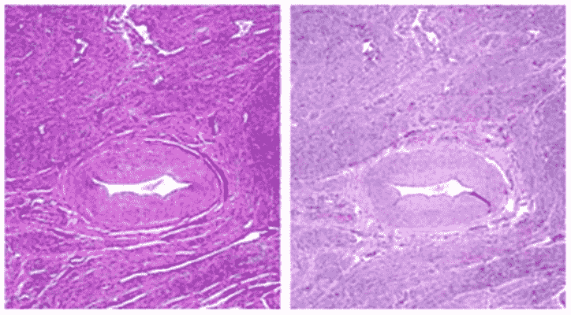
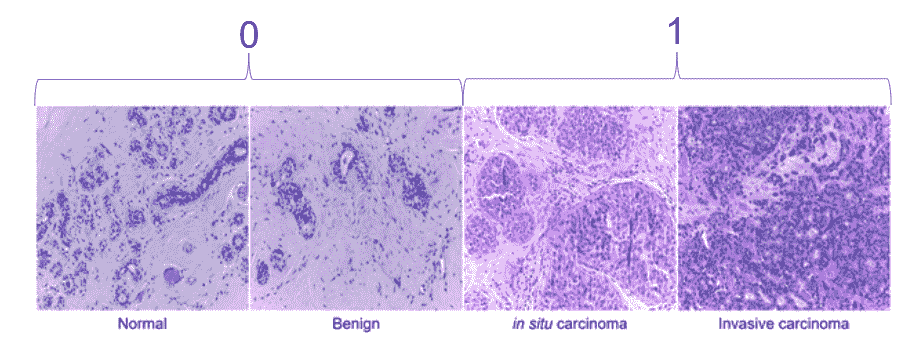
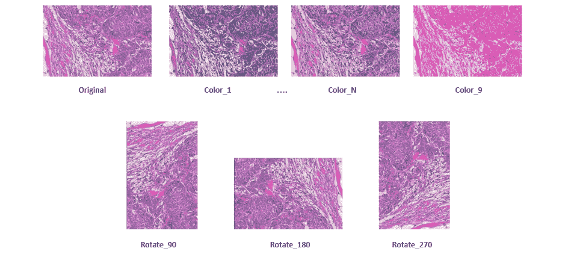
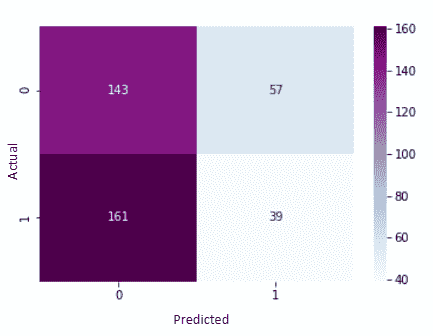
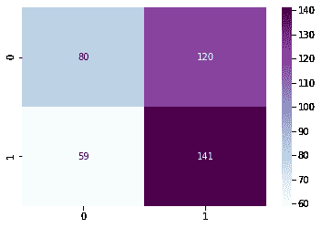
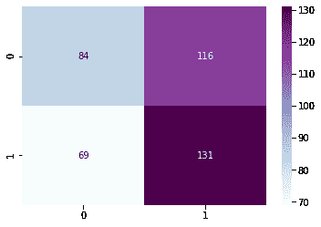

# 乳腺癌检测中的域适应

> 原文：<https://towardsdatascience.com/domain-adaptation-in-breast-cancer-detection-4d04da1bc7b?source=collection_archive---------27----------------------->

[图像来源](https://unsplash.com/photos/BOBMNKVry0Q)

## 探索 CNN 图像分类在整个行业中的应用

作者:Arjun Rao、David Kinman、David Sterling Owen、、Katie Grant 和 Pengdi Xia

# 概述和项目目标

在美国，癌症是导致死亡的主要原因之一，仅次于心脏病。2017 年，美国有近 60 万人死于癌症，全球经济负担估计为 1800 亿美元[A，B]。在所有癌症中，乳腺癌是第二常见的，也是女性中最常见的。组织学通常是患者癌症治疗过程中的转折点。如果常规乳房 x 光检查(X 射线)发现异常肿块，将进行活检以确定诊断。然而，检查和评估活检切片所需的漫长时间可能会给患者带来巨大的压力。一种能够识别癌组织并降低误诊率的有效算法可以让患者更快地开始治疗并改善患者的总体结果。

卷积神经网络(CNN)的使用先前已经被探索用于癌症应用。然而，基于 CNN 的模型的一个共同弱点是它们的脆弱性和对训练数据的依赖性。部署模型时，假设训练和测试数据来自同一个分布。这在医学成像中可能是一个问题，因为相机设置或染色化学品的年龄等因素会因设施和医院而异，并可能影响图像的颜色。这些变化对人眼来说可能不明显，但它们可能会影响对 CNN 重要的特征，并导致模型性能下降。为此，开发一种能够适应域间差异的健壮算法是很重要的。

在过去，已经举行了几次比赛来开发用于从组织学载玻片检测癌症的算法，例如 ICIAR 系列(BACH) [C]、乳腺癌组织病理学数据库(BreakHist) [D]和 Kaggle 组织病理学癌症检测[E]。在之前的课程中，我们团队的一名成员使用 ICIAR BACH 数据集开发了一个癌症分类模型[F]。在这个项目中，我们将探索使用领域适应来开发一个更强大的乳腺癌分类模型，以允许在多个医疗机构部署模型。

# 背景

根据癌症护理中心的说法，“癌症是体内异常细胞不受控制的生长。当身体的正常控制机制停止工作时，癌症就会发展。在美国，八分之一的女性预计会在一生中患上乳腺癌。2020 年，预计将有超过 30 万例乳腺癌被确诊，每 38 人中就有 1 人因此死亡。

组织学用于评估患者的身体组织并识别癌细胞。在评估之前，组织样本被染色以突出组织的不同部分。苏木精和伊红是常见的染色剂，因为它们能有效地突出异常细胞团。苏木精是一种碱，与嗜碱性结构结合，如细胞核，将它们染成紫色，曙红将嗜酸性结构染成粉红色，如细胞质[H]。在理想情况下，不同的颜色和结构足以识别组织异常。然而，染色组织的确切色调会因年龄、染色化学品浓度、湿度和样本大小等变量而异(图 1)。这些颜色的变化可能会混淆 CNN 的模型。因此，我们的目标是设计一个对组织染色中的颜色变化具有鲁棒性的 CNN 模型。

图一。薄厚组织切片的颜色差异[I]。

# **数据**

对于这个项目，我们使用了来自 ICIAR BACH 2018 案例竞赛[C]和 BreakHist 数据库[D]的数据。每张图片都由几名医学专业人士审核后贴上标签。样本图像如图 2 所示。

图二。来自 BreakHist 数据库的示例图像。

BACH 数据集提供了 400 幅图像，分为四类:正常、良性、*、原位*和侵入性。良性肿瘤是一种异常的细胞团，对患者的风险极小。往往认定了，就不管了[J]。T4 原位肿瘤是一组尚未扩散到全身系统的侵袭性细胞。一般来说，它被认为是一种恶变前的癌症，随着时间的推移会变成恶性的[J]。侵袭性癌症是最严重的癌症类型，因为它已经转移到身体中其原始位置之外。对于这种分析，我们将正常和良性标记视为健康组织，而将原位和浸润性标记视为癌组织。

BreakHist 数据集提供了大约 8000 个良性和恶性肿瘤的图像，这些图像是在多个缩放级别(40x、100x、200x 和 400x)下拍摄的。这些组中包括的不同类型的肿瘤如下所列。

*   良性肿瘤:腺病、纤维腺瘤、叶状肿瘤和管状腺瘤
*   恶性肿瘤:癌、小叶癌、粘液癌和乳头状癌(PC) [K]。

# **预处理**

为了开发一个健壮的域适应模型，我们选择使用 BreakHist 数据作为我们的训练集。由于幻灯片图像的大小/放大倍数通常在行业内没有标准化，因此多个缩放级别可作为模型稳健性的良好起点。

为了减少计算时间，所有图像都被缩放为 224x224 像素。对于 CNN 模型，随着输入图像大小的增加，权重和节点的数量呈指数增长。不幸的是，当整个幻灯片图像从原始尺寸缩小时，许多信息可能会丢失。因此，在模型复杂性和准确性之间有一个折衷。

图 1 和图 2 展示了污渍中存在的各种颜色。为了使我们的模型可以跨域使用，我们为训练集中的每个原始图像实现了九种颜色增强。这些颜色增强改变了图像的颜色和强度。此外，我们对每个转换后的图像进行了一系列 3 次旋转，以说明相机定位和组织样本方向的差异。这些预处理步骤将我们的训练集的大小从 7，909 个图像增加到 285，000 个图像。

图 3。训练集中的单个图像的图像增强摘要。

# 培训和建模

## **基线模型**

为了理解领域适应的优势，我们首先在原始 BreakHist 数据集上训练 CNN 模型，并在 ICIAR 数据集上测试该模型。这个初始模型允许我们理解一个模型在应用到不同领域时的准确性，而无需进行设计考虑。

如前所述，BreakHist 数据集包含大约 8，000 张图像。每个图像从其原始尺寸缩小到 224x224 平方的图像。因此，CNN 的输入是所有 224x224 像素的 RGB 值。ResNet34 模型架构经过十个时期的训练；并记录从原始 BreakHist 数据集中提取的验证集上模型的准确性。为了确定该模型的准确性是否适用于另一个领域，该模型在来自 ICIAR 数据集的 400 幅图像上进行了测试。

**接近 1**

为了提高我们在第二个领域检测癌症的能力，我们使用颜色标准化技术和旋转增加了 BreakHist 数据。处理完所有这些数据后，我们有了大约 285，000 张图片。对于这么多的图像，运行一个时期需要 7 个多小时。为了找到一个计算上更可行的解决方案，我们将训练数据下采样到一个由 25，000 幅图像组成的平衡集。

一个新的 CNN 在 25，000 个增强图像上被训练。所有其他模型参数，如 ResNet34 架构和历元数，都保持与以前相同。该模型在验证集上的准确性被确定。然后，在 ICIAR 数据集上测试该模型，以确定增强图像是否提高了我们在不同领域检测癌症的能力。

**方法 2**

为了提高模型精度并进一步探索领域适应性，ICIAR 测试集以与 BreakHist 训练集相同的方式进行预处理。对测试集中的每个图像执行颜色增强，以产生原始图像的九个变体。九种变化通过 CNN 模型，并对其输出进行多数投票，以确定原始图像的预测标签。然后通过比较多数投票标签和真实标签来确定模型的准确性。

# 结果

**基线模型**

测试的第一个模型是我们的基线模型，它允许我们量化领域适应的优势。当该模型在包含来自与训练集相同来源的数据的验证集上测试时，该模型达到了 89.31%的准确度。这表明当在它被训练的相同领域中使用时，该模型在诊断癌症方面是成功的。然而，该模型随后在来自不同领域的数据上进行测试，并且仅产生 45%的准确性。这种准确性比随机猜测差，表明设计考虑是必要的，以产生可用于多种医疗保健设置的模型。对这些不良结果的可能解释包括扫描仪和染色技术的差异。该测试的混淆矩阵如图 4 所示。该模型似乎没有过度预测癌症。

图 4:未增强/预处理的结果

**接近 1**

先前的研究和期刊出版物表明，域适应可以提高乳腺癌分类器的准确性。为了测试这个想法，我们在增强图像上训练了一个新模型，试图使该模型对颜色和方向的变化更加鲁棒。当该模型在不同领域的数据上测试时，准确率为 55.25%。尽管这个领域中的性能仍然明显低于原始领域中的性能，但它确实证明了领域适应允许对基线模型进行一些改进。此外，我们可以观察到模型预测的巨大变化。基线模型倾向于过度预测没有癌症。然而，这个新模型有相反的问题，并且过度预测癌症。这个模型的混淆矩阵如图 5 所示。

图 5。方法 1 的测试结果。

**接近 2**

为了使训练域和测试域更加相似，使用与训练集相同的增强对测试图像进行预处理。增强的测试图像然后通过来自方法 1 的 CNN 模型。不幸的是，在这种方法下，模型精度下降到 53.75%。这个模型的混淆矩阵如图 6 所示。

图 6。方法 2 的测试结果。

# 学习和未来工作

这个项目的目标是了解医学领域算法领域适应所带来的挑战。之前的研究表明，深度学习模型可能会有效地减轻医生缓慢而单调的工作，但在现实世界中实施之前必须经过充分的训练和测试。从我们的模型中可以看出，验证准确性(经过最小的预处理/扩充)是 89%，但是在不同的领域中使用时，验证准确性迅速下降到 45%。这突出了领域适应的挑战。一旦我们在设计中考虑到了域的变化，我们的模型的测试精度就提高到了 55.25%。这表明，通过更多的数据、准备和训练，我们可以提高模型的准确性。

然而，在该模型可用于诊断癌症之前，进一步的改进是必要的。由于项目限制，我们将训练集从 285，000 张图像减少到 25，000 张图像。此外，每个图像的尺寸缩小到 224x224 像素。这些修改可能限制了我们模型的性能，特别是在这个领域，因为色阶看起来非常类似于人眼，并且缩小可能导致太多的信息丢失，特别是数据集之间。未来的工作应该探索使用更多的可用数据，并且在寻找精细细节时，可以对颜色安排和大量相同颜色如何影响模型和各种类型的 CNN 过滤器进行更多的研究。这种分析的另一个局限性是我们无法解释模型错误的可能原因，因为组织学切片的解释需要一定程度的专业知识。对于更大规模的解释，有一个病理学家来识别潜在的趋势并提供见解将是有帮助的。

也可以使用其他方法来潜在地提高模型精度。例如，可以根据来自多个领域的数据来训练模型。我们希望这个模型能够展示出改进的性能，因为过度适应特定源特有的模式会得到缓解。在乳腺癌的情况下，这将必须由医院提供，并且由于 HIPAA 代码，这通常不是免费提供的。

该项目表明，CNN 模型可能非常脆弱，领域适应至关重要，并强调了对稳健性的需求，尤其是在医疗领域，决策可能对患者的生活产生重大影响。我们希望这种模式在未来能够得到改进，以提高乳腺癌诊断的准确性，并为癌症患者带来更好的结果。

来源:

A.[https://www . CDC . gov/nchs/fastats/leading-causes-of-death . htm](https://www.cdc.gov/nchs/fastats/leading-causes-of-death.htm)

B.[http://phr ma-docs . phr ma . org/sites/default/files/pdf/08-17-2010 _ economic _ impact _ study . pdf](http://phrma-docs.phrma.org/sites/default/files/pdf/08-17-2010_economic_impact_study.pdf)

C.【https://iciar2018-challenge.grand-challenge.org/ 号

D.h[ttps://www . ka ggle . com/ambarish/break his](https://www.kaggle.com/ambarish/breakhis)

E.[https://www.kaggle.com/c/histopathologic-cancer-detection](https://www.kaggle.com/c/histopathologic-cancer-detection)

F.[https://medium . com/@ the purple blobs/breast-cancer-detection-the-purple-blobs-6ac 40984 CEB 4](https://medium.com/@thepurpleblobs/breast-cancer-detection-the-purple-blobs-6ac40984ceb4)

G.[https://www.cancercenter.com/what-is-cancer](https://www.cancercenter.com/what-is-cancer)

H.[http://histology.leeds.ac.uk/what-is-histology/H_and_E.php](http://histology.leeds.ac.uk/what-is-histology/H_and_E.php)

一、[https://www . Leica biosystems . com/knowledge-pathway/he-basics-part-4-trouble shooting-he/](https://www.leicabiosystems.com/knowledge-pathway/he-basics-part-4-troubleshooting-he/)

J.[https://www . webmd . com/a-to-z-guides/良性-肿瘤-病因-治疗#1](https://www.webmd.com/a-to-z-guides/benign-tumors-causes-treatments#1)

K.[https://web . INF . ufpr . br/vri/databases/breast-cancer-organism-database-break his/](https://web.inf.ufpr.br/vri/databases/breast-cancer-histopathological-database-breakhis/)