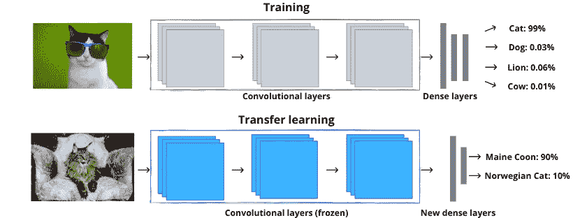
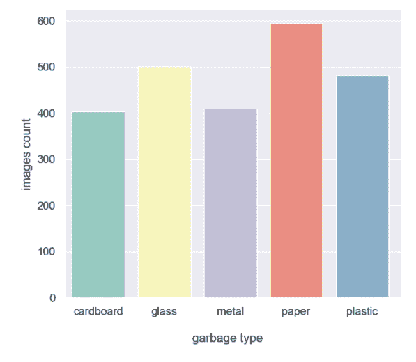
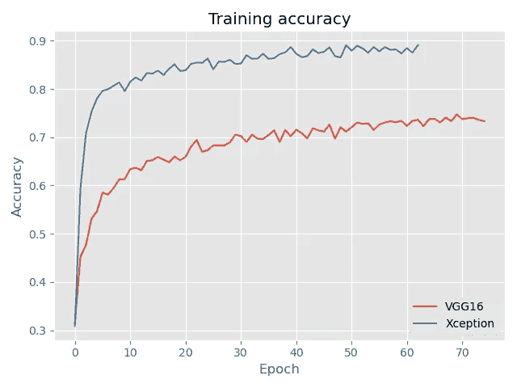
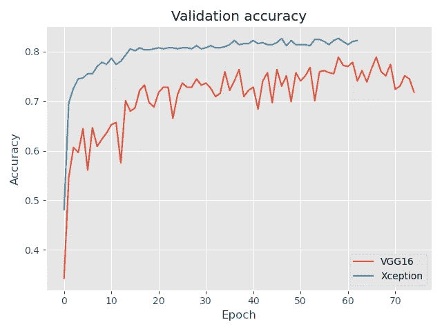
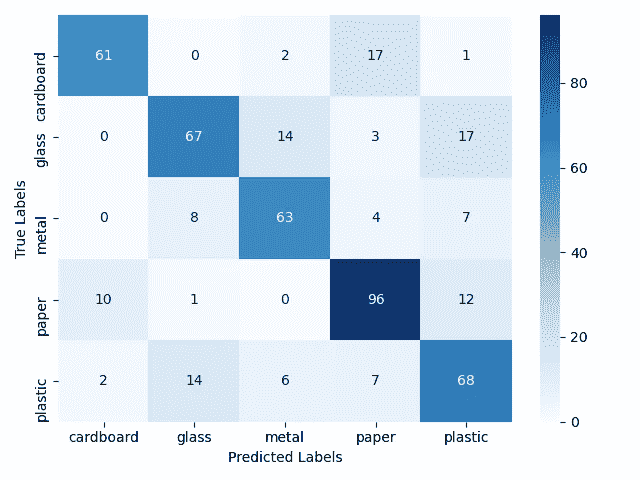
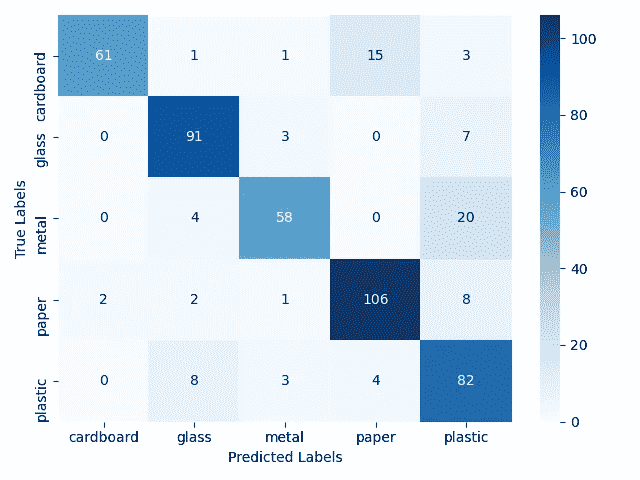

# 使用 Xception 和 VGG16 模型进行域适配

> 原文：<https://towardsdatascience.com/domain-adaptation-with-xception-and-vgg16-models-993744b06d31?source=collection_archive---------61----------------------->

当开始人工智能算法之旅时，有必要问自己两个基本问题:

1.  我们试图解决的问题是什么？
2.  如何建立一个模型来帮助解决这个问题？

要回答第一个问题，唯一的限制因素是我们的想象力和可用于训练模型的数据的可用性。对于第二个问题，选择哪种模式将在很大程度上取决于以下因素:我们正在解决的问题、可用的资源和我们可支配的时间框架。

这在一个例子中得到最好的展示。让我们假设我们正在尝试创建一个算法，帮助根据照片正确地分离废物。当谈到选择算法本身时，它将取决于所提出的问题。在我们从图像中提取适当的特征后，我们可以使用**随机决策森林**或**支持向量机**。我们也可以使用**卷积神经网络**，它直接对图像数据进行操作。我们可以自己设计这个网络的架构。然而，考虑预先训练的模型是值得的，这将允许节省大量时间。为了解决这个问题，我决定采用预先训练的人工神经网络进行图像分类。这在实践中看起来如何？让我们一步一步地经历这个过程。

**数据分析和准备**

我决定用的数据集可以在这里找到: [**垃圾分类**](https://www.kaggle.com/asdasdasasdas/garbage-classification) 。它包含了分为 6 类的垃圾照片:纸板、玻璃、金属、纸张、塑料和混合垃圾。最后一个类别包含的项目照片可以大部分分配给其他 5 组。为此，我们将其排除在进一步分析之外。下面是一个图表，显示了每个班级可用的照片数量。

在准备数据集的过程中，一个非常重要的阶段是将数据集分成至少两个子集:训练子集和验证子集。更好的做法是创建三个独立的数据集:训练、验证和测试。在这种情况下，在测试集上获得的结果是有代表性的，并且显示了该系统对于新的、以前未见过的照片的真实有效性。在我的例子中，60%的照片用于训练，20%用于验证集，另外 20%用于测试集。

以下是每个班级的照片样本。每张照片都是 512 x 384 像素。当使用现成的神经网络时，将集合中图像的大小调整到网络接受的输入数据的大小是非常重要的。在 [**除了**](https://arxiv.org/abs/1610.02357) 网络的情况下，输入层的大小是 299×299，而在 [**VGG16**](https://arxiv.org/abs/1409.1556) 网络的情况下，这个大小是 224×224。因此，在训练模型之前，我们需要缩放我们的图像。

**模型的准备和训练**

为了解决给定的问题，我使用了两种流行的网络架构: **VGG16** 和 **Xception** 。我选择的两个模型都在 **ImageNet** 集合上进行了预训练，该集合包含属于 1000 个类的对象的图片。因此，负责输入图像分类的输出层具有 1000 个输出。在我们正在分析的问题的情况下，输出层的大小应该是 5。下面是允许**根据我们的数据集调整**预训练模型的代码。

由于用于训练模型的数据集有限，我决定使用**数据扩充**来扩展它。下面是负责训练所选模型的代码片段。

在选定车型的训练中，我使用了**早停**。其工作方式是，如果来自验证集的照片的识别效率在一定数量的时期内没有增加，则训练被中断。使用这种方法可以降低模型过度拟合数据的风险。下面是训练集和验证集的学习曲线。很明显，在这种情况下，Xception 网络做得更好，在从验证集中识别照片时实现了超过 80%的效率。

**创建的解决方案的有效性**

正如我之前提到的，最好是在没有参与我们模型训练的新数据集上确定我们模型的实际有效性。因此，下面我将展示通过让模型处理测试集而获得的结果。这个收藏包含 480 张照片。结果证实了这样的结论，即在这种情况下，基于预训练的例外网络的模型做得更好。实现了 **83%** 的效率，几乎比基于 VGG16 架构的模型高出 10 个百分点。

**VGG16: ACC = 74%**

**例外:ACC = 83%**

**总结**

本文展示了如何使用预先训练好的网络架构，并将其应用于我们想要解决的特定问题。简要讨论了数据分析和准备的过程、预训练模型对个人需求的适应性以及评估创建的解决方案的有效性的方法。源代码可在 [**这里**](https://github.com/kater-datascience/garbage_classification) 。

这是一系列文章中的第一篇，旨在为想要开始人工智能算法冒险的人提供帮助。我邀请您在 [**博客**](https://isolution.pl/en/blog-en/) 上关注我们的条目，在 [**【李】**](https://www.linkedin.com/company/isolution/)****[**【FB】**](https://www.facebook.com/IsolutionPolska/)上关注我们的公司简介，并订阅我们的时事通讯。****