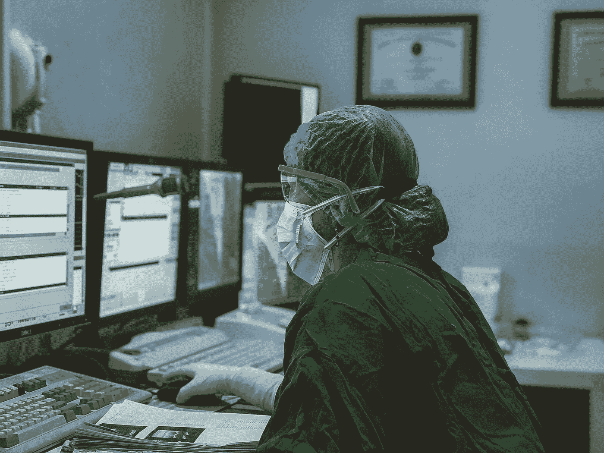
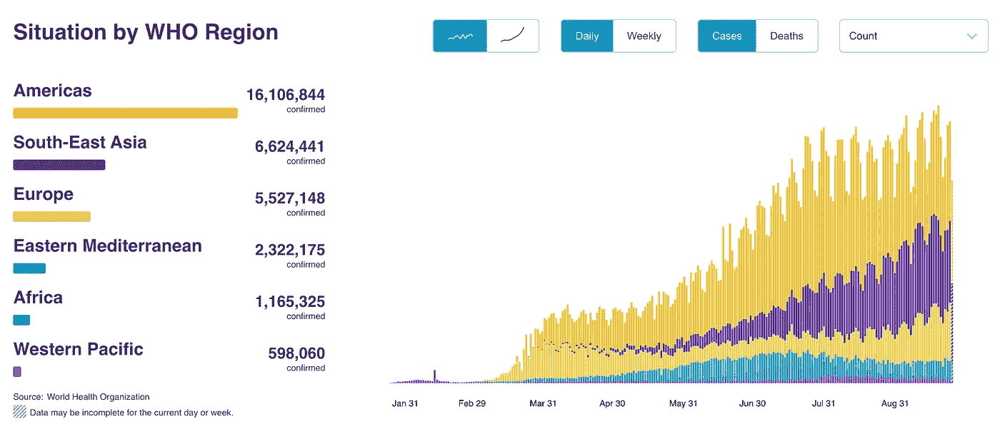
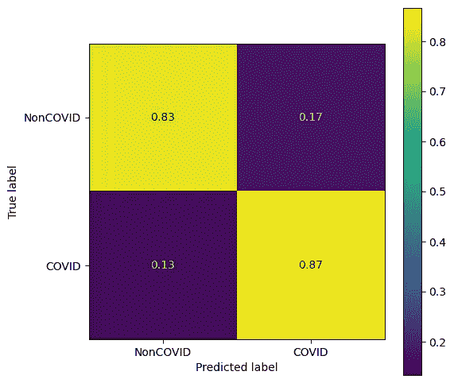
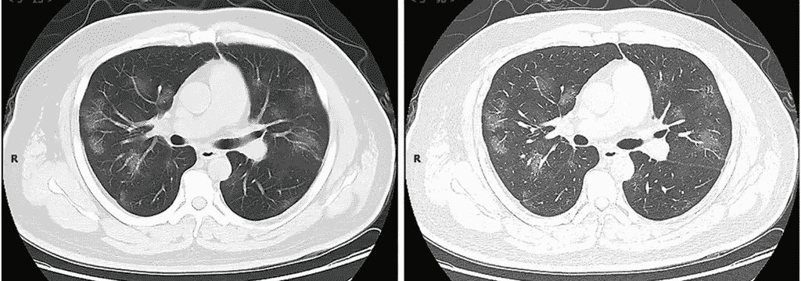
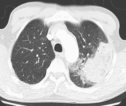
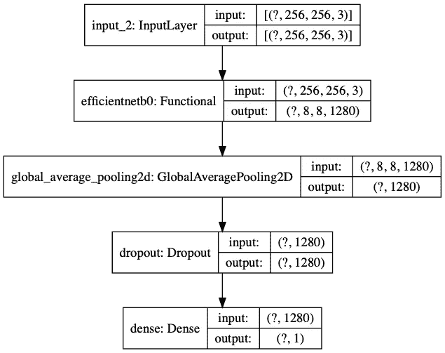
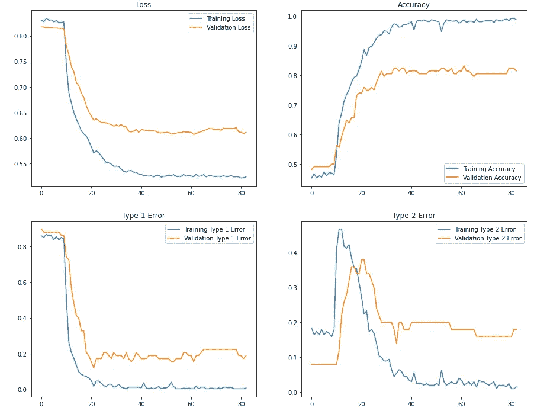
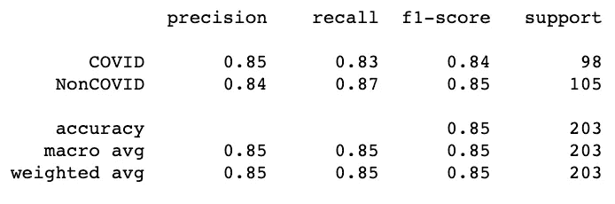
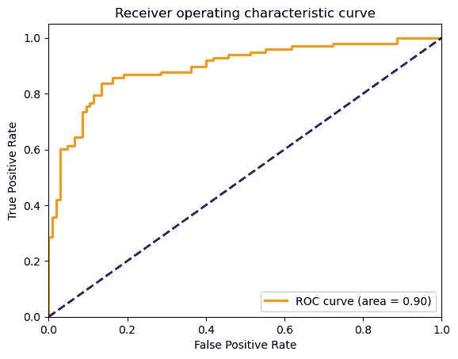

# 深度学习需要什么来更好地检测新冠肺炎

> 原文：<https://towardsdatascience.com/domain-expertise-what-deep-learning-needs-for-better-covid-19-detection-56cdeefde564?source=collection_archive---------49----------------------->

## [**现实世界中的数据科学**](https://medium.com/towards-data-science/data-science-in-the-real-world/home)

## 这个世界可能不需要另一个神经网络，但它需要与那些在第一线的人进行咖啡聊天。



照片由[欧文·](https://unsplash.com/@aboutiwe?utm_source=medium&utm_medium=referral)在 [Unsplash](https://unsplash.com?utm_source=medium&utm_medium=referral) 拍摄

到目前为止，你可能已经看过一些关于深度学习如何帮助检测新冠肺炎的文章。特别是，通过分析患者的计算机断层扫描(CT)扫描，卷积神经网络(CNN)已经被研究为黄金标准聚合酶链式反应测试的更快更便宜的替代方案。这并不奇怪，因为 CNN 在图像识别方面非常出色；许多地方有 CT 扫描仪，而不是新冠肺炎检测工具(至少在最初)。

尽管 CNN 在图像识别任务中取得了成功，如 ImageNet challenge，但它真的能帮助医生检测新冠肺炎吗？如果可以，它能做到多准确？众所周知，CT 扫描是敏感的，但不是针对新冠肺炎的。也就是说，新冠肺炎几乎总是产生 CT 扫描可见的异常肺模式。然而，其他肺炎也可以产生同样的异常模式。强大且有时神奇的 CNN 能解决这个模糊问题吗？

我们有机会自己回答这些问题(与我的同事[和顾问](https://www.linkedin.com/in/yuchen-shi-2830ba158/?originalSubdomain=sg) [A/P 陈](https://www.eng.nus.edu.sg/isem/staff/chen-nan/))。我将带你看一个新冠肺炎分类器，这是我们为 2020 年 QSR 数据挑战[建造的入口。如果您不熟悉 CNN，或者想重温 CNN 的主要功能，我强烈建议您首先阅读这篇文章:](https://connect.informs.org/HigherLogic/System/DownloadDocumentFile.ashx?DocumentFileKey=f404f7b8-fcd6-75d5-f7a7-d262eab132e7)

[](/a-math-free-introduction-to-convolutional-neural-network-ff38fbc4fc76) [## 卷积神经网络:它与其他网络有何不同？

### CNN 有什么独特之处，卷积到底是做什么的？这是一个无数学介绍的奇迹…

towardsdatascience.com](/a-math-free-introduction-to-convolutional-neural-network-ff38fbc4fc76) 

另外，如果你想亲自动手，你可以从这个 Github [repo](https://github.com/YangXiaozhou/CNN-COVID-19-classification-using-chest-CT-scan) 中获得所有代码和数据。

## 关键要点

1.  使用预训练的 CNN 的迁移学习可以在新冠肺炎分类上实现非常强的基线性能(85%的准确度)。
2.  然而，需要基于领域专业知识的特征工程和适应来将 CNN(或其他 ML 方法)提升到医学上令人信服的水平。

# 挑战是什么？

新冠肺炎·疫情改变了世界各地的生活。据[世卫组织](https://covid19.who.int/)报道，这是截至 2020/09/26 的现状。



CT 扫描已被用于筛查和诊断新冠肺炎，尤其是在拭子检测资源严重缺乏的地区。这项数据挑战的目标是使用胸部 CT 扫描诊断新冠肺炎。因此，我们需要建立一个**分类模型**，它可以根据患者的胸部 CT 扫描**尽可能准确地将患者分类为 COVID 或非 COVID**。

## 提供什么？

提供相对偶数的 COVID 和非 COVID 图像来训练模型。比赛还要求，模型的训练与提供的数据必须少于一个小时。

*   训练数据集:251 个 COVID 图像和 292 个非 COVID 图像
*   元信息:患者信息、严重性、图像标题等。

所有质询数据均取自公共[数据集](https://github.com/UCSD-AI4H/COVID-CT)。

# 模型性能

我们先来看看结果，好吗？

用一组独立的测试数据对训练好的模型进行评估。这里你可以看到混淆矩阵。总体准确率约为 85%，灵敏度略高于特异性，即真阳性率>真阴性率。



# 履行

值得注意的是，挑战在于区分 COVID 和非 COVID CT 扫描，而不是 COVID 和正常扫描。事实上，可能有一些不属于其他肺炎患者的 ct 扫描(特异性问题)。以下是 COVID 和其他肺炎 CT 扫描的一个示例:



新冠肺炎引起的肺炎患者的 CT 扫描。资料来源:SJin，y，Cai，l，Cheng，z 等人/ [CC BY](https://creativecommons.org/licenses/by/4.0)



非细菌性肺炎的 CT 扫描。来源:詹姆斯·海尔曼，医学博士/ [CC BY-SA](https://creativecommons.org/licenses/by-sa/4.0)

## 训练-验证分割

我们保留 20%的数据进行验证。由于一些连续的图像来自同一个患者，它们往往彼此相似。也就是说，我们的很多数据都是**而非独立**。为了防止数据泄漏(训练数据的信息溢出到验证数据)，我们保留原始图像序列，并使用最后 20%作为验证集。拆分后，我们有两对数据:

1.X_train，y_train
2。x 值，y 值

x 是 CT 扫描的列表，y 是二进制标签的列表(0 表示非 COVID，1 表示 COVID)。

## 数据扩充

数据扩充是在训练数据中包含更多随机变化的常用方法。这有助于防止过度拟合。对于图像相关的学习问题，增强通常意味着应用**随机**几何(例如，裁剪、翻转、旋转等。)和外观变换(例如，对比度、边缘滤波、高斯模糊等。).我们使用`tf.keras.Sequential`创建一个管道，其中输入图像通过以下操作进行随机转换:

1.  随机水平和垂直翻转
2.  在[-5%，5%]*2pi 范围内随机旋转度数
3.  高度随机放大 5%
4.  随机翻译 5%
5.  随机对比度调整 5%

## 使用预先训练的 CNN 作为主干

我们不能从零开始建立 CNN。对于只有少量训练图像的图像相关问题，建议使用预训练模型作为主干，并在其上进行[迁移学习](https://cs231n.github.io/transfer-learning/)。选择的型号是 [EfficientNetB0](https://www.tensorflow.org/api_docs/python/tf/keras/applications/EfficientNetB0) 。它属于谷歌研究人员提出的名为[高效网络](https://arxiv.org/abs/1905.11946)的模型家族。EfficientNets 是当前用于计算机视觉任务的最先进的 CNN 之一。他们

1.  需要数量少得多的参数，
2.  在 ImageNet 上取得了非常高的准确率，
3.  很好地转移到其他图像分类任务。

EfficientNets 和其他众所周知的预训练模型可以很容易地从`tf.keras.applications`加载。我们首先导入预先训练的 EfficientNetB0，并将其用作我们的模型主干。我们删除了 EfficientNetB0 的原始输出层，因为它是为 1000 类分类而训练的。此外，我们冻结了模型的权重，以便它们不会在初始训练期间更新。

```
# Create a base model from the pre-trained EfficientNetB0
base_model = keras.applications.EfficientNetB0(input_shape=IMG_SHAPE, include_top=False)
base_model.trainable = False
```

## 用我们的模型包裹它

导入 EfficientNet 后，我们可以用它来包装我们的分类模型，从而解决我们的问题。你可以把 EfficientNetB0 想象成一个训练有素的特征提取器。最终模型具有:

1.  输入层
2.  **EfficientNetB0 基本型号**
3.  平均池层:通过平均操作来池化信息
4.  丢弃层:将输入的百分比设置为零
5.  分类层:输出不一致的概率

我们也可以使用`tf.keras.utils.plot_model`来可视化我们的模型。



我们可以看到:

1.  输入和输出形状中的`?`是为样本数预留的位置，模型还不知道。
2.  EfficientNetB0 位于输入层之后。
3.  最后一层(分类层)的输出为 1 维:非 VID 的概率。

## 训练我们的模型

**公共数据预训练**:为了帮助 NetB0 更有效地适应 COVID 与非 COVID 图像分类，我们实际上已经在另一个公共 CT 扫描数据集[上训练了我们的模型](https://www.kaggle.com/plameneduardo/sarscov2-ctscan-dataset)。希望在 CT 扫描上训练模型将允许它学习我们的新冠肺炎分类任务的特定特征。我们不会深入到公共数据训练部分，但是这个过程本质上和我下面要展示的是一样的。

**迁移学习工作流程**:我们使用一个典型的迁移学习工作流程:

1.  阶段 1(特征提取):固定 EfficientNetB0 的权重，仅更新最后一个分类层的权重。
2.  阶段 2(微调):允许一些 EfficientNetB0 '权重也进行更新。

你可以在这里阅读更多关于工作流程[的信息。](https://www.tensorflow.org/guide/keras/transfer_learning#the_typical_transfer-learning_workflow)

**关键配置**:我们使用以下指标和损失函数:

1.  **指标**:评估模型性能

*   二元精度
*   假阳性和真阳性
*   假阴性和真阴性

**2。损失函数**:引导梯度搜索

*   二元交叉熵

我们使用`Adam`优化器，对于这两个阶段，学习率被设置为`[1e-3, 1e-4]`，训练次数被设置为`[10, 30]`。两阶段训练迭代两次。

**训练历史**:让我们把训练历史形象化；



在这里，你可以看到，在我们允许一些层的效率网络更新后(在纪元 10 之后)，我们在分类准确性方面获得了显著的提高。最终的训练和验证准确率在 98%和 82%左右。

# 它在测试数据上的表现如何？

我们可以从包含 105 个非 COVID 图像和 98 个 COVID 图像的相同数据报告中获得一组测试数据。让我们看看训练好的模型在他们身上表现如何。下面是使用`sklearn.metrics.classification_report`的测试数据的结果分析:



分类报告

这是 ROC 曲线:



# 什么是正确和错误分类的 CT 扫描？

我们可以深入分类结果，看看哪些是正确识别的，哪些是错误识别的。**发现的潜在模式**可以用来帮助进一步改进模型。请看这个 jupyter [笔记本](https://github.com/YangXiaozhou/CNN-COVID-19-classification-using-chest-CT-scan/blob/master/notebooks/2-COVID-19-classification-based-on-CT-scan.ipynb)中的图片。从这些图像中，我们看到:

1.  真阳性有明显的异常模式，肺结构保存完好。
2.  很多真阴性都是完全黑肺(无异常模式)。
3.  很多假阳性的肺边界不清楚。

关键是，对于像我这样的非医学人士来说，许多 COVID 和非 COVID 图像看起来是一样的。当一些图像具有不清楚的肺边界时，模糊甚至更严重。看起来我们的 CNN 也很难区分这些图像。

# 我们将何去何从？

从上面的结果，我们可以看到，一个预训练的 CNN 可以适应实现一个真正强大的基线性能。然而，深度学习模型(或任何其他模型)单独能够实现的目标有明显的限制。在这种情况下，计算机视觉研究人员和医学专家需要以一种有意义的方式进行合作，以便最终模型既有计算能力又有医学可靠性。

我们可以从几个方面改进模型:

1.  **肺部分割**:对每一幅图像进行处理，只保留 CT 扫描的肺部区域，例如这里的[见](https://pubs.rsna.org/doi/full/10.1148/rg.2015140232)。
2.  更复杂的**迁移学习**设计:例如，参见多任务[学习](https://ruder.io/multi-task/)或监督域[适配](https://en.wikipedia.org/wiki/Domain_adaptation#The_different_types_of_domain_adaptation)。
3.  **集合**模型:这似乎是一个普遍的信念，尤其是在 Kaggle 用户中，构建一个集合[模型](https://scikit-learn.org/stable/modules/ensemble.html)几乎总是会给你额外增加几个百分点的准确度。

*以上就是我们 CNN 新冠肺炎 CT 扫描分类！谢谢大家！*

*原载于*[*https://yang xiaozhou . github . io*](https://yangxiaozhou.github.io/data/2020/09/27/detecting-covid19-using-cnn.html)*。*