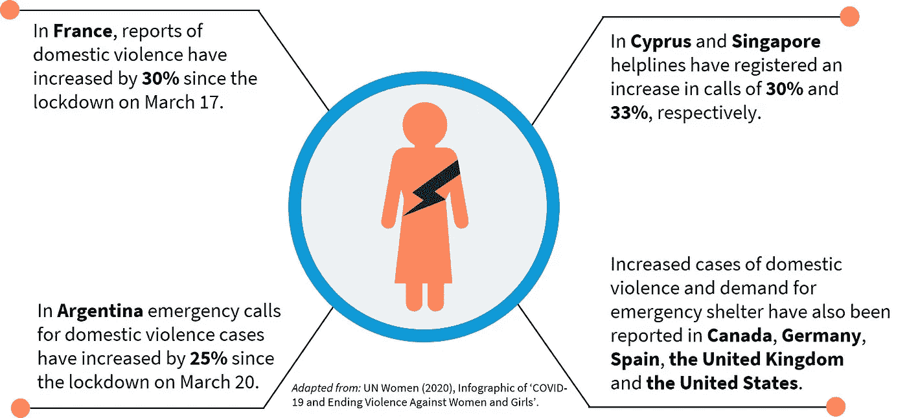
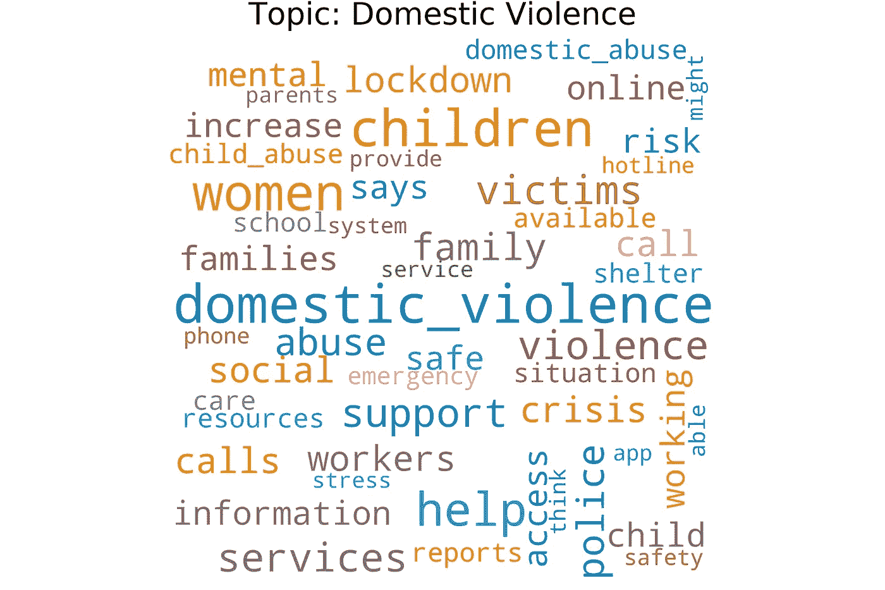
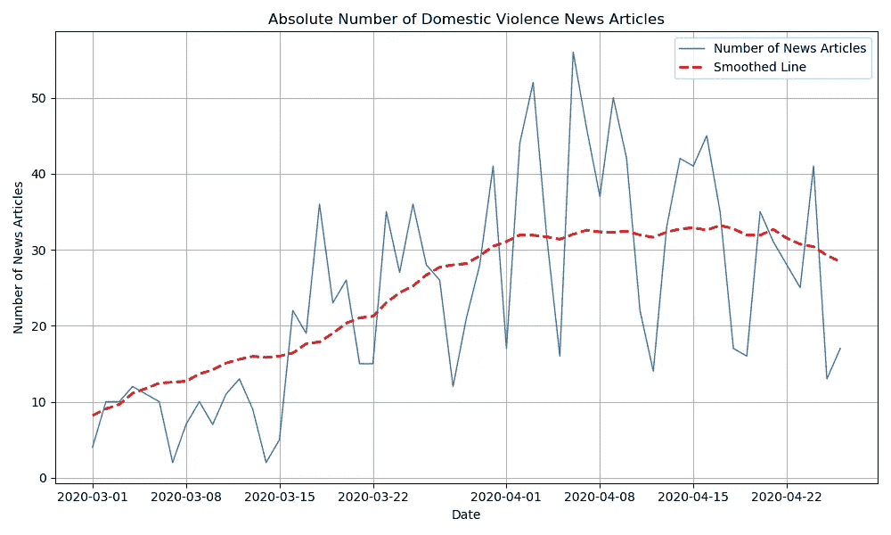
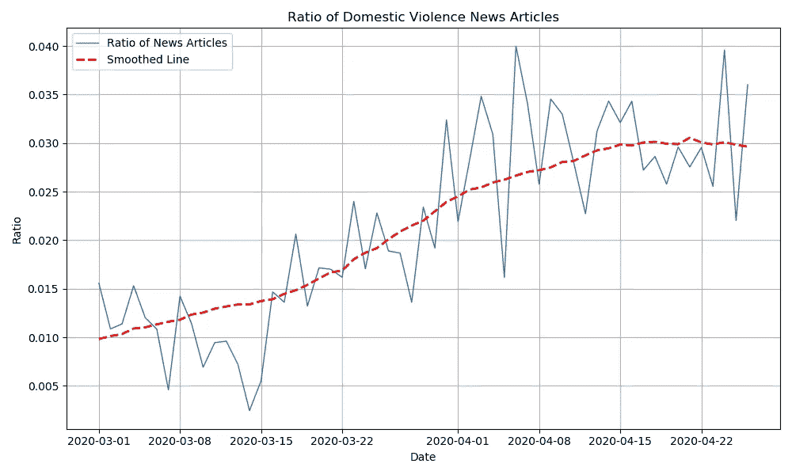
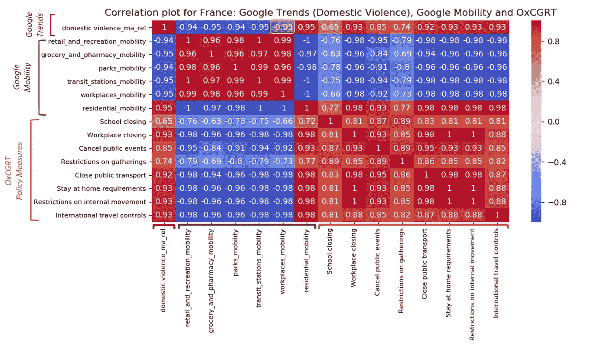
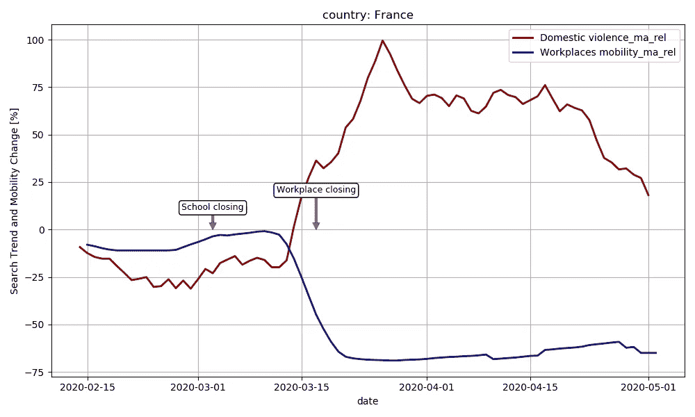
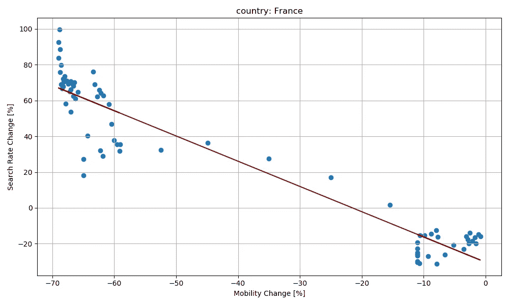
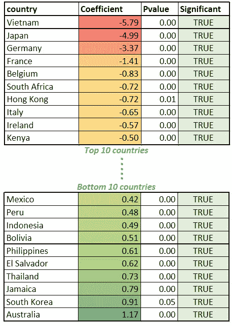
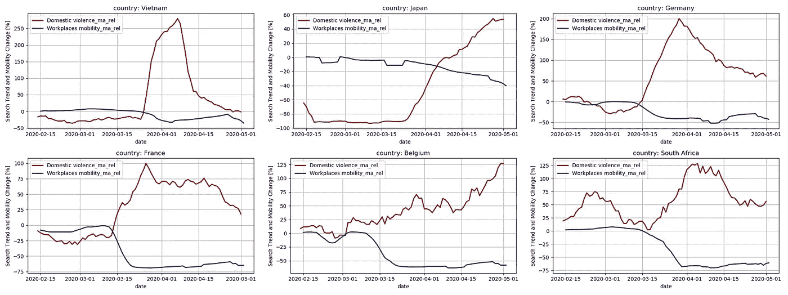
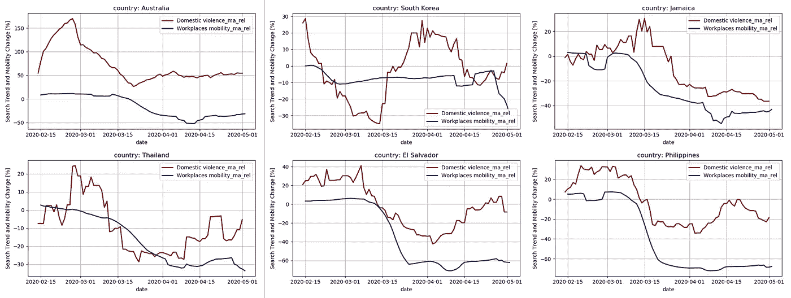

# 家庭暴力 Covid19 的阴影疫情

> 原文：<https://towardsdatascience.com/domestic-violence-the-shadow-pandemic-of-covid19-2db1167a1988?source=collection_archive---------61----------------------->

## 使用人工智能技术和数据分析来寻找封锁和家庭暴力之间的相关性。

# 政策措施对弱势群体的影响

为了防止 Covid19 的传播，许多政府已经采取了严格的措施，如关闭边境，实行全国封锁，并建立隔离设施。虽然这些措施可以确保认真遵守社会距离，但它们可能对经济产生间接影响，并对人民的福祉产生不利影响，特别是弱势群体。

为了帮助政府做出数据驱动的政策决策，以有效应对 Covid19 等流行病， [Omdena](https://omdena.com/projects/ai-pandemics/) 为人工智能专家、数据科学家和领域专家提供了一个支持平台，以便他们可以研究 Covid19 政策措施对弱势人群的影响。本文描述了这一挑战的许多方面之一的结果，重点是 Covid19 对家庭暴力的影响。

这项任务的目标是更好地控制家庭暴力，评估问题的严重程度。为此，使用了不同的数据源，包括新闻文章、政策数据、移动趋势和家庭暴力搜索率。调查结果表明，家庭暴力问题可能比新闻中提到的一些关键数字所显示的要严重得多。此外，对行动的限制和严格实施封锁可能进一步加剧了这一问题。可以说，家庭暴力是疫情的一个阴影，理解这一问题的严重性并确保对幸存者和弱势群体的补救和支持是不可或缺的。

# 家庭暴力——疫情越来越大的阴影

联合国妇女署(T2)最近将针对女性的暴力事件的增加称为“*日益增长的阴影疫情*”。作为 Covid19 政策措施的结果，许多受害者发现自己因封锁措施而接近施虐者。如下图所示，全球求助热线电话和家庭暴力报告的数量急剧上升。这突出表明，迫切需要反思先前存在的和日益增多的家庭暴力事件，并提高基层组织和社区的认识，以提供帮助和支持。

关于 Covid19 和家庭暴力的信息图，改编自联合国妇女署。

# 影子疫情的规模——新闻报道

新闻中充斥着家庭暴力的报道和案例，以及在疫情期间家庭暴力的激增。三月初，新闻报道了中国家庭暴力的增加。与去年同期相比，湖北省二月份报告的病例数量增加了两倍。几周后，世界各地都出现了类似的文章。

为了首次掌握这种阴影疫情的重力和传播，使用了约 80，000 篇 Covid19 相关新闻文章的数据集。这个数据集是使用 [GDELT](https://pypi.org/project/gdelt/) 查询相关文章和[新闻-请](https://pypi.org/project/news-please/)提取内容而创建的。所述数据集已被用于[奥姆德纳艾疫情挑战赛](https://omdena.com/projects/ai-pandemics/)的不同分析。为了识别与家庭暴力相关的新闻文章，基于与家庭暴力相关的关键词过滤语料库。总共有 1，500 篇文章与 Covid19 和家庭暴力有关，揭示了两者之间的联系。

基于 Covid19 和家庭暴力相关文章建模的其中一个主题的词云。

## Covid19 与家庭暴力相关的文章

为了评估家庭暴力相关新闻文章子集的相关性，使用 [gensim](https://github.com/RaRe-Technologies/gensim) 进行 LDA 主题建模。模拟了三个主题，其中一个清楚地说明了所考虑的子集涵盖了家庭暴力。本题的词云如图。

一段时间内 Covid19 和家庭暴力相关新闻文章的数量。

## 与家庭暴力有关的文章绝对增加

与 Covid19 和家庭暴力相关的新闻文章数量在欧洲实施首批封锁措施(2 月底)几周后开始增加。

家庭暴力相关新闻文章相对于 Covid19 相关新闻文章。

## 相对增长

家庭暴力相关文章的增加趋势可以用 Covid19 相关文章的总体增加来解释。为了研究家庭暴力这一主题是否在讨论中变得更加突出，图表显示了家庭暴力相关文章占 Covid19 相关文章总数的比例。可以观察到一种上升趋势，这表明在疫情爆发后，家庭暴力问题变得更加突出。

# 影子疫情的规模——搜索率

新闻中提到的数据通常是摘要形式，类似于联合国妇女署的[信息图中显示的关键数字。为了更详细地掌握阴影疫情的范围和大小，使用了不同的数据集:](https://prod.unwomen.org/-/media/headquarters/attachments/sections/library/publications/2020/issue-brief-covid-19-and-ending-violence-against-women-and-girls-infographic-en.pdf?la=fr&vs=5348)

*   **政策数据:** [【牛津新冠肺炎政府应对跟踪报告(OxCGRT)](https://data.humdata.org/dataset/oxford-covid-19-government-response-tracker) ，覆盖 152 个国家采取的政策措施(2020 年 5 月 8 日访问)。
*   **移动数据:**
    [谷歌新冠肺炎社区移动报告](https://www.google.com/covid19/mobility/)，显示了 132 个国家移动模式的*百分比变化*(2020 年 5 月 8 日访问)。该数据与 2020 年 1 月 7 日至 2 月 7 日之间的移动模式相关( *_rel* )。为了限制随机性，应用了 7 天(1 周)的移动平均( *_ma* )过滤器。
*   **搜索数据:** [Google Trends](https://trends.google.com/trends/) 数据，表示某个话题随时间的搜索趋势(2020 年 5 月 8 日访问)。为了得到搜索率的*百分比变化* ( *_rel* )，这个日期也是相对于基线期(1 月 3 日-2 月 13 日)而言的。为了消除随机性，对谷歌趋势数据应用了 14 天(2 周)的移动平均过滤器( *_ma* )。

分析的重点是所有三个数据集中的国家，这些国家有足够的 [Google Trends](https://trends.google.com/trends/) 数据可用。强加了在至少 50%的考虑时间段(1 月 3 日-5 月 8 日)内数据可用的条件。这确保了分析的广泛性，包括总共 53 个国家。

在 ***一个人正在寻求帮助*** 、 ***能够访问互联网*** 、 ***对能够提供帮助的社会组织具有一定程度的信任*** 的情况下，搜索趋势数据被认为与研究问题的规模相关。显然，后两个条件在不同的国家并没有达到全世界所期望的水平。除其他外，这反映在[人类发展数据](http://hdr.undp.org/en/data)中——例如，可以访问互联网的(女性)人口的百分比。因此，在考虑结果时，应该牢记这些条件、注意事项和细微差别。

此外，使用搜索率有一个明显的优势。受害者寻求帮助和接受帮助预计包括几个步骤；需要采取的每一个后续步骤都需要更多的勇气。最基本的步骤可能是浏览网页，寻找处理家庭暴力和寻求帮助的方法。 ***因此，搜索率数据可能比家庭暴力报告数量更准确地反映了实际问题的规模，因为搜索率可能是受害者寻求援助的第一步。***

## 政策措施、流动性和家庭暴力搜索率之间的相关性

分析的第一步是研究数据集中不同要素之间的相关性。法国的相关图如下所示。可以观察到*工作场所流动性*和*家庭暴力搜索率*之间的高度负相关(-0.95)。不出所料，工作场所流动性与政府实施的关闭工作场所政策高度相关。

政策、移动性和搜索率数据集(法国)的不同功能的关联图。

政策措施、流动性和搜索率的长期趋势(法国)。

在图中，随着时间的推移，工作场所流动性和家庭暴力搜索率的趋势被可视化。这两个变量之间的负相关关系表现为工作场所流动性的下降，同时家庭暴力搜索率上升。与基线相比，搜索率**几乎翻了一番**(增长 100%)。这表明，随着工作场所流动性的下降以及人们发现自己被困在家里，搜索与家庭暴力有关的信息的发生率增加了。

## 回归模型量化流动性对家庭暴力搜索率的影响

回归模型用于评估工作场所流动性和家庭暴力搜索率之间关系的大小和重要性。

流动性对家庭暴力搜索率影响的回归模型结果(法国)。

散点图中的直线显示了法国案例研究回归模型的输出。流动性和家庭暴力之间的关系是显著的，斜率表明流动性每降低 1%，家庭暴力搜索率就增加 1.4%。

下面列出了*前 10 名*和*后 10 名*国家的模型结果。在*十大*国家中，流动性下降与家庭暴力搜索率的急剧上升相关。在排名垫底的 10 个国家中，观察到了相反的趋势:流动性和家庭暴力同时下降。为了进一步研究和解释不同模型的结果，下一节显示了*前 10* 和*后 10* 国家类别中前六个国家的单独地块。

## 流动性下降与家庭暴力增加之间存在密切关系的国家

显示了前 10 个国家中前 6 个国家的个别数字。这些国家的流动性下降和家庭暴力增加之间有着密切的关系。

*   除了日本之外，在所列举的每个国家中，搜索率的峰值都翻了一倍甚至两倍。
*   虽然*日本*的系数比较高，但是搜索率峰值‘刚好’60%。这是因为流动性的下降相对有限，可能是因为这个国家的封锁措施不太严格。
*   *越南*表现突出，家庭暴力搜索率达到峰值，增长了基线的三倍多。本条也强调了*越南*社会距离背景下的家庭暴力问题，指出与 2018 年和 2019 年相比，需要庇护的人数翻了一番。
*   *德国*、*法国*、*比利时、*和*南非*的数字清楚地表明，随着流动性下降，家庭暴力搜索率呈上升趋势。

## 国家*未*说明流动性下降和家庭暴力增加之间的关系

倒数 10 个国家中最后 6 个国家的数字如下所示，显示出流动性和家庭暴力之间的*正*关系。

*   首先，*澳大利亚*的情节很突出，在二月底家庭暴力有了很高的增长。澳大利亚家庭暴力的突然增加被认为是这一时期发生的森林大火的结果。这篇文章也表达了这种关系:'[森林大火的隐藏后果:家庭暴力的激增风险【T3 ' '](https://thenewdaily.com.au/news/national/2020/02/29/bushfires-domestic-violence/)
*   在*南韩，*封锁措施可能被认为比严格的一揽子措施更有针对性，这可以解释该国与其他国家相比所表现出的独特趋势。
*   对于*菲律宾、泰国、萨尔瓦多、*和*牙买加、*来说，家庭暴力搜索率和流动性的同时下降是显而易见的。这并不意味着家庭暴力事件减少了。可能有各种其他因素影响观察到的搜索率趋势。例如，这些国家的搜索率在 2 月底/3 月初达到峰值，这可以解释为 3 月 8 日国际妇女节(媒体)对家庭暴力的关注。那天有很多人参加了不同的游行，无论是在亚洲还是拉丁美洲。

# 讨论——需要采取行动来减少家庭暴力的增加

本文研究了 Covid19 全球疫情对家庭暴力的影响。家庭暴力的增加可以被视为“疫情成长的阴影”。新闻也强调了这一点——报道这一问题的文章数量呈增长趋势。这些文章中的一些以摘要的形式提供了对“成长中的疫情阴影”的严重性和规模的洞察。例如，本文开头显示的联合国妇女署[信息图](https://prod.unwomen.org/-/media/headquarters/attachments/sections/library/publications/2020/issue-brief-covid-19-and-ending-violence-against-women-and-girls-infographic-en.pdf?la=fr&vs=5348)提到，在法国、阿根廷、塞浦路斯和新加坡，家庭暴力紧急呼叫和报告增加了 30%以上。

## 调查结果表明，家庭暴力问题可能比新闻中一些关键人物所显示的要严重得多

对谷歌移动性和搜索率趋势的分析表明，封锁措施对家庭暴力的影响，如关闭工作场所，可以远远高于 30%。在流动性下降和家庭暴力增加之间的反比关系最强的国家，搜索率翻了一番，有些国家翻了两倍多。搜索查询可以被认为是寻求帮助的最容易的步骤。这可以解释为什么这篇文章的结果表明家庭暴力问题可能比前面提到的关键数字要大得多。

值得注意的是，还有许多其他因素会影响搜索率的结果。搜索率在多大程度上可以准确反映家庭暴力问题日益严重的程度，还取决于各国的情况。如前所述，只有当受害者能够*访问互联网*并且**对* *社会组织具有一定程度的信任，从而能够提供帮助*时，受害者才会执行搜索查询。这些假设可以解释这项研究中在许多欧洲国家发现的紧密联系。*

*这项工作的目的是帮助建立对家庭暴力问题的认识。尽管一些国家已经采取措施缓解问题，但结果清楚地表明，问题依然存在。有鉴于此，联合国最近发表了一份简报，其中载有“供社会所有部门，从政府到国际组织和民间社会组织考虑的建议，以便在公共卫生危机开始、期间和之后预防和应对暴力侵害妇女和女童行为，并附有已经采取的行动的例子”。*

# *学分——奥姆德纳艾疫情挑战赛*

*本文介绍的工作是奥姆德纳人工智能疫情项目的一个专门任务的一部分。没有所有团队成员的帮助，这项工作是不可能完成的。特别感谢 [**Albina Latifi**](https://www.linkedin.com/in/albina-latifi-098265199/) 为新闻文章分析和主题建模所做的一切努力。*