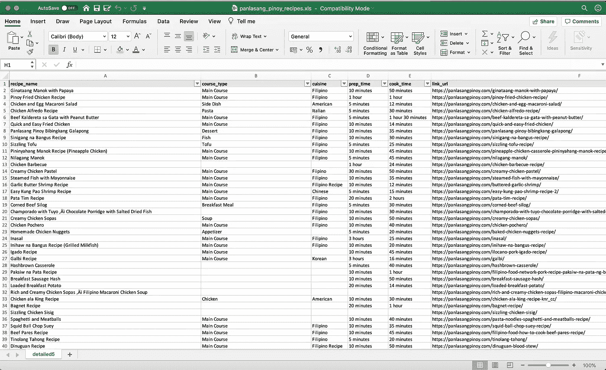
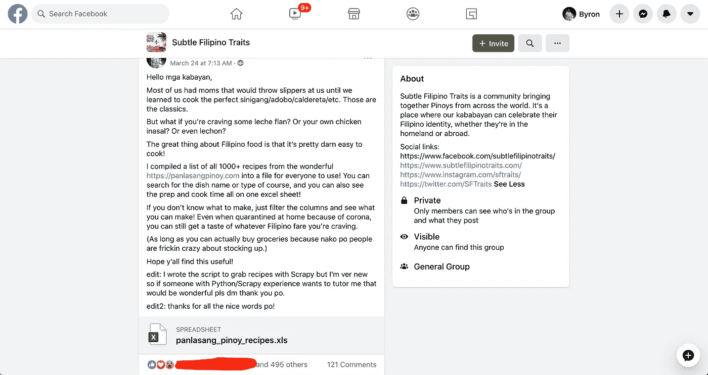
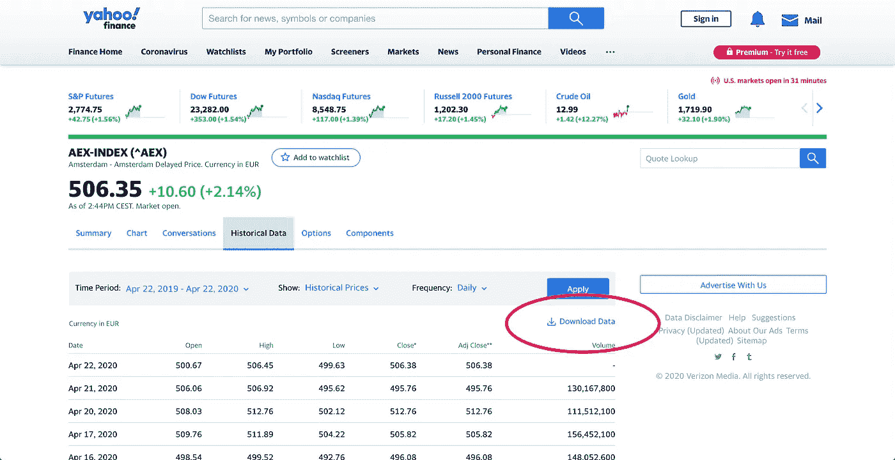
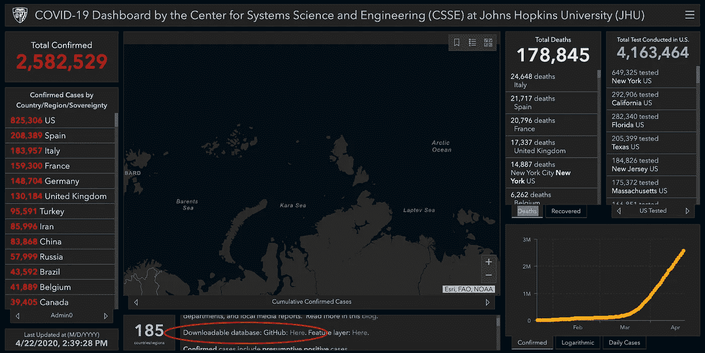
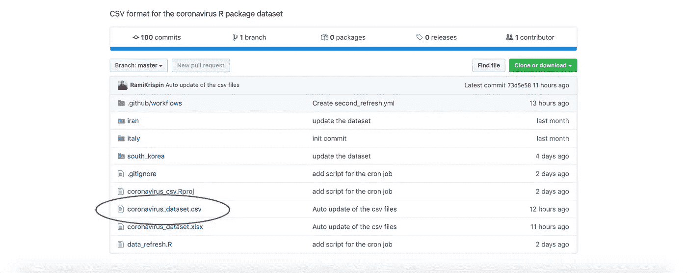
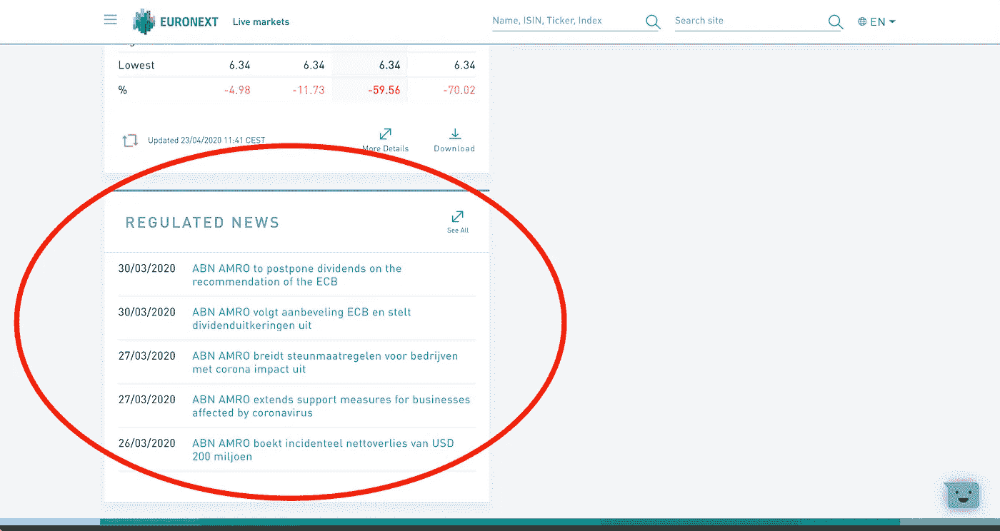
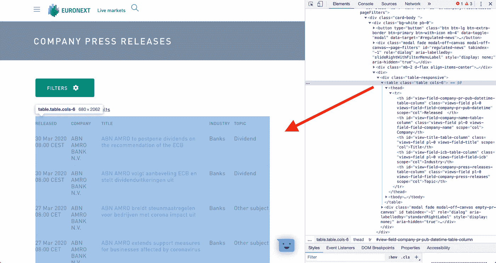
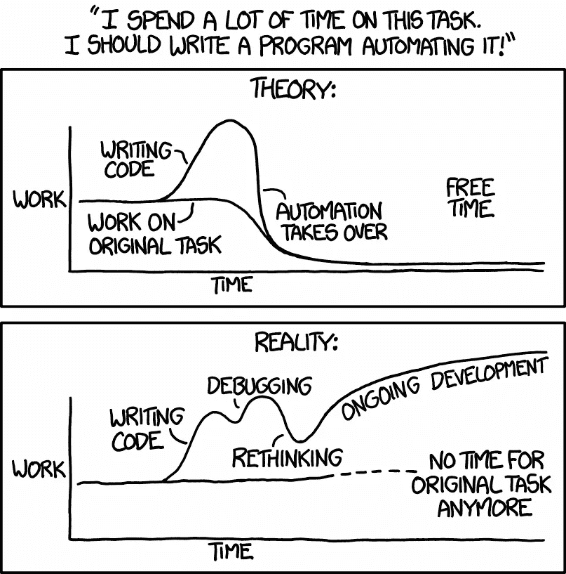

# 不要把所有无聊的东西自动化

> 原文：<https://towardsdatascience.com/dont-automate-all-the-boring-stuff-84d493ecc135?source=collection_archive---------40----------------------->

## 有时候无聊是可以的。

打哈欠然后去工作！—[Vincent van Zalinge](https://unsplash.com/@vincentvanzalinge?utm_source=unsplash&utm_medium=referral&utm_content=creditCopyText)在 [Unsplash](https://unsplash.com/s/photos/boring?utm_source=unsplash&utm_medium=referral&utm_content=creditCopyText) 上拍摄的照片

我倾向于让事情自动化。

学习和实施新事物是一件非常有趣的事情。特别是作为一个编程新手，感觉就像让你的计算机表演魔术一样。但是有时候，自动化是不必要的，而且会适得其反。

# **菲律宾食品:一个需要自动化的项目**

作为一个个人项目，我决定从菲律宾食谱网站“ [Panlasang Pinoy](https://panlasangpinoy.com/) ”获取所有食谱。我希望最终产品是一个 Excel 电子表格，聚集了网站上所有的食谱数据。这样，每当我想做些新东西的时候，我都会在电脑上有一个文件。

手动获取几千份食谱是一项不可能完成的任务。相反，我想尝试使用 Scrapy，一个用于网络抓取的 Python 库。我浏览了文档，认为我可以在几个小时内做出一些东西。

在温习了 HTML、学习了 xpath 选择器和“yield”的功能之后，我运行了我的第一个蜘蛛。迎接我的是一个错误。经过一点调试，我意识到我错过了几个必需的变量赋值。15 分钟后，我的蜘蛛运行没有错误，并提取每一个食谱到一个 Excel 文件。

我的蜘蛛在 Excel 上的输出(2k+行)—来自[https://panlasangpinoy.com/](https://panlasangpinoy.com/)的数据

我的最终目标很简单，这就是为什么从一无所有到“最终产品”只花了几个小时的原因。尽管简单，该文件易于使用，并作为一个基本的食物汇编。在 Excel 上做了一点格式化后，我把数据上传到了脸书的“微妙的菲律宾人特质”小组。

我在脸书微妙的菲律宾特质小组上的帖子

这个快速项目对我来说是一个完成需要自动化的任务的机会。在学习编码时，我读过的很多建议都是构建自己的项目。一个建议是审视你做的每一件事，尝试自动化每一项任务，即使你不需要。这样，你就可以通过“边做边学”的方法来提高你的知识。在这种情况下，如果不写代码，我甚至无法完成我的项目。这证明了花时间学习设置和部署蜘蛛是值得的。

自动化一切可能对学习有好处，但它可能不是获得结果的最有效方式。

# AEX 指数和新冠肺炎:一个不需要自动化的项目

最近，我想跟踪在新冠肺炎引发的隔离期间，阿姆斯特丹交易所指数(AEX)的表现。

我这个项目的最终目标是一个 KPI 和可视化的 Tableau 仪表板，包含三类数据:

*   一段时间内的 AEX 指数价格。
*   能够解释市场运动的新闻文章。
*   荷兰电晕病例的数量。

这三类数据存在于网络上的各种来源中。我的目标是创建一个仪表板来尽快了解情况。因此，我的首要任务是分析数据，而不是花太多时间收集数据。该项目不需要定制的蜘蛛，但我认为我的经验将有助于这个项目的数据收集。

以下是我收集数据的过程:

## **1。AEX 指数数据**

https://finance.yahoo.com/quote/%5EAEX/history?p=%5EAEX AEX 指数[雅虎财经数据](https://finance.yahoo.com/quote/%5EAEX/history?p=%5EAEX)

在 AEX 的“历史数据”选项卡上，所有价格信息都可以通过“下载数据”按钮获得。在这一点上，我甚至懒得去检查 HTML，因为我不需要这样做。我只需设置日期过滤器，然后点击下载。然后，我直接把那个 Excel 输出连接到 Tableau。

**完成时间:< 5 分钟**

## **2。新冠肺炎病例**

到目前为止，每个人可能都看过新冠肺炎统计公司的约翰·霍普斯金·CSSE 仪表盘。

https://coronavirus.jhu.edu/map.html 约翰·霍普斯金新冠肺炎仪表板—

我一时兴起，在那个页面上搜索“Github”，找到了他们的资源库。我点击了这个存储库，试图找到另一个包含所有 Corona 案例的 Excel 文件。我登陆了另一个存储库，那里有人将来自约翰·霍普斯金的原始数据转换成了 csv 格式。

Github 存储库，包含 https://github.com/RamiKrispin/coronavirus-csv 新冠肺炎的 csv 数据—

我下载了那个 csv，检查以确保数据都在，然后把它加载到 Tableau 中。

**完成时间:20 分钟**

## **3。AEX 指数公司新闻稿**

我把这个留到了最后，因为我知道这将花费我最长的时间来弄清楚。我开始查看常规新闻网站，输入“AEX”和“科罗纳”作为关键词。这些搜索的大部分内容看起来并不能解释 AEX 指数的趋势。接下来，我想到用公司新闻稿和季度报告。

有 25 家公司被纳入 AEX 指数。我不想去每个网站，点击它，直到我找到他们的“媒体”页面，然后把我在那里找到的任何东西复制粘贴到 Excel 表格中。作为测试，我试着做了一个网站，花了大约五分钟。一些快速的心算让我得出结论，我绝对不想花 2.08 小时复制粘贴东西。

之后，我上了泛欧交易所(股票交易所)网站，点击了指数中的一家公司。我发现公司主页有一个“监管新闻”标签，显示最近的新闻发布。

泛欧交易所网站 ABN AMRO 页面截图—[https://live . Euronext . com/en/product/equities/nl 0011540547-XAMS](https://live.euronext.com/en/product/equities/NL0011540547-XAMS)

主站点依靠 JavaScript 来加载其站点的部分内容。因为 Scrapy 不能解析 JavaScript 站点，所以我不能写一个蜘蛛来抓取整个站点。然而，当我点击每个公司的新闻稿选项卡时，我被重定向到的网站没有任何 JavaScript！此外，只需要修改 URL 中的一个子字符串就可以访问 Euronext 网站上的任何公司。

有了这些，我想我可以写一个快速的蜘蛛来获取每家公司所有必要的新闻稿。

ABN AMRO—[https://live . Euronext . com/listview/Company-Press-release/nl 0011540547](https://live.euronext.com/listview/company-press-release/NL0011540547)的公司新闻稿选项卡截图

于是我开始了。我建立了一个虚拟环境，安装了 Scrapy，并测试了服务器是否会阻止我进行 Scrapy。我初始化了一个基本的蜘蛛模板，然后打开浏览器检查网站。

HTML 格式起初看起来不错，但后来我意识到有几个问题:

*   一些新闻稿的标题不是英文的，这意味着我需要想出如何翻译它们。
*   不是所有的标题都属于同一个 HTML 类，所以我必须找到一种方法来包含任何一个出现的标题。
*   相对于我想要研究的时间框架，新闻的页数在不同的公司之间是不同的。一些公司只有一页上的几篇新闻稿，而其他公司有三页的更新。我需要弄清楚如何在我的目标时间框架内只浏览这些页面。

这些问题可能看起来不是很难，但我在网页抓取(以及一般的编码)方面完全是个新手。

我被难住了。

我知道我可以花时间学习更多关于刮痧的知识，并最终解决并发症。然而，由于我的知识有限，我无法估计达到抓取速度和实际编写蜘蛛需要多少时间。我已经花了两个小时来测试和发现这些问题。我走开了一会儿，清醒一下头脑。

回来后打开一家随机公司的新闻稿选项卡，复制新闻表格，粘贴到一个空的 Excel 文件中。我花了大约十秒钟。我做了一些快速心算(完全公开，这是我打开计算器)第二部分，我意识到我将花 4.16 分钟完成所有 25 家公司。

我太沉迷于试图找出如何自动化这个过程，以至于忘记了我项目的目标。这不应该是学习网络抓取的练习。我的目标是尽快将原始数据转化为关键见解。

我很想忽略这一点，继续进行刮擦，因为我已经为此投入了大量时间。谢天谢地，我的大脑想:

“拜伦，我们学习了沉没成本。放手吧”。

10 分钟后，我把 AEX 指数中每家公司的所有新闻稿都从泛欧交易所网站上复制粘贴了下来。所以不到 4 分钟，因为我需要额外的 6 分钟来处理复制粘贴的数据。完成后，我将 Excel 文件加载到 Tableau 中，并最终准备好开始制作一些图表。

**完成时间:130 分钟。**

**完成这项工作可能需要的时间:10 分钟。**

# 按比例还是不按比例？

我的大脑现在已经在尖叫了:

“但是拜伦，规模呢？你不想最终扩大这个项目的规模吗？为什么不把它做成可扩展的？”

明白了吗？尺度？鱼有鳞？—[paweczerwiński](https://unsplash.com/@pawel_czerwinski?utm_source=unsplash&utm_medium=referral&utm_content=creditCopyText)在 [Unsplash](https://unsplash.com/s/photos/fish?utm_source=unsplash&utm_medium=referral&utm_content=creditCopyText) 上拍摄的照片

答案是肯定的。在某种程度上，我确实想让 Tableau 上的仪表盘拥有实时数据，但这并不是我这么做的原因。这个项目的目标是制作一些图表。这个练习对我来说是一个快速而又肮脏的方法，让我重温 Tableau，了解 AEX 指数的变化。

绘制图表比收集数据要快得多，因为我已经学会了使用 Tableau。我不需要去找那些小众的东西，比如同步轴、编写 LOD 表达式和混合数据源。

当我完成时，我有了一个组合了所有三个数据集的仪表板。从一页纸上，我可以很快对事件如何影响股票价格有一个基本的了解。我还可以看到随着时间的推移，新冠肺炎病例和 AEX 指数之间是否有任何关联。

我从中学到的是，有时候，你真的不需要自动化你正在尝试做的事情。如果我能实时更新每一类数据，那就太好了。事实上，这就是我接下来要做的。但这对于概念验证项目来说是不必要的，而这正是本练习的目的。

我在自动化方面取得了一些早期的成功。我安排电子邮件，处理 RSS 订阅，用熊猫来分析数据，所有这些都是在学习 Python 的几个月内完成的。正因为如此，我有点痴迷于尝试在任何地方应用自动化。我艰难地认识到，开发自动化解决方案的过程可能会妨碍实际工作。

这是如此真实——https://xkcd.com/1319/

从一个网站上复制粘贴有点像走捷径，尽管这种捷径无聊得令人麻木。

这个:

> **“我设置了一个高级的 scraper，它在云中填充了一个关系数据库，然后连接到一个 Tableau 仪表板。”**

听起来比这性感多了:

> “我从一个网站上复制了一些东西，粘贴到 Excel 中。然后我把它放在舞台上。”

事情是这样的:**性感不是目标。**

如果我不性感的话，我可以节省一个小时。我不需要变得性感来完成概念验证仪表板。

所以在 1944 年的单词之后(谢谢你能走到这一步)，我的大收获是双重的:

*   说到**学习**，想怎么做就怎么做吧。
*   当涉及到**交付一个项目**时，关注获得结果，而不是实验。

***TLDR；不要总是性感。***

旁注:如果你集成了 Splash 或者 Selenium，Scrapy 可以解析 JS，但是我还没有学会这么做。这是我还没有接触过的东西，这就是为什么我甚至没有想过去尝试去做。抓取常规(非 JS)站点的任务已经有些熟悉了。这就是为什么我有一个是否自动化数据收集的有效难题。