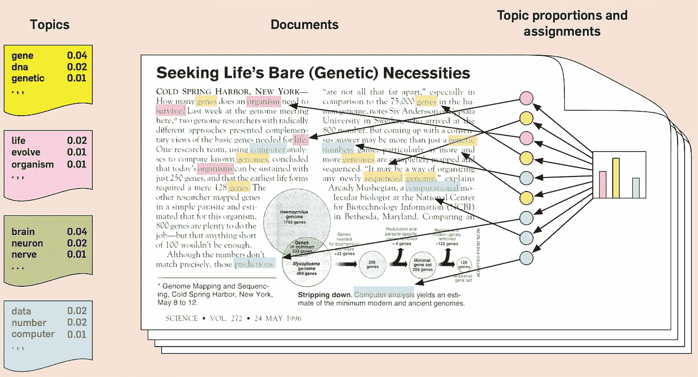
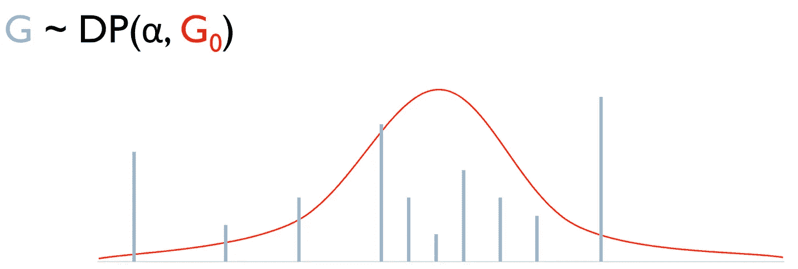
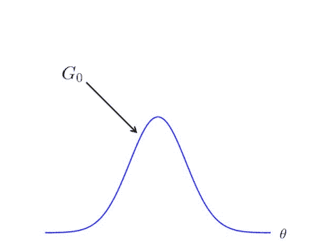
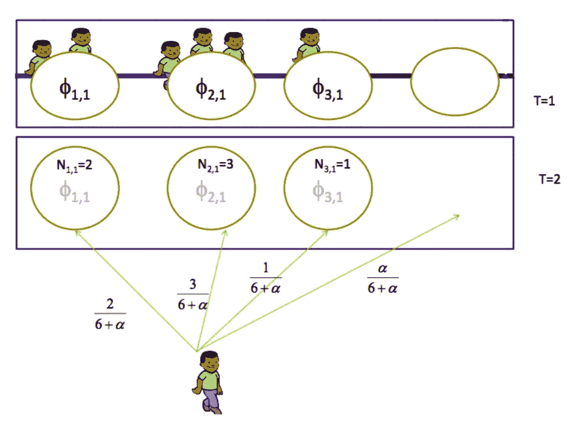
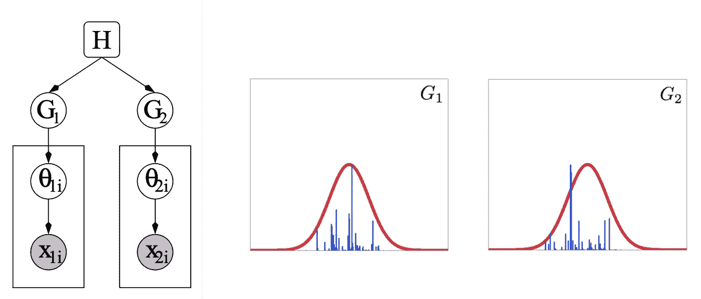
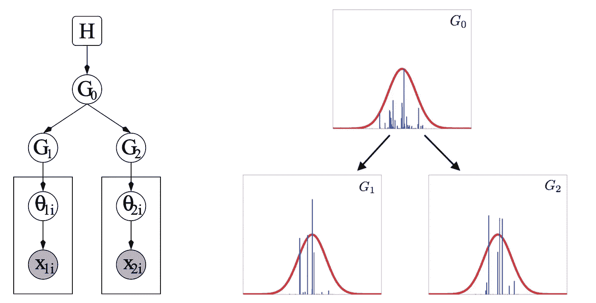

# 不要害怕非参数主题模型

> 原文：<https://towardsdatascience.com/dont-be-afraid-of-nonparametric-topic-models-d259c237a840?source=collection_archive---------35----------------------->

你好，我是尼克🎞 on [Unsplash](https://unsplash.com?utm_source=medium&utm_medium=referral)

> 在本文中，我将介绍高级基础材料。如果您对如何用 Python 实现我下面描述的模型感兴趣，我将很快发表第二篇文章。

想想你最后一次阅读一本书或一篇文章。我打赌你不可能记住你读过的每一个单词，但是，你可以回忆起文章中的某些趋势或主题。这只是因为我们的大脑倾向于那些可以轻易储存在微小细节中的摘要。主题建模本质上模仿了我们大脑用来捕捉文本数据趋势的“摘要”技术。

这些类型的模型通常在工业中用于定义文本数据中的共性或潜在趋势。例如，根据与以前票据的文本相似性自动标记客户支持票据，或者在开放式客户反馈调查中发现潜在趋势，以便为未来的产品功能提供信息。

那么，这和*非参数*有什么关系呢？好吧，让我们继续上面的例子。在开始读这篇文章之前，我不相信你的第一想法是“对于这本书，我会准确地记住 5 个主题。”相反，你的大脑决定了一些对文章有意义的主题，这个数字会随着书籍/文章的不同而变化。这里是*非参数*进入场景的地方。**这只是一种“让模型从数据中推断其参数”的奇特说法，或者在我们的情况下，让模型推断主题的数量**(就像我们的大脑在某种程度上一样)。

你们中的一些人可能会被这篇文章中的术语吓到(例如，Dirichlet，混合模型，等等。).我明白，这不是一个简单的话题(相信我，我一开始也很纠结)。**但是，不用害怕！我的目标是在本文结束时，您将学到一些关于非参数建模和主题模型的新知识。**

# **概率主题模型的简要总结**

> 如果你没有任何概率模型或狄利克雷分布的介绍，我强烈推荐你在继续之前阅读这篇文章

在深入细节之前，提供一些关于主题建模和相关方法的一般背景是有帮助的。根据定义，主题建模是指用于分析文档中的文本数据和识别重要词组(主题)的一组无监督技术。因此，主题模型输出 1)一组主题和 2)一组按主题分组的文档。

一种常用的参数模型是潜在的狄利克雷分配(LDA ),它利用两个基本假设

1.  相似的主题将使用相似的单词(具体来说，每个主题将有一个单词分布)
2.  文档可以被认为是多个主题的混合体

下图将为您提供一些关于 LDA 的直觉。我们看到，主题(左侧)是由一组相似的、共现的单词归纳而成的，而文档(右侧)是由主题混合而成的。

潜在狄利克雷分配(LDA)背后的直觉——资料来源:Blei，David M (ACM，2012)

这是一个过于简单的解释，该模型有其复杂性，如假设主题是狄利克雷分布，但我们不会在这里逗留。

这种设置的一个主要缺点是，我们必须预先定义要生成的主题数量。如果你真的不知道有多少话题可以期待，这可能是一个问题(想想我们书的阅读例子在开始)。为了克服这个限制，我们可以使用非参数方法，如狄利克雷过程混合。

# **狄利克雷过程混合物(DPMs)**

在您被这个术语吓倒之前，请将 DPMs 看作是以前的 LDA 模型的扩展。代替预先定义的主题

1.  这些是从文本数据中学习到的
2.  它们只受文档集合中的词汇(唯一的单词)的限制

这最后一点很重要，因为它考虑到了无限数量的主题的可能性，如果你要训练世界上每个可能的单词的模型。“但那要花很长时间才能跑完！”你可能会说。我不反对，但狄利克雷过程(DPs)给了我们一个概率公式，使这变得可行。

## 关于狄利克雷过程(DPs)的简短而重要的旁白

下面的内容听起来很吓人，但请耐心听我说。

> 形式上，DP 被定义为分布上的分布，并且由可计数的无限数量的点质量组成

唷！那是一口。

**简单来说，**DP 创建了一个被认为是“无限”的离散分布这种无限离散的特性源于这样一个事实，即我们可以将 DP 看作是首先从一个连续的基本分布(例如高斯分布)中抽取样本，它可以取无限多个值。当我们分配非零权重时，这些样本被认为是离散的。我们使用一个*断棒构造*来创建这些样本**结果是一个遵循狄利克雷**的无限离散分布。

下图提供了一种直觉。在第一幅图像中， **G** (浅蓝色)是通过具有参数 **α** 和 **G0** 的狄利克雷过程生成的离散概率分布(连续的基本分布，例如高斯分布)。参数 **α** 控制 **G** 与基本分布的相似程度——例如，当我们增加 **α** 时， **G** 的形状将看起来更像 **G0** 的形状。换句话说，分布 **G** 由离散的(“可计数的”)分量组成，这些分量通过将非零权重分配给无限数量分量的子集的过程来实现。

在第二张图中，我们可以看到 s *分笔成交点构造*如何生成这些分立元件。

狄利克雷过程背后的直觉——资料来源:K. El-Arini (2008)

*断棒结构背后的直觉——来源:Patrick Dallaire (2011)*

> 在主题建模中，狄利克雷过程用于生成主题的无限离散分布

## 狄利克雷过程混合物(DPMs)的高级概述

恭喜你坚持到现在，你已经完成了 75%!现在，让我们继续 DPMs…

理解 DPMs 的一个常见且有时有用的类比是**中国餐馆流程**。(我还是不明白他们为什么选择这么叫。)

以下是直觉以及它与主题建模的关系:想象一家餐馆，它提供来自无限菜单(一组主题)的菜肴(主题)，并有无限桌子(单词组)的空间。**每桌只能点一道菜，但多桌可以点同一道菜(即话题可以重复)。然后，顾客(词)和其他顾客坐在一张现有的桌子上，或者有可能坐在一张新桌子上。**

下图显示了这一过程的描述。现在，让 ***k*** 索引主题和**表格**。**每个表上的参数φ代表一个表主题索引，客户代表单词。当一个新客户(词)出现在迭代 ***T*** 时，他/她坐在一个新的或现有的桌子上。顾客最终就座的位置由与每张桌子就座的顾客数量成比例的概率*和帮助定义新桌子概率的参数 **α** 来定义。***

******

***中餐厅流程的直觉—资料来源:Eric P. Xing (2014)***

***主题模型是通过在多个“时期”循环遍历文档集合中的所有单词来训练的使用主题和表索引φ，我们可以通过收集分组在一起的单词来解释推断的主题。(在我们的类比中，这些是坐在一起的顾客，他们坐在桌子*旁，分享同一道菜 ***k*** 。)还有一些度量标准，比如困惑度，这在本文中没有涉及，它们可以帮助您评估每个时期的模型拟合度。****

**好极了。就这样对吗？不完全是。**

> ****如果我们有多个不同的文档集合，比如一个关于统计的集合和另一个关于计算机工程的集合，并且希望保持相同的设置，但让集合共享主题**会怎么样？**

**在当前的设置中，每个 DP 为每个文档集合生成一组独立的“无限”主题。我们只需要再多一步——一个层级。**

# **分层狄利克雷过程**

**根据 Yee Why Teh 等人在 2005 年发表的一篇精彩论文，HDP 在上一节介绍的 DPM 的基础上引入了一个层次结构。HDP 提供了“无限”数量的基础主题，可以在不同的文档集合之间共享。**

****下面的图片将为您提供一些关于 DPMs 和 HDPs 之间差异的直觉**。首先，下面的 DPM 图显示，尽管两个集合共享相同的连续基分布 **H** (左图)，但是与每个文档集合相关联的狄利克雷过程 **G1** 和 **G2** 生成不相同的离散样本(右图，蓝色)。这意味着如果我们使用这个框架进行主题建模，我们的集合不会共享主题。**

****

****对狄利克雷过程混合物的直觉**:(左)代表两个文档集合的 DPM 的平板图，(右)来自每个集合的不同 DPM 的样本—来源:Teh 等人(2007)**

**相比之下，下面的 HDP 图显示了引入层次结构(左)如何允许两个集合共享来自相同的无限主题底层分布的样本(这里记为 **G0** )。**

****

****对分层狄利克雷过程的直觉**:(左)表示现在共享无限数量主题的两个文档集合的 HDP 的平板图 **G0** ，(右)来自每个集合的共享 **G0** 的样本来源:Teh 等人(2007)**

> **继续以中国餐馆流程为例，HDPs 可以被认为是中国餐馆的特许经营**

**对我们之前的类比的唯一改变是，在这种情况下，有多个餐馆(文档集合)现在共享来自一个全局菜单( **G0** )的菜肴(主题)。训练模型和解释题目的过程和上面的原中餐厅过程类似。**

# **结论**

**万岁！我们结束了，你应该为自己走到这一步而自豪。您刚刚学习了一种非常复杂的建模技术。**

**在我列出一些优点和缺点之前，我只想说明我已经掩盖了这些模型的许多复杂性。如果你对深入研究感兴趣，我推荐你阅读 Yee Why Teh 的原始论文。**

## **优势**

1.  **它们是探索文本数据潜在趋势的有用工具**
2.  **在非参数模型中，主题的数量是从数据中学习的，而不是用户指定的**
3.  **主题可以在不同的文档集合之间共享，这可以提供对趋势的进一步洞察**

## **不足之处**

1.  **这些模型使用词袋表示法分析文本，忽略句法和语义信息**
2.  **要使这些模型最有效，需要大量高质量的数据(即预先清理的文本)**

# **参考**

*   **叶惠德，迈克尔一世·乔丹，马修·J·比尔和大卫·M·布莱(2006)分层狄利克雷过程，美国统计协会杂志，101:476，1566–1581，DOI:10.198/01660000005**
*   **概率主题模型。美国计算机协会第 55.4 届会议的来文(2012 年):77-84。**
*   **杜迈斯、S. T .、弗纳斯、G. W .、兰道尔、T. K .、和迪尔韦斯特(1988 年)。利用潜在语义分析改进信息检索。CHI'88 计算系统中人的因素会议论文集，281–285。**
*   **Khalid El-Arini (2008 年)。狄利克雷过程:温和的介绍。卡内基梅隆大学，计算机科学。**
*   **埃里克. p .兴。分层狄利克雷过程。10–708:概率图形模型 10–708，2014 年春季。抄写笔记。**

**我希望你喜欢这篇文章，欢迎[在 Twitter 上关注我](https://twitter.com/ecoronado92)或[访问我的网站](https://ecoronado92.github.io/)了解其他很酷的想法/项目。**