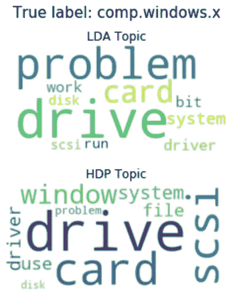

# 不要害怕非参数主题模型(第 2 部分:Python)

> 原文：<https://towardsdatascience.com/dont-be-afraid-of-nonparametric-topic-models-part-2-python-e5666db347a?source=collection_archive---------10----------------------->

## [视频教程](https://towardsdatascience.com/tagged/video-tutorial)

## 准备好开始你的模特游戏了吗？深入了解如何实现/评估分层 Dirichlet 过程模型的简单分步教程

*本文建立在我在上一篇文章* *中介绍的高级基础材料* [*的基础上，描述了如何用 Python 实现主题建模的层次化 Dirichlet 过程模型。*](/dont-be-afraid-of-nonparametric-topic-models-d259c237a840)

让我们都同意，学习和谈论很酷的新方法是一回事，用数据实际实施/测试它们是另一回事。主要是因为对它们的了解不会带来 bug、奇怪的错误等典型的挫折。然而，我个人认为，修补的结果是对概念本身的更深理解。

你猜怎么着？贝叶斯非参数(BNP)方法，如分层狄利克雷过程(HDP)也不例外。

在你认为我要把你扔进编码池的最深处之前，不要担心。我写这篇文章的总体目标是，最终你可以**自信地实现一个 HDP 模型，在你的项目中驱动价值**(或者允许你向你的朋友谦虚地吹嘘)。


由 [MARK ADRIANE](https://unsplash.com/@markadriane?utm_source=medium&utm_medium=referral) 在 [Unsplash](https://unsplash.com?utm_source=medium&utm_medium=referral) 上拍摄的照片

# **一目了然**

以下是我将介绍的内容

*   关于如何使用现有 Python 库实现 HDP 模型的分步教程
*   其性能与潜在狄利克雷分配(LDA)模型相比如何
*   实施 HDP 时的一些关键注意事项、陷阱和潜在的修复方法

我将使用通过`sklearn.datasets`获得的 [20 新闻组数据集](http://qwone.com/~jason/20Newsgroups/)。考虑到大约 20，000 个文档的集合几乎平均分布在 20 个不同的主题(新闻组)中，这是一个很棒的玩具数据集。由此可见，从某种意义上说我们已经知道了*真题* 这个模本应该推断出来。

# **目录**

这篇文章分为以下几个部分

1.  **数据预处理**
2.  **HDP 模特培训与评估**
3.  **型号对比**
4.  **反面教材**

# 属国

在我们开始之前，我建议您安装以下依赖项`spaCy`、`nltk`、`gensim`、`tomotopy`、`plotnine`和`wordcloud`。您可以使用`pip`单独安装每一个，也可以使用我创建的 [**需求文件**](https://github.com/ecoronado92/towards_data_science/blob/master/hdp_example/requirements.txt) 来简化您的工作，如下所示

```
pip3 install -r requirements.txt
```

# 数据预处理

> 如果你还没有为 NLP 项目预处理过文本数据，我强烈推荐你提前查看一下这个循序渐进的教程

让我们首先加载 20 个新闻组数据集，指定我们只需要模型的`train`子集。

```
from sklearn.datasets import fetch_20newsgroups# Read in train subset (11,314 observations)
news = fetch_20newsgroups(subset='train')
```

这个`news`实例包含文本数据(`news.data)`和标签(`news.target`和`news.target_names`)，在 pandas 中可能是这样的


而不是一步一步地告诉你我如何用标准方法预处理`content` 数据(例如，标记化、停用词移除等)。)，我将在下面总结这些步骤。

随着我们在这一部分(以及在未来的项目中)向前推进，我希望您记住以下几点:

> 基于最终目标和选择的建模方法，这些预处理步骤有意义吗？

这很容易被忽略，因为标准的预处理方法在许多应用程序中工作得很好。例如，**在我们的例子**中，我们想要去除由停止字( *on、*等)产生的噪声。)以便我们的模型可以更好地捕捉与真实主题相似的潜在主题。
**然而，总是这样吗？编号**
【查看[这篇文章](https://medium.com/@limavallantin/why-is-removing-stop-words-not-always-a-good-idea-c8d35bd77214)关于为什么这不是情绪分析的好主意】

## 特殊字符删除

首先，我使用正则表达式替换删除了数据集固有的任何特殊字符，如`@`和`\n`，以及单引号`'`。

## 标记化

这里我使用了函数`gensim.simple_preprocess`,它非常有效地标记了每个文档(即，将文本分割成单个单词)。为了删除任何潜在的重音，我用`deacc=True`参数运行它。

## 二元模型

这些有助于构建，因为它们考虑到了词的共现。例如，在我们的数据中，这会生成`['oil_leak']`而不是`['oil', leak']`。你可以使用`gensim`的内置`Phrases`和`Phraser`功能来实现这一点。

## 停止单词删除

如果我们首先删除文档中的非信息词(即停用词)，推断潜在主题将会更容易。我下载了`nltk`的英文停用词，并添加了几个简单的针对这个数据集`['from', ‘subject', ‘re','edu',use']`的停用词。

## 词汇化

考虑到数据集相对较小(即大约 10k 个观察值)，我使用`spaCy`和词性(POS)标签为名词、动词、形容词和副词实现了一个词汇化方案。**简单地说，**我删除了任何屈折变化的词尾，并返回了基本/词典单词，如下所示。

```
"A letter has been written asking him to be released"[ex. Original ==> Lemmatized, POS tag]A        ==> a, DET
letter   ==> letter, NOUN
has      ==> have, AUX
been     ==> be, AUX
written  ==> write, VERB
asking   ==> ask, VERB
him      ==> -PRON-, PRON
to       ==> to, PART
be       ==> be, AUX
released ==> release, VERB
```

虽然 lemmatization 提供了更好的标记，但它的代价是可能会花费比您希望等待它完成更长的时间。因此，当时间至关重要或者如果你有一个大的数据集，一个**的选择是词干化** ，它使用粗糙的试探法切断单词的结尾，希望得到基本单词。(例如，在这个数据集**中，词汇化需要大约 4 分钟，而词干化只需要 14 秒**)。

## 把所有的放在一起

我构建了一个定制脚本`newsgrp_preprocess` ( [**链接此处为**](https://github.com/ecoronado92/towards_data_science/blob/master/hdp_example/scripts/newsgrp_preprocess.py) )，它整合了上述所有步骤，并为我们拥有超过 1M 令牌的 HDP 模型(即`word_list_lemmatized`)输出现成的数据。此外，它整理了`news`实例中的信息，并将信息输出到一个漂亮的`pandas`数据帧中(如本文前面所示)。

```
> from scripts.newsgrp_preprocess import run_preprocess> news_df, word_list_lemmatized = run_preprocess(news)# Showing first document, first seven tokens
> word_list_lemmatized[0][:7] 
> ['where', 'thing', 'car', 'nntp_poste', 'host', 'park', 'line']
```

现在已经完成了，让我们继续真正酷的事情——训练模型！

# HDP 模型训练与评估

如果你不熟悉贝叶斯模型，你可能会问“训练一个贝叶斯模型意味着什么”？嗯，这基本上意味着我们试图*推断/学习一个分布*。在我们的例子中，我们试图从文档中了解**未观察到的(*潜在的*)主题的分布。**

为了训练贝叶斯模型，你通常使用两个主要阵营的方法:**蒙特卡罗方法(例如 Gibbs/MCMC 采样)和近似/优化方法(例如变分推断)。**

> MCMC？变分…什么？不要担心，[**这里有一本由**](/bayesian-inference-problem-mcmc-and-variational-inference-25a8aa9bce29)**[约瑟夫·罗卡](https://medium.com/u/b17ebd108358?source=post_page-----e5666db347a--------------------------------)撰写的简单读物** ，它解释了这些方法，即使你不太了解贝叶斯统计

不用深入细节，两个阵营基本上实现了相同的目标:从数据中推断出一组主题。然而，在考虑使用哪种方法时，每种方法都有重要的优点和缺点(其中一些我将在后面的小节中介绍)。

**在本节的剩余部分**，我将使用 Python 库，这些库使用一种叫做[折叠吉布斯采样](https://www.coursera.org/lecture/ml-clustering-and-retrieval/what-is-collapsed-gibbs-sampling-qC5gv)的蒙特卡罗方法。与传统的吉布斯采样器相比，该方法加快了主题推理过程(即模型训练)。

## 建立 HDP 模式

这里我使用了`tomotopy` Python 库。

如果您有任何实现 HDPs 的经验，此时您可能会问，“但是您为什么不使用`gensim.HdpModel`函数呢？”嗯，我尽力了(相信我，真的很努力)。还记得我在开头提到的挫折吗？对我来说，这是其中之一，因为即使在广泛的调整之后，我也无法使用`gensim`的方法来生成高质量的数据集结果。


对 HDP 模型和超参数α和γ的直觉

训练一个`tomotopy`模型相当简单。首先，通过设置一些参数来初始化一个模型对象，如模型将如何加权令牌、与令牌频率相关的阈值以及 HDP 模型的集中参数`alpha`和`gamma`(见左图)。

对于这个数据集，我将模型限制为只使用出现在至少 5 个带有`min_cf`参数的文档中的单词，而排除了 7 个最常用的带有`rm_top`的单词。类似地，我设置了集中参数`gamma=1`和`alpha=0.1`，假设文档共享许多主题，而单个文档只谈论很少的主题。我用`initial_k=10`初始化了主题的数量，它充当了一种*先于*的角色。鉴于数据的 20 个主题分为 6 个主要组(例如`rec.car`、`rec.bike`下的建议)，我选择了这一点，并且我假设`misc`组可能有一些应该考虑的其他主题。

```
import tomotopy as tpterm_weight = tp.TermWeight.ONEhdp = tp.HDPModel(tw=term_weight, min_cf=5, rm_top=7, gamma=1,
                  alpha=0.1, initial_k=10, seed=99999)
```

## 模特培训

一旦我们实例化了`hdp`对象，我们就可以添加它将用来训练模型的文档，如下所示。(如果有帮助的话，我已经用一个 [**自定义函数**](https://github.com/ecoronado92/towards_data_science/blob/master/hdp_example/scripts/model_funcs.py) `train_HDPModel`自动化了这些步骤。)

上面的示例输出提供了有用的早期诊断信息。例如，看到每个单词的对数似然增加，这告诉我们模型正在充分学习。

从模型中提取主题不像其他包那样简单，所以我构建了一个 [**自定义脚本**](https://github.com/ecoronado92/towards_data_science/blob/master/hdp_example/scripts/model_funcs.py) `get_hdp_topics`来简化这个过程。

## 模型评估

> 接下来的部分听起来会很乏味，但是我强烈建议您完成它。它涵盖了如何评估这类模型的最佳实践。

给定的主题模型是无监督的方法，我们无法使用常见的*性能指标*(例如 RMSE)来评估它们，相反，我们使用一种称为 ***一致性*** 的指标，它提供了一种*客观*的方法来衡量组合在一起作为主题的单词是否有意义。

有多种方式来计算这个度量，但是基本上，如果定义一个主题的单词在文档中出现在一起(共现)的概率很高，则该主题被认为具有高*。一般来说， **CV 方法**是首选，因为它考虑了通过滑动窗口计算这些概率时单词出现的接近程度。*

*假设我们知道数据集中的主题，我们可以评估两件事:*

1.  *模型的主题是否代表*真实主题*(连贯性)*
2.  *模型推断一个看不见的(样本外的)文档的主题有多好*

*鉴于`tomotopy` 提供了[三种不同的令牌加权方案](https://bab2min.github.io/tomotopy/v0.7.0/en/index.html#tomotopy.TermWeight)，我测试了每种方案，以根据上述标准比较它们的性能。首先，我比较了使用`gensim.CoherenceModel`的和使用 [**的`coherence='c_v'`自定义脚本**](https://github.com/ecoronado92/towards_data_science/blob/master/hdp_example/scripts/model_funcs.py) **。**CV 指标得分范围从 **0 到 1** (其中好的话题连贯性得分范围在 0.5-0.65 之间)。*

**

*对于这个数据集，**逆文档频率**模型似乎基于主题一致性表现得最好。如果你的目标只是理解特定数据集中的一些潜在主题，那么很好——你已经完成了！选择一致性最高的模型。然而，**请注意，这并不一定意味着模型将很好地概括**(即准确地将主题分配给看不见的文档)。*

*在我们的例子中，我们有一个*标记的测试集*，我们可以用它来验证模型是如何概括的。(如果没有带标签的数据，可以做一些类似的检查。抓住一个看不见的文件进行预测，选择分配的最主要的主题，看看这个分配基于文本是否有意义。)*

*预测到一个，如果你愿意，你也可以使用训练集作为健全性检查，即使它是未标记的数据，只要预测一个文档，看看它是否基于内容有意义。)*

*下面的单词 clouds 提供了一个很好的例子。使用与前面相同的步骤，我们得到一个测试集(`subset='test'`)，并评估每个模型的泛化能力。我们看到，具有最高一致性的模型( **IDF** )并不一定分配“正确的”主题(`rec.autos`)，相反，它似乎认为这份文档讨论的是计算机。*

**

*比较三个 HDP 模型的概括能力，一些模型给出了正确的主题，而另一些则没有*

*虽然这是一个非常具体的例子，但我选择继续使用 **HDP** **IDF 模型**，因为它倾向于产生类似于*真实标签*的主题，并且比其他模型更经常地将正确的主题分配给*测试*文档。*

****

*HDP IDF 模型:(上)主题示例[左] sci.med，[中] comp。__，【右】 *rec.sport.hockey* 。(下)主题分配与真实标签*

> *顺便提一下，主题标签可能是主观的(例如，一个人可能会将单词理解为硬件主题，而另一个人则理解为软件主题)。为了避免这种情况，`tomotopy`提供了一种有趣的方法，即**客观地**给主题贴标签。你可以在这里找到一些[**的例子**](https://github.com/ecoronado92/towards_data_science/blob/master/hdp_example/objective_topic_labels.ipynb) 。*

# *模型比较*

*恭喜你！如果您已经学了这么多，那么您应该非常了解如何用 Python 实现 HDP 模型了！但是，和 LDA 相比如何？*

*让我们比较我们的 HDP 模型和 MALLET LDA 模型(有趣！).我使用这个版本而不是默认的`gensim` LDA，因为它允许苹果到苹果的比较(即，它也使用折叠吉布斯采样器)。在这种情况下，`gensim`有一个简单的包装器`LdaMallet`，一旦你下载了 MALLET 二进制文件，就可以快速实现这个模型。要了解如何运行它我建议你看看下面的 [**Jupyter 笔记本**](https://github.com/ecoronado92/towards_data_science/blob/master/hdp_example/hdp_example.ipynb) **。***

*使用相同的数据集，我将如上所述的几个 LDA 模型的性能(即相干性+概化)与 HDP 模型的性能进行了比较。在下图(左)中，我们可以看到，随着 LDA 模型中主题参数的增加，主题连贯性也在增加。*

> ***该比较展示了在不指定主题的情况下，即兴 HDP 模型如何能够实现与 LDA 模型相似或更高的主题一致性***

*类似地，我们可以看到我们的最佳 HDP 模型( **IDF** )在将正确的主题分配给看不见的文档(右图)方面具有与最佳 LDA 模型(主题=26)相似的性能。*

****

# *警示故事*

*没有一些好的警示故事的数据科学文章算什么？让我们面对现实吧，每种建模技术都有优点和缺点，也有可能出错的情况。在这里，我只想分享一些在实现 HDP 模型(或者一般的主题模型)时要记住的事情。*

## ***故事 número uno(故事#1):垃圾输入，垃圾输出***

**认真思考你的预处理步骤。*一个简单的开始方式是考虑你的目标是解决什么问题，你拥有的数据，以及你将使用的模型。很多时候我们可以随波逐流，在项目中使用相似的预处理步骤，但是正如我上面提到的，这可能会导致糟糕的输出。*

*例如，这个项目的目标是实现一个可以从文本数据中学习 20 个( *ish* )主题的模型。在给定数据集大小的情况下，删除停用词以减少噪音和词汇化是有意义的。然而，如果目标是做一些情感分析，那么删除停用词就不是一个好的选择。*

## *故事 2:不要盲目相信统计数据*

**、*作为众多可以用来评估主题模型的指标之一，*、*提供了一种直观的方式来衡量表现。我不知道你怎么想，但我认为有时我们倾向于专注于*统计*(例如 RMSE 或预测模型的分类)，特别是当它们似乎表明良好的性能时。*

*这里有一个明显的例子。还记得我们把一致性作为一个很好的性能指标吗？当我使用`gensim.HdpModel`的时候，这肯定不是真的。因为它们的实现是基于变分推理的，所以我测试了(作为数百个调整组合中的一个)改变其中一个学习参数( ***kappa*** )会如何影响模型的主题一致性和在看不见的文档上的性能。*

**

*跨 kappa ={0.6，0.8，1}值的 gensim HDP 模型的 CV 一致性分数*

*结果是，当我增加 ***kappa*** 时，模型的一致性分数增加。你可能会问，“太好了，这正是我们想要的，对吗？”是的，但是在这种情况下，当您尝试在一个看不见的文档上测试模型时，您会观察到 1) **每个文档都被分配了一个相同的主题**和 **2)这个主题太宽泛了，以至于您无法理解它**。根据给定的度量，该模型已经收敛到一个表现“良好”(例如，局部最优)的解决方案，但是仍然没有用。*

*因此，如果有一个**我想让你从这篇文章中学到的关键是***

> *在完全相信一个统计数据之前，退一步想想这个数字是否有意义，为什么有意义*

## *故事 número tres(故事#3):推理方法可以产生不同的结果*

*之前我提到过贝叶斯推理中使用的两个主要阵营:蒙特卡罗方法和变分法。根据您的具体项目和目标，选择使用哪个包实现会有很大的不同。然而，我相信这归结为一个**速度/内存与准确性的权衡。***

*`tomotopy` **模型:快速准确** 如前所述，这个包使用了折叠吉布斯采样器。**主要优势**是它固有地产生无偏见和准确的结果。
**然而这种方法扩展性不好**(内存开销随着观察次数线性增加)。在我们的例子中，这是有意义的，但是如果您要获取一个包含 100 万个文档的数据集，您可能需要等待一段时间来完成运行。*

*`gensim` **模型:更快和可扩展的** 这个包使用了一个**在线变分推理**方法，简单来说，它允许你大规模使用经典的变分推理近似工具。这种方法的主要优势**是速度和低内存消耗(内存不会随着观察次数的增加而线性增长，因此这对于大型数据集非常有用)。 **然而，如果你用一个“更简单的分布”来近似一个目标分布，而不是像折叠吉布斯采样那样直接从目标中采样，它会以牺牲准确性为代价获得速度**。这不仅会引入偏差，而且可能需要大量的参数调整才能获得有用的结果。下面是两个参数如何影响学习速度从而影响收敛的例子(你可以在这里访问 [Dash 应用)。](https://vb-learning-rate-demo.herokuapp.com/)***

**

*(考虑到这些限制[，已经开发了新方法](http://www.cs.columbia.edu/~blei/papers/WangBlei2012.pdf)来尝试解决变分推理的近似偏差。)*

# *结论*

*当你不希望预先指定主题时，HDP 模型是 LDA 模型的强大替代品，有几个软件包可以帮助你轻松实现它们。但是，请记住，在实施这些模型之前、期间和之后进行一些尽职调查可以确保您的结果符合您的初始目标。*

*所以，现在你已经学会了如何实现一个 HDP 模型(并且可以流利地用西班牙语数数)，继续测试你新学到的技能吧！*

# *参考*

1.  *王、钟、、戴维·布雷。"分层狄利克雷过程的在线变分推断."在 PMLR 举行的第十四届人工智能和统计国际会议记录。2011.*
2.  *格里菲斯，托马斯 l，和马克斯特弗斯。“寻找科学话题。”*美国国家科学院学报*101 . Suppl 1(2004):5228–5235。*
3.  *断层摄影术。【https://github.com/bab2min/tomotopy】T4。[https://doi.org/10.5281/zenodo.3816629](https://doi.org/10.5281/zenodo.3816629)*
4.  *布莱恩特、迈克尔和埃里克·b·索德思。"分层 Dirichlet 过程的真正非参数在线变分推断."*神经信息处理系统的进展*。2012.*

*如果你喜欢这篇文章，请随意分享！如果您有任何问题或看到任何不正确/有问题的内容，请发表评论或发推文( [@ecoronado92](https://twitter.com/ecoronado92) )。*

***本文中使用的所有代码和笔记都可以在这里找到***

 *[## ecoronado 92/走向 _ 数据 _ 科学

### Repo 包含了一个在 20 个新闻组数据集上实现 HDP 模型的例子，该模型使用 tomotopy…

github.com](https://github.com/ecoronado92/towards_data_science/tree/master/hdp_example)*