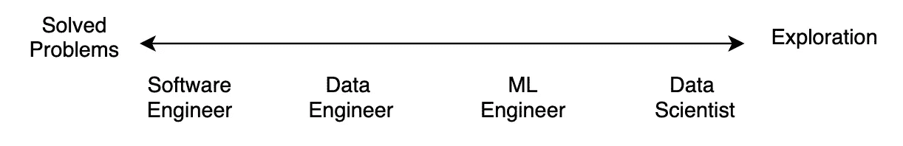
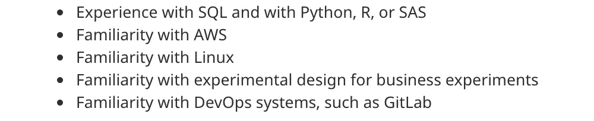

# 不要成为数据科学家

> 原文：<https://towardsdatascience.com/dont-become-a-data-scientist-ee4769899025?source=collection_archive---------0----------------------->

## 意见

## 当有人问我如何进入数据科学时，我给出的建议是。而是成为一名软件工程师。

这是一篇观点文章。我很想听听你下面的反驳。

每个人和他们的祖母都想成为一名数据科学家。尽管数据科学可能是 21 世纪[最性感的工作](https://hbr.org/2012/10/data-scientist-the-sexiest-job-of-the-21st-century)，但这却低估了另一个回报丰厚、薪酬丰厚的职业——软件工程师。

我经常收到新毕业生和转行者的信息，询问我关于进入数据科学的建议。我告诉他们要成为一名软件工程师。

在这两方面都有经验，我会试着说服你成为后者。

# 1.有更多的软件工程工作

与数据科学相比，软件工程的工作数量要多一个数量级。

下面是谷歌搜索“**数据科学家”**和**“软件工程师”**职位后的几张截图。

谷歌:美国数据科学家

谷歌:的确是美国软件工程师

与 53，893 份软件工程工作相比，这是 7616 份数据科学工作。这只是美国的就业情况，但其他国家也显示了类似的结果。

根据 Glassdoor 的说法，数据科学家赚的钱更多，但我未经验证的假设是，数据科学工作平均来说也更高级。

[www.glassdoor.ca](http://www.glassdoor.ca)

[www.glassdoor.ca](http://www.glassdoor.ca)

也就是说，如果你在 Open AI 获得了 100 万美元的薪水，我建议你接受。

# 2.“数据科学”是什么意思，还没有达成共识

管理层通常对“数据科学”的含义没有共识。也有可能由于业务限制，他们没有严格遵循角色框架的奢侈。

这意味着“数据科学家”的职责因公司而异。

速写

虽然软件工程师和数据科学家之间可能存在一个理想的角色范围，但它不太可能在现实中得到遵循。这尤其适用于仍在建设基础设施的初创企业。

被雇佣的候选人最终会致力于公司当前需要解决的问题，而不是他们可能被雇佣的“角色”。

Marc-Olivier Jodoin 在 [Unsplash](https://unsplash.com/s/photos/reality?utm_source=unsplash&utm_medium=referral&utm_content=creditCopyText) 上拍摄的照片

来自该领域同事的轶事证据表明，许多数据科学家发现自己像软件工程师一样编写后端代码。我认识其他在 excel 中处理财务数据的“数据科学家”。

这与你在 Kaggle 竞赛中长大时的预期形成了鲜明的对比。

# 3.数据科学是孤立的

大多数公司不需要像软件工程师那样多的数据科学家。其他公司正在招聘他们的第一位数据科学家。

由于这个原因，许多数据科学家最终只能独自工作，即使他们与开发人员坐在同一张桌子上。

这使得获得反馈和第二意见变得困难。软件工程师要么不懂预测建模，要么忙于解决完全不同的问题。

相比之下，在软件工程团队中的一个额外好处是能够对同事说，“我认为我们应该以 XYZ 的方式实现 ABC。你怎么看？”。

准备好和自己……[或一只橡皮鸭](https://en.wikipedia.org/wiki/Rubber_duck_debugging)进行这样的对话。

# 4.数据科学是探索性的

准备好与管理层进行尴尬的对话，讨论为什么你花了两周时间买的东西不能用了。

处理已解决和未解决的问题是软件开发和人工智能之间的一个基本区别。

除了缺陷和限制，你在开始任何工作之前就知道大多数软件工程项目是否可行。对于 ML 来说就不一样了，你不知道一个模型是否有效，直到你建立了它。

# 5.公司还没有为人工智能做好准备

即使在一个[每个公司都是 AI 公司](https://techcrunch.com/2020/02/25/when-that-ai-company-isnt-really-an-ai-company/)的时代，大多数也没有支持它的基础设施，甚至不需要它。

一家快速扩张的初创公司的数据科学主管最近在喝咖啡时分享了一些建议。

> 首先你要找出问题，然后你要建立基础设施，然后你要引进数据科学家。这不是一个快速的过程。(我转述)

另一个知名公司的数据科学第一名员工最近向我透露。她被迫在笔记本电脑上而不是在云中根据大数据训练人工智能模型。

如果你是在没有具体问题需要解决的情况下入职的，或者公司没有为数据科学做好准备，你可能会发现自己很难增加价值。

# 6.软件工程教授通用技能

成为一名初级软件工程师就像获得一个技术 MBA 学位。你什么都能学到一点。

您将学习数据库、云技术、部署、安全性和编写干净的代码。

通过观察你的 scrum 领导者、高级开发人员或项目经理，你将学会如何管理构建软件。

你将通过代码评审获得指导。

如果你进入一家拥有成熟工程团队的公司，几乎可以保证你会很快提升自己的技能，并建立一个多面手的背景。

# 7.软件工程更容易移植

通过提供更全面的技术体验，当你决定是时候改变时，软件工程提供了更好的退出机会。

开发运维、安全性、前端、后端、分布式系统、商业智能、数据工程、数据科学…

我认识一些从软件转向数据科学的开发人员。如果你浏览一下数据科学的工作描述，你会立即注意到它们充斥着核心软件开发技能。

来源:确实如此(我在这里摘樱桃)

如果你能构建端到端的项目，那么你不仅能为 Kaggle 构建一个模型。你可以采用这种模式，将其生产化，设置授权和分条，然后开始向用户收取访问费用。那是你自己的创业。

我从不认为数据科学是不可转移的。根据数据做决定是一项杀手锏。但随着我们越来越受数据驱动，这也将成为每项工作的一部分。

# 8.机器学习将成为软件工程师的工具

随着人工智能变得商品化和更容易使用，软件工程师将开始使用它来解决他们的问题。

我可以在一个下午教一个开发者构建 Sklearn 分类器。这并不意味着他们可以构建下一个 AlphaGo，但这确实给了他们一种替代基于用户输入的硬编码条件逻辑的方法。

数据科学家拥有统计学等专业知识，以及对模型如何工作的直觉。但是 DevOps 和安全工程师也有他们自己的专业知识。

我认为这些更多的是共性而不是差异。一个经验丰富的软件专业人员可以在专业之间转换，其速度比一个新进入者选择专业的速度快一个数量级。

虽然我不认为我们会看到数据科学完全合并到软件工程中，但感觉数据科学可能会成为另一个软件工程专业。

# 9.人工智能不会取代软件工程师

虽然听起来很傻，但我在 2014 年进入了软件工程领域，因为我担心人工智能会让其他所有工作都变得过时。

照片由[张秀坤镰刀](https://unsplash.com/@drscythe?utm_source=unsplash&utm_medium=referral&utm_content=creditCopyText)在 [Unsplash](https://unsplash.com/s/photos/robot?utm_source=unsplash&utm_medium=referral&utm_content=creditCopyText) 上拍摄

然而从那以后，表盘几乎没有离开过特定的环境。技术采用缓慢，人工智能比媒体让你相信的要狭隘。

与其他职业相比，机器学习离自动化软件工程更远。虽然我们有初创公司在开发像[人工智能支持的代码完成](https://www.codota.com/)这样的酷产品，但编写代码并不是真正的工作。工作是用技术解决问题。

前奇点，这将仍然是一个有价值的高薪技能。

# 结论

首先，这是轶事。其次，我意识到我把数据科学家、ML 工程师和 AI 研究人员混为一谈了。但我觉得这些论点还是值得考虑的，鉴于这是你的职业。

不要太认真。我更希望你研究一下，自己做决定。这毕竟是作为数据科学家的一部分:)。

在一天结束的时候，我们被支付来解决问题。