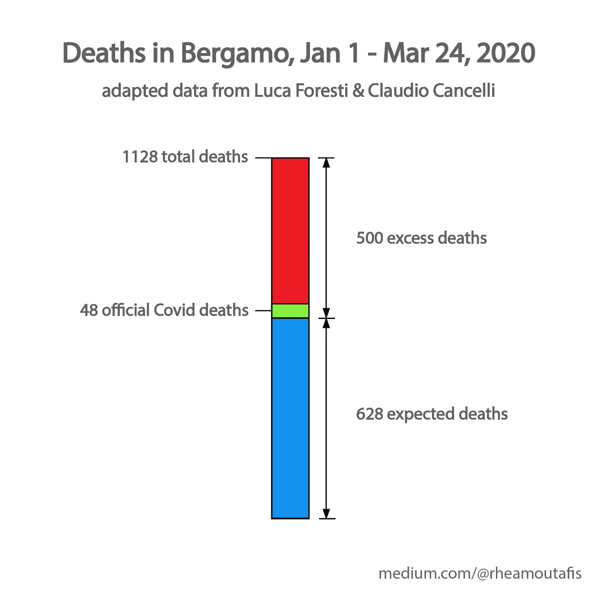
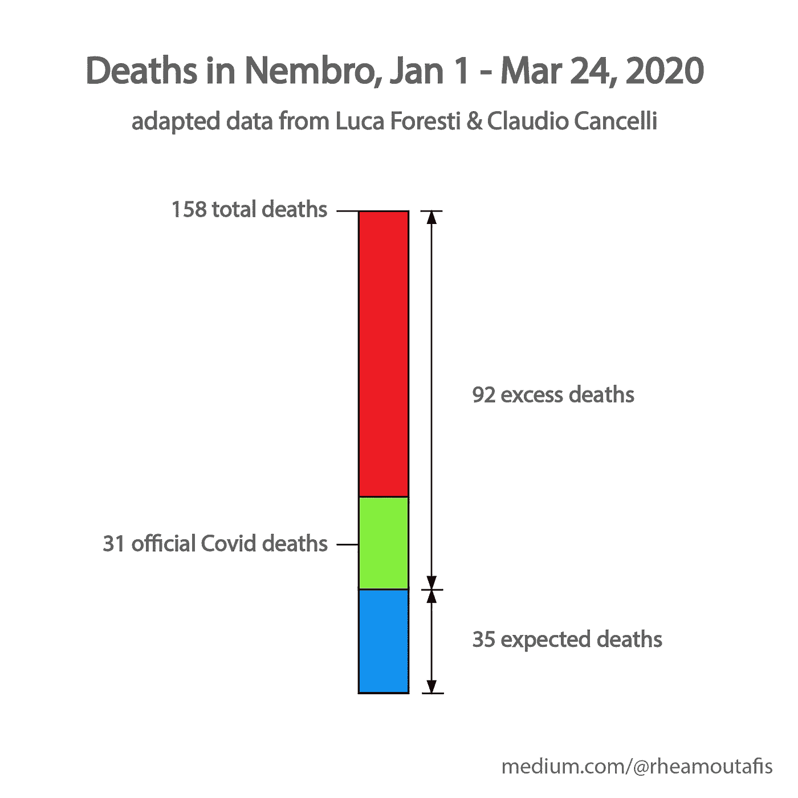

# 不要相信任何关于冠状病毒的数字

> 原文：<https://towardsdatascience.com/dont-believe-any-numbers-on-coronavirus-9c5d6a971bef?source=collection_archive---------5----------------------->

## 每个国家的官方 COVID 数据都是假的，这是有科学依据的

不要相信你看到的一切。在 [Unsplash](https://unsplash.com/s/photos/coronavirus?utm_source=unsplash&utm_medium=referral&utm_content=creditCopyText) 上 [engin akyurt](https://unsplash.com/@enginakyurt?utm_source=unsplash&utm_medium=referral&utm_content=creditCopyText) 拍摄的照片

  I 众所周知，来自[官方渠道](https://coronavirus.jhu.edu/map.html)的冠状病毒病例被严重低估了。在大多数国家，人们只有在出现症状时才会接受检测。这一点显而易见，因为大部分病例是轻微的或无症状的，而且这些[没有被广泛报道](https://static.poder360.com.br/2020/03/science-estudo-coronavirus-contagio-documentacao-16-mar-2020.pdf)。

因此，在一个天真的近似值中，我一直假设感染人数比官方统计的数字高五倍。我从大约五分之一的病例中推断出这一点。

另一方面，我认为死亡人数是相当可靠的——毕竟，如果病人有可能死亡的严重症状，他们会去看医生。医生肯定会让他们做测试。

至少我是这么认为的。

我错了。

 [## 为什么我们绝对没有过度宣传冠状病毒

### 我用官方数据计算了六个月内有和没有社会距离的估计死亡人数。事实可能比我的模拟还要糟糕。

towardsdatascience.com](/why-we-are-definitely-not-over-hyping-coronavirus-f69a8d3cc091) 

我灵光一现的时刻来自于与 Luca Foresti 的一次谈话，他是意大利北部一家专业诊所网络 Centro Medico Santagostino 的首席执行官。我问过他为什么意大利的死亡人数这么高。

10 分钟后，我对官方数字的全部信心都破灭了。

Foresti 的方法很简单:拿一个城市过去几年的死亡人数——总有人会死——和现在的死亡人数比较。由于越来越多的人死于电晕，与过去相比，你会看到更多的死亡人数。

在一个理想的世界中，这一超额死亡人数将等于官方公布的死于电晕的人数。你可以多给或少给一些，因为更多的人可能没有得到足够的其他疾病的医疗保健，而较少的人死于车祸。

*但现实却大相径庭。*

作为一个例子，Foresti 分析了意大利北部伦巴第的两个城市的数据:据[纽约时报](https://www.nytimes.com/interactive/2020/03/27/world/europe/coronavirus-italy-bergamo.html)报道，贝加莫是欧洲受灾最严重的城市。Nembro 是附近的一个村庄，当你考虑到人均死亡人数时，它受到的打击更大。

在贝加莫，如果我们对 2015 年至 2019 年的死亡人数进行平均，从今年年初到 3 月 24 日的[预计死亡人数为 628 人。2020 年的死亡人数几乎是现在的两倍。只有十分之一的额外死亡与新冠肺炎有关。](https://www.corriere.it/foto-gallery/politica/20_marzo_26/nembro-and-bergamo-data-analysis-4804734e-6f3c-11ea-b81d-2856ba22fce7.shtml)

现在，人们可以得出结论，在意大利的许多地方，死亡率甚至比你从官方数字中预期的还要高。但这不太可能。

即使你考虑到意大利人口相当老龄化，而且许多人因为医院人满为患而无法得到充分的护理，这也无法解释意大利的死亡人数。唯一的解释是，意大利已经有很多人被感染了。

让我们假设每个国家的死亡率大致相同。由于人口的年龄和医疗保健的可获得性，你不得不做出一些让步，但我们很快就会看到，这不会发挥如此大的作用。

研究死亡率的一个很好的例子就是[钻石公主](https://www.medrxiv.org/content/10.1101/2020.03.05.20031773v2.full.pdf)。游轮断电数周，船上每个人都接受了测试。病死率为 1.1%。

再比如[韩国](https://www.ijidonline.com/action/showPdf?pii=S1201-9712%2820%2930150-8)。这个国家很早就开始大规模测试，所以它的数据多少是可靠的。早期的病死率约为 0.7%。

这两个比率之间的差异完全可以用这样一个事实来解释:游轮上的人平均来说[相当老](https://www.niid.go.jp/niid/en/2019-ncov-e/9407-covid-dp-fe-01.html)，而南韩的人口[相当年轻](https://en.wikipedia.org/wiki/Demographics_of_South_Korea#Age_structure)。

由于贝加莫的人口年龄较大，让我们假设意大利的病死率约为 1.1%。如果我们天真地假设所有超额死亡都是由电晕引起的，那么该镇目前约有 45，000 人被感染或已经康复。这大约是贝加莫五分之二的人口。

贝加莫郊区奈姆布罗的情况更为极端。根据 2015-2019 年的死亡人数，预计会有 35 人死亡。但是今年，死亡人数增加了五倍。

虽然报道的电晕相关死亡的比例高于贝加莫——四分之一的超额死亡归因于该病毒——但对该村的影响甚至更严重。不仅 72%的人已经感染了冠状病毒。更糟糕的是，在不到三个月的时间里，内布罗 0.8%的人口死于电晕相关的死亡。

## 底线是:更多的人正在死去

全国范围内的全因死亡人数很难获得。但是这两个意大利小镇的例子表明了一件事:死于电晕的人数是官方统计的四倍，甚至十倍。

让我们不要以此怀疑我们的政府。他们只是想做好自己的工作，拯救人们的生命。

相反，让我们把这作为一个警告，看看这种病毒有多致命。让我们照顾老人和弱者。当然，让我们#呆在家里。这已经拯救了成千上万人的生命。

***编者按:*** [*走向数据科学*](http://towardsdatascience.com/) *是一份以数据科学和机器学习研究为主的中型刊物。我们不是健康专家或流行病学家，本文的观点不应被解释为专业建议。想了解更多关于疫情冠状病毒的信息，可以点击* [*这里*](https://www.who.int/emergencies/diseases/novel-coronavirus-2019/situation-reports) *。*