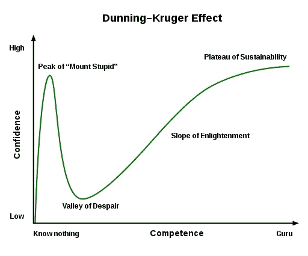

# 不要让数据科学民主化

> 原文：<https://towardsdatascience.com/dont-democratize-data-science-bd638c4e7957?source=collection_archive---------26----------------------->

图片来自 [Pixabay](https://pixabay.com/?utm_source=link-attribution&utm_medium=referral&utm_campaign=image&utm_content=3157821) 的 Artsy Solomon

## 意见

## 大量的在线课程和工具有望使该领域民主化，但仅仅学习一些基本技能并不能成为一名真正的数据科学家

很少几年，一些学术和专业领域在大众的想象中获得了很高的声望。现在，这个领域就是数据科学。因此，很多人都想进入这个领域。此外，新闻媒体称数据科学很性感，各种学术机构承诺在几个月内将你培养成数据科学家，你已经得到了灾难的完美配方。

当然，作为一名数据科学家本人，我不认为问题在于人们选择数据科学作为职业。如果你对处理数据、理解商业问题、钻研数学感兴趣，并且热爱编码，你很可能会在数据科学领域取得成功。你将有很多机会使用数学和编码来开发解决问题的创新方案，并且可能会发现这项工作是有回报的。这里的主要问题是，人们进入这个领域的动机往往是有缺陷的。

对一些人来说，吸引力在于金钱，而另一些人则喜欢这个名字的发音。更糟糕的是，有些人可能只是在回应我们社会灌输的从众心理。例如，不久前，每个毕业生都渴望攻读 MBA。我自己也有同样的罪过。通过了 GMAT 测试和几次被拒后，我才意识到我并不是真的想要这个学位。最终，这些拒绝是发生在我身上最好的事情，因为在那之后，我终于将数据科学视为一种选择。一旦我进入其中，我发现我喜欢所涉及的数学，以及我使用数据科学来帮助企业解决问题的所有不同方式。

> 今天，我看到数据科学不知何故获得了 MBA 曾经拥有的同等地位。

很多人都想做，但是他们不知道这份工作到底需要什么。这导致许多人自称为数据科学家，并做出许多糟糕的决策。事实上，很多考虑进入这个行业的人可能甚至不知道数据科学是什么。

今天，由于有如此多的材料，整个领域都变得民主化了。来自最好的导师的大量 MOOCs 涵盖了从基础到高级的概念，你可以很容易地找到让你只用几行代码就能创建模型的包。

我真的很喜欢有这么多学习和实践数据科学的资源这一事实。但是这种民主化本身也产生了一些问题。在这篇文章中，我想简要地看看这些问题以及它们可能对这个领域产生的不利影响。

# 自动化数据科学？

许多 AutoML 软件包旨在使数据科学大众化。它们提供了一个模型库，自动化超参数调优过程，有时还提供了一种将这些模型投入生产的方法。这种软件包的可用性使许多人认为数据科学可以完全自动化，完全消除了对数据科学家的需求。或者，如果流程不能自动化，这些工具将允许任何人成为数据科学家。

我真心不同意。我发现这样的代码库有时很有用，但是它们纯粹从编码的角度来看待数据科学。

> ***在我看来，除了建模，数据科学还涉及很多工作。***

数据科学的工作包括理解和识别手头的问题，并设置正确的评估指标。你还必须分析项目的盈利能力:大多数企业不想把钱花在对底线没有积极影响的项目上。您可以使用现有的数据，但是有时您可能需要想办法建立新的数据管道来收集数据以解决问题。这需要与利益相关者交谈，并获得对问题的整体理解。数据科学家还需要能够执行数据管理和特征创建，以从现有模型中获得更多性能。最后，模型测试和设置反馈循环需要与业务部门进行无休止的讨论，并且对于每个项目来说都非常具体。仅仅运行代码的人可能无法为这样的讨论增加价值，因为他们并不真正理解他们在 AutoML 中使用的模型背后的东西。

接下来是领域知识的问题。在零售领域中可以接受的流程在金融领域中并不适用，在金融领域中，一个小小的变化就可能导致您的客户损失很多钱。有些事情就是不能自动化，因为它们需要领域知识和对你正在处理的业务的理解。

> 更重要的是，如果一个项目不工作或者如果你的模型在生产中失败了，自动化管道不能负责。

一个好的数据科学家会试图找出解决生产问题的方法，同时创建一个特定于项目的机器学习管道来缓解这些问题。

# 代号跑者的心态

我开始怀疑我所谓的新数据科学家。几乎每天，我似乎都会遇到一个自称为数据科学家的人，而他们只是美化了的代码运行人员，这指的是一个只是运行代码而不了解代码背后发生了什么的人。有这么多学院和机构提供基于训练营的课程，现在有大量的代码跑者。

我收到很多请求，有人问我他们是应该参加 XYZ 学院的认证课程还是 ABC 学院的训练营。我的答案是都不是。我发现这些承诺让数据科学家成群结队的研究所主要只是在赚钱的生意。最终，翻阅几本笔记本和运行别人的代码并不能让一个人真正成为数据科学家。

别误会我的意思。如果有人通过自上而下的方法学习得最好，他们首先运行一些代码，然后深入阅读代码背后的原理，这是非常好的。然而，数据科学不仅仅是运行代码。在你真正理解所有代码背后的数学和理论之前，你还没有掌握数据科学。

# 邓宁-克鲁格效应

[来源](https://commons.wikimedia.org/wiki/File:Dunning%E2%80%93Kruger_Effect_01.svg):维基共享

邓宁-克鲁格效应是一种认知偏差,在这种情况下，对某个主题略知一二的人高估了自己的能力，因为他们没有意识到自己实际上知道的有多少。我经常在数据科学中看到这种情况。事实上，它在这个领域可能比其他任何领域都更加突出！

我倾向于认为这是一种新手效应。这是一个在学习一项新技能的早期阶段困扰人们的问题。在我看来，数据科学家的旅程分为三个阶段。

*   **Dunning-Kruger 阶段—** 您创建了自己的第一个模型，并认为自己了解数据科学的所有知识。
*   **“我什么都不知道”阶段—** 你去参加一个会议或和你的同事聊天，突然意识到还有很多东西要学。
*   **“终身学习”阶段—** 你不得不承认，总会有一些你不知道的东西刚刚被引入，因此追求数据科学需要终身学习。

现在，大多数初学者都会面临邓宁-克鲁格效应。运行你的第一个程序并完美执行它的快乐真的把你带到了世界的顶端。在这个阶段完全没问题。当新来者无法及时离开这个阶段并进入下一个阶段时，问题就来了。我见过一些人陷入这个阶段，因为他们带着错误的期望进入了数据科学，认为它很性感，很刺激，但不了解这个领域的深度。这些类型的人倾向于认为他们可以使用现有的模型来解决问题，他们不需要理解数学。

例如，我最近采访了一个在这个领域有两年经验的人。他似乎很自信。他在工作中使用了数据科学，并参与了几个 Kaggle 项目。面试的前几分钟进行得非常顺利。他很好地解释了更高层次的概念，以至于我决定更深入地挖掘他对他在项目中应用的技术的数学理解。这就是事情发生变化的地方。我让他给我讲一下日志丢失功能。当他说:*但是我们有做这一切的包**我意识到这个家伙从来没有离开过第一阶段。***

# ***结论***

***现成的软件包和课程的可用性正在使数据科学领域民主化。但是这份工作更多的是来自实践经验、与人交流以及能够倾听不同的观点。***

***因此，虽然有些人可能认为数据科学是一项纯粹的编码工作，但它不仅仅是成为编码巨星。***

***它是关于找到对业务有用的正确问题，并提出解决这些问题的最佳方法。要做到这一点，你需要领域知识、谦逊、一点数学知识，最重要的是，终身学习的愿望。***

***如果你想学习数据科学，我想调出吴恩达的这个 [***精品课程***](https://www.coursera.org/learn/machine-learning?ranMID=40328&ranEAID=lVarvwc5BD0&ranSiteID=lVarvwc5BD0-btd7XBdF681VKxRe2H_Oyg&siteID=lVarvwc5BD0-btd7XBdF681VKxRe2H_Oyg&utm_content=2&utm_medium=partners&utm_source=linkshare&utm_campaign=lVarvwc5BD0) 。这是我开始的原因。***

**谢谢你的阅读。将来我也会写更多初学者友好的帖子。在**关注我或者订阅我的 [**博客**](http://eepurl.com/dbQnuX) 了解他们。一如既往，我欢迎反馈和建设性的批评，可以通过 Twitter [@mlwhiz](https://twitter.com/MLWhiz) 联系。****

****此外，一个小小的免责声明——这篇文章中可能会有一些相关资源的附属链接，因为分享知识从来都不是一个坏主意。****

*****这个故事最初发表于* [*此处*](https://builtin.com/data-science/dont-democratize-data-science) *。*****