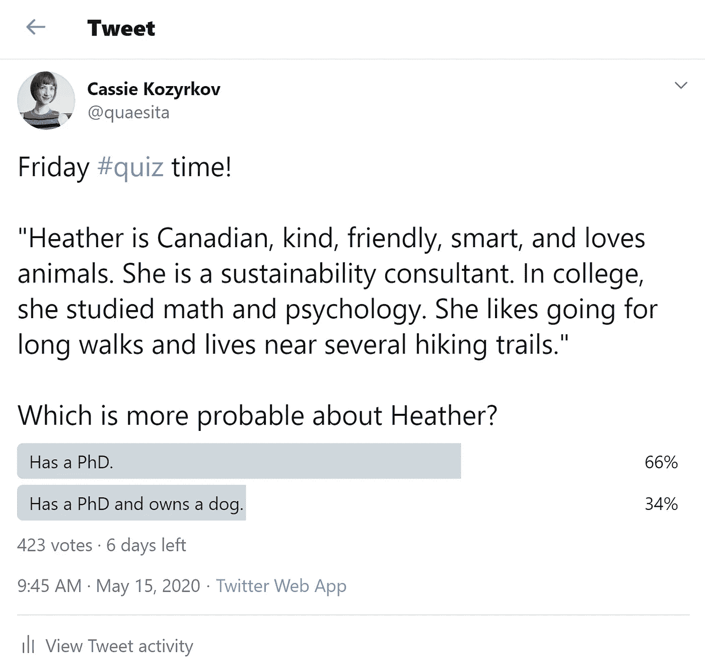

# 不要陷入合取谬误！

> 原文：<https://towardsdatascience.com/dont-fall-for-the-conjunction-fallacy-d860ed89053e?source=collection_archive---------10----------------------->

## 心理学与统计学相结合，揭示了你的刻板印象欺骗你的另一种方式

# 测验时间！

希瑟是加拿大人，善良，友好，聪明，喜欢动物。她是一名可持续发展顾问。在大学里，她学习数学和心理学。她喜欢长途散步，住在几条徒步旅行路线附近。

关于希瑟哪个可能性更大？

1.  希瑟有博士学位。
2.  希瑟拥有博士学位，并拥有一只狗。

在进一步阅读之前，请在[推特投票](https://twitter.com/quaesita/status/1261291522026278912)上分享你的答案。

对于那些喜欢把名字和面孔联系起来的人来说，推特上的测试问题的主角是[希瑟](https://bit.ly/heathermann)(在右边)，她是我读研以来最好的朋友。那是我们在塔吉克斯坦的 Hisor 要塞，那时菜单上还有国际旅行。

在撰写本文时，以下是调查结果:

我很好奇这篇文章的警告标题是否会将答案的分布转向更极端的分裂。

好消息是，大约 66%的观众正确回答了选项(1)。坏消息是，由于我的读者主要是数据科学的爱好者，其他 34%的人应该知道不要陷入合取谬误！

# 什么是合取谬误？

除了聪明人曲解事实并让他们的偏见泛滥的另一种方式，合取谬误是认知启发(经验法则)失控的一个典型例子。

> 选项 2 给了你一个额外的犯错机会。

理想的启发是选择选项 1 ( *希瑟拥有博士学位*)，因为选项 2 ( *希瑟拥有博士学位，希瑟拥有一只狗*)给了你一个额外的犯错机会。你犯错的机会越多，你就应该越谨慎。不幸的是，并不是每个人都使用这一经验法则，而是更喜欢妄下结论。

> 你的结论越详细，就越站不住脚。

统计学家和科学家受过训练，懂得更精细的结论需要更多的证据。否则，你的结论越华丽，它就变得越脆弱。

> 合取谬误让你的偏见横行。

问题从来不是关于希瑟有没有养狗。相反，它是关于你是否意识到一个结论比另一个更复杂。

> 问题从来不是希瑟有没有养狗。

由于“希瑟拥有博士学位”是两个选项的一部分，这个问题本质上是问你，*“希瑟拥有一只狗的概率超过 100%？”概率介于 0 和 100%之间，所以这是不可能的；你可以 1000%确定答案是否定的，当你逻辑推理出来，答案是 P(A) ≥ P(A ∩ B)一样明显。*如果你不习惯这种符号，我在下面加了一个脚注，教你如何阅读这些象形文字。*

> 数据新手和科学家的区别在于，科学家是极其不情愿地得出结论的。

这里欺骗你的错觉是，每当一个精心设计的结论符合你的刻板印象时，它对你来说就像是一个不太精心设计的选择。除非你集中注意力，否则你不会意识到你已经越过了你的证据所证明的复杂程度，现在你主要是在抓救命稻草。新手[分析师](http://bit.ly/quaesita_battle)因此臭名昭著，他们兴高采烈地[从 10 个](http://bit.ly/quaesita_inkblot)[数据点](http://bit.ly/quaesita_slkid)中吸取 200 个推断，直到他们被比他们更有能力的[长辈训练成遵守分析的黄金法则](http://bit.ly/quaesita_hero)。

> 刻板印象+可用性偏差=妄下结论

问题是，当你没有逻辑推理的时候，你会回到你的刻板印象中。典型范例更容易描绘，因此它们可能会触发一个反馈循环，其中包含 ***可用性*** [***偏差***](http://bit.ly/quaesita_biasdef)***:****“一个例子越容易浮现在脑海中，你分配到它的类别的可能性就越大。”*

以下是可用性偏见让你说出的一些愚蠢的事情:

*   “我们同意五五分账洗碗，但结果是我洗碗的次数比我的配偶还多。”
*   *“以 K 开头的英语单词比以 K 为第三个字母的英语单词多。”*
*   暴力犯罪正在上升

(如果你想让我写一篇文章解释可用性偏见以及为什么这种说法往往是错误的，[转发](https://twitter.com/quaesita/status/1261418298383781889)是我最喜欢的动机。)

# 刻板印象:给可用性添加精心设计的侮辱

合取谬误是雪上加霜:你的思维似乎对你的可用性驱动的经验法则可能存在例外的想法过敏。

> 你对你的经验法则可能有例外的想法过敏吗？

因此，我们表现得好像一个类别中符合我们触发的刻板印象的人比整个类别中的总人数还要多。博士养狗怎么会比博士多？当你停下来想一想，你会发现这种推理很离奇，但不幸的是，我们往往没有慢下来足够长的时间来为自己感到惊讶。

> 你的偏见诱使你做出过于复杂的结论。

我再给你看两个例子，希望你不会上当。

# 测试一定是对的

琳达**住在纽约市。她在三月份患了严重的咳嗽，不得不休息一段时间来康复。她想知道自己是否患有 [*【新冠肺炎】*](http://bit.ly/quaesita_covid10) *并接受了抗体测试。*

琳达哪一个更有可能？

1.  琳达测试呈阳性。
2.  琳达测试呈阳性，她使用的测试程序非常准确。

现在你看到了这种模式，你会注意到这种思维是一种可爱的方式，让你的大脑欺骗你比以前“学习”得更多。也许她被一个看手相的人测试过。也许她的医生使用了一种敏感性和特异性都不确定的测试工具。(你对当前抗体测试的质量有什么看法？)保持警惕，并有纪律来阻止自己将那个小小的关联附加到你从社交媒体源中获取的[信息上。](http://bit.ly/quaesita_confirmation)

# 雇佣“艺术”人士

凯西热爱艺术、戏剧和旅行。她在大学里选修了历史和人文课程。她收藏了大量的诗集，许多晚上都在写散文。

关于凯西哪个可能性更大？

1.  凯西喜欢写作。
2.  凯西喜欢写作，但数学很差。

对于那些没有注意到作者名字的人，嗨！你的作者凯西有数理统计的研究生学位，所以我希望你不要拿她的诗集来反对她。

如果你聪明，你会认为(1)比(2)更有可能。越谨慎的结论总是越安全。如果你不能控制你的偏见，你可能不会意识到你过于自信地基于偏见而不是证据下结论。

> 越谨慎的结论总是越安全。

# 有什么意义？

无论何时有不确定性，你都可以保持开放的心态。没有人强迫你在希瑟养狗还是凯西擅长数学的问题上表明立场——你总是可以做出开明的选择。每一次，问题本质上都是问你是否有足够的证据完全排除其他可能性……而每一次答案都应该是*不*。

> 不要觉得不得不跳到最复杂的结论上！你可以保持开放的心态。

即使你认为你有一个不错的经验法则，也不要忘记例外是可能的，从而搬起石头砸自己的脚。如果你忍不住跳到最复杂的结论，你的世界观中迅速膨胀的误差幅度应该是巨大的！不要浑浑噩噩地过完一生，而不去适应它。

> 即使你认为你有一个不错的经验法则，也不要忘记例外是可能的，从而搬起石头砸自己的脚。

你能给自己的最好习惯是记住，除了你在幼儿园学会的两个结论——(a)某事是真的和(b)某事是假的——通常还有更好的选择:(c)让我们保持开放的心态，直到有压倒性的证据。

> 当证据迫使你下结论时，下结论只是一种美德。过度自信并不是什么值得骄傲的事情。

唉，你们中的一些人会读完这篇文章，然后走开，不明白为什么你的选择是错误的(2)。如果是这样的话，扔掉带有“艺术”兴趣证据的完美工程简历，在你的认知犯罪清单上可能是相对次要的。

# 希瑟有一只狗吗？

在这里了解！

# 感谢阅读！喜欢作者？

如果你渴望阅读更多我的作品，这篇文章中的大部分链接会带你去我的其他思考。不能选择？试试这个:

 [## 你理性地做决定吗？

### 两个来自行为经济学的场景来测试你自己

towardsdatascience.com](/do-you-make-decisions-rationally-d12a0eb9c89b) 

# 人工智能课程怎么样？

如果你在这里玩得开心，并且你正在寻找一个为初学者和专家设计的有趣的应用人工智能课程，这里有一个我为你制作的娱乐课程:

在这里欣赏整个课程播放列表:[bit.ly/machinefriend](http://bit.ly/machinefriend)

# 脚注

## *象形文字

由[全概率定律](https://bit.ly/lawoftotalprob)(以及常识)，P(A) = P(A ∩ B) + P(A ∩ B`)。

因此 P(A) ≥ P(A ∩ B)因为 P(A ∩ B`) ≥ 0，因为现在概率起作用了(根据定义，它们总是在 0 和 1 之间)。

以下是如何阅读这些象形文字:

*   **P()** 读作*“概率…”*
*   **A** 代表一个事件，例如:“*希瑟获得了博士学位。”*
*   **B** 代表另一个事件，例如*希瑟拥有一只狗*
*   ∩读作*和*
*   B `读作*“非 B”*
*   **≥** 表示*“…不会输给…”*

所以，换句话说:****的概率(希瑟拥有博士学位)等于** **的概率(希瑟拥有博士学位并拥有一只狗)加上(希瑟拥有博士学位并不拥有一只狗)的概率。**因为最后一点不可能是负的，(希瑟有博士学位)是最有可能的事情。**

**感兴趣的读者可以在这里找到我对概率基础[的随意介绍。](http://bit.ly/quaesita_bday)**

## *** *琳达**

**合取谬误最著名的论证也被称为**琳达问题**，它是以[卡尼曼和特沃斯基](https://bit.ly/conjunctionfallacywiki)使用的一个经典例子命名的:**

**琳达 31 岁，单身，直言不讳，非常聪明。她主修哲学。作为一名学生，她深切关注歧视和社会正义问题，还参加了反核示威。**

**哪个可能性更大？**

1.  **琳达是银行出纳员。**
2.  **琳达是一名银行出纳员，积极参加女权运动。**

**到目前为止，我希望你已经抑制住了回答(2)比(1)更有可能的冲动。如果没有，你就错过了这个故事的全部寓意:**

> **无论哪里存在不确定性，保持开放的心态都是一个可靠的习惯。这样，你在生活中犯错的事情会更少。**

## *** * *语言误解**

**一些人出于语言误解为选项 2 辩护，认为人们会把选项(1)理解为“有博士学位，没有养狗”。“我认为看到不存在的东西是问题的一部分。再说一次，没有人强迫你跳到更复杂的结论。如果有疑问，为什么不谨慎行事呢？**

> **看到不存在的东西是问题的一部分。**

# **与凯西·科兹尔科夫联系**

**让我们做朋友吧！你可以在[推特](https://twitter.com/quaesita)、 [YouTube](https://www.youtube.com/channel/UCbOX--VOebPe-MMRkatFRxw) 、 [LinkedIn](https://www.linkedin.com/in/kozyrkov/) 上找到我。有兴趣让我在你的活动上发言吗？使用[表格](http://bit.ly/makecassietalk)取得联系。**