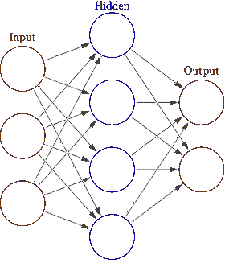

# 不要忘记深度学习中的“深”是什么意思

> 原文：<https://towardsdatascience.com/dont-forget-what-deep-learning-actually-mean-2ab801bdbe31?source=collection_archive---------38----------------------->

批判性地思考你是否真的需要深度学习。

## *在你作为一家人工智能初创公司将深度学习应用于你的客户数据之前，首先批判性地思考你的客户数据的基本统计数据——记下数据集中的偏差——并问你自己深度学习是否真的有必要在该数据集中使用，或者你是否可以使用其他统计/ML 方法。*

深度学习是人工智能中“最热门”的事情之一，它有一种渗入流行文化的方式，因为这种神秘的软件可以在计算机视觉、语音识别或玩围棋等游戏、推荐我们最喜欢的电影等方面以人类水平的准确度进行看似惊人的分类。

但深度学习有着至关重要的陷阱，当它驾驶的汽车不幸地不止一次因为愚蠢的图像识别错误而伤害或杀死司机或行人。或者，当深度学习被用于面部识别时——这显然对有色人种、LGBT 和其他边缘化群体有负面影响——如果深度学习的面部预测被有种族主义、LGBT 恐惧症和在私营公司和政府之间来回折腾的[的权力机构使用——深度学习的陷阱会被可怕地放大。](https://www.theverge.com/2018/10/23/18013376/amazon-ice-facial-recognition-aws-rekognition)[另一个例子是，2017 年底，脸书的深度学习神经翻译机器导致一名巴勒斯坦男子因发表帖子而被非法逮捕。如果你认为这些是“智能系统”犯下的“不可避免的错误”,你显然没有抓住要点。深度学习实际上](https://www.theguardian.com/technology/2017/oct/24/facebook-palestine-israel-translates-good-morning-attack-them-arrest)[只是一个统计关联工具](https://people.orie.cornell.edu/davidr/or474/nn_sas.pdf)，这与这篇文章的标题有关。

看到中间只有一个蓝色的隐藏层了吗？“深度”学习必须有 2 个或更多。

在人工神经网络的上图中，由于只有一个隐藏层，这个神经网络被认为是*浅*。如果你插入至少*两个*隐藏层或更多，它被认为是一个“深”神经网络。这就是深度学习的“深度”部分。

## 深度学习中的“深”并不代表深刻、抽象的理解。它不像人类那样理解抽象概念。

“深”仅仅意味着*网络*在长度上是深的。[这里有一篇来自*The Atlantic:Technology*](https://www.theatlantic.com/technology/archive/2018/01/the-shallowness-of-google-translate/551570/)*的文章显示，尽管谷歌翻译使用深度学习，但其神经翻译，即人工智能系统，再次使*愚蠢的*翻译错误超过人类标准。*

*现在，深度学习的*“*学习”部分怎么样了？当然，它必须模仿人类的学习能力，因为它的结构就像大脑中的神经元一样！*

*没有。想想看:如果深度学习模仿人类学习如此之好，以至于可以通过图灵测试(一个人类会被深度学习系统愚弄)，就不会有 *Nature* 中的 [**一篇文章详细描述深度学习系统如何犯了以人类标准衡量的愚蠢错误**](https://www.nature.com/articles/d41586-019-03013-5)。请记住，如果深度学习应该像人类学习一样，我们应该以人类的标准来判断它。深度学习的先驱之一 Geoffrey Hinton 表示，他对神经网络作为解释人类或人工智能的一种方式深感怀疑。*

*深度学习是这样做的:它近似于一个函数，一个映射。例如:如果你有一个病人健康记录的数据库，你必须根据一些训练集来预测病人应该接受治疗 A 还是治疗 B，你可以在这个集上训练一个深度学习网络。它所要做的，是从病人 x 记录到治疗的近似直接映射。原谅我，我要借用一下数学符号。*

*说 *X =患者记录*，而*Y = {治疗 A，治疗 B}* 。通常机器学习中标签的编码方式是 0 和 1 所以 *Y = {1，0}。**

*深度学习网络是做什么的？它只是近似一个函数 *f* 映射 *X* 到 *Y* 。所以它非常努力，有时使用数千到数百万个参数——旋钮和转盘，来逼近一个平滑函数 *f(X) = Y* 。*

*但是它是如何实现这种近似的呢？嗯，由于 *f* 往往非常复杂，所以必须使用迭代算法。神经网络使用一种叫做“成本函数”的东西来寻找 *f(x)* 。通过最小化预测值和实际值之间的误差，神经网络可以通过一种称为“反向传播”的算法来近似映射。(对于那些知道微积分导数的*链规则*的人来说，[神经网络中的反向传播实际上就是应用于较小的线性和非线性激活函数的大组合](https://twitter.com/fchollet/status/951906139632840704)的链规则。)不信我？看看格兰特·桑德森 (Youtube 频道 3b1b)的这个[惊人的视频，它解释了包含数学的神经网络。](https://www.youtube.com/watch?v=aircAruvnKk&list=PLZHQObOWTQDNU6R1_67000Dx_ZCJB-3pi)*

*原来如此！神经网络中的“学习”只是一种称为反向传播的算法，用于最小化成本函数，该成本函数用于逼近输入和输出之间的一些复杂函数。难道这就是*人类*的学习和智能？我不这么认为。*

*为什么这很重要？嗯，大量在软件产品中使用人工智能的创业公司喜欢使用深度学习作为他们工具包的一部分，以展示他们的应用产品(或其他产品)的预测能力有多棒。可以肯定的是，深度学习的想法很受欢迎。当然有！如果一家初创公司可以声称在某个领域(语音识别、计算机视觉)再造人类智能，或者至少声称在这些领域与人类识别不相上下，他们将在科技领域产生难以想象的影响。毕竟，人工智能是每个技术人员都在寻找的黄金宝藏。*

*但是在深度学习的糖衣之下，存在着为了给软件提供动力而收集的大量数据。函数逼近是一个非常困难的问题，通常只有当你有大量的数据点时才能解决。这就是为什么像谷歌、脸书和亚马逊这样的公司可以使用深度学习的一个根本原因:它们基本上是数据的海洋，收集数据点，就像雨滴收集到盆地中一样。由于他们是科技巨头，他们有权力使用复杂的深度学习模型，这些模型在现实世界中可能非常不准确——并且有权力将它们作为政府合同或与其他公司的合同出售，这些公司控制着我们购买的产品，我们生活在监视之下，以及边缘化人群通过技术遭受的持续压迫。*

*我并不是说，如果你正在考虑开始一项人工智能业务，你就不能使用深度学习。当然可以；有数百个预先训练好的深度神经网络模型可以从网上下载。[但是你应该批判地使用它们](https://arxiv.org/pdf/1801.00631.pdf)*。在应用深度学习之前，想想你已经收集的*数据的*总体统计*。不要简单地应用深度学习，认为它将揭示你正在收集数据的变量之间的复杂关系。深度学习是一个黑箱，但是你*不一定要那么用*。了解数据集中的偏差；理解并记下数据集中存在的社会不平等现象；很有可能，它们已经存在了。为什么？因为你的数据集就像是来自世界人口的(有偏见的)随机样本，所以它会反映出我们当前社会中的歧视和偏见体系。***

*把深度学习想象成工具箱里的螺丝刀。也许它可能对某些任务有效，但是对许多任务来说，它自己根本就不能工作，试图强行解决它作为一个有效的可解释的工具不能足够快解决的问题，还不如浪费时间、金钱，并可能潜在地危及实际的生命。*