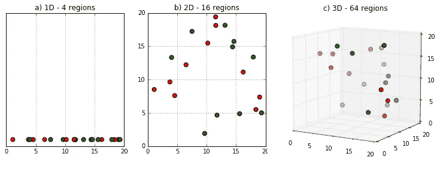

# 不要被维度所诅咒

> 原文：<https://towardsdatascience.com/dont-get-cursed-by-dimensionality-629bca5de3a5?source=collection_archive---------64----------------------->

## 从前，有一个模型。它已经有了许多功能，但它还想要更多。然后 PCA 出现了…不要在黑暗中看这个！


[丹尼尔·延森](https://unsplash.com/@dallehj?utm_source=medium&utm_medium=referral)在 [Unsplash](https://unsplash.com?utm_source=medium&utm_medium=referral) 上拍照

这是一个关于一个模特的故事，她已经拥有了许多功能，但她总是想要更多。这个模型变得如此臃肿，以至于无法将它们分开。但是，它还是成长了。然后有一天，主成分分析来到了模型的土地，它诅咒了他一劳永逸。诅咒就是日复一日地从模型中提取特征，直到只剩下最重要的特征。

**这里有几个你可能会感兴趣的链接:**

```
- [Labeling and Data Engineering for Conversational AI and Analytics](https://www.humanfirst.ai/)- [Data Science for Business Leaders](https://imp.i115008.net/c/2402645/880006/11298) [Course]- [Intro to Machine Learning with PyTorch](https://imp.i115008.net/c/2402645/788201/11298) [Course]- [Become a Growth Product Manager](https://imp.i115008.net/c/2402645/803127/11298) [Course]- [Deep Learning (Adaptive Computation and ML series)](https://amzn.to/3ncTG7D) [Ebook]- [Free skill tests for Data Scientists & Machine Learning Engineers](https://aigents.co/skills)
```

*上面的一些链接是附属链接，如果你通过它们进行购买，我会赚取佣金。请记住，我链接课程是因为它们的质量，而不是因为我从你的购买中获得的佣金。*

# 维度的诅咒

当数据集中有成千上万个要素时，诅咒就会出现在高维空间中。当维度增加时，空间的体积也增加，数据变得稀疏。这给任何需要统计显著性的方法带来了问题。随着每个功能的添加，支持结果所需的数据量呈指数级增长。



增加维度时空间体积的增加。

# 诅咒对你有什么影响？

通俗地说，机器学习模型根据与训练集中看到的样本的相似性，对看不见的样本进行预测。当特征多于样本时，我们有过度拟合模型的风险。测试集上的性能将受到影响*。*

猫狗模型可能会想:特征 has _ lilac _ fur 是真的，我只在训练集中看到过一次有猫的情况，所以一定是猫。这样的特征也是异常值，因为它没有任何统计意义。猫真的有淡紫色的皮毛还是数据收集过程中的错误？在收集到更多数据之前，我们无法确定。

# 如何破除诅咒？


[Simon Wijers](https://unsplash.com/@simonwijers?utm_source=medium&utm_medium=referral) 在 [Unsplash](https://unsplash.com?utm_source=medium&utm_medium=referral) 上的照片

要解除诅咒，请执行以下操作之一:

*   使用降维算法:使用[主成分分析](https://en.wikipedia.org/wiki/Principal_component_analysis)或[t-分布随机邻居嵌入(t-SNE)](https://en.wikipedia.org/wiki/T-distributed_stochastic_neighbor_embedding) ，
*   计算皮尔逊线性相关或斯皮尔曼非线性相关并去除相关特征，
*   使用[特征选择算法](https://scikit-learn.org/stable/modules/feature_selection.html)并且只保留 n 个最重要的特征，
*   如果可能的话，获取更多的训练数据。

# 不要再被诅咒了


照片由 [MontyLov](https://unsplash.com/@montylov?utm_source=medium&utm_medium=referral) 在 [Unsplash](https://unsplash.com?utm_source=medium&utm_medium=referral) 上拍摄

# 在你走之前

在 [Twitter](https://twitter.com/romanorac) 上关注我，在那里我定期[发布关于数据科学和机器学习的](https://twitter.com/romanorac/status/1328952374447267843)消息。

您可能会对以下几个链接感兴趣:

```
- [Data Science Nanodegree Program](https://imp.i115008.net/c/2402645/788185/11298)- [AI for Healthcare](https://imp.i115008.net/c/2402645/824078/11298)- [Autonomous Systems](https://imp.i115008.net/c/2402645/829912/11298)- [Your First Machine Learning Model in the Cloud](https://datascienceisfun.net/)- [5 lesser-known pandas tricks](https://gumroad.com/l/YaaJn)- [How NOT to write pandas code](https://gumroad.com/l/vxxiV)- [Parallels Desktop 50% off](https://www.dpbolvw.net/click-100126493-14105294)
```


照片由[Courtney hedge](https://unsplash.com/@cmhedger?utm_source=medium&utm_medium=referral)在 [Unsplash](https://unsplash.com/?utm_source=medium&utm_medium=referral) 拍摄