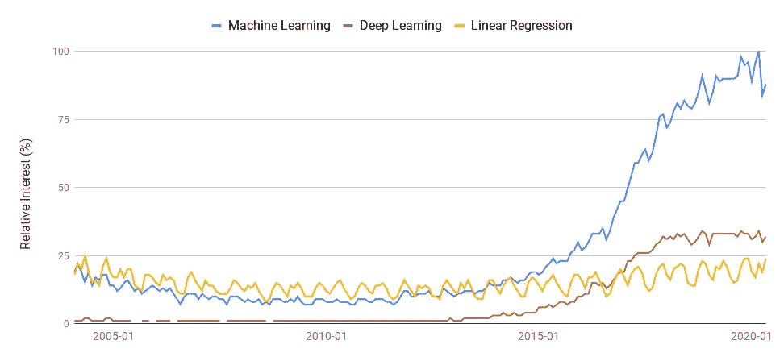
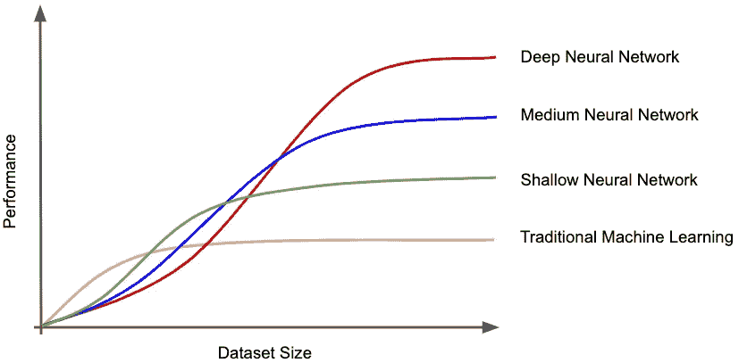

# 不要迷失在深渊中

> 原文：<https://towardsdatascience.com/dont-get-lost-in-the-deep-26ee0749e04e?source=collection_archive---------82----------------------->

## 机器学习很少涉及深度学习。这没关系。

[灭霸·帕尔的照片](https://unsplash.com/photos/vb-hPUzfpBo)

L 先说我为什么写这篇文章。对于刚刚踏上数据科学之旅的人来说，很容易迷失方向。不，这不是关于决策树和随机森林的双关语。我的意思是有太多东西要学，太多东西要激动人心，但我认为我们真正应该关注的是对基础知识的详细理解。深度学习是机器学习领域向前迈出的令人难以置信的一步，这绝对是一个激起许多人兴趣的领域，甚至首先将他们带入这个研究领域，但事实是，很少有公司真正应用这些技术。通常情况下，线性模型可以很好地解决业务问题。我的观点是，如果你对基本的机器学习算法有坚实的理解，那么你对公司的价值会比你过于专注于新工具更大。

# 什么是机器学习？

我想我应该在这里添加这一部分，因为有太多的定义，很容易混淆什么是机器学习，什么不是机器学习。

> 机器学习是人工智能(AI)的一种应用，它为系统提供了自动学习和根据经验改进的能力，而无需显式编程。主要目的是让计算机在没有人类干预或帮助的情况下自动学习，并相应地调整行动— [来源](https://expertsystem.com/machine-learning-definition/)

许多定义可能变得相当罗嗦，但我认为上面的引用很好地总结了这一点。机器学习是人工智能的一个分支，旨在赋予系统从经验中学习的能力(即从数据中学习)，而无需显式编程以特定方式表现。

现在这一切听起来相当性感，但线性回归模型确实做到了这一点，因此它坚定地属于机器学习领域。对许多人来说，这可能有些令人沮丧。

我们都见过 Excel 对一些数据进行最佳拟合，因此，您的意思是告诉我 Excel 正在应用机器学习技术吗？

嗯，是的，事实上是的。但是没关系。线性回归素有简单乏味的名声，但它是一个异常强大的工具，却被异常低估了，尤其是对于该领域相对较新的人(在思考本文之前包括我自己)。在本文中，我使用线性回归作为例子，但是许多其他的基本算法也有类似的名声。

# 看一看趋势…

作为一篇数据科学相关的文章，我们来看看一些实际的数据。下面的图表是取自 Google Trends 的数据，显示了过去 15 年来对机器学习、深度学习和线性回归的相对兴趣(Google 搜索次数)。

在此期间，对线性回归的兴趣一直保持相当一致，这是有道理的，因为它的起源可以追溯到 19 世纪初，由卡尔·弗赖德里奇·高斯或阿德里安-玛丽·勒让德提出(更多关于它的争议性发现可以在这里阅读)。**另一方面，深度学习在过去 5 年才真正普及**。

给了我“思考的食粮”的是，尽管深度学习在行业中的使用远远少于它，但它在网上被搜索的频率明显更高。这是可以理解的，因为目前围绕这个话题有大量的炒作，但我将在这里打破一个数据科学规则，并提出这种因果关系。

**人们正在关注错误的事情。**无论如何，对最令人兴奋和先进的机器学习技术感兴趣是没问题的。事实上，这是一件很棒的事情，因为这意味着你拓宽了自己的知识面，并表现出对自己领域前沿话题的浓厚兴趣。但是，只要我们不忽略作为数据科学领域基础的基本算法，这是没问题的。

# 那么谁在使用深度学习，谁没有呢？

深度学习算法是一个具有多个隐藏层的大型神经网络。深度神经网络的问题在于，它们需要大量的数据，才能获得超过传统机器学习算法的优势。

这张图展示了我们在不同大小的数据集上比较机器学习算法时看到的总体性能趋势。当数据集在较小的一边时，传统方法往往优于神经网络，这就是问题所在。

很少有公司坐拥足够的数据，能够真正从这些出色的算法中获益。那些人往往是科技巨头——比如亚马逊、脸书和谷歌。事实是，大多数公司仍处于数据科学的早期采用阶段，距离拥有利用深度学习优势所需的资源(数据、资金和专业知识)还有很长的路要走。

此外，企业实际上想要一个复杂问题的最简单的解决方案。即使一家公司有深度学习或任何其他复杂算法的资源，如果问题可以用一个更简单的模型来解决，但性能相当，你可以打赌他们会用那个更简单的模型。这是为什么呢？

简单的模型可以更快地构建，更容易实现，更容易理解，更新起来也相对容易。这一点的重要性不应被低估。算法越简单，就越透明。我们应该始终避免实现“黑盒”模型，因为这限制了它的应用范围，最终降低了它对我们的价值。**通过使用简单的模型，我们可以更好地调查和理解我们正在解决的问题中存在的关系。**

我将引用一段话来结束这一部分，这段话以一种颇具诗意的方式总结了我观点的精髓:

> 对于复杂的模型，有一种可怕的诱惑，要把柠檬榨干，并展示一幅未来的画面，通过其非常精确和逼真的画面来表达信念。然而，一个使用想象中的地图的人，认为这是一个真实的地图，很可能比一个根本没有地图的人更糟糕；因为他不会尽可能地去询问，观察路上的每一个细节，也不会用他所有的感官和智慧不断地寻找他应该去哪里的指示——从舒马赫的《小即是美》到

# 最后一点…

请不要误会，**复杂！=坏**。复杂的方法肯定有它们的位置，我们对它们感到兴奋是正确的。让我们先确保基本的都包括在内。不要马上跳入算法游泳池的深水区。

此外，如果你没有在工作场所经常使用这些先进的技术，也不要灰心丧气。我们有多少次在电视上看到律师在陪审团面前争论或者医生实施紧急救生手术？

非常经常。问题是这些都是现实的戏剧化表现。律师在他们的日常工作中很少这样做，医生每天花大部分时间诊断相同的常规医疗状况。这同样适用于数据科学家。

我们无时无刻不在阅读该领域令人兴奋的发展，这些发展会让我们思考‘为什么我的工作看起来比较平凡？’。我们的大部分时间都花在清理和准备数据上，然后使用简单的模型来解决手头的问题。这仍然是一份很棒的工作。管理期望是我们应该在生活的许多方面应用的一件重要事情，否则我们可能会让自己失望。

*感谢您阅读至此！我很想在评论中听到你的想法。如果你想直接联系我，请随时在*[*LinkedIn*](https://www.linkedin.com/in/ravi-malde/)*给我留言。*