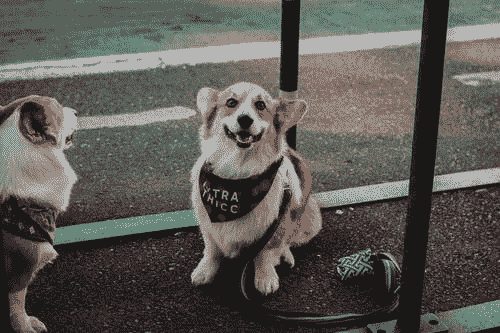
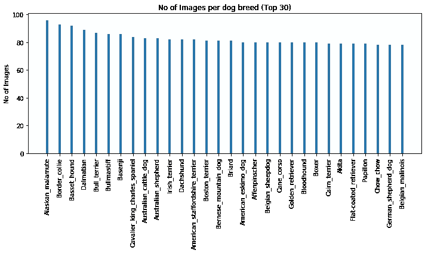
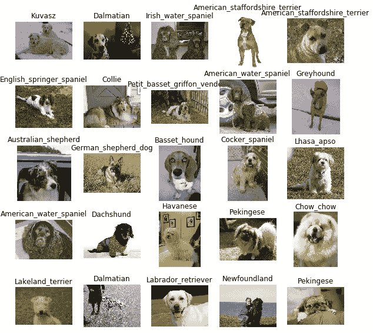

# 不知道你家狗狗的品种？ML 可以帮忙！

> 原文：<https://towardsdatascience.com/dont-know-the-breed-of-your-dog-ml-can-help-6558eb5f7f05?source=collection_archive---------42----------------------->

## 学习如何建立一个生产就绪的软件，可以分类品种的狗的图像

你有没有想过你的狗或者你在街上看到的其他狗的品种？关于那件事，你可能得问专家。嗯，不会再有了！在这篇文章中，我将教你构建自己的 web 应用程序，它将接受你的狗的图像并以超过 80%的准确率输出它的品种！

这只狗是什么品种？来自 [Pexels](https://www.pexels.com/photo/brown-and-white-short-coated-dog-sitting-and-smiling-2463238/?utm_content=attributionCopyText&utm_medium=referral&utm_source=pexels) 的[亚历克斯·多勒](https://www.pexels.com/@alexdolle?utm_content=attributionCopyText&utm_medium=referral&utm_source=pexels)的照片

你可能想知道这怎么可能？嗯，我们将使用机器学习，特别是深度学习，在狗的图像数据集上训练一个模型，并记录它们的品种，以学习区分每个品种的特征。那我们开始吧！

# 数据分析

数据集可以从[这里](https://s3-us-west-1.amazonaws.com/udacity-aind/dog-project/dogImages.zip)下载。成功加载和浏览数据集后，以下是关于数据的一些见解:

1.  狗的品种总数:133
2.  狗图像总数:8351(训练:6680，有效:835，测试:836)
3.  最受欢迎的品种:`Alaskan_malamute:96`，`Border_collie: 93`

按图片数量排序的前 30 个品种如下所示:

作者图片

我们还可以在这里看到一些狗的图片和它们的品种:

作者图片([数据集](https://s3-us-west-1.amazonaws.com/udacity-aind/dog-project/dogImages.zip))

# 数据预处理

分析之后，是为机器学习算法准备数据的部分。我们将加载每个图像作为一个 NumPy 数组，并将它们的大小调整为 224x224，因为这是大多数传统神经网络接受图像的默认大小。我们还将为图像的数量添加另一个维度

细胞神经网络图像预处理

最后，我们将使用`ImageDataGenerator`对图像进行动态缩放和增强

# CNN 从零开始

我们将从在预处理数据集上从头开始训练卷积神经网络(CNN)开始，如下所示:

我们使用回调`ModelCheckpoint`来保存基于验证分数的模型。测试这个模型，我们得到了大约 1%的精确度

# 使用迁移学习

现在，我们将看到使用预先训练的功能如何产生巨大的差异。下载 [ResNet-50 瓶颈功能](https://s3-us-west-1.amazonaws.com/udacity-aind/dog-project/DogResnet50Data.npz)。您可以通过运行下面的代码单元格来提取相应的定型集、测试集和验证集:

我们现在将再次定义模型，并对提取的特征使用`GlobalAveragePooling2D`,将一组特征平均为一个值。最后，如果验证损失在连续 2 个时期内没有增加，我们使用额外的回调来降低学习速率`ReduceLROnPlateau`，并且如果验证损失在连续 5 个时期内没有增加，我们还使用额外的回调来提前停止训练`EarlyStopping`。

现在测试集上的准确率为 **82.65%。与我们从零开始训练的模型相比，这是一个巨大的进步。**

# 构建 web 应用程序

对于 web 应用程序，我们将首先编写一个助手函数，它接受图像路径并返回品种。`label_to_cat` dictionary 将每个数字标签映射到其犬种。

对于 web 应用程序，我们将使用 **Flask** web 框架，它帮助我们用最少的代码创建 web 应用程序。我们将定义一条接受图像的路线，并呈现一个带有狗的品种的输出模板

`predict.html`是分别显示图片及其犬种的模板。

# 结论

恭喜你！你已经成功地实现了一个犬种分类器，并且可以自信地辨别犬种。让我们总结一下我们在这里学到的东西:

1.  我们对数据集进行了分析和预处理。独立的**训练、测试和验证集**对于机器学习算法进行有把握的预测是必要的。
2.  我们从零开始使用了一个**CNN**，它表现很差，因为它无法提取特征。
3.  然后我们使用**迁移学习**，准确度提高了很多
4.  最后，我们构建了一个 Flask web 应用程序，使我们的项目**可以投入生产**

我们确实学到了很多，但是还有很多其他的事情你可以尝试。您可以在 Heroku 上部署 web 应用程序，或者尝试使用不同的层(如`Dropout`层)来提高准确性。

要了解更多信息和详细分析，请务必点击这里查看我的 GitHub [上的代码。](https://github.com/nouman-10/Dog-Breed-Classifier)

如果您觉得以上内容对您有用，请分享并随时支持我-->

*   [https://www.buymeacoffee.com/nouman10](https://www.buymeacoffee.com/nouman10)