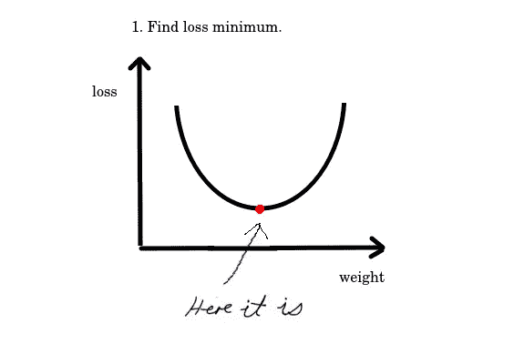
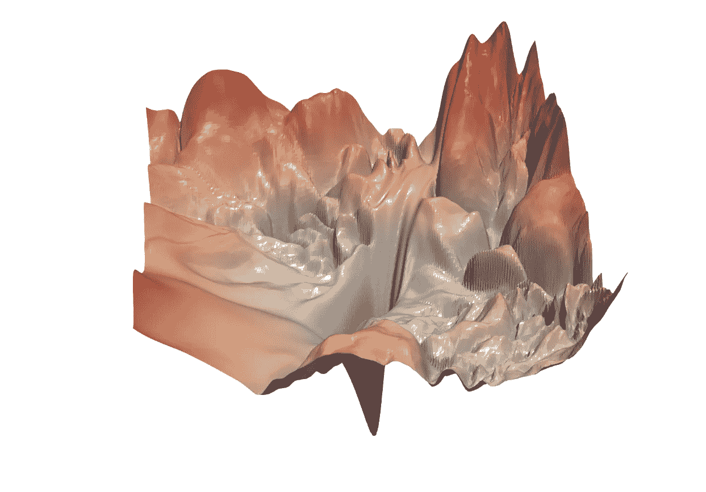
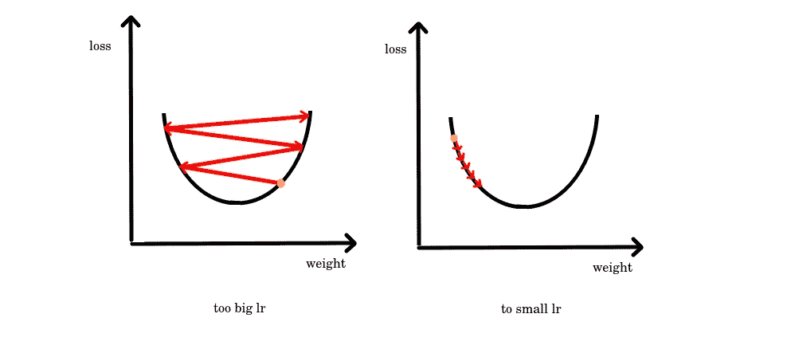
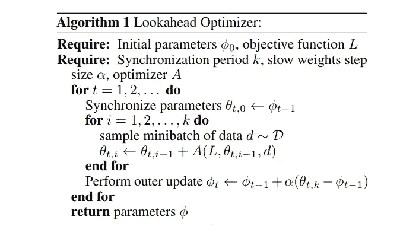
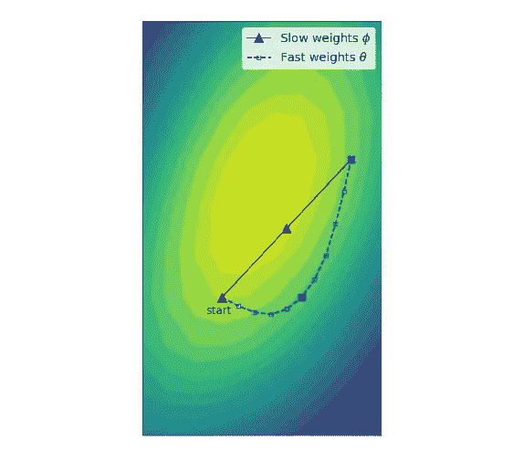
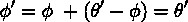
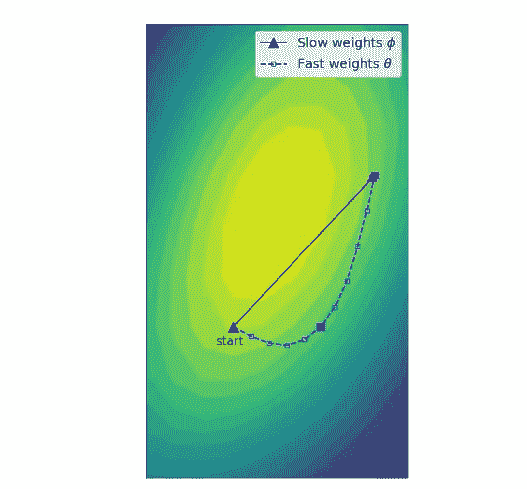

# 不要向后看，向前看！

> 原文：<https://towardsdatascience.com/dont-look-backwards-lookahead-6bcd7ff50f93?source=collection_archive---------38----------------------->

## 前瞻优化器使您的模型对超参数的选择不太敏感

图片由 [rihaij](https://pixabay.com/pl/users/rihaij-2145/?utm_source=link-attribution&utm_medium=referral&utm_campaign=image&utm_content=1366118) z [Pixabay](https://pixabay.com/pl/?utm_source=link-attribution&utm_medium=referral&utm_campaign=image&utm_content=1366118) 提供

优化器的任务是寻找这样一组权重，使神经网络模型产生尽可能低的损失。如果你只有一个权重和一个如下图所示的损失函数，你不需要成为天才也能找到答案。

不幸的是，你通常有许多权重和一个很难简单的损失景观，更不用说不再适合 2D 绘画。

使用[https://arxiv.org/pdf/1712.09913.pdf](https://arxiv.org/pdf/1712.09913.pdf)中提出的方法可视化无跳跃连接的 ResNet-56 的损失表面。

找到这样一个函数的最小值不再是一个微不足道的任务。像 Adam 或 SGD 这样最常见的优化器需要非常耗时的超参数调整，并且可能陷入局部最小值。选择学习率这样的超参数的重要性可以用下图来概括:

太大的学习率会引起最小值附近的振荡，而太小的学习率会使学习过程非常慢。

最近提出的[前瞻优化器](https://arxiv.org/pdf/1907.08610.pdf)进行优化过程

> 对次优超参数不太敏感，因此减少了对大范围超参数调整的需求。

这听起来像是值得探索的事情！

# 该算法

> 直观地说，该算法通过**在由另一个优化器生成的“快速权重”序列中前瞻**来选择搜索方向。

优化器保留两组权重:快速权重`θ`和慢速权重`ϕ`。它们都用相同的值初始化。具有一定学习速率`η`的标准优化器(例如，Adam、SGD、…)被用于为定义数量的步骤`k`更新快速权重`θ`，从而产生一些新值`θ’`。

然后关键的事情发生了:慢速权重`ϕ`沿着权重向量 `θ’- ϕ`的差定义的方向**移动。这一步的长度由参数`α`——慢速权重学习率控制。**

前瞻算法中的重要更新

然后，通过将快速权重值重新设置为新计算的慢速权重值`ϕ’`，开始重复该过程。你可以看到下面的伪代码:

来源:[https://arxiv.org/pdf/1907.08610.pdf](https://arxiv.org/pdf/1907.08610.pdf)

# 这有什么意义？

为了回答这个问题，我们将研究来自[前瞻出版物](https://arxiv.org/pdf/1907.08610.pdf)的(略微修改的)图片，但是作为介绍，让我们首先看另一张图片。如果我们的模型只有三个权重，损失函数可以很容易地可视化，如下图所示。

在模型仅依赖于三个权重的情况下，权重空间中的损失函数可视化。提出了权重空间中损失到三个平面(“超平面”)的投影，其中一个权重具有恒定值。

显然，在现实生活的例子中，我们有三个以上的权重，导致权重空间具有更高的维度。然而，我们仍然可以通过把它投影到这样一个空间的超平面上来形象化这个损失。

这就是在[前瞻报告](https://arxiv.org/pdf/1907.08610.pdf)中提出的内容:

来源:https://arxiv.org/pdf/1907.08610.pdf

我们看到目标函数(在这种情况下是精度，但也可能是损失)到权重空间中的超平面的投影。不同的颜色对应不同的目标函数值:颜色越亮，值越优。前瞻优化器的行为如下所示:蓝色虚线表示快速权重`θ`的轨迹(蓝色方块表示十个后续状态)，而紫色线表示快速权重更新`θ’- ϕ`的方向。紫色三角形表示两个后续的慢速权重值`ϕ`、`ϕ’`。三角形之间的距离由慢速权重学习速率`α`定义。

我们可以看到，标准优化器(在本例中为 SGD)遍历了一个次优绿色区域，而第二个慢权重状态已经非常接近最优。[论文](https://arxiv.org/pdf/1907.08610.pdf)描述的更为优雅:

> 当在高曲率方向振荡时，快速权重更新沿着低曲率方向快速进行。慢速权重有助于通过参数插值消除振荡。快速权重和慢速权重的组合改善了在高曲率方向上的学习，减少了方差，并且使得前瞻在实践中能够快速收敛。

# 在 Keras 怎么用？

现在回到方法的实际方面；到目前为止只有[一个非官方的 Keras 实现](https://pypi.org/project/keras-lookahead/);它可以很容易地与您当前的优化器一起使用；

如您所见，除了优化器本身之外，`Lookahead`还需要两个参数:

*   `sync_period`对应前面介绍的`k`——两组砝码同步后的步数，
*   `slow_step`对应于`α`慢速权重的学习速率。

为了检查它是否按预期工作，您可以将`slow_step`设置为`1`，并将`Lookahead`的行为与常规优化器的行为进行比较。

对于`1`的`α`，前瞻更新步骤减少为:

这意味着前瞻被简化为它的底层标准优化器。我们也可以在修改后的权重轨迹图上看到它:

改编自:[https://arxiv.org/pdf/1907.08610.pdf](https://arxiv.org/pdf/1907.08610.pdf)

现在慢速权重的结束状态与快速权重的结束状态相同。

您可以使用以下代码对其进行测试:

测试证明具有 Adam 和慢学习率 1 的 LookAhead 等价于纯 Adam。

# 一锤定音

前瞻是一种有效的优化算法，它以可忽略的计算成本使寻找损失函数最小值的过程更加稳定。此外，需要较少的超参数调整。

据说当与[修正的 Adam 优化器](https://arxiv.org/pdf/1908.03265.pdf)结合使用时特别有效。我将在下一篇文章中讨论这个话题。