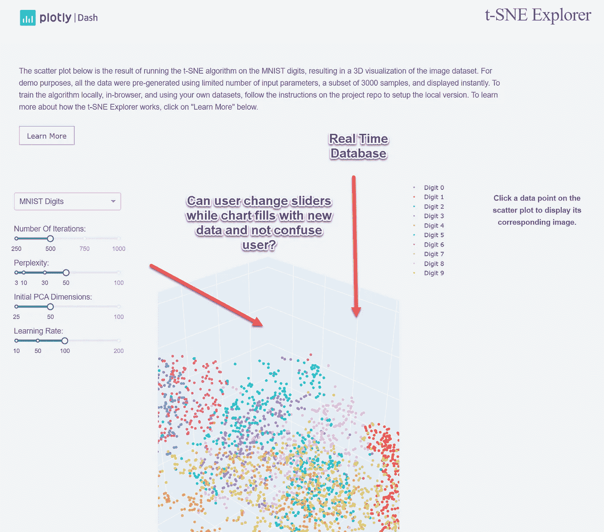

# 不要惹海森堡

> 原文：<https://towardsdatascience.com/dont-mess-with-heisenberg-f9a2a349ea23?source=collection_archive---------31----------------------->

丽塔·莫莱斯在 [Unsplash](https://unsplash.com/s/photos/fixing-plane?utm_source=unsplash&utm_medium=referral&utm_content=creditCopyText) 上拍摄的照片

# 数据可视化必须接受一些不确定性

在开发一个数据可视化 app 之前，想想*时间*和*空间*哪个更重要。你想显示实时数据吗？还是要分析干净的数据？在开发我的应用程序时，我两者都想要。我变得沮丧，直到我意识到我犯了一个新手的错误。

在 [Plotly Dash](https://plot.ly/dash/) 中，我着手构建一个[仪表板](https://github.com/maxrottersman/Python_Chart_Automation)，它将通过 [CryptoCompare 的公共 API](https://min-api.cryptocompare.com/) 获得每分钟的加密货币价格，并提供 Dash 可视化，以便在其中研究数据。

在我的第一次迭代中，我并不担心实时方面。我给了用户一个下拉菜单来选择他们的加密货币。

然后我检查了 Sqlite 数据库，果然，每分钟都有一个新的比特币值通过 cron 作业添加进来。在我的 Google Cloud Ubuntu 虚拟机(VM)上，我告诉 crontab 服务每分钟调用一个 Python 脚本，该脚本从 CrypoCompare 获取数据并将其插入到 SQLite 表中。

然后我刷新了我的 Dash app。*但是数据没变*。

我在 Dash 论坛上发帖，寻找类似于 *RefreshOnPageLoad = True，*的函数，但是一个也没有找到。一开始我对短跑队很恼火。然后我开始思考这个问题，并意识到如果一个人在每次页面加载时都刷新 Dash 应用程序，你最终会质疑为什么你一开始就使用 Dash！

首先，非常明确地说，我不是要说你不能在像 Dash 这样的框架中进行实时数据可视化——你可以。我的观点是，当你试图服务于两个主人，数据的及时性和数据质量时，你应该预料到你的编程的复杂性会呈指数级上升。让我们来看看 Dash 图库中的一些例子。

这是[制造 SPC 仪表板](https://dash-gallery.plotly.host/dash-manufacture-spc-dashboard/)应用程序。

该应用程序看起来像是某台机器正在向 Dash 应用程序发送数据以进行可视化

如果我们查看代码，我们会注意到外部数据源并没有驱动可视化。该应用程序正在根据其定时事件提取数据。

但是，如果我们希望它每秒钟都向数据帧中重新加载新数据，该怎么办呢？

用户几乎无法控制数据。没有花哨的滑块。也就是说，Dash gallery 中的“流媒体”应用没有发挥 Dash 的优势。使用普通的 Javascript 和 Chart.js 就可以很容易做到。

这是另一个 Dash“流”应用程序。

Dash 真的是风力驱动的吗？！

和上面的 app 一样，软件使用复杂的回调来重新加载组件。有一个滑块，但它不是用于数据探索的。

每当我看着将流数据添加到我的 Dash 应用程序所需的代码时，我的大脑就冻结了。Dash 里的试镜对我来说已经够复杂了。集成两组回调，一组用于更新数据，另一组用于处理用户输入，将我的技能推到了极限。

我们来看看 Dash 的长处。在下面的应用程序中，各种控件(滑块)可以改变数据的图形。用户还可以通过将鼠标悬停在图表上来浏览数据。

该应用程序不刷新数据，但如果它做到了呢？那是我的*啊哈*时刻。会有什么后果？

Dash 只用几行代码就提供了强大的功能

在 Dash 中，HTML 控件允许用户根据他们选择的参数可视化数据。

如果一个外部数据源改变了数据，它能在不改变用户基于他们最后选择的参数的期望的情况下这样做吗？

比方说，我已经将我的应用程序设置为查看加密货币价格的前 5 个百分点。我发现起价是 100 美元。我过滤掉所有低于 100 美元的硬币？一切都好。

但是如果新数据进入系统，百分位变为 110 美元呢？**我的结论现在已经过时而且错误**！

就像[海森堡测不准原理](https://en.wikipedia.org/wiki/Uncertainty_principle)，**我可以研究我的加密货币的位置，或者它的动量，但不能同时研究两者！在物理实验中，从某种意义上来说，你必须经常触摸你正在研究的东西。你只能通过记录来注意到一个电子，比如说，另一个电子被它反弹并通过你的传感器击中另一个电子。当你的*记录*电子撞击你正在研究的电子时，它可以改变那个电子的位置或动量。你只能研究它没有影响的方面。那是我外行的理解。**

就像我上面的例子一样，对于任何给定的数据可视化数据集，我都可以非常非常确定我的分析对于给定的数据集是正确的。当有人问，不确定性出现了，但是新的数据会说什么呢？

这是 Dash 的致命弱点，我想也是所有数据可视化框架的致命弱点。

当我试图添加算法来更新我的应用程序数据时，我开始去厨房寻找舒适的食物。下面是两个 Dash 示例应用程序的一些代码来说明我的观点:

432 行代码的惊人可视化！

上面的应用程序发挥了 Dash 的优势，允许人们以惊人的深度研究数据集。

这是一个 Dash 应用程序，它添加了流数据。

为什么这么简单的仪表板有这么多行代码？

纵观全局，数据可视化中最困难的部分是决定用户将执行什么实验。我希望他们拥有最新的数据，还是最干净的数据？如果我试图让应用程序两者都做，我可能会倾向于这样或那样，这将激怒一些用户。要么他们在重新加载数据时会丢失参数，要么他们将无法查看新数据。

总之，你可以在 Dash 中做任何你想做的事情。但是你应该理解数据科学中的基本问题。数据可视化应用的成功部分取决于管理预期。

在未来，如果我想要一个数据流应用程序，我可能会用不同的技术来构建它。然而，如果我想让用户尽情探索复杂的数据集，那么 Dash 可以用最少的代码行提供最强大的功能。

如果我必须两者都做，我最好找一个开发团队和一个装满东西的冰箱。