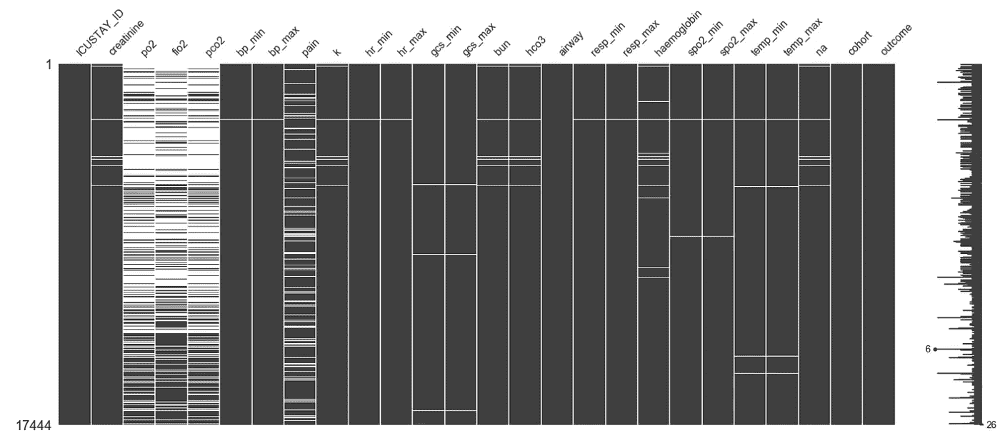
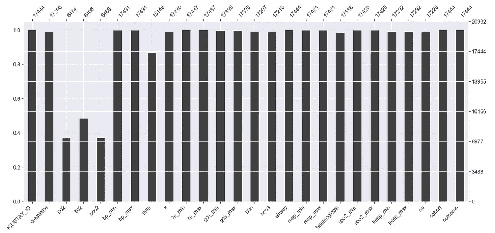
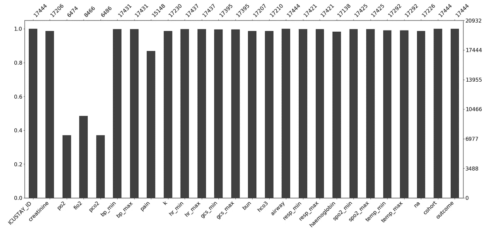
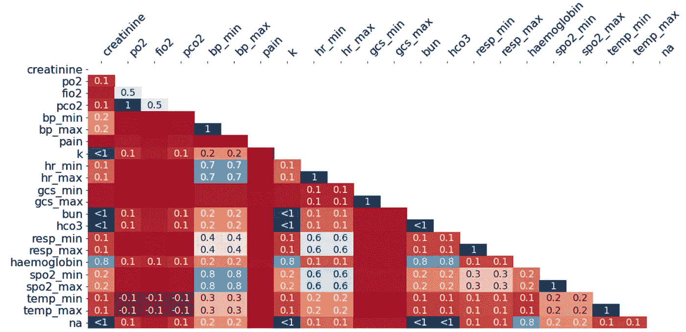
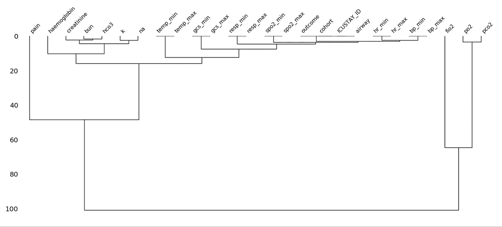

# 不要错过识别缺失数据的缺失号！

> 原文：<https://towardsdatascience.com/dont-miss-out-on-missingno-for-identifying-missing-data-9a0681433c36?source=collection_archive---------43----------------------->

## 应该用来可视化缺失数据的库

由[阿尔文·恩格勒](https://unsplash.com/@englr?utm_source=medium&utm_medium=referral)在 [Unsplash](https://unsplash.com?utm_source=medium&utm_medium=referral) 拍摄的照片

野外的数据并不总是完整的。您需要立即发现这一点，调查为什么会有丢失的数据，并潜在地捕捉可以用来填充丢失的数据或丢弃它们的值。填充或丢弃取决于任务。但是同样，如果不首先识别那些丢失的值，你就不能做任何事情。这就是 [Missingno](https://github.com/ResidentMario/missingno) 库的用武之地，你将在这里学习如何使用它。

# 缺少不，Python 版本

Missingno 是由 [Aleksey Bilogur](https://github.com/ResidentMario) 创建的 python 库，用于可视化数据中的缺失值。有了它，您可以快速了解数据集中缺少哪些数据。这是我在使用任何数据执行任何主要任务之前首先要做的事情之一。

在[imgflip.com](https://imgflip.com/i/44h55n)自制形象

这是真的。如果您的数据可能最多有 8 到 10 列，您可以快速浏览一下。但是如果你有 20 列的数据呢？30 列？40 列？您是否仍然能够以比这样的可视化方式更快的速度浏览和读取每一列中的非空值总数？

我的代码的 msno.matrix(数据)的结果。

你的眼睛会立刻移动到有白色条纹的条纹上。这是您可以找出哪些列缺少数据的速度。顺便说一下，这也是在一个有 26 列的随机数据集上。现在，让我们让你使用这个库！在你的终端上输入`pip install missingno`然后开始吧！

Armand khou ry[在](https://unsplash.com/@armand_khoury?utm_source=medium&utm_medium=referral) [Unsplash](https://unsplash.com?utm_source=medium&utm_medium=referral) 上拍摄的照片

# 安装

当然，我们必须下载一些和 Missingno 一起的库。这些是我为任何数据任务导入的默认库。我们将继续上传我们的数据。数据来自[这个网站](https://www.researchgate.net/publication/331961009_Feature_Matrix_MIMIC_with_missing_values)在[谷歌的数据集搜索](https://datasetsearch.research.google.com/)引擎上快速搜索“缺失值”。

亲提示，用`sns.set()`。默认情况下，它给你的图表一个海边背景。当我们做条形图时，这将非常有用。但首先，我们必须查看矩阵。

# Msno 矩阵(数据)

`msno.matrix(data)`将显示我们在上面看到的图表类型。空白表示缺少值，而黑色表示有值。

我的代码的 msno.matrix(数据)的结果。

除了可以快速识别哪些列有缺失值之外，您还可以查看这些列在哪里有缺失值。按特定列对数据进行排序可以让您看到是否有数据块丢失，并在筛选出这些行后帮助您更快地识别它们。右边的锯齿状垂直折线图根据长度标记了行中丢失的数据量。图表中向左的线条越长，该行中丢失的数据就越多。

# Msno.bar(数据)

`msno.bar(data)`将生成一个条形图，显示每列中非空数据值的数量。它还在顶部标记了非空值的数量。

我的代码中 msno.bar(data)的 sns.set()版本的结果。

您的目光应该转向此图表左侧较低的条形，以快速看到 3 列(po2、fio2 和 pco2)缺少大量数据值。现在，还记得我告诉过你如何使用`sns.set()`吗？你应该自己检查，但是如果你没有，这里有一个没有使用`sns.set()`的相同的条形图。

我的代码中没有 sns.set()的 msno.bar(data)的结果。

请注意，`sns.set()`版本的线条将条形分割成六分之一的数据。这可以让您了解基于这些间隔的特性所占的百分比。所以我们可以很快确定，我们有大约三分之一的 po2 和 pco2 值。seaborn 背景的另一个好处是背景中的百分比线，因此您可以从另一个视觉角度了解每 20%标记处有多少数据。

# 其他可视化

Missingno 还提供了数据的[热图](https://seaborn.pydata.org/generated/seaborn.heatmap.html)和[树状图](https://docs.scipy.org/doc/scipy/reference/generated/scipy.cluster.hierarchy.dendrogram.html)，以显示某些列中缺失值之间可能的相关性。我还没有在我自己的职位上使用过这些，原因是领域知识或者只是问了正确的人。但是我会给你这些数据的每个图表的图片，这样你就可以开始学习如何根据[失踪人口](https://github.com/ResidentMario/missingno)文档自己解释这些数据。

我的代码中 msno.heatmap(data，figsize=(15，7)的结果。

我的代码的 msno.dendrogram(数据)的结果。

请确保您也从 Missingno 库中查看了代码,以查看所有这些函数的底层细节。

# 最后的想法

尽管热图和树状图提供了很好的关联关系，但是如果您有领域知识，它们并不是必需的。如果您不了解您正在处理的数据的领域知识，那么这些图表会变得更加有用。如果你的组织中没有可以及时咨询的人，我觉得这些图表应该是最后的手段。请记住，领域知识可以解决您处理的数据中的大量背景知识缺口(以及缺失的数据缺口)。

感谢您的阅读！请记住，调查丢失的数据应该是您正在进行的任何项目的探索性数据分析过程的一部分。在您自己的数据上尝试 Missingno！

你可以在 [Linkedin](https://www.linkedin.com/in/jdejesus22/) 和 [Twitter](https://twitter.com/johnnydata22?lang=en) 上关注或联系我。对 Twitter 上的 DM 开放。

直到下一次，

约翰·德杰苏斯